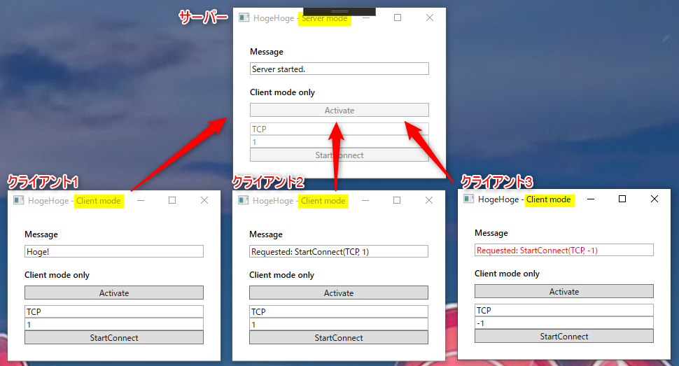
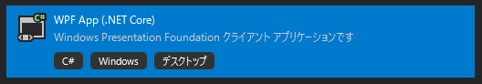
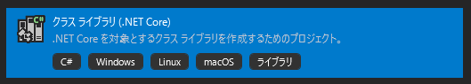
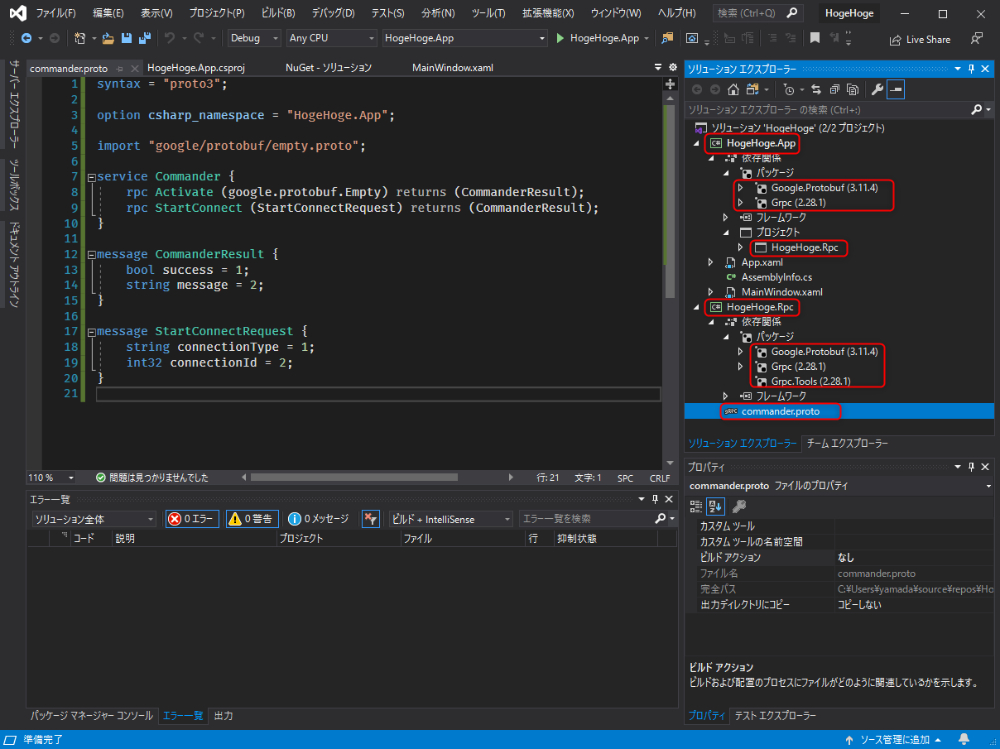
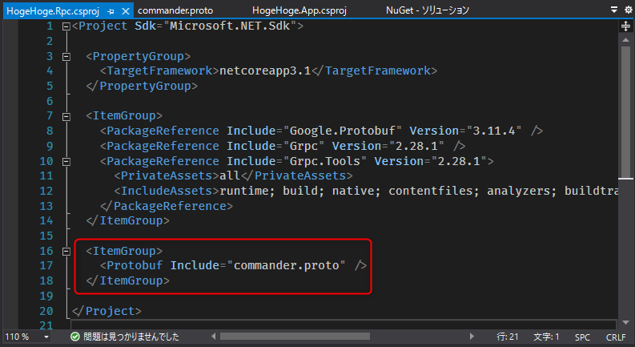
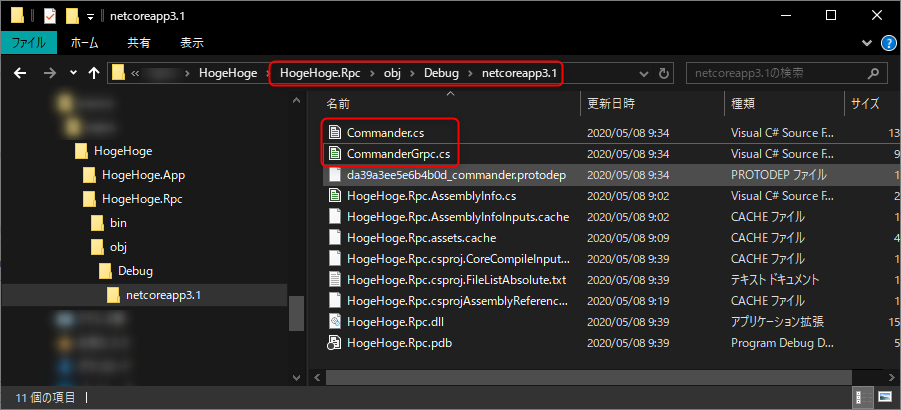
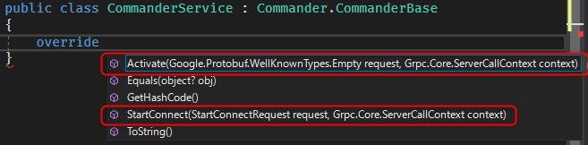
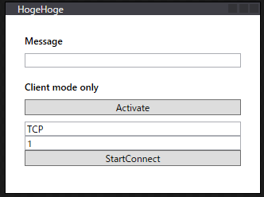
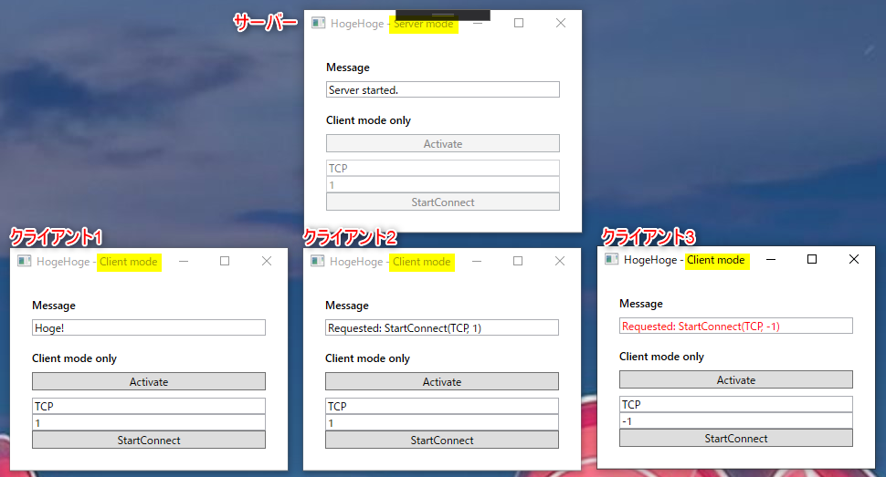

こんにちは、kenzauros です。

とあるアプリで**プロセス間通信** (Inter-Process Communication; IPC) のために WCF (Windows Communication Foundation) を使っていたのですが、 **.NET Core に移行したことで WCF が使えなくなってしまいました**。

大したことをやっていたわけではないのですが、なんらかの形でプロセス間通信が必要なため、 **.NET Core で利用できる gRPC** に移行することにしました。

## 概要

gRPC の詳しい説明は省きますが、 gRPC は RPC (Remote Procedure Call; 遠隔手続き呼び出し) を行うための手法の一つです。 **google が開発した RPC ＝ gRPC** というわけです。

HTTP/2 を使った高速な通信がメリットですが、プログラマーとしては **`.proto` ファイルに API の仕様を定義することでサーバーとクライアントで必要なソースコードのひな形を生成してくれる**というのも大きなメリットです。

C# 版 gRPC でも Grpc.Tools パッケージ (後述) が入った状態で `.proto` ファイルを指定すれば、必要なクラスが自動的に生成されます。

C# 版の公式情報は下記を参照してください。 ASP.NET Core だけでなくコンソールアプリや WPF アプリでも使用できます。

- [grpc/src/csharp at master · grpc/grpc](https://github.com/grpc/grpc/tree/master/src/csharp)

今回はこの **C# 版 gRPC を使って、同アプリのプロセス間通信を実装**しました。

動作イメージは下図のような感じです。 5 分ぐらいでできちゃいます。



ソースコードは GitHub においていますので、参考にしてください。

- [mseninc/z03-grpc-wpf-app: My first gRPC WPF app in .NET Core 3](https://github.com/mseninc/z03-grpc-wpf-app)

## 前提条件

- Visual Studio 2019
- .NET Core 3.1.200
- Google.Protobuf 3.11.4
- Grpc 2.28.1
- Grpc.Tools 2.28.1

## Hello World

なにはともあれ最初に一歩を知るには、公式の Helloworld が一番参考になります。ほとんど `.proto` ファイルと `.csproj` ファイルしかないことに驚きます。

- [grpc/examples/csharp/Helloworld at master · grpc/grpc](https://github.com/grpc/grpc/tree/master/examples/csharp/Helloworld)

## .NET Core での実装

### .proto ファイルの定義

**gRPC は `.proto` ファイルに定義する仕様ファーストな設計**です。まずはサーバーとクライアント間でやりとりする API の内容を定めます。

ちなみに **proto** は構造化データを定義する Protocol Buffers (protobuf) のことで、プロトタイプの略ではありません。

今回用いる `.proto` 定義です。ファイル名はなんでも大丈夫ですが、 **`commander.proto`** としました。

```
syntax = "proto3";

option csharp_namespace = "HogeHoge.App";

import "google/protobuf/empty.proto";

service Commander {
    rpc Activate (google.protobuf.Empty) returns (CommanderResult);
    rpc StartConnect (StartConnectRequest) returns (CommanderResult);
}

message CommanderResult {
    bool success = 1;
    string message = 2;
}

message StartConnectRequest {
    string connectionType = 1;
    int32 connectionId = 2;
}
```

簡単に説明すると下記のような定義です。

- `syntax = "proto3";` はいわゆる "おまじない" (構文が version3 であることを表す)
- `option csharp_namespace = "HogeHoge.App";` は生成される C# のクラスの名前空間を指定
- `import "google/protobuf/empty.proto";` は "空のメッセージ" を表す `google.protobuf.Empty` を利用するためにインポート
- `Commander` サービスを定義 (ここに RPC の API を記載する)
  - `rpc Activate (google.protobuf.Empty) returns (CommanderResult);` 引数=なし、 `CommanderResult` メッセージを戻り値として返す `Activate` を定義
  - `rpc StartConnect (StartConnectRequest) returns (CommanderResult);` 引数= `StartConnectRequest` メッセージ、 `CommanderResult` メッセージを戻り値として返す `StartConnect` を定義
- `message CommanderResult` `CommanderResult` メッセージを定義 (`bool` 型の `success`, `string` 型の `message` フィールドをもつ)
- `message StartConnectRequest` `StartConnectRequest` メッセージを定義 (`string` 型の `connectionType`, `int32` 型の `connectionId` フィールドをもつ)

ちなみにフィールド定義の `= 2` などの部分は数値を表すリテラルではなく、 **タグ** と呼ばれるものです。フィールドを区別するために使われるため、メッセージの中で一意である必要があります。

また、ここで定義した **`Activate` や `StartConnectRequest`, `connectionType` などの名前がそれぞれ C# のクラス名やメンバー名**になります。 (`connectionType` は .NET の命名規則に合わせて `ConnectionType` のような Pascal case に変換されます)

### プロジェクト構成

今回は下記の 2 プロジェクト構成とします。 gRPC のプロジェクトを分けている理由は後述の「WPF での gRPC 実装の注意」を参照してください。

- HogeHoge (ソリューション)
  - HogeHoge.App (**WPF アプリ**)
  - HogeHoge.Rpc (**.NET Core クラスライブラリ**)

VS だと似たような名前のテンプレートが多くてややこしいですが、下記の2種類です。いずれも .NET Core になっているか注意してください。





両方のプロジェクトに NuGet から下記のパッケージをインストールします。 Grpc もいろいろややこしい名前のパッケージがいっぱいありますが、とりあえず **Grpc** で大丈夫です。

- **Google.Protobuf**
- **Grpc**

次に `HogeHoge.Rpc` 側にのみ下記のパッケージをインストールします。

- **Grpc.Tools**

また、**`HogeHoge.App` から `HogeHoge.Rpc` を利用するのでプロジェクト参照を追加**しておきます。

**`HogeHoge.Rpc` には前述の `commander.proto` ファイルを作成**します。

ここまでで下記のような構成になっていれば OK です。



`.proto` ファイルもちゃんとシンタックスハイライトされて見やすいですね。

### `.proto` ファイルを Protobuf としてプロジェクトに定義

次に `HogeHoge.Rpc` をダブルクリックしてプロジェクトファイル `HogeHoge.Rpc.csproj` を開き、下記の記述を追加します。

```xml
<ItemGroup>
  <Protobuf Include="commander.proto" />
</ItemGroup>
```

プロジェクトファイルの内容は下図のようになります。



ここまでできたら **`HogeHoge.Rpc` をビルド**します。ビルドが正常終了すると `HogeHoge.Rpc\obj\Debug\netcoreapp3.1` あたりに **`Commander.cs` と `CommanderGrpc.cs` が自動生成**されているはずです。



この 2 つに gRPC のクラス群の詰め合わせセットが含まれています。ではこのクラスを用いてサービスを実装します。

### サービスクラスの実装

`HogeHoge.Rpc` にサービスを実装するクラス (ここでは `CommanderService` としました) を作成し、 `Commander.CommanderBase` クラスを継承します。

クラス内で `override` をタイプすると `.proto` で定義した `Activate` や `StartConnect` がオーバライド可能になっていることがわかります。



さっそく2つのメソッドをオーバライドします。

```cs
public class CommanderService : Commander.CommanderBase
{
    public override Task<CommanderResult> Activate(Empty request, ServerCallContext context)
    {
        Console.WriteLine("Requested: Activate");
        // ... some actual tasks
        return Task.FromResult(new CommanderResult() { Success = true, Message = "Hoge!" });
    }

    public override async Task<CommanderResult> StartConnect(StartConnectRequest request, ServerCallContext context)
    {
        Console.WriteLine($"Requested: StartConnect({request.ConnectionType}, {request.ConnectionId})");
        var message = await Task.Run(() =>
        {
            // ... some actual tasks
            return $"Connected to {request.ConnectionType} ({request.ConnectionId})!";
        });
        return new CommanderResult { Success = true, Message = message };
    }
}
```

今回は `Console.WriteLine` で表示だけして、適当なレスポンスを返すようにしました。

以上でサービスクラスの実装は完了です。

### メインウィンドウのレイアウト

今回はサーバーとクライアントは同じアプリを使用します。最初の 1 プロセスがサーバー、後から起動されたプロセスをクライアントとします。

`HogeHoge.App` の `MainWindow.xaml` を開いて、適当にコントロールを配置します。

```xml
<Window x:Class="HogeHoge.App.MainWindow"
        xmlns="http://schemas.microsoft.com/winfx/2006/xaml/presentation"
        xmlns:d="http://schemas.microsoft.com/expression/blend/2008"
        xmlns:x="http://schemas.microsoft.com/winfx/2006/xaml"
        xmlns:mc="http://schemas.openxmlformats.org/markup-compatibility/2006"
        Loaded="Window_Loaded"
        mc:Ignorable="d"
        Title="HogeHoge" SizeToContent="Height" MinHeight="240" Width="320">
    <StackPanel Margin="16">
        <StackPanel Margin="8">
            <TextBlock Text="Message" FontWeight="Bold" Margin="0 0 0 8" />
            <TextBox Name="MessageTextBox" IsReadOnly="True" />
        </StackPanel>
        <StackPanel Name="ClientPanel" Margin="8">
            <TextBlock Text="Client mode only" FontWeight="Bold" Margin="0 0 0 8" />
            <Button Content="Activate" Click="ActivateButton_Click" Margin="0 0 0 8" />
            <TextBox Name="ConnectionTypeTextBox" Text="TCP" />
            <TextBox Name="ConnectionIdTextBox" Text="1" />
            <Button Content="StartConnect" Click="StartConnectButton_Click" />
        </StackPanel>
    </StackPanel>
</Window>
```

ダサいですが下図のような感じです。



### サーバーの起動

 `Window_Loaded` イベントを関連づけてコードビハインド (`MainWindow.xaml.cs`) にサーバー起動のロジックを記述します。

```cs
const int DefaultPort = 50051;

private void Window_Loaded(object sender, RoutedEventArgs e)
{
    try
    {
        var service = new CommanderService();
        var server = new Server
        {
            Services = { Commander.BindService(service) },
            Ports = { new ServerPort("localhost", DefaultPort, ServerCredentials.Insecure) },
        };
        server.Start();
        Title += " - Server mode";
        ClientPanel.IsEnabled = false;
        MessageTextBox.Text = "Server started.";
    }
    catch (Exception)
    {
        Title += " - Client mode";
        ClientPanel.IsEnabled = true;
    }
}
```

※今回はサンプルなので **「サーバーが起動できたらサーバーモード、できなかったらクライアントモード」というゴリ押しな仕様**にしています。真似しないでくださいね。

実質的に gRPC のサーバーを起動している部分は下記の部分だけです。わかりやすく簡潔ですね。

```cs
var server = new Server
{
    Services = { Commander.BindService(new CommanderService()) },
    Ports = { new ServerPort("localhost", DefaultPort, ServerCredentials.Insecure) },
};
server.Start();
```

### クライアントからのリクエスト

次にクライアントモードの場合のリクエストを記述してみます。クライアントの初期化も実にシンプルでホスト名とポートがわかっている場合、下記のように 2 行で実現できます。

```cs
var channel = new Channel("localhost", DefaultPort, ChannelCredentials.Insecure);
var client = new Commander.CommanderClient(channel);
```

ここで `client` には `Activate` や `StartConnect` といった **`.proto` で定義されたプロシージャがメソッドとして定義されているので、これを呼び出すだけでサーバーにメッセージを送ることができます**。

まず、 `Activate` です。**引数には空を表す `Google.Protobuf.WellKnownTypes.Empty`** を渡します。

戻り値は `CommanderResult` 型であるはずなので、 `Success` プロパティと `Message` プロパティが参照できます。

```cs
private void ActivateButton_Click(object sender, RoutedEventArgs e)
{
    var channel = new Channel("localhost", DefaultPort, ChannelCredentials.Insecure);
    var client = new Commander.CommanderClient(channel);
    var result = client.Activate(new Empty());
    MessageTextBox.Foreground = result.Success ? Brushes.Black : Brushes.Red;
    MessageTextBox.Text = result.Message;
}
```

次に引数ありの `StartConnect` です。 `.proto` に規定したとおり `StartConnectRequest` メッセージを渡します。このように同期メソッドだけでなく `Async` のついた非同期メソッドも利用できます。

```cs
private async void StartConnectButton_Click(object sender, RoutedEventArgs e)
{
    var channel = new Channel("localhost", DefaultPort, ChannelCredentials.Insecure);
    var client = new Commander.CommanderClient(channel);
    var result = await client.StartConnectAsync(new StartConnectRequest {
        ConnectionType = ConnectionTypeTextBox.Text,
        ConnectionId = int.Parse(ConnectionIdTextBox.Text),
    });
    MessageTextBox.Foreground = result.Success ? Brushes.Black : Brushes.Red;
    MessageTextBox.Text = result.Message;
}
```

### 実行してみる

ここまできたら、サーバー・クライアントとして動作するはずですので、VS のデバッグ実行でサーバーとして起動したあと、 `Debug` フォルダ内にある `HogeHoge.App.exe` を手動で起動してクライアントとして使ってみます。

試しに 4 プロセス起動してみたところです。最初の 1 プロセス以外は "Client mode" で起動しており、 Activate や StartConnect ボタンの動作によってメッセージが適切に表示されていることがわかります。




### WPF での gRPC 実装の注意

**WPF アプリで gRPC.Tools を用いる場合、 WPF プロジェクト内で `.proto` ファイルからクラス群を生成しても、下記のようなメッセージが表示されてビルドできません。**

> 1>C:\hogehoge\CommanderService.cs(11,30,11,39): error CS0246: 型または名前空間の名前 'Commander' が見つかりませんでした (using ディレクティブまたはアセンブリ参照が指定されていることを確認してください)。

よって、この記事で行ったように **gRPC のクラス群は別プロジェクトで ".NET Core クラスライブラリ" を作って、その中で生成させておく**必要があります。

公式の情報は下記を参照してください。

- [Troubleshoot gRPC on .NET Core | Microsoft Docs](https://docs.microsoft.com/en-us/aspnet/core/grpc/troubleshoot?view=aspnetcore-3.0#wpf-projects-unable-to-generate-grpc-c-assets-from-proto-files)

簡単なアプリをつくるときは面倒ではありますが、責任の切り分けにもなりますので、分離しておいて損はないと思います。

## あとがき

今回は **1 つのアプリケーションでサーバーとクライアントを兼ねた gRPC の C# 実装**を紹介しました。

gRPC はマイクロサービス間の通信に使われることが多く、当然ながら (?) Go や Java での実装例が多いので、 C#er にとっては少しとっつきにくいかもしれません。

しかし、必要なソースコードが自動生成されること、静的型付けにより IntelliSense の恩恵を受けて実装できることもあり、他の RPC 手法 (REST-API など) を用いるよりはるかに実装は簡単だと思います。

今回のアプリは例外処理もなにもしていないので、実用には向きませんが、概念としてはわかりやすいのではないかと思います。

誰かのお役に立てれば幸いです。
