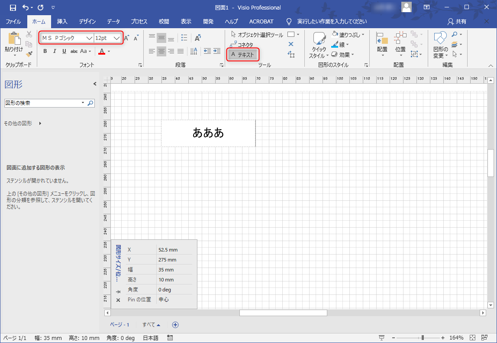
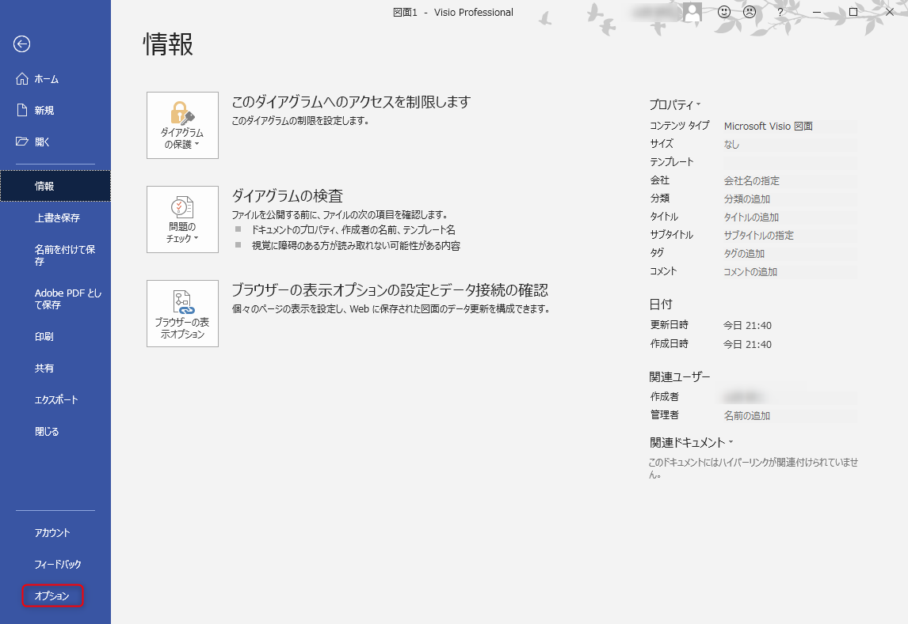
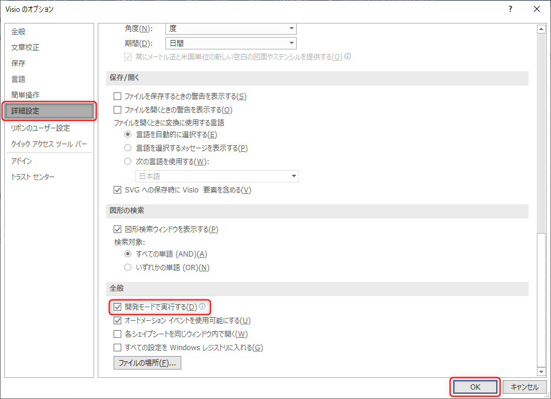
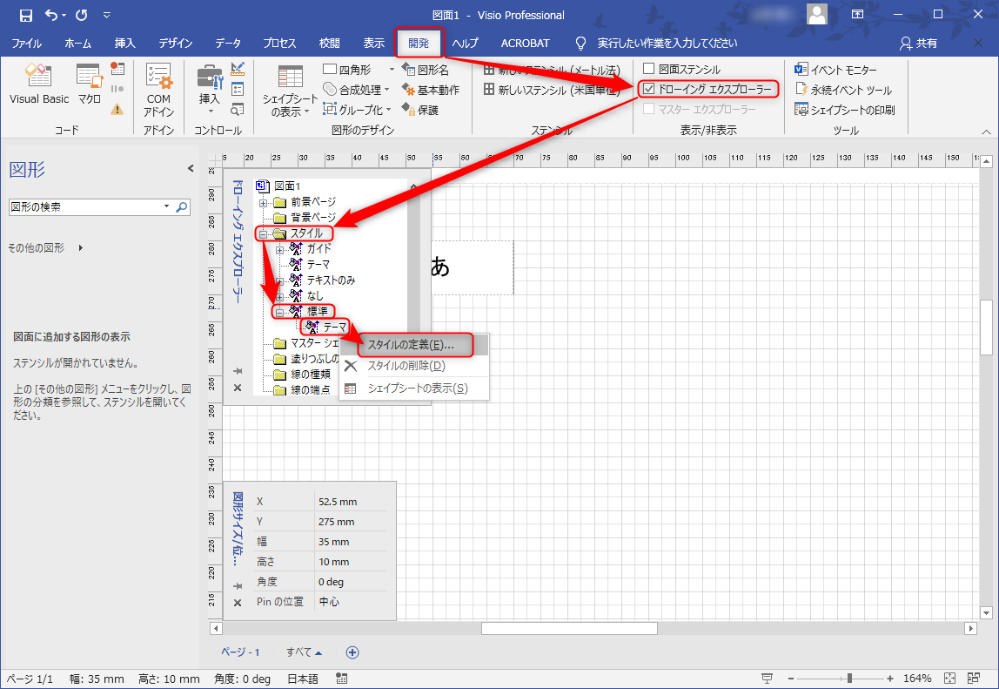
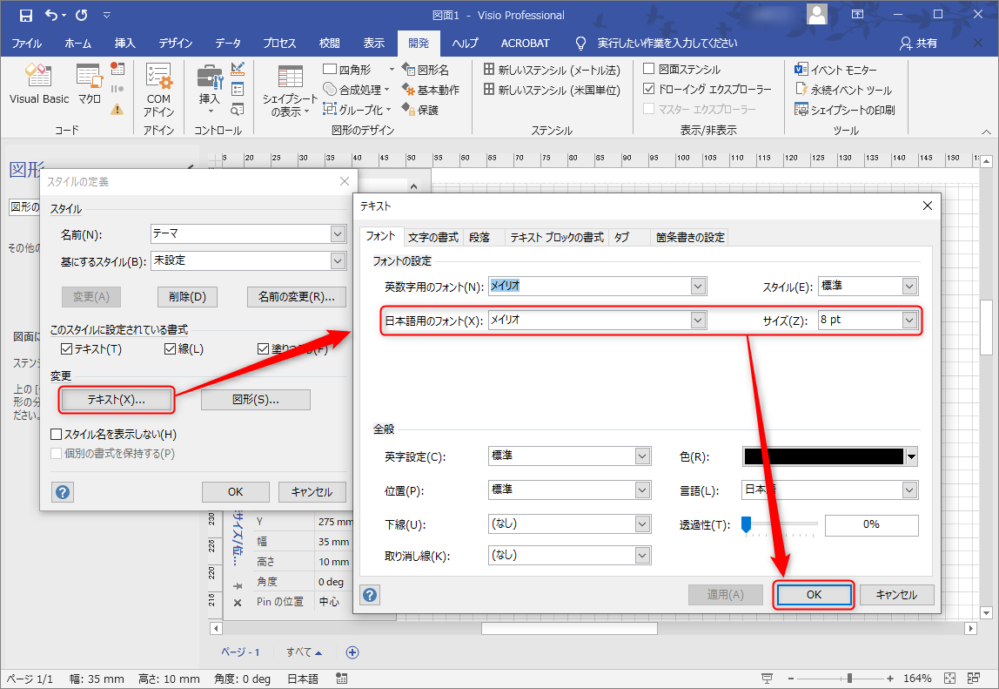

**Microsoft Visio** はちょっとした図を書くのに、ちょっとだけ便利なツールですが、 Microsoft らしくイマイチなところも多いのが玉にキズです。

- [フローチャート作成と作図のソフトウェア、Microsoft Visio](https://products.office.com/ja-jp/visio/flowchart-software)

**Visio の図面でデフォルトのフォントを変更する方法**を紹介します。

## 背景

Visio では Word や Excel などと同様に「ホーム」リボンにフォント設定があるので、ここでフォントやフォントサイズが変更できます。

ただ、テキストツールでテキストボックスを配置したり、図形をダブルクリックして文字列を入力すると毎回**「ＭＳ Ｐゴシック」「12 pt」を強制**されます。（環境によって異なるかもしれません）

特に図面の実サイズがかなり細かい場合でも、このサイズを強制されるので、毎回ポイント数を変更するのが面倒です。また、図面全体で雰囲気を非「ＭＳ Ｐゴシック」にしようと思うとかなりモヤモヤすることになります。

というわけで、このデフォルトのフォントを変更したいと思います。

## [開発] リボンを表示

まず Visio のリボン (画面上部の[ホーム][挿入]などが並んでいるところ) に **[開発]** が表示されているか確認します。表示されていれば、次の項に進んでください。

表示されていなければ、 [ファイル] メニューから **[オプション]** を開きます。

オプションの [詳細設定] で **[開発モードで実行する]** にチェックを入れ [OK] を押します。

## ドローイングエクスプローラーからテーマを変更

**[開発]** リボンをクリックし、 **[ドローイング エクスプローラー]** にチェックをいれます。図面上に（ちょっと邪魔ですが）「ドローイング エクスプローラー」が表示されます。

**[スタイル] → [標準] → [テーマ]** とたどり、 [テーマ] を右クリックして、 **[スタイルの定義...]** を選択します。

「スタイルの定義」ダイアログの [変更] にある **[テキスト...]** をクリックすると、見たことのあるような「テキスト」設定ダイアログが開きます。

ここで**フォントやサイズを変更して [OK]** をクリックします。

これで以後作成される**「その図面の既定のフォント」**が設定できます。

別の図面を新しく作った場合は、都度設定が必要なので、ちょっと面倒ですが、これでもずいぶんマシになりました。

## 補足

ちなみに同様にドローイング エクスプローラーで標準の線種・太さなども設定することができます。デフォルトの線はやたら太くてダサいので、図面を書く場合は、最初に細めにしておくと幸せになれるかもしれません。
