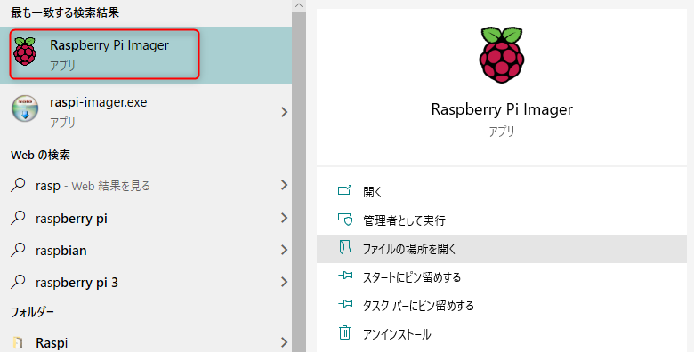
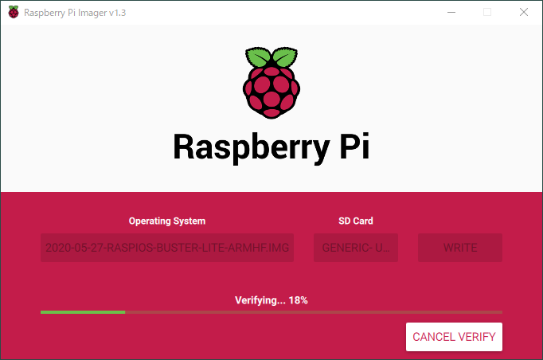

**Raspberry Pi** に OS をインストールするときは Micro SD カードをフォーマットしてイメージをダウンロードしてイメージライティングツールで書き込んで...という流れが面倒でした。

最近は公式サイトで提供されている **Raspberry Pi Imager を使うことでワンストップで OS 入の Micro SD カードを準備することができます。**

## 動作環境

今回は会社に余っていた **Raspberry Pi 3 Model B** を使いました。 OS は従来 Raspbian と呼ばれていた **Raspberry Pi OS** を使います。

- Raspberry Pi 3 Model B V1.2
- [Raspberry Pi Imager v1.3](https://www.raspberrypi.org/documentation/installation/installing-images/README.md)
- [Raspberry Pi OS (32-bit) Lite (2020-05-27-raspios-buster-lite-armhf)](https://www.raspberrypi.org/downloads/raspberry-pi-os/)

GUI が不要だったので Desktop のない Lite 版を選びました。

ちなみに **Raspberry Pi Imager を使う場合はイメージファイルを事前にダウンロードしておく必要はありません。**

今回は DHCP で IP アドレス割り当てが可能な環境で有線 LAN に接続して行います。


## Raspberry Pi Imager を使ったインストール

### Raspberry Pi Imager のインストール

今回は Windows マシンで Raspberry Pi Imager を使って Raspberry Pi OS の Micro SD を作成します。

下記のサイトから **Raspberry Pi Imager for Windows** をダウンロードしてインストールします。

- [Raspberry Pi Downloads - Software for the Raspberry Pi](https://www.raspberrypi.org/downloads/)

### Raspberry Pi OS の SD カードの作成

インストールできたら SD カードリーダーに Micro SD カードをセットし、スタートメニューから Raspberry Pi Imager を起動します。



**CHOOSE SD CARD** で書き込む SD カードを選択し、 **CHOOSE OS** をクリックします。


OS を選択すると自動でイメージをダウンロードできます。 Lite の場合は **Raspberry Pi OS (other)** からたどってください。


すでにダウンロードしてあるイメージを使うには一番下にある **Use custom** を選んで `.img` ファイルを選択します。


**WRITE** ボタンを押すと書き込みが開始されます。しばし待ちます。


書き込みが完了すると自動的にベリファイが走ります。しばし待ちます。



ベリファイが完了すると完了です。


なんと以上です。他のツールがなにもいりません。非常に便利ですね。

### SSH 有効化

モニターにつながずヘッドレス環境で使用する場合は、**初期状態で SSH を有効化させるため、書き込まれた Micro SD カードの `boot` ディレクトリに `ssh` または `ssh.txt` という空ファイルを作成**しておきましょう。

### 起動と接続

Micro SD を挿して Raspberry Pi を起動すると起動シーケンスのあとログインできます。手元の環境ではなぜか初回だけログインのプロンプトが表示されませんでしたが、 Enter キーを叩くと表示されました。

**初期ユーザーとパスワードは `pi` と `raspberry`** になっています。

**ヘッドレス環境の場合は SSH で接続**します。有線 LAN に接続していれば DHCP で IP アドレスが割り振られているはずですが、この段階ではわかりません。ルーターの設定画面などからがんばって調べましょう。

初期状態でホスト名が `raspberrypi` なので **Windows 10 では `raspberrypi.local` で接続できるかもしれません**。コマンドプロンプトなどで `ping raspberrypi.local` としてみて通信できればそれでいけるでしょう。

## 初期設定

### OS バージョン確認

念のためディストリビューションを確認しておきます。

```bash
$ uname -a
Linux raspberrypi 4.19.118-v7+ #1311 SMP Mon Apr 27 14:21:24 BST 2020 armv7l GNU/Linux
```

### パスワード変更

セキュリティに配慮して **`passwd` で `pi` ユーザーのパスワードを変更**しておきます。

```bash
$ passwd
```

### SSH 有効化

インストール時に ssh ファイルを配置していない場合は、デフォルトで SSH が無効になっていますので、有効化しておきます。

```bash
$ sudo systemctl enable ssh
$ sudo systemctl start ssh
```

### パッケージ更新

全パッケージを更新します。

```bash
$ sudo apt update
$ sudo apt upgrade -y
```

### vim インストール

エディターはお好みで。

```bash
$ sudo apt install vim -y
```

### 固定 IP アドレス設定

用途にもよりますが、 DHCP で IP が変わると SSH が面倒なので `/etc/dhcpcd.conf` を編集して、固定 IP 設定に変更します。

```bash
$ vim /etc/dhcpcd.conf

# Static IP configuration:
interface eth0
static ip_address=192.168.0.25/24
static routers=192.168.0.254
static domain_name_servers=192.168.0.1 8.8.8.8
```

IP アドレス、ゲートウェイ、 DNS サーバー等は環境に合わせて設定してください。

### ホスト名変更

ホスト名もお好きなものを指定してください。

```bash
$ sudo raspi-config nonint do_hostname ホスト名
```

再起動後に変更されますので、先に進みましょう。

### 日本語フォントインストール

SSH でのみ使う場合はリモート側で日本語表示できるはずなので不要です。またロケールを英語のまま使う場合も不要です。

```bash
$ sudo apt install fonts-ipafont fonts-ipaexfont
```

### タイムゾーン、ロケール設定

```bash
$ sudo raspi-config nonint do_wifi_country JP
$ sudo raspi-config nonint do_change_timezone Asia/Tokyo
```

日本語へのロケールの切り替えは必要なら行ってください。特に日本語にする必要がなければ不要です。

```sh
$ sudo raspi-config nonint do_change_locale ja_JP.UTF-8
```

### ファイルシステム、メモリーの設定

raspi-config を起動して、ファイルシステムとメモリの設定をしておきます。

```bash
$ sudo raspi-config
```

<del datetime="2020-11-11T11:11:00+09:00">
- 7 Advanced Options
    - **A1 Expand Filesystem** を実行して SD カードの全容量を使用できるように設定
    - **A3 Memory Split** で GPU に割り当てるメモリを最小の 16MB に設定
</del>

- 6 Advanced Options
    - **A1 Expand Filesystem** を実行して SD カードの全容量を使用できるように設定
- 4 Performance Options
    - **P2 GPU Memory** で GPU に割り当てるメモリを最小の 16MB に設定

SD カードの容量がすべて割り当てられていることを確認しておきます。

```bash
$ df -h
Filesystem      Size  Used Avail Use% Mounted on
/dev/root        29G  1.3G   27G   5% /
devtmpfs        484M     0  484M   0% /dev
tmpfs           488M     0  488M   0% /dev/shm
tmpfs           488M  6.6M  482M   2% /run
tmpfs           5.0M  4.0K  5.0M   1% /run/lock
tmpfs           488M     0  488M   0% /sys/fs/cgroup
/dev/mmcblk0p1  253M   52M  202M  21% /boot
tmpfs            98M     0   98M   0% /run/user/1000
```

ついでに raspi-config の **8 Update** で raspi-config 自身を更新しておきましょう。

### Swap の無効化

SD カードで Swap を用いると寿命が短くなるそうなので、 Swap 領域を無効化します。

```bash
$ sudo swapoff --all
$ sudo apt-get purge -y --auto-remove dphys-swapfile
$ sudo rm -rf /var/swap
$ free -mh
              total        used        free      shared  buff/cache   available
Mem:          975Mi        54Mi       755Mi       6.0Mi       166Mi       862Mi
Swap:            0B          0B          0B
```

Swap が 0B になっていることを確認します。

### NTP インストール

時刻は重要なので NTP で NICT あたりに同期させます。

```bash
$ sudo apt install ntp -y
$ sudo vim /etc/ntp.conf

# pool 0.debian.pool.ntp.org iburst
# pool 1.debian.pool.ntp.org iburst
# pool 2.debian.pool.ntp.org iburst
# pool 3.debian.pool.ntp.org iburst
pool ntp.jst.mfeed.ad.jp
pool ntp.nict.jp iburst

$ sudo service ntp restart
$ ntpq -p
     remote           refid      st t when poll reach   delay   offset  jitter
==============================================================================
 ntp.jst.mfeed.a .POOL.          16 p    -   64    0    0.000    0.000   0.001
 ntp.nict.jp     .POOL.          16 p    -   64    0    0.000    0.000   0.001
 ntp2.jst.mfeed. 133.243.236.18   2 u    5   64    1   16.514    8.291   0.001
 ntp1.jst.mfeed. 133.243.236.17   2 u    2   64    1   16.708    8.442   0.001
 ntp-k1.nict.jp  .nict.           1 u    1   64    1    7.880    6.647   0.031
 ntp-a2.nict.go. .NICT.           1 u    -   64    1   14.024    6.225   0.001
 ntp3.jst.mfeed. 133.243.236.19   2 u    4   64    1   16.187    7.578   0.001
 ntp-b3.nict.go. .NICT.           1 u    1   64    1   14.272    6.143   0.032
```

### SSH 鍵認証設定

鍵認証の設定が不要な場合はここは飛ばしてください。

#### 鍵ペアの作成

**ssh-keygen で RSA 鍵ペアを作成**します。

```sh
$ ssh-keygen -t rsa
```

おそらく `/home/pi/.ssh/` に `id_rsa` と `id_rsa.pub` が作成されます。今回はセキュリティをあまり気にしなくていいのでパスフレーズは空にしました。

```sh
Generating public/private rsa key pair.
Enter file in which to save the key (/home/pi/.ssh/id_rsa): 
Created directory '/home/pi/.ssh'.
Enter passphrase (empty for no passphrase): 
Enter same passphrase again: 
Your identification has been saved in /home/pi/.ssh/id_rsa.
Your public key has been saved in /home/pi/.ssh/id_rsa.pub.
The key fingerprint is:
SHA256:wri/0bxckzmtGSyHlgrMogZAMIWvG47Yb7UczVVLBD8 pi@ホスト名
```

#### 公開鍵の設定

`id_rsa.pub` を **`authorized_keys` に変更し、パーミッションを 600** に変えておきます。

```sh
$ mv ~/.ssh/id_rsa.pub ~/.ssh/authorized_keys
$ chmod 600 ~/.ssh/authorized_keys
```

#### sshd_config の設定

**sshd_config を編集して、鍵認証を許可、パスワード認証を不許可**にします。接続できなくなると面倒なので、パスワード認証不許可は後回しでもいいと思います。

```sh
$ sudo vi /etc/ssh/sshd_config 
```

`sshd_config` を下記のように書き換えます。

```diff
- #PubkeyAuthentication yes
+ PubkeyAuthentication yes

- #PasswordAuthentication yes
+ PasswordAuthentication no
```

sshd を再起動しておきます。

```sh
$ sudo /etc/init.d/ssh restart
```

#### 秘密鍵を入手

クライアントからの接続に利用する**秘密鍵を取得**します。

SCP などでダウンロードしてもいいですし、 cat で表示させてコピーし、ローカル端末に保存してもよいと思います。ただし改行コードは LF なので注意しましょう。

```sh
$ cat ~/.ssh/id_rsa
```

不要ならラズパイ側の秘密鍵は消しておきましょう。

```sh
$ rm ~/.ssh/id_rsa
```

以上で今回の初期設定は完了です。


## おまけ

今回は I2C を使ったシリアル通信をするため、 I2C のインターフェイスを有効化しました。

### I2C を有効化

raspi-config を使って I2C を有効化し、再起動します。

```bash
$ sudo raspi-config nonint do_i2c 0
$ sudo reboot
```

※ 0で I2C有効、1で I2C無効

i2c がデバイスとして有効化されていることを確認します。

```bash
$ ls -l /dev/i2c*
crw-rw---- 1 root i2c 89, 1  6月 29 10:08 /dev/i2c-1
```

### ツールインストール

とりあえず Python で遊ぶためにパッケージ追加しました。

```bash
$ sudo apt install -y install python-smbus i2c-tools

$ sudo i2cdetect -y 1
     0  1  2  3  4  5  6  7  8  9  a  b  c  d  e  f
00:          -- -- -- -- -- -- -- -- -- -- -- -- -- 
10: -- -- -- -- -- -- -- -- -- -- -- -- -- -- -- -- 
20: -- -- -- -- -- -- -- -- -- -- -- -- -- -- -- -- 
30: -- -- -- -- -- -- -- -- -- -- -- -- -- -- -- -- 
40: -- -- -- -- -- -- -- -- -- -- -- -- -- -- -- -- 
50: -- -- -- -- -- -- -- -- -- -- -- -- -- -- -- -- 
60: -- -- -- -- -- -- -- -- -- -- -- -- -- -- -- -- 
70: -- -- -- -- -- -- 76 --   
```

今回は Raspberry Pi 標準の I2C ポートに BME280 を接続しているので `0x76` が表示されていれば OK でした。

## 参考文献

[Raspbian Stretch Lite on Raspberry Pi 3 初期設定メモ - Qiita](https://qiita.com/shinsumicco/items/c48cb9457a49a03f453e)
- [Raspberry Piの I2C機能を有効化する方法、最新の Raspbian Stretch対応 2018年版 (ラズパイの I2C機能を有効にして各種センサーを繋げる方法まとめ)](http://www.neko.ne.jp/~freewing/raspberry_pi/raspberry_pi_3_enable_i2c_2018_raspbian_stretch/)
- [SWITCHSCIENCE/samplecodes](https://github.com/SWITCHSCIENCE/samplecodes)
