先日 **[Google Pixel 5](https://store.google.com/jp/product/pixel_5)** を購入しました。

これまで使っていた Huawei P10 と比べてさほどサイズも変わらず、軽快でおサイフケータイつき、防水つきになったので、気に入っています。

メインの SIM は仕事用に使っているドコモ SIM ですが、いわゆる"ギガ"はあまりつけていないので、サブ回線の個人 SIM をデータ通信用にも使っています。これまで IIJmio を使用していましたが **[IIJmio の eSIM](https://www.iijmio.jp/esim/) はデータ通信プランしかありません**ので eSIM で音声回線も使える楽天モバイルにしてみることにしました。

**Pixel 5 は楽天回線対応端末に掲載されていませんが、まったく問題なく eSIM で利用できています。**

楽天モバイルにはスタートガイドがついてきますが、これが冗長でわかりにくいため、手順をまとめておくことにします。

## 概要

今回 Pixel 5 で利用する Dual SIM の構成は下記のようになります。

- 物理 SIM (nano SIM): Docomo
- eSIM: 楽天モバイル

大きな流れとしては、下記の通りです。

1. 旧キャリアで MNP 手続きを行う (MNP 予約番号を発行)
1. 楽天モバイルに MNP で申し込む (MNP 予約番号を使用)
1. 2日程度で楽天モバイルからスタートガイドが届く ※ 
1. 楽天モバイルで **MNP 転入手続き**を行う
1. 楽天モバイルで**開通手続き**を行う
1. Pixel 5 に **eSIM をダウンロード**する
1. Pixel 5 で **eSIM の設定**を行う

※なお、 3 でスタートガイドが届くところについては、運転免許証を使った[電子本人確認 (eKYC; electronic Know Your Customer)](https://network.mobile.rakuten.co.jp/guide/verify/ekyc/) の場合、即日転入手続きが可能です。

なお、今回は 2 までは完了していて、 3 でスタートガイドが届いたところからはじめます。

## 準備

**スタートガイドの背表紙には開通用の QR コードが載っており、本人確認用に使用**します。

<a href="images/mnp-to-rakute-mobile-esim-with-google-pixel-5-1.jpg">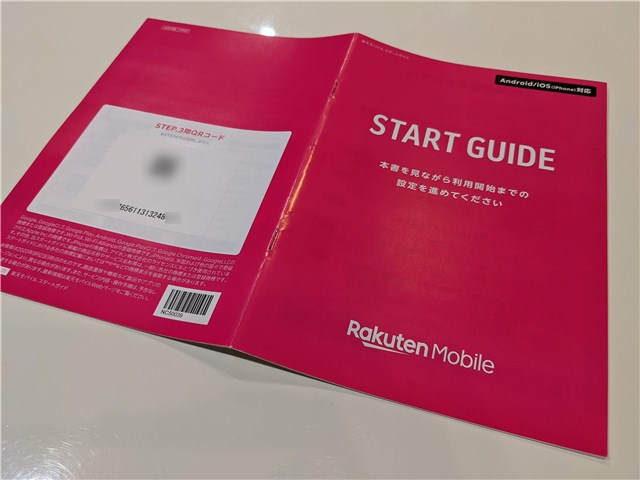</a>

※補足：私は MNP 転入後にスキャンしましたが、まず最初にこの QR コードを Google Lens などでスキャンして本人確認をしたほうがよいようです。

**eSIM ダウンロード用の QR コードを表示させるため、設定するスマホと別に1台スマホかパソコンが必要**です。

**eSIM を設定する新しいスマホ (Pixel 5) は Wi-Fi に接続**しておきます。

## 手順

### MNP 転入、開通手続き

まず MNP 転入と開通手続きを行って、 eSIM のダウンロードができる手前まで設定します。

設定する端末で行ってもいいですが、先ほども書いたとおり、ダウンロード用の QR コードを表示させるため、別端末ではじめたほうがスムースでしょう。

**[my 楽天モバイル](https://portal.mobile.rakuten.co.jp/my-rakuten-mobile) にログイン**し、申込番号が表示されているリンクを選択します。なぜか出荷準備中からステータスが進んでいませんが、スタートガイドが届いていれば問題ありません。

<a href="images/mnp-to-rakute-mobile-esim-with-google-pixel-5-2.png">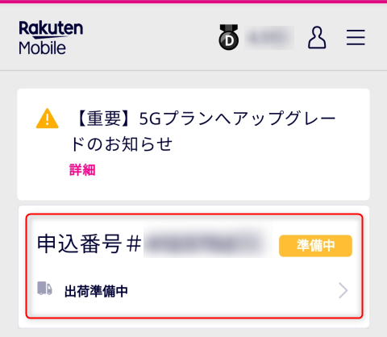</a>

**「転入を開始する」**ボタンをクリックします。

<a href="images/mnp-to-rakute-mobile-esim-with-google-pixel-5-3.png">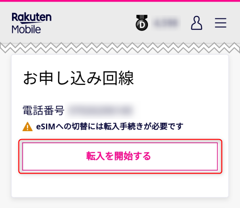</a>

MNP 切替条件が表示されます。特に問題なければ**「転入を開始する」**ボタンをクリックします。

<a href="images/mnp-to-rakute-mobile-esim-with-google-pixel-5-4.png">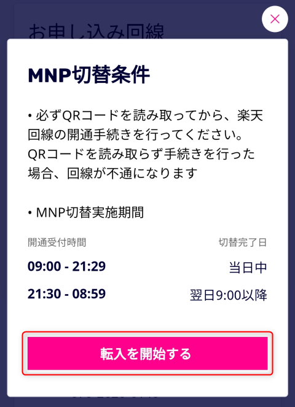</a>

ステータスが**「有効化進行中」**になります。

<a href="images/mnp-to-rakute-mobile-esim-with-google-pixel-5-5.png">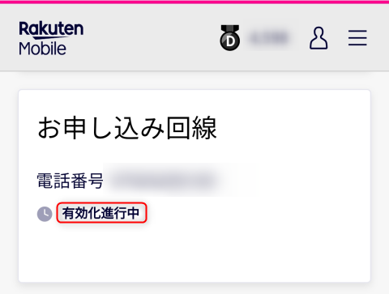</a>

私の場合、この時点で**旧回線が使用不可能**になりました。

<a href="images/mnp-to-rakute-mobile-esim-with-google-pixel-5-6.png">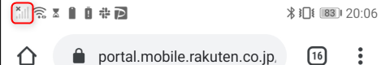</a>

メールで MNP 開通完了のお知らせが届きます。

<a href="images/mnp-to-rakute-mobile-esim-with-google-pixel-5-7.png">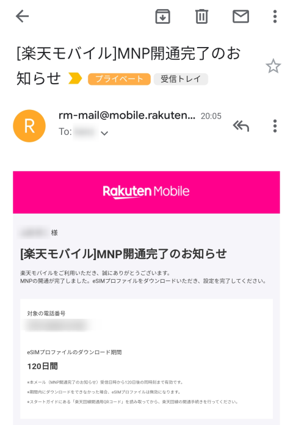</a>

(未実施の場合) 次に**スタートガイドにある QR コードを Google Lens や QR コードアプリで読み取り**、リンク先に飛びます。

**リンク先に飛ぶと自動的に本人確認が終了**し、完了メッセージが表示されます。

<a href="images/mnp-to-rakute-mobile-esim-with-google-pixel-5-8.png">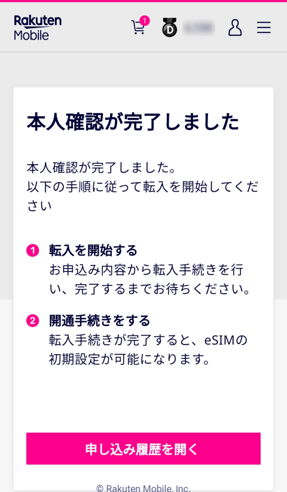</a>

この状態で回線のステータスに戻ると**「開通手続きをする」**ボタンが表れるので、これを選択します。

<a href="images/mnp-to-rakute-mobile-esim-with-google-pixel-5-9.png">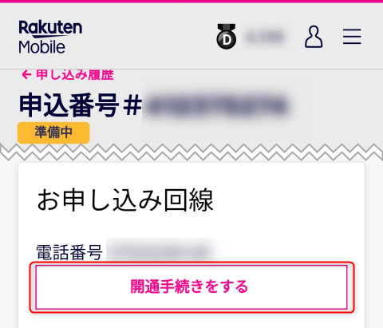</a>

開通手続きが完了すると**「SIM の初期設定」という QR コード**が表示されます。これが **eSIM のダウンロード用 QR コード**ですので、この後の手順で設定するスマホから読み取ります。

<a href="images/mnp-to-rakute-mobile-esim-with-google-pixel-5-10.png">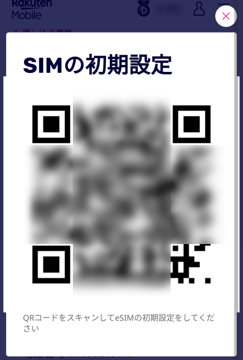</a>

ここまでくると**楽天モバイルの回線ステータスは「開通済み」**となります。

<a href="images/mnp-to-rakute-mobile-esim-with-google-pixel-5-11.png">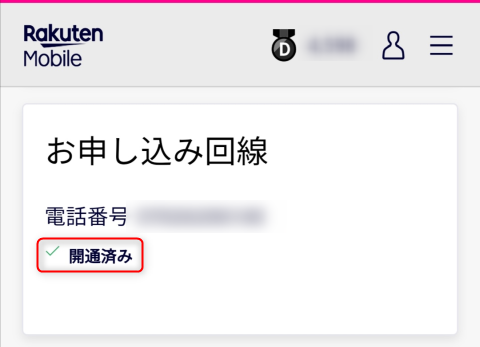</a>

### eSIM のダウンロード

いよいよ **Pixel 5 に eSIM をダウンロード**します。

設定から**「ネットワークとインターネット」**を選択します。

<a href="images/mnp-to-rakute-mobile-esim-with-google-pixel-5-12.png">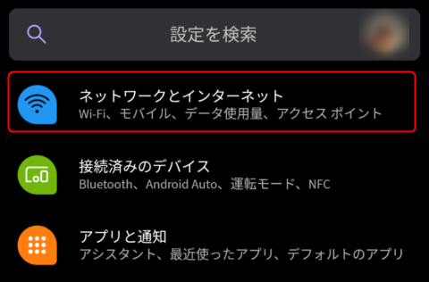</a>

**「モバイルネットワーク」横の＋**を選択します。

<a href="images/mnp-to-rakute-mobile-esim-with-google-pixel-5-13.png">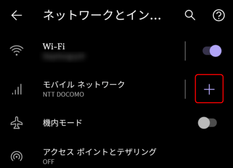</a>

「モバイルネットワークへの接続」画面で**「代わりに SIM をダウンロードしますか？ eSIM を使用して番号を追加」**を選択します。

<a href="images/mnp-to-rakute-mobile-esim-with-google-pixel-5-14.png">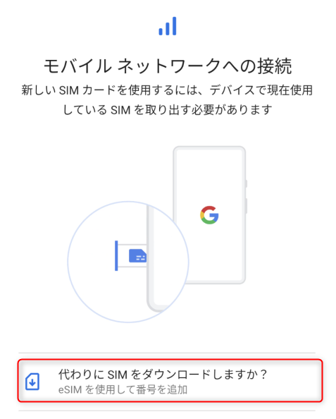</a>

Pixel 5 では **Dual SIM の場合、 4G になってしまう**旨の警告が表示されます (T_T)。仕方ないので「はい」を選択します。

<a href="images/mnp-to-rakute-mobile-esim-with-google-pixel-5-15.png">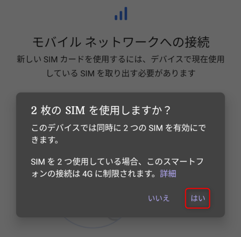</a>

**「SIM のダウンロード」**画面で「次へ」を選択します。

<a href="images/mnp-to-rakute-mobile-esim-with-google-pixel-5-16.png">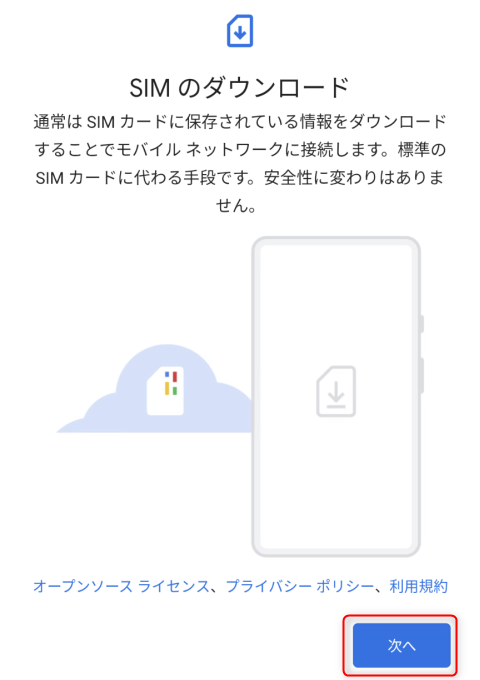</a>

QR コードをスキャンする画面になるので、**楽天モバイルで表示されている eSIM のダウンロード用 QR コードをスキャン**します。

<a href="images/mnp-to-rakute-mobile-esim-with-google-pixel-5-17.png">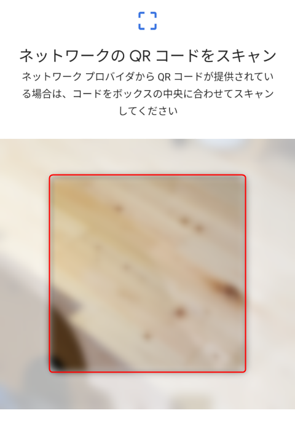</a>

回線名を確認して**「有効化」**を選択します。

<a href="images/mnp-to-rakute-mobile-esim-with-google-pixel-5-18.png">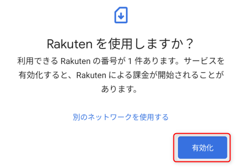</a>

有効化しているところです。数十秒で終了しました。

<a href="images/mnp-to-rakute-mobile-esim-with-google-pixel-5-19.png">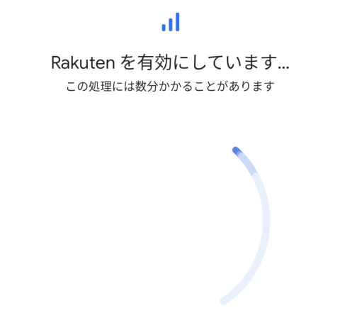</a>

**「Rakuten は有効です」**と表示されれば OK です。「完了」を選択します。

<a href="images/mnp-to-rakute-mobile-esim-with-google-pixel-5-20.png">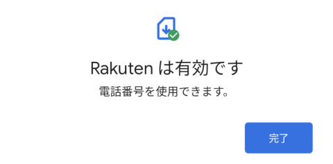</a>

これで**端末に eSIM がダウンロードされ、利用可能**になりました。

### eSIM の設定

再度「ネットワークとインターネット」を開くと **Rakuten** が追加されています。デフォルトではデータ通信等が有効になっていないため、 Rakuten を選択して設定を開きます。

<a href="images/mnp-to-rakute-mobile-esim-with-google-pixel-5-21.png">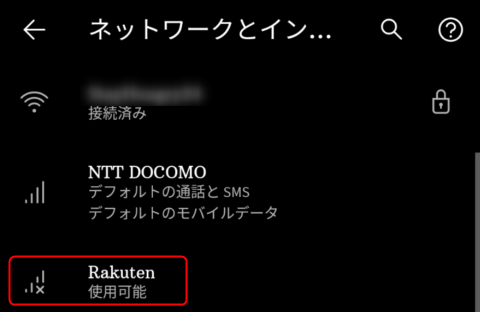</a>

**Rakuten SIM でデータ通信を行うには「モバイルデータ」のスイッチを ON** にします。

<a href="images/mnp-to-rakute-mobile-esim-with-google-pixel-5-22.png">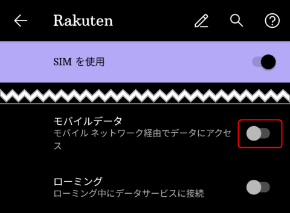</a>

確認が表示されるので、「Rakuten を使用」を選択します。

<a href="images/mnp-to-rakute-mobile-esim-with-google-pixel-5-23.png">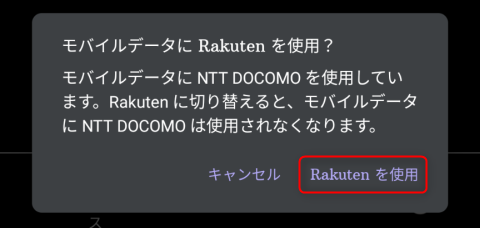</a>

**「デフォルトのモバイルデータ」が Rakuten 側に移り**、データ通信にはこちらの回線が利用されるようになります。

<a href="images/mnp-to-rakute-mobile-esim-with-google-pixel-5-24.png">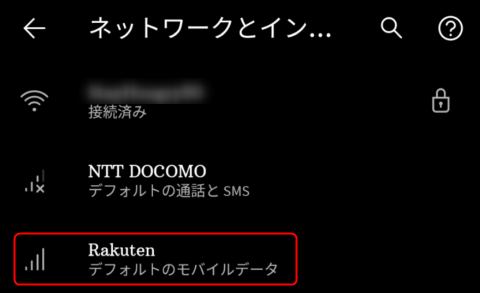</a>

## スピードテスト

最後にスピードテストをやってみました。夜間ではありますが 40 Mbps ほど出ているので無事楽天回線につながっているようです。（＠大阪市内）

<a href="images/mnp-to-rakute-mobile-esim-with-google-pixel-5-25.png">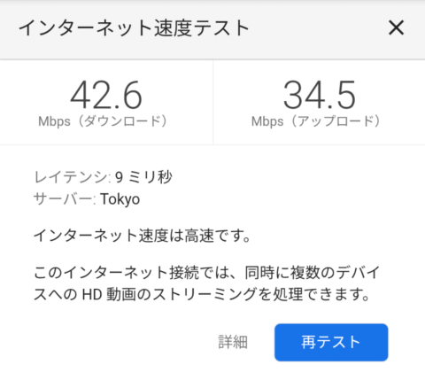</a>

こちらは 13 時ごろ。

<a href="images/mnp-to-rakute-mobile-esim-with-google-pixel-5-26.png">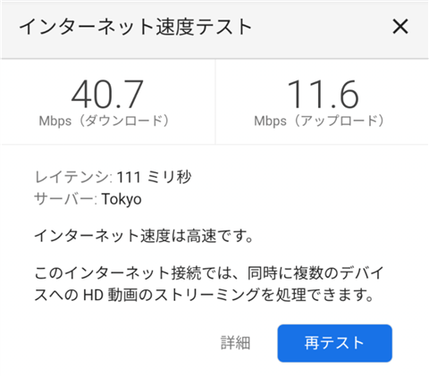</a>

一応 USEN のスピードテストも（夜間）。

<a href="images/mnp-to-rakute-mobile-esim-with-google-pixel-5-27.png">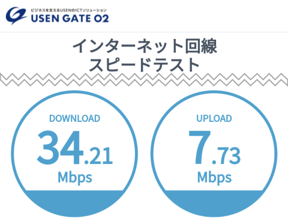</a>

## まとめ

**Google Pixel 5 を Dual SIM で使うために、楽天モバイルに MNP したときの流れ**をご紹介しました。

今回はじめての eSIM でしたが、若干迷いつつも 30 分程度ですべて完了することができました。eSIM なのに郵送を待たないといけないというのもナンセンスなので eKYC を活用した即時登録がもっと普及すればよいと思います。

順調に楽天経済圏に包まれつつある今日このごろでした。