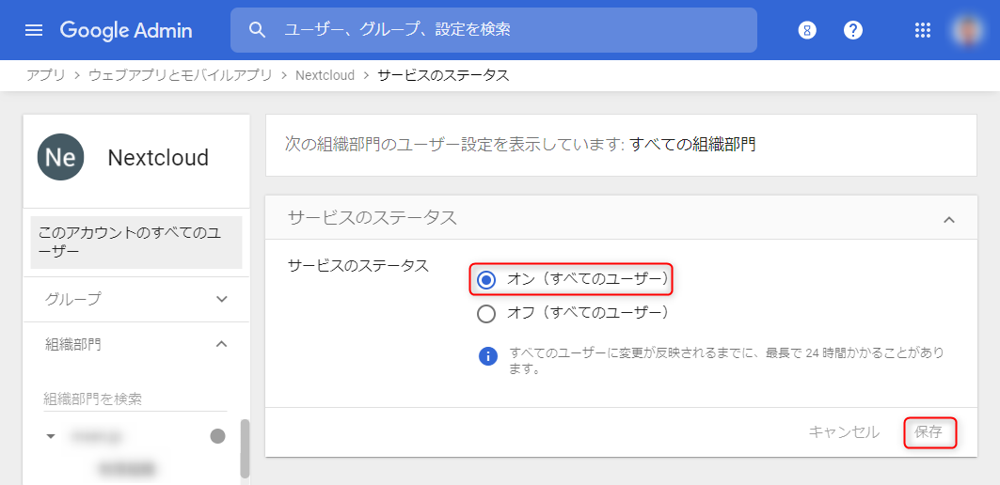

AWS EC2 上に構築した **Nextcloud に Google アカウントでシングル・サインオン (SSO)**できるように設定しました。

**Google Workspace** (旧 G Suite) は Google アカウントを使った SSO ができるよう **SAML 認証の IdP (Identity Provider)** の仕組みを提供しています。 Google Workspace の機能であるため個人アカウントでは利用できません。

これを使って Nextcloud を自社の Google アカウントで使えるようにしました。が、当初は評価環境で試していたこともあり、結構ハマりましたので、ちゃんとまとめておきたいと思います。

- [カスタム SAML アプリを設定する - Google Workspace 管理者 ヘルプ](https://support.google.com/a/answer/6087519?hl=ja)

基本的には上記のヘルプに従えばよいのですが、おそらくこれだけでは設定が難しく、ネット上にもあまり有益な情報がないのが難点です。

## 前提条件

- OS: Amazon Linux 2 (Linux 4.14.198-152.320.amzn2.x86_64 x86_64)
- PHP 7.4.11
- DB: Mysql 5.5.64
- [Nextcloud](https://nextcloud.com/) 20.0.0

Nextcloud の構築については下記の記事を参照してください。

- [Amazon Linux 2 に Nextcloud 20 を構築する](/build-nextcloud-20-on-amazon-linux2)

## Google 側の設定

Nextcloud 側からやりたくなってしまいますが、先に Google 側の設定を済ませたほうがスムースです。

まずは Google 側で設定します。

### SAML アプリの追加

**Google に管理者アカウントでログインし、管理コンソール**を開きます。アプリ→ウェブアプリとモバイルアプリを開き、「**アプリを追加**」から「**カスタム SAML アプリの追加**」を選択します。

- [Google 管理コンソール](https://admin.google.com/)


アプリ名を設定します。既存のものと重複しなければなんでも OK ですが、わかりやすく Nextcloud か nextcloud などにしておくとよいでしょう。

入力したら「続行」をクリックします。


### Google IdP 情報の取得

Google 側の IdP 情報が表示されます。のちほど**赤枠で囲った部分を Nextcloud の SAML 認証設定に入力**しますが、とりあえずこの 3 つの値をテキストエディターなどにコピーしておきます。

ちなみにこれらの値は後からも参照できるのでコピーし忘れても問題ありません。

ここでは入力するものはないので「続行」をクリックします。


### Nextcloud (SP) 情報の入力

「サービスプロバイダの詳細」画面で Nextcloud (SP) 側の設定を入力します。

**ACS (Assertion Consumer Service) の URL** と **エンティティ ID** はのちほど Nextcloud 側で再確認しますが、基本的には下記のような URL になるはずですのでこれを入力します。

項目 | 値
-- | --
ACS の URL | `https://<Nextcloud のアドレス>/index.php/apps/user_saml/saml/acs`
エンティティ ID | `https://<Nextcloud のアドレス>/index.php/apps/user_saml/saml/metadata`

ちなみに **ACS の URL は https しか入力できません**ので、 http 運用の場合は連携できません。

「名前 ID」のところは下記のように設定します。

項目 | 値
-- | --
名前 ID の形式 | `EMAIL`
名前 ID | Basic Information &gt; Primary email

入力したら「続行」をクリックします。


### 属性マッピングの定義

属性のマッピングを定義します。

Google ディレクトリの属性 | アプリの属性
-- | --
Basic Information &gt; Primary email | `username`
Basic Information &gt; Primary email | `emailAddress`
Last name | `displayName`

`username` は Nextcloud のユーザー名にマッピングするために定義します。ただこの `username` という属性名は後ほど Nextcloud 側で設定するときに一致させればよいので、 `mail` や `uid` などでもかまいません。

`emailAddress` や `displayName` などは必須ではありません。それぞれ Nextcloud の登録メールアドレスと表示名にマッピングさせるために必要であれば定義します。こちらも属性名は任意のものでかまいません。

「完了」をクリックすると Google 側の設定は完了です。


### ユーザーアクセスの有効化

設定が完了すると追加したアプリの詳細画面になります。ここでデフォルトでは「ユーザー アクセス」が「オフ（すべてのユーザー）」になっていると思いますので、ここをクリックしてユーザーアクセスの設定画面を開きます。


サービスのステータスで「**オン（すべてのユーザー）**」を選択して、「保存」をクリックします。特定のグループや部門にアクセス権を設定する場合は、左メニューから選択して設定します。



**「ユーザー アクセス」が「オン（すべてのユーザー）」**になっていれば OK です。


これで Google 側の設定は終了です。

## Nextcloud の設定

続いていよいよ Nextcloud 側を設定していきます。

### SAML 認証アプリのインストールと有効化

アカウントメニューから「**アプリ**」を選びます。


検索欄に **`saml`** とでも入力すると 「**SSO & SAML authentication**」 が表示されるので、「**ダウンロードして有効にする**」を選択します。


### SAML 認証の設定

インストールが終わると「設定」の「管理」に「**SSOとSAML認証**」が表示されているはずなので、これを開きます。

「**組み込みのSAML認証を使用する**」ボタンをクリックします。


まず、上のほうに警告がでているとおり、何も考えずに **SAML 認証だけ有効にしてしまうと Nextcloud の認証ができなくなり、管理者でログインできなくなる**恐れがあります。

事前に下記のいずれかの対応をしておきましょう。

- ユーザー設定から、ログイン ID を今から連携する Google アカウントのメールアドレスにしたアカウントに管理者権限を与えておく
- 下図のように**「複数のユーザーのバックエンド（LDAPなど）の使用を許可する (Allow the use of multiple user back-ends (e.g. LDAP))」にチェック**をいれておきます。（このチェックにより、 Nextcloud の元々の認証も利用できるようになります）


次に IdP (Identity Provider = Google) の設定を入力します。

各項目がとてもわかりづらいですが、下記のように設定します。日本語だと項目名が若干変なので英語版も併記しておきます。

項目 | 値/値の例
-- | --
UID をマップする属性 <br> Attribute to map the UID to. | Google で Primary email をマップした属性名 <br> 例. `username`
ID プロバイダのオプション表示名 <br> Optional display name of the identity provider (default: "SSO & SAML log in") | この認証方法の名前 (任意) <br> 例. `Google ログイン`
IdP エンティティの識別子 <br> Identifier of the IdP entity (must be a URI) | Google の "エンティティ ID" <br> 例. `https://accounts.google.com/o/saml2?idpid=<ID>`
SPが認証要求メッセージを送信するIdPのURLターゲット <br> URL Target of the IdP where the SP will send the Authentication Request Message | Google の "SSO の URL" <br> 例. `https://accounts.google.com/o/saml2/idp?idpid=<ID>`
URL SP がSLO要求を送信するIdPの場所 <br> URL Location of the IdP where the SP will send the SLO Request | 空 ※後述
IdPの公開X.509証明書 <br> Public X.509 certificate of the IdP | Google の SAML 証明書
表示名をにマップする属性 <br> Attribute to map the displayname to. | Google の属性マッピングで Last name をマッピングした属性名 (任意) <br> 例. `displayName`
電子メールアドレスをマップする属性 <br> Attribute to map the email address to. | Google の属性マッピングで Primary email をマッピングした属性名 (任意) <br> 例. `emailAddress`


「IdPの公開X.509証明書」の設定欄などが表示されていないときは Show optional Identity Provider settings... をクリックします。

設定できたら、ページ下部の「メタデータXMLをダウンロード」をクリックして、 metadata.xml を保存します。


metadata.xml の中身は下記のようになっています。

```xml
<?xml version="1.0"?>
<md:EntityDescriptor xmlns:md="urn:oasis:names:tc:SAML:2.0:metadata"
                     validUntil="2020-11-15T08:39:42Z"
                     cacheDuration="PT604800S"
                     entityID="https://<Nextcloud のアドレス>/index.php/apps/user_saml/saml/metadata">
    <md:SPSSODescriptor AuthnRequestsSigned="false" WantAssertionsSigned="false" protocolSupportEnumeration="urn:oasis:names:tc:SAML:2.0:protocol">
        <md:NameIDFormat>urn:oasis:names:tc:SAML:1.1:nameid-format:unspecified</md:NameIDFormat>
        <md:AssertionConsumerService Binding="urn:oasis:names:tc:SAML:2.0:bindings:HTTP-POST"
                                     Location="https://<Nextcloud のアドレス>/index.php/apps/user_saml/saml/acs"
                                     index="1" />
        
    </md:SPSSODescriptor>
</md:EntityDescriptor>
```

ここで `md:EntityDescriptor@entityID` と `md:AssertionConsumerService@Location` を確認します。これが最初に Google 側で設定した「エンティティ ID」と「ACS の URL」と一緒であれば OK です。もし違っている場合は一致させる必要があるので Google 側で設定変更が必要です。

## SSO 動作確認

ここまできたら、 Nextcloud からログアウトするか、別のブラウザーを開き、 Nextcloud のログイン画面を開きます。


上記のように**ダイレクトログイン** (Nextcloud のユーザー認証) と先ほど追加した SAML 認証 (ここでは「**Google ログイン**」) が表示されているはずです。

ここでは「Google ログイン」をクリックして SSO をテストします。

うまく設定できていて、 Google アカウントにすでにログイン済みの場合は、そのまま Nextcloud にログインできるはずです。 Google アカウントにログインしていない場合は Google のログイン画面が表示されます。


Google アカウントから無事サインインできれば成功です。お疲れ様でした！


## トラブルシューティング

### SAML 認証エラーのデバッグ

SAML 認証に失敗すると下記のような Google のエラーが表示されることがあります。


エラーメッセージについては下記のページを参考にします。

- [SAML アプリのエラー メッセージ - Google Workspace 管理者 ヘルプ](https://support.google.com/a/answer/6301076?hl=ja)

また、このとき Request Details を展開して表示される **SAMLRequest** は下記のページでデコードできます。

- [Encode / Decode](https://toolbox.googleapps.com/apps/encode_decode/)

### 403 app_not_configured_for_user (未解決)

Google Chrome や Internet Explorer, Firefox では動作確認できたのですが、なぜか **Edge (Chromium 版) では 403 (app_not_configured_for_user) がでてログインできません**。


残念ながら現状ではこの問題は解決できていません。環境依存かもしれませんので、またなにかわかれば更新します。

## ログアウトについて

SSO でログインすると ログアウト ボタンが表示されなくなり、ログアウトできなくなります。通常の利用者には大きな問題がないと思いますが、ログアウトしたいときだってあるかもしれません。

SAML 認証構成で **ログアウトできるようにするには Nextcloud の SAML IdP 設定に SLO (シングル・ログアウト) の URL を設定**する必要があります。 


が、残念ながら **Google は SLO の URL を提供していません**。。。

というわけで今のところ弊社では **SLO の URL に Nextcloud の URL** (`https://<Nextcloud のアドレス/`) を指定しています。 

本来の使い方とは違う気もしますが、これでログアウトボタンも出現し、特に問題なく動作しているようです。

## その他参考サイト

- [G-Suite as a SAML Provider for Nextcloud - Google ドキュメント](https://docs.google.com/document/d/1yWk8Viov-1gKyen0UuERBiPgviAhJofcIabOHC0UnBg/edit)
- [Google as a SAML Provider - ℹ️ Support - Nextcloud community](https://help.nextcloud.com/t/google-as-a-saml-provider/5126/4)