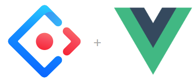

こんにちは、kenzauros です。

今作っているサービスのビュー試作で **Nuxt.js** に UI フレームワークとして **[Ant Design Vue](https://www.antdv.com/docs/vue/introduce/)** を組み合わせて使っています。

今回は **Ant Design Vue** のテーマをカスタマイズする方法を紹介します。

## 概要

### Ant Design Vue について

[Ant Design Vue](https://www.antdv.com/docs/vue/introduce/) は **Alibaba** が React 向けに作った [Ant Design](https://ant.design/) の Vue 向けバージョンです。割とほしくなるコンポーネントが揃っており、サイズ感も好みにあったので、試してみることにしました。



Nuxt.js でも `create-nuxt-app` の UI フレームワークの選択肢に入っているので導入しやすいのも特徴です。

### デフォルトの中華フォントが難

中国のアリババで作られているので仕方ないのですが、**デフォルトのフォント指定が中華フォント**になっていて、日本語サイトを書こうとすると極端に気持ちわるいです。

これは標準の CSS で `font-family` が下記のように定義されているからです。

```
-apple-system, BlinkMacSystemFont, 'Segoe UI', 'PingFang SC', 'Hiragino Sans GB',
'Microsoft YaHei', 'Helvetica Neue', Helvetica, Arial, sans-serif, 'Apple Color Emoji',
'Segoe UI Emoji', 'Segoe UI Symbol'
```

### スタイル・テーマは LESS で書かれている

下記の公式リファレンスにもあるように **Ant Design Vue の CSS は [Less](http://lesscss.org/)** で書かれています。個人的には SCSS のほうがよかったのですが、仕方ありません。

- [Customize Theme - Ant Design Vue](https://www.antdv.com/docs/vue/customize-theme/)

Nuxt のデフォルトでは既定の CSS (`ant-design-vue/dist/antd.css`) を読み込むようになっているので、テーマをカスタムするには **Less ファイルをコンパイルして読み込む**ように変更する必要があります。

### 前提条件

- Node 12.9.1
- Nuxt 2.0.0
- ant-design-vue 1.1.10

## テーマのカスタマイズ

### Less 変数を上書きする

基本的には [Ant Design Vue Less variables](https://www.antdv.com/docs/vue/customize-theme/#Ant-Design-Vue-Less-variables) で説明されているように **Less 変数を設定することでテーマを上書き**することができます。

Nuxt は内部的に Webpack を使っているので [Customize in webpack](https://www.antdv.com/docs/vue/customize-theme/#Customize-in-webpack) のとおり、 **`less-loader` の `options` に `modifyVars` を指定する**と Less 変数を上書きすることができます。

なお、**使用できる変数の一覧は [ant-design-vue/default.less](https://github.com/vueComponent/ant-design-vue/blob/master/components/style/themes/default.less)** で参照できます。

### Less とローダーのインストール

まず **Less** と **less-loader** をインストールします。

```bash
yarn add less less-loader
```

### nuxt.config.js の変更

**`nuxt.config.js`** を下記のように修正します。

```js
module.exports = {
  // ～中略～
  /*
  ** Global CSS
  */
  css: [
    {
      src: 'ant-design-vue/dist/antd.less',
      lang: 'less',
    },
  ],
  // ～中略～
  /*
  ** Build configuration
  */
  build: {
    loaders: {
      less: {
        modifyVars: {
          'primary-color': '#2cbe4e',
          'font-family': '-apple-system, BlinkMacSystemFont, Meiryo, sans-serif',
        },
        javascriptEnabled: true,
      },
    },
  },
};
```

元々 `css` は `[ 'ant-design-vue/dist/antd.css' ]` のように CSS ファイル指定になっていると思いますが、このパス指定をオブジェクトに変え、 **`lang` を指定すると指定したプリプロセッサで処理される**ようになります。

**Less のオプションは `build.loaders.less`** に渡します。

これで `yarn dev` すれば緑のプライマリーカラーとメイリオで表示されるはずです。
