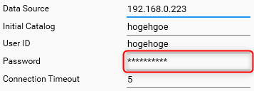

.NET Core で WPF が利用できるようになって便利になりましたが、 .NET Core では **[SecureString](https://docs.microsoft.com/ja-jp/dotnet/api/system.security.securestring?view=netcore-3.1)** の扱いが変更になったことで、 WPF の PasswordBox の扱いを変更せざるを得なくなりました。

**SecureString クラスは元々パスワードのような機密性の高い文字列を格納するために導入されたクラスですが、 .NET Core では非推奨になり、今後は使用しないことが公式に勧奨**されています。

しかしながら既存のクラスには残念ながら (?) SecureString を使ったものが残っています。今回は .NET Core において **SecureString** の扱いをどうするか、と **PasswordBox を使ったパスワードの取り扱いや XAML でのバインディング**について考えます。

## SecureString は非推奨となった

前述のとおり .NET Core では SecureString は非推奨となり、「使うべきではない」とされています。

> 新しい開発には SecureString クラスを使用しないことをお勧めします。 詳細については、GitHub でSecureString を使用しないでください。
> [SecureString クラス (System.Security) | Microsoft Docs](https://docs.microsoft.com/ja-jp/dotnet/api/system.security.securestring?view=netcore-3.1)

> DE0001: SecureString shouldn't be used
> [platform-compat/DE0001.md at master · dotnet/platform-compat](https://github.com/dotnet/platform-compat/blob/master/docs/DE0001.md)

理由としては大きく 2 つのようです。

- Windows では機密性の高い文字列がメモリ上に残る時間を短くすることでセキュアにしたつもりだったが、そもそも .NET ではプレーンテキストに変換する必要があるので、完全にセキュアにはできなかった
- .NET Framework 以外の .NET 環境では暗号化されていないので意味がない

元々意味がないと思っていましたが、公式に言われるとなんだか拍子抜けですね。

回避方法としては代わりに**証明書やWindows認証などの他の認証手段を利用せよ**とのことです。

というわけで今後 **.NET Core や後続の .NET 5 では SecureString を使用せず、他の方法を用いるのがよい**ようです。

## では何を用いるのか

とはいえ、すべてが証明書や Windows 認証に切り替えられるわけではありません。

パスワード認証を採用せざるをえない環境もありますし、パスワード自体を管理したいアプリケーションもありえます。

今後そういった文字列でも**普通に String 型で扱うしかなさそう**です。

unmanaged な配列を確保して暗号化して不要になったら解放して...ということもできなくはないですが、結局のところ SecureString と似たような「意味無し」という結論になるでしょう。

## PasswordBox の問題

### SecurePassword と Password とデータバインディング

さて、先のことはそのときに考えるとして、これまで使ってきたものはどうするのか、という問題が残ります。最たるものが **WPF のパスワード表示コントロール PasswordBox** です。



ご存知のとおり、この PasswordBox は SecurePassword という SecureString 型のプロパティをもっており、このプロパティにアクセスすることでユーザーが入力したパスワードを取得する、というのが推奨でした。

が、プレーンテキストで取得する Password プロパティというバックドアまで存在するので、結局ザルでした。

しかもこれらのプロパティ、またもセキュリティの観点から**依存関係プロパティとしては実装されておらず、バインディングできないのでここだけ MVVM 的に実装できない**、という問題もありました。

これに対しては先人がヘルパーやビヘイビアを考案しておられるので、これを利用できます。

- [\[WPF\]PasswordBoxのセキュアなパスワードSecurePasswordにバインドしたい - Qiita](https://qiita.com/pierusan2010/items/5d4ceb28ee18cd4e3853)
- [WPF で PasswordBox に データバインド する方法 - galife](https://garafu.blogspot.com/2014/09/wcf-passwordbox.html)

いずれにしても SecurePassword はすでに意味がないということなので、プレーンテキストの Password プロパティを使うことにします。

### ビヘイビアを用いたデータバインディング

[@pierusan2010](https://qiita.com/pierusan2010) さんの作られた SecurePassword 用のビヘイビアを Password 用に書き換えて少し加筆したものが下記のソースです。

ほぼそのままですが、ビヘイビアの名前空間が `System.Windows.Interactivity` から **`Microsoft.Xaml.Behaviors`** (アセンブリも同名) に変わっており、 `System.Windows.Interactivity.dll` の参照は不要になっています。

```cs
using Microsoft.Xaml.Behaviors;
using System.Windows;
using System.Windows.Controls;

internal class PasswordBindingBehavior : Behavior<PasswordBox>
{
    public string Password
    {
        get { return (string)GetValue(PasswordProperty); }
        set { SetValue(PasswordProperty, value); }
    }

    public static readonly DependencyProperty PasswordProperty =
        DependencyProperty.Register("Password",
        typeof(string),
        typeof(PasswordBindingBehavior),
        new PropertyMetadata("", PasswordPropertyChanged));

    private static void PasswordPropertyChanged(DependencyObject d,
        DependencyPropertyChangedEventArgs e)
    {
        if (!(d is PasswordBindingBehavior behavior)
            || !(behavior.AssociatedObject is PasswordBox passwordBox)
            || !(e.NewValue is string newPassword))
        { return; }

        var oldPassword = e.OldValue as string;
        if (newPassword.Equals(oldPassword)) return;
        if (passwordBox.Password == newPassword) return;
        passwordBox.Password = newPassword;
    }

    protected override void OnAttached()
    {
        base.OnAttached();
        AssociatedObject.PasswordChanged += PasswordBox_PasswordChanged;
    }

    protected override void OnDetaching()
    {
        AssociatedObject.PasswordChanged -= PasswordBox_PasswordChanged;
        base.OnDetaching();
    }

    private void PasswordBox_PasswordChanged(object sender, RoutedEventArgs e)
    {
        Password = AssociatedObject.Password;
    }
}
```

こんな感じで使用します。

```xml
<PasswordBox PasswordChar="*">
    <i:Interaction.Behaviors>
        <behaviors:PasswordBindingBehavior
            Password="{Binding PasswordInViewModel, Mode=TwoWay}" />
    </i:Interaction.Behaviors>
</PasswordBox>
```

### ヘルパーを用いたデータバインディング

こちらも [galife](https://garafu.blogspot.com/2014/09/wcf-passwordbox.html) さんの PasswordBoxHelper を C# 7 向けに書き直しただけで、ほぼそのままです。

```cs
using System.Windows;
using System.Windows.Controls;

internal class PasswordBoxHelper : DependencyObject
{
    public static readonly DependencyProperty IsAttachedProperty
        = DependencyProperty.RegisterAttached(
            "IsAttached",
            typeof(bool),
            typeof(PasswordBoxHelper),
            new FrameworkPropertyMetadata(false, IsAttachedProperty_Changed));

    public static readonly DependencyProperty PasswordProperty
        = DependencyProperty.RegisterAttached(
            "Password",
            typeof(string),
            typeof(PasswordBoxHelper),
            new FrameworkPropertyMetadata(string.Empty, FrameworkPropertyMetadataOptions.BindsTwoWayByDefault, PasswordProperty_Changed));

    public static bool GetIsAttached(DependencyObject dp)
        => (bool)dp.GetValue(IsAttachedProperty);

    public static string GetPassword(DependencyObject dp)
        => (string)dp.GetValue(PasswordProperty);

    public static void SetIsAttached(DependencyObject dp, bool value)
        => dp.SetValue(IsAttachedProperty, value);

    public static void SetPassword(DependencyObject dp, string value)
        => dp.SetValue(PasswordProperty, value);

    private static void IsAttachedProperty_Changed(DependencyObject sender, DependencyPropertyChangedEventArgs e)
    {
        if (!(sender is PasswordBox passwordBox)) return;
        if ((bool)e.OldValue)
        {
            passwordBox.PasswordChanged -= PasswordBox_PasswordChanged;
        }
        if ((bool)e.NewValue)
        {
            passwordBox.PasswordChanged += PasswordBox_PasswordChanged;
        }
    }

    private static void PasswordBox_PasswordChanged(object sender, RoutedEventArgs e)
    {
        if (!(sender is PasswordBox passwordBox)) return;
        SetPassword(passwordBox, passwordBox.Password);
    }

    private static void PasswordProperty_Changed(DependencyObject sender, DependencyPropertyChangedEventArgs e)
    {
        if (!(sender is PasswordBox passwordBox)) return;
        var newPassword = (string)e.NewValue;
        if (!GetIsAttached(passwordBox))
        {
            SetIsAttached(passwordBox, true);
        }
        if ((string.IsNullOrEmpty(passwordBox.Password) && string.IsNullOrEmpty(newPassword)) ||
            passwordBox.Password == newPassword)
        {
            return;
        }
        passwordBox.PasswordChanged -= PasswordBox_PasswordChanged;
        passwordBox.Password = newPassword;
        passwordBox.PasswordChanged += PasswordBox_PasswordChanged;
    }
}
```

こんな感じで使用します。

```xml
<PasswordBox
    PasswordChar="*"
    helpers:PasswordBoxHelper.IsAttached="True"
    helpers:PasswordBoxHelper.Password="{Binding PasswordInViewModel}"
    />
```

すっきりしていいですね。

<ins>

2022/6/1 追記

`IsAttached` を明示的に設定しておかないとバインディングしたパスワードが空文字のときに下記の現象となり、入力値が VM に反映されません。
（`PasswordProperty_Changed` が発生せず、 `PasswordBox_PasswordChanged` ハンドラも設定されないため）

このヘルパーを使用する場合は `IsAttached` を明示的に `True` にしておきましょう。

</ins>


## あとがき

というわけで今回は **.NET Core 時代の SecureString と PasswordBox の取り扱い**を紹介しました。

もはや SecureString でもないのなら Password プロパティを依存関係プロパティにしてくれれば、バインディングも楽なんですけどね...

いずれにしても開発者は String 型でパスワードを扱う以上、プレーンテキストがメモリ上に滞留するというリスクを把握した上で、用途にあった適切な実装をすることが求められます。
