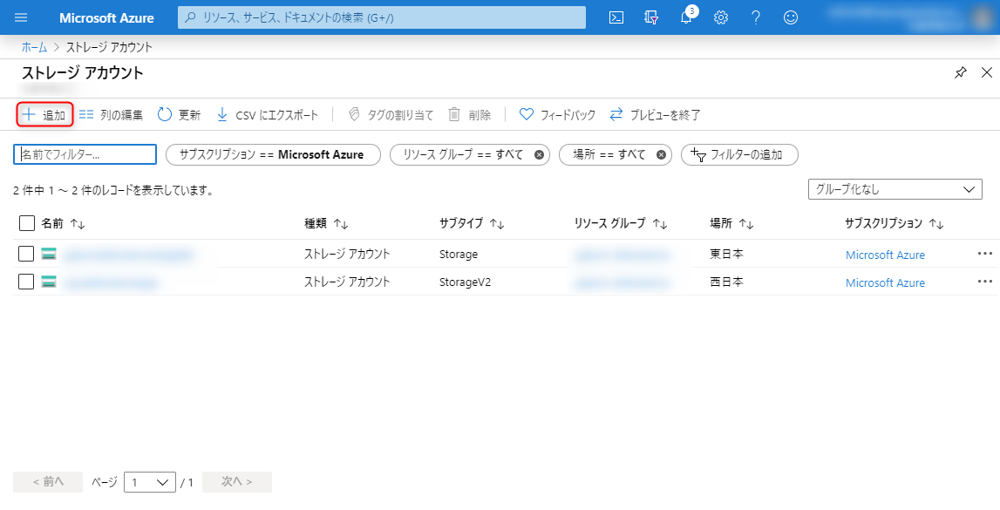
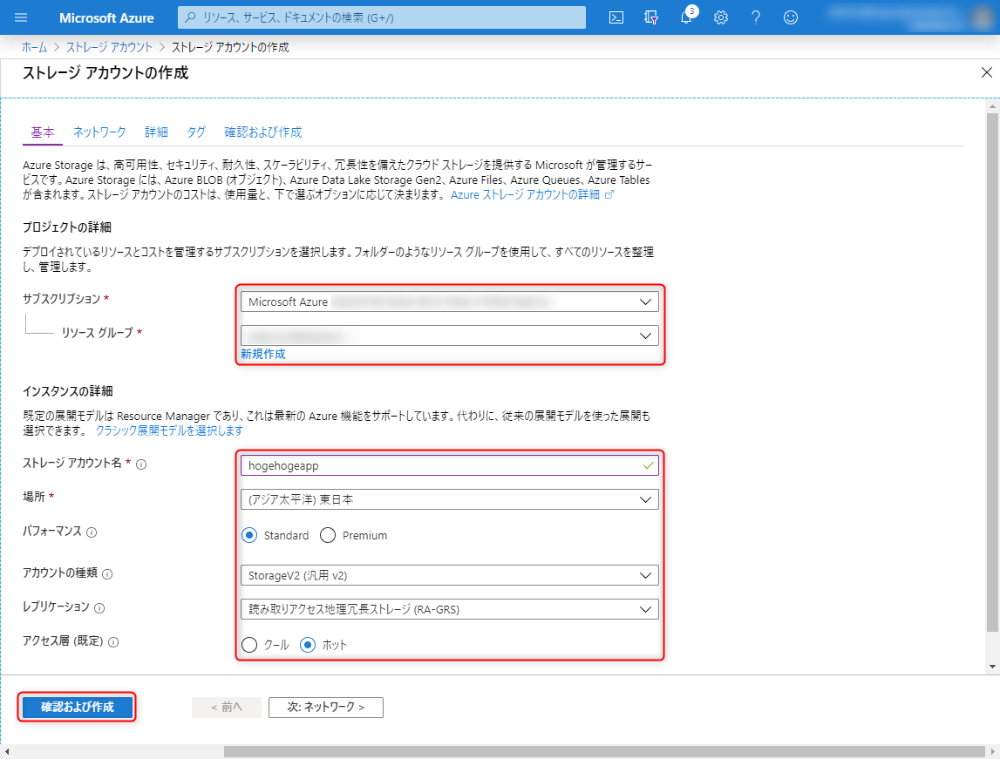
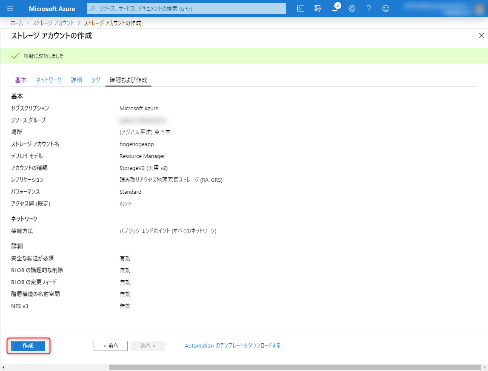
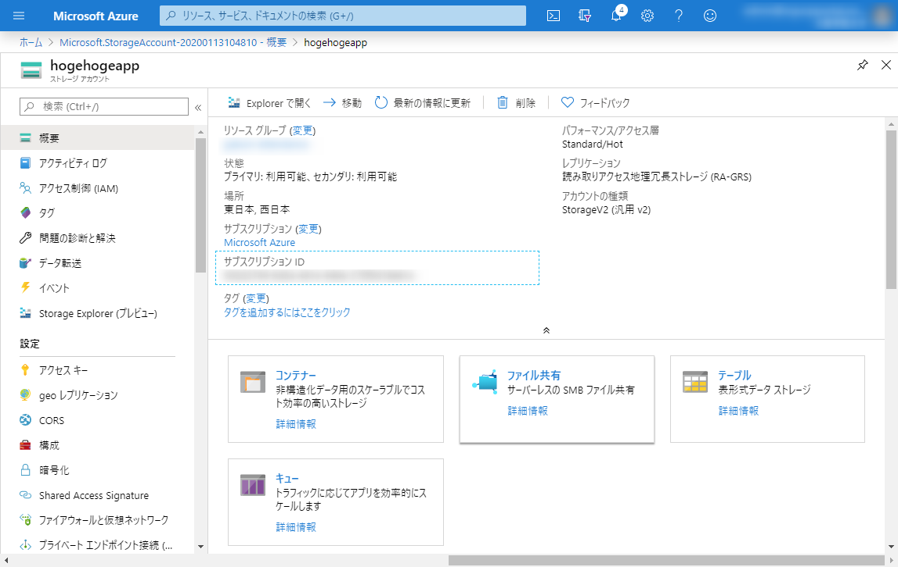
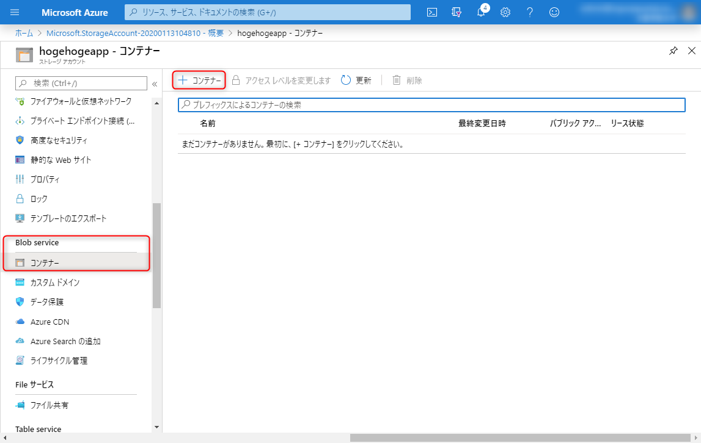
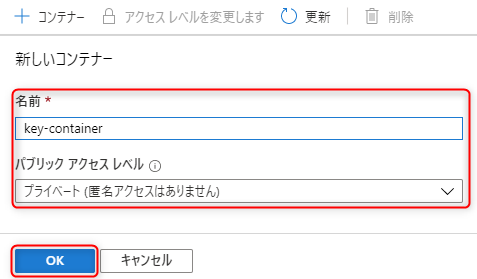
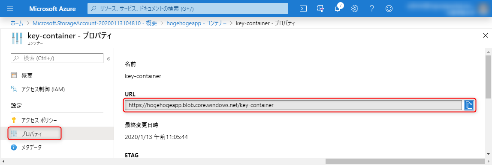
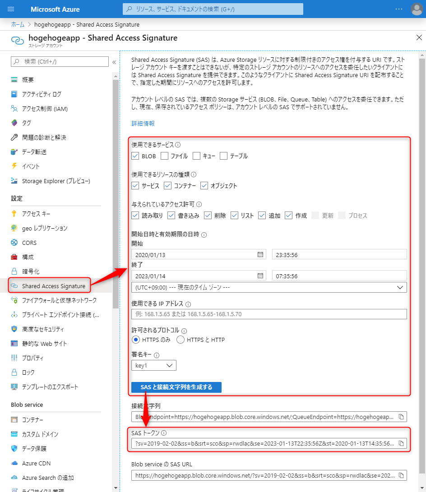
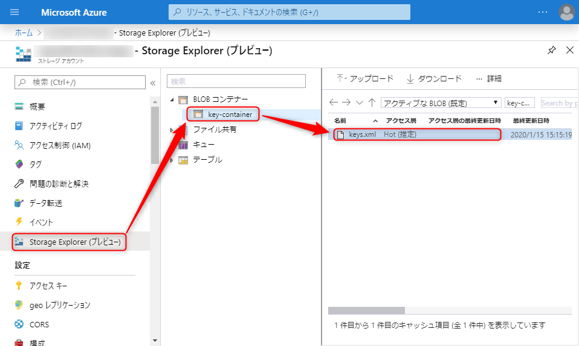

こんにちは、kenzauros です。

## はじめに

本記事は連載です。概要については先行記事を参照ください。

- [概要編](/persist-keys-with-to-azure-blob-storage-and-protect-with-key-vault-in-aspnet-core-1)
- [Azure Blob ストレージ設定編](/persist-keys-with-to-azure-blob-storage-and-protect-with-key-vault-in-aspnet-core-2) ← いまここ
- [Azure Key Vault 設定編](/persist-keys-with-to-azure-blob-storage-and-protect-with-key-vault-in-aspnet-core-3)

**データ保護キーの永続化と暗号化に必要となる URI やシークレットなどの値を取得するため、 Azure ポータルからサービスを設定**していきます。

下記3つのサービスを利用し、4つの値を得る必要がありますが、今回はまず Azure Blob ストレージの URL を取得し、暗号化されていない状態のキーがストレージに保存されることを確認します。

- **Azure Blob ストレージのコンテナー作成**
    - **Blob コンテナー URL** + **SAS トークン**
- アプリの登録
    - クライアント ID
    - クライアント シークレット
- Azure Key Vault のキーコンテナー作成
    - キー識別子 (URL)

## Azure Blob コンテナーの設定

Azure Blob Storage に Blob コンテナーをつくるため以下の手順を踏みます。

- ストレージアカウントの作成
- Blob コンテナーの作成
- SAS トークンの取得

### ストレージアカウントを作る

まず、 **Blob コンテナーを作成するためにストレージ アカウントを作成**します。すでにアプリ用にストレージ アカウントがあるときはこの手順をスキップできます。

ストレージ アカウント に遷移して [追加] をクリックします。



プロパティを設定します。



- サブスクリプション: 現在のサブスクリプションを指定
- リソースグループ: アプリ/VM が動作しているリソースグループを指定
- ストレージアカウント名: `hogehogeapp` (半角英数しか使用できない)
- 場所: `東日本`
- パフォーマンス: `Standard`
- アカウントの種類: `StorageV2`
- レプリケーション: `読み取りアクセス地理冗長ストレージ (RA-GRS)`
- アクセス層 (既定): `ホット`

今回はその他の設定は特に行わないので、 [確認および作成] をクリックし、確認画面で問題なければ [作成] をクリックします。



デプロイが進行し、しばらくすると完了しますので、 [リソースに移動] をクリックして作成したストレージアカウントに遷移します。下図はデプロイ後のストレージアカウントの状態です。



### Blob コンテナーを作る

作成した**ストレージアカウントの中に Blob コンテナーを作成**します。ここにキーの書かれたファイルが格納されることになります。

ストレージアカウントの設定から [Blob service] → [コンテナー] からコンテナーを新規追加します。



必要事項を入力します。



- 名前: `key-container`
- パブリックアクセスレベル: `プライベート (匿名アクセスはありません)`

URL は `https://<ストレージアカウント名>.blob.core.windows.net/<コンテナー名>` という形式になりますので、名前はそれっぽいものを指定します。ここではわかりやすく `key-container` としました。

アクセスは SAS で行うため匿名アクセスなし = プライベートでよいようです。

作成したらコンテナーの [プロパティ] から**コンテナーの URL** を取得します。この URL だけではファイルを書き込めないので、とりあえずメモしておきます。



### SAS トークンの生成

Blob コンテナーにデータを書き込むため、認証・認可が必要になります。ここでは ASP.NET Core のドキュメントで示されている **SAS (Shared Access Signature; 共有アクセス署名) トークンを使ったアクセス**を採用します。

SAS にも種類がありますが、今回はアドホック SAS を使用します。 SAS の詳細は下記のドキュメントを参照してください。

- [Shared Access Signatures (SAS) でデータの制限付きアクセスを付与する - Azure Storage | Microsoft Docs](https://docs.microsoft.com/ja-jp/azure/storage/common/storage-sas-overview)

今回必要な **SAS トークンとは `?sv=<開始日>&ss=<サービス>&srt=<リソース種類>&sp=<アクセス許可>&se=<終了日時>&st=<開始日時>&spr=<プロトコル>&sig=<署名>` のような形式の URL クエリー文字列**です。

ストレージアカウントの設定から [設定] → [Shared Access Signature] を選択し、必要事項を設定します。



- 使用できるサービス: `BLOB`
- 使用できるリソースの種類: `オブジェクト`
- 与えられているアクセス許可: `読み取り, 書き込み, 削除`
- 開始: 適当に設定
- 終了: 適当に設定
- 強化されるプロトコル: `HTTPS のみ`
- 署名キー: `key1`

[SAS と接続文字列を生成する] をクリックすると下部に **[SAS トークン]** が表示されますので、これをコピーします。

### キーファイル URL の生成

以上で Blob コンテナーの準備は完了です。

- Blob コンテナー URL
- SAS トークン

の2つが手元にあるはずなので、あとはキーファイル名を決定し、 `<Blob コンテナー URL><キーファイル名><SAS トークン>` と連結して、完全な URL にします。

ASP.NET Core のデータ保護キーは XML としてシリアライズされるため、ここではキーファイル名を `keys.xml` とします。

つまり下記のような URL ができます。

```
https://hogehogeapp.blob.core.windows.net/key-container/keys.xml?sv=2019-02-02&ss=b&srt=sco&sp=rwdlac&se=2023-01-13T22:35:56Z&st=2020-01-13T14:35:56Z&spr=https&sig=<署名>
```

この URL が `PersistKeysToAzureBlobStorage` メソッドに指定するストレージの URL となります。


## 実装

これで Blob ストレージが用意できたので、一旦 **ASP.NET Core のデータ保護キーを暗号化せずにストレージに格納**してみます。プログラム側の実装については [概要編](/persist-keys-with-to-azure-blob-storage-and-protect-with-key-vault-in-aspnet-core-1) を参照してください。

`Startup.ConfigureServices` で `PersistKeysToAzureBlobStorage` を呼び出し、さきほど生成した SAS トークンつきの URL を指定します。

```cs
public void ConfigureServices(IServiceCollection services)
{
    services.AddDataProtection()
        .PersistKeysToAzureBlobStorage(new Uri("https://hogehogeapp.blob.core.windows.net/key-container/keys.xml?sv=2019-02-02&ss=b&srt=sco&sp=rwdlac&se=2023-01-13T22:35:56Z&st=2020-01-13T14:35:56Z&spr=https&sig=<署名>"));
}
```

今回はまだ Key Vault を設定していないため `ProtectKeysWithAzureKeyVault` は省いています。

この状態でアプリをデプロイし、サービスを起動します。 (今回は Azure VM 上の IIS ですので、アプリケーションプールを起動します。)

### 起動後の確認

起動後にアプリにアクセスし、ストレージアカウントの Storage Explorer などから **BLOB コンテナーを参照し、 `keys.xml` が生成されていれば成功**です。



`keys.xml` の中身は下記のようになっています。 `masterKey` が含まれていますが、暗号化されていないことが XML 内のコメントにも書かれています。

```xml
<repository>
  <key id="ffff11fd-61a5-410f-802b-6771ee94383d" version="1">
    <creationDate>2020-01-15T05:59:19.6650822Z</creationDate>
    <activationDate>2020-01-15T05:59:19.3159102Z</activationDate>
    <expirationDate>2020-04-14T05:59:19.3159102Z</expirationDate>
    <descriptor deserializerType="Microsoft.AspNetCore.DataProtection.AuthenticatedEncryption.ConfigurationModel.AuthenticatedEncryptorDescriptorDeserializer, Microsoft.AspNetCore.DataProtection, Version=3.1.0.0, Culture=neutral, PublicKeyToken=adb9793829ddae60">
      <descriptor>
        <encryption algorithm="AES_256_CBC" />
        <validation algorithm="HMACSHA256" />
        <masterKey xmlns:p5="http://schemas.asp.net/2015/03/dataProtection" p5:requiresEncryption="true">
          <!--  Warning: the key below is in an unencrypted form.  -->
          <value>
hrrBFUsActc0w3z8LxfrY+ZrRuxR2983KuLB6xHHQpaBAryZdjnEwDk6324TUVAmsCh90aD1iA9GlXPoJehak7Q==
</value>
        </masterKey>
      </descriptor>
    </descriptor>
  </key>
</repository>
```

### トラブルシューティング

起動後にアプリ側で例外が発生する場合、ストレージ URL が適切でない場合があります。典型的なエラーを下記に示します。

- BLOB コンテナーの URL が間違っているとき
    - エラーメッセージ: `An error occurred while reading the key ring. The specified container does not exist.`
    - 確認点: ストレージアカウント名、コンテナー名が正しいこと、ファイル名が含まれていることを確認してください。
- SAS トークンが間違っているとき
    - エラーメッセージ: `An error occurred while reading the key ring. Server failed to authenticate the request. Make sure the value of Authorization header is formed correctly including the signature.`
    - 確認点: SAS の署名 (Signature) が正しいこと、 有効期限が切れていないことなどを確認してください。 **SAS の署名は与えた許可に応じて変化しますので注意**してください。

## 次回

次回は Azure Key Vault の設定をして、ようやく暗号化されたデータ保護キーを保存していきます。

- [\[ASP.NET Core\] データ保護キーを Azure Blob ストレージに永続化して Azure Key Vault で暗号化する (Azure Key Vault 設定編)](/persist-keys-with-to-azure-blob-storage-and-protect-with-key-vault-in-aspnet-core-3)
