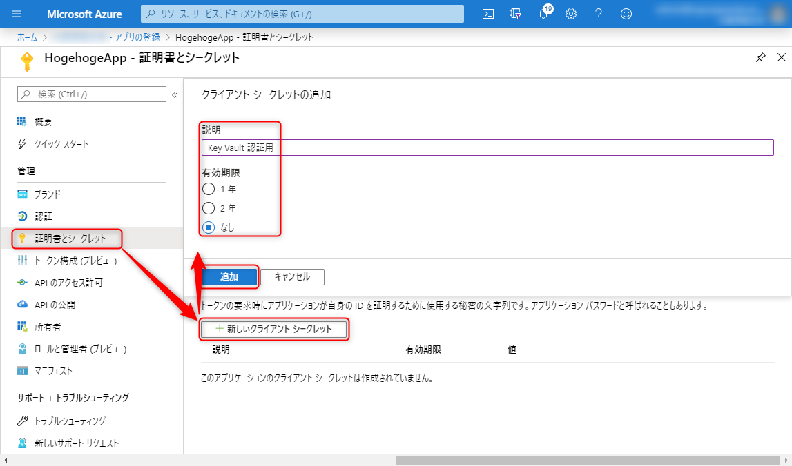

## はじめに

本記事は連載です。概要、これまでの手順については先行記事を参照ください。

- [概要編](https://mseeeen.msen.jp/persist-keys-with-to-azure-blob-storage-and-protect-with-key-vault-in-aspnet-core-1)
- [Azure Blob ストレージ設定編](https://mseeeen.msen.jp/persist-keys-with-to-azure-blob-storage-and-protect-with-key-vault-in-aspnet-core-2)
- [Azure Key Vault 設定編](https://mseeeen.msen.jp/persist-keys-with-to-azure-blob-storage-and-protect-with-key-vault-in-aspnet-core-3) ← いまここ

**データ保護キーの永続化と暗号化に必要となる URI やシークレットなどの値を取得するため、 Azure ポータルからサービスを設定**しています。

前回は Azure Blob ストレージの設定を行いましたので、今回は残る **Azure Key Vault の設定を行い、データ保護キーが暗号化された状態で保存**されることを確認します。

- Azure Blob ストレージのコンテナー作成
    - Blob コンテナー URL + SAS トークン
- **アプリの登録**
    - **クライアント ID**
    - **クライアント シークレット**
- **Azure Key Vault のキーコンテナー作成**
    - **キー識別子** (URL)

## アプリの登録

まず Key Vault でクライアントを識別するため、 **Azure AD に今回 VM で稼働させるプログラムを Azure 上のアプリとして登録**します。とはいえ、簡単に名前を登録するだけです。

**Azure Active Directory** の [アプリの登録] を開き、 [新規登録] をクリックします。


プロパティを設定して [登録] をクリックします。


- 名前: `HogehogeApp`
- サポートされているアカウントの種類: `この組織ディレクトリのみに含まれるアカウント (<テナント> のみ - シングル テナント)`
- リダイレクト URI (省略可能): 省略

作成されると自動的に詳細ページに遷移しますので、 **[アプリケーション (クライアント) ID]** をメモしておきます。これを `ProtectKeysWithAzureKeyVault` メソッドの第2引数 `clientId` にわたすことになります。


### シークレットの発行

Key Vault 認証用に**クライアント シークレット**を発行します。

[管理] → [証明書とシークレット] から [新しいクライアント シークレット] をクリックします。



- 説明: `Key Vault 認証用`
- 有効期限: `なし`

プロパティを入力して [追加] を押します。

シークレットが発行されたら [値] をメモしておきます。これが `ProtectKeysWithAzureKeyVault` メソッドの第3引数に渡す `clientSecret` になります。


以上でアプリの登録は完了です。

## Azure Key Vault の設定

次にキーを暗号化するための **Azure Key Vault** を設定します。

### Key Vault キーコンテナーの作成

**キーコンテナー (Azure Key Vault)** に遷移し、 **[追加]** をクリックします。


プロパティを設定します。


- サブスクリプション: 現在のサブスクリプションを指定
- リソースグループ: アプリ/VM が動作しているリソースグループを指定
- Key Vault 名: `hogehoge-app`
- 地域: `東日本`
- 価格レベル: `標準`

今回はその他の設定は特に行わないので、 [確認および作成] をクリックし、確認画面で問題なければ [作成] をクリックします。

キーコンテナーが作成されたら [設定] → [キー] から新しいキーを作成します。 [生成/インポート] をクリックします。


- オプション: `生成`
- 名前: `data-protection-key`
- キーの種類: `RSA`
- RSA キー サイズ: `2048`
- アクティブ化する日を設定しますか?: チェックしない
- 有効期限を設定しますか?:  チェックしない
- 有効ですか: `はい`

上記内容で [作成] し、生成されたキーを選択します。


現在のバージョンのキーを選択します。


ここでやっと **キー識別子 (URI)** が取得できます。これを `ProtectKeysWithAzureKeyVault` メソッドの第1引数 `keyIdentifier` にわたすことになります。

ちなみにこの画面で設定できる **許可された操作は `キーを折り返す (Wrap Key)` `キーの折り返しを解除 (Unwrap Key)` のみ** 許可されていれば OK です。

これで Key Vault の設定は完了です。

以上でやっと必要なパラメーターが揃いました。

## 実装

これで Blob ストレージが用意できたので、**ASP.NET Core のデータ保護キーを暗号化してストレージに格納**してみます。プログラム側の実装については [概要編](https://mseeeen.msen.jp/persist-keys-with-to-azure-blob-storage-and-protect-with-key-vault-in-aspnet-core-1) を参照してください。

`Startup.ConfigureServices` で `PersistKeysToAzureBlobStorage` に加え、 **`ProtectKeysWithAzureKeyVault` を呼び出し、キー識別子、クライアント ID、クライアントシークレットを渡します**。

```cs
public void ConfigureServices(IServiceCollection services)
{
    services.AddDataProtection()
        .PersistKeysToAzureBlobStorage(new Uri("https://hogehogeapp.blob.core.windows.net/key-container/keys.xml?sv=2019-02-02&ss=b&srt=sco&sp=rwdlac&se=2023-01-13T22:35:56Z&st=2020-01-13T14:35:56Z&spr=https&sig=<署名>"))
        .ProtectKeysWithAzureKeyVault(
            "https://hogehoge-app.vault.azure.net/keys/data-protection-key/3071deaab75a4fb09da56f33d6c8dee9",
            "8e55c3c9-3e90-45de-11c9-bb455a04ee19",
            ".7Q:_jBKq3STi:eDkucN7U(sg5U:xg98");
}
```

この状態でアプリをデプロイし、サービスを起動します。 (今回は Azure VM 上の IIS ですので、アプリケーションプールを起動します。)

前回の暗号化前の動作確認などで、 Blob コンテナー上に `keys.xml` がすでに生成されている場合は先に削除しておきましょう。暗号化前のファイルがあると、それがそのまま使われ、暗号化されたキーファイルが生成されません。

### 起動後の確認

起動後にアプリにアクセスし、ストレージアカウントの Storage Explorer などから **BLOB コンテナーを参照し、 `keys.xml` が生成されていれば成功**です。


`keys.xml` の中身は下記のようになっています。暗号化前にあった `masterKey` という要素は消え、 Azure Key Vault のキーを暗号鍵として暗号化されたデータ保護キーが記録されています。

```xml
<repository>
  <key id="2b8a07d9-13b9-4113-bf02-a500242b3f66" version="1">
    <creationDate>2020-01-15T05:50:11.597292Z</creationDate>
    <activationDate>2020-01-15T05:50:11.2978123Z</activationDate>
    <expirationDate>2020-04-14T05:50:11.2978123Z</expirationDate>
    <descriptor deserializerType="Microsoft.AspNetCore.DataProtection.AuthenticatedEncryption.ConfigurationModel.AuthenticatedEncryptorDescriptorDeserializer, Microsoft.AspNetCore.DataProtection, Version=3.1.0.0, Culture=neutral, PublicKeyToken=adb9793829ddae60">
      <descriptor>
        <encryption algorithm="AES_256_CBC" />
        <validation algorithm="HMACSHA256" />
        <encryptedSecret xmlns="http://schemas.asp.net/2015/03/dataProtection" decryptorType="Microsoft.AspNetCore.DataProtection.AzureKeyVault.AzureKeyVaultXmlDecryptor, Microsoft.AspNetCore.DataProtection.AzureKeyVault, Version=3.1.0.0, Culture=neutral, PublicKeyToken=adb9793829ddae60">
          <encryptedKey xmlns="">
            <!--  This key is encrypted with Azure KeyVault.  -->
            <kid>
https://hogehoge-app.vault.azure.net/keys/data-protection-key/3071deaab75a4fb09da56f33d6c8dee9
</kid>
            <key>
RlbgtJ7eqDpvhl+z0jBhpT48mTRAizLEgj7Ys9D6oFyloCoUicVB7XjDd+uda352X77pCTEqs3q4riEoHCb2CadMHsPGhzyehjDUrmqFC0llH5IhX/tJ/wO68kEkW5H6ugTdlUR/Tarq3Y46KXHU0VXVXMzdNY5sdfsdfaViJv/9ZZJ7f+V+FZDpf3Nv9UPQkWYnac8fwI/+vzoJOguxyADeDmwKJBBbcG7K6dpDbhcB3/OV01kDs+u6q9St7kladWXrNm2saPplixNtO00IH4y/6fDWVaBHGlymGd7cMzPldIyhXlu4qziOHMdCbsgF82OQyXISkUxDUS7KkD7z6UQ==
</key>
            <iv>yqtccPwEdHDHPu2IYLXI1A==</iv>
            <value>
2z1XlUasKMQlJ4uPy5f904HvWxAATNpNDjLRotpaM6GZ3GehwBmOle6hiCkcSj4x7zvuaAR3bea6IDig6EeXKz0IJtUGZ+Csa8yeA7C2w6qP5yRgkMEesCe5bfmlYqN9JrSKV756B/N7p63G37XoavWiYtWQN31dn7RmuUFMpjpTHETm5oMZGaNId4iPjN+bzOfoKNKh08ZlgtA7IhdTEfiBr68f1oLLEDV3wp1ydGJLGo/fhBhZWu/+SIzgVTOxcfh658+lMnsqfrAXcGJeqVpwQYAP7bv16uOlEKr5bDu9RuIKXKETk7vOPcZQy2cwMPLmFvLlXKBrnoOZ0gdyVUL0Jk2NLrJ5ZLVXoaOojSAQzI5Cp3aYSW6YXaZ31FbEamoxE3HO5sfRbIFbFq8DOQru5hmn/CR0hihPU767wco=
</value>
          </encryptedKey>
        </encryptedSecret>
      </descriptor>
    </descriptor>
  </key>
</repository>
```

ちゃんと `This key is encrypted with Azure KeyVault.` と暗号化されている旨のコメントもついています。

### トラブルシューティング

起動後にアプリ側で例外が発生する場合、各パラメーターをチェックしてください。典型的なエラーを下記に示します。

- アプリとして登録されていない もしくはクライアント ID が間違っているとき
    - エラーメッセージ: `An error occurred while reading the key ring. AADSTS700016: Application with identifier '8e55c3c9-3e90-45de-11c9-bb455a04ee19' was not found in the directory 'f449f776-8791-4f7d-8162-65a5321db0ff'. This can happen if the application has not been installed by the administrator of the tenant or consented to by any user in the tenant. You may have sent your authentication request to the wrong tenant.`
    - 確認点: Azure AD のアプリとして登録されていること、クライアント ID (アプリケーション ID) が正しいことを確認してください。
- クライアントシークレットが間違っているとき
    - エラーメッセージ: `An error occurred while reading the key ring. AADSTS7000215: Invalid client secret is provided.`
    - 確認点: クライアントシークレット が正しいことを確認してください。
- Key Vault の URL が間違っているとき
    - エラーメッセージ: `An error occurred while reading the key ring. Operation returned an invalid status code 'NotFound'`
    - 確認点: Key Vault の URL が正しいことを確認してください。

以上で一連の記事で行ってきた「**データ保護キーを Azure Blob ストレージに永続化して Azure Key Vault で暗号化する**」は完了です。お疲れ様でした。
