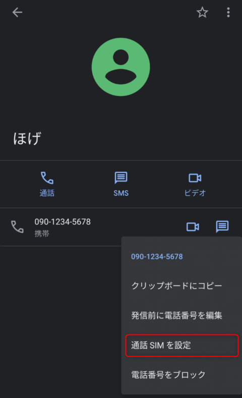
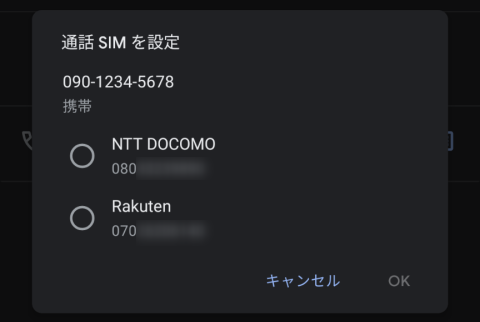
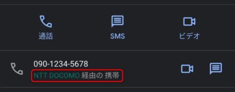
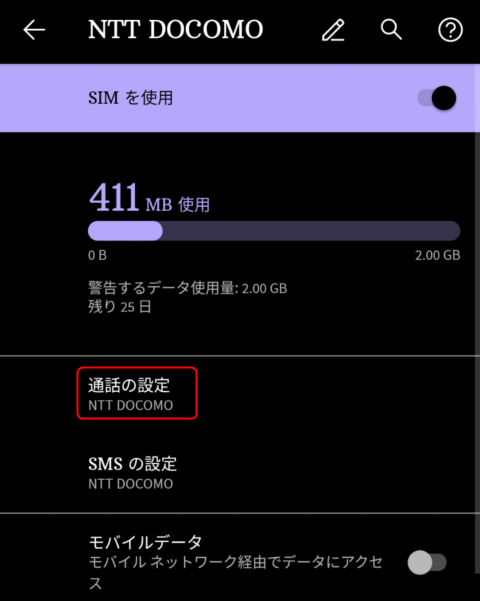
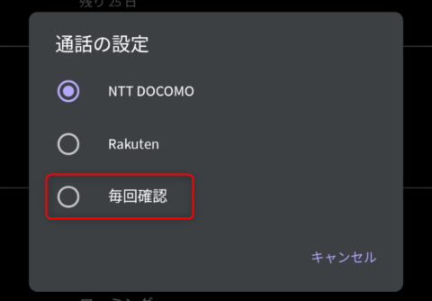
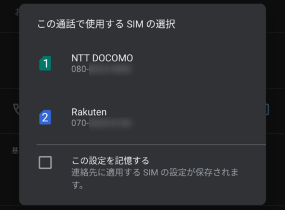

**[Google Pixel 5](https://store.google.com/jp/product/pixel_5) では 2 種類の SIM で同時に待ち受けることができます。** (DSDS; Dual SIM Dual Standby)

今回は物理 SIM + eSIM 構成の **Pixel 5 で、連絡先ごとに通話 SIM を切り替える**方法をご紹介します。

## 構成

SIM の構成は下記の通りです。

- 物理 SIM (nano SIM): Docomo
- eSIM: 楽天モバイル

Android のバージョンは 11 です。

なお、楽天モバイル eSIM の設定に関する記録は前記事をご覧ください。

- [Google Pixel 5 を Dual SIM で使うために楽天モバイル (eSIM) に MNP してみた](https://mseeeen.msen.jp/mnp-to-rakute-mobile-esim-with-google-pixel-5/)

## 連絡先ごとに設定する

連絡先から指定したい連絡先を開き、詳細を表示します。指定したい**電話番号を長押しして、ポップアップメニューから「通話 SIM を設定」**を選択します。

この電話番号に使用する SIM を選択して「OK」を選択します。

電話番号の下に SIM 名が表示されます。この状態でかけると指定した SIM が使用されます。

ちなみに設定を解除するには、同じように長押しして「通話 SIM の設定をクリア」を選択します。

## どちらの SIM を使うか毎回確認するようにする

連絡先ごとに設定する他に、**どちらの SIM を使うか毎回確認するようにする**こともできます。

設定から**「ネットワークとインターネット」から SIM の詳細画面**を開き、**「通話の設定」**を選択します。

ここでデフォルトで使う SIM が選択できます。毎回確認するようにするには**「毎回確認」**を選択します。

この状態で連絡先などから電話をかけようとすると下記のような SIM 選択画面が表示されます。

ちなみにこの**「この設定を記憶する」**のチェックを入れることで、先に紹介した「連絡先ごとに設定する」と同様の設定がなされ、この連絡先については、設定した SIM が使用されるようになります。