コロナウイルスの影響により、リモートワークが急激に増加しています。弊社も多分にもれず原則リモートワークとなりました。

弊社は業務上のコミュニケーション手段が Slack ですので、 **Slack に標準搭載されているビデオチャット機能**を使うことにしました。
今回は、弊社の標準端末である **ThinkPad X1 シリーズでの使い方**を紹介します。

## 前提

### 環境

下記の 2 台＆ 2 バージョンの OS の環境での動作事例です。

- ThinkPad X1 Carbon 7th (Windows 10 version 1903)
- ThinkPad X1 Carbon 5th (Windows 10 version 1809)

### Windows 10 1809 以前では Store アプリ版の Slack が必要

まずカメラとマイクを Slack で使うために設定が必要なのですが、**Windows 10 version 1809** ではうまく設定できませんでした。

調べたところ **1809 以前は Store アプリにしか許可設定がないらしい**です。

> カメラまたはマイクを現在使用中のアプリや、カメラまたはマイクに最近アクセスしたアプリを確認するには、[スタート]  > [設定]  >  [プライバシー]  > [カメラ] または [スタート]  > [設定]  >  [プライバシー]  > [マイク] に移動します。
> **注意: この機能は Windows 10 Version 1809 以前には存在しません。**
> [Windows 10 でのカメラとマイク、およびプライバシー – マイクロソフトのプライバシー](https://support.microsoft.com/ja-jp/help/4468232/windows-10-camera-microphone-and-privacy)

ということで Store アプリ版の Slack をインストールします。すでにデスクトップアプリ版がインストールされている場合は先にアンインストールしておきます。

スタートボタンをクリックし、 `Store` と入力して Microsoft Store を開きます。

<a href="images/start-video-chat-on-slack-with-lenovo-thinkpad-x1-1.png">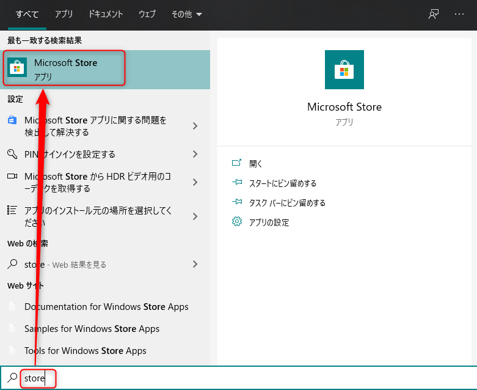</a>

[検索] で `Slack` を検索して開き、 [入手] を選択します。

<a href="images/start-video-chat-on-slack-with-lenovo-thinkpad-x1-2.png">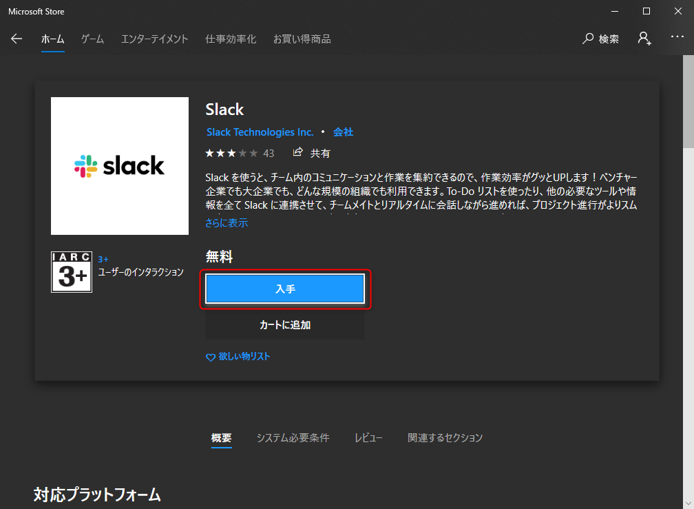</a>

Microsoft アカウントでサインインしていない場合、サインインを促されますが、 [必要ありません] を選べばそのままインストールが選べます。

<a href="images/start-video-chat-on-slack-with-lenovo-thinkpad-x1-3.png">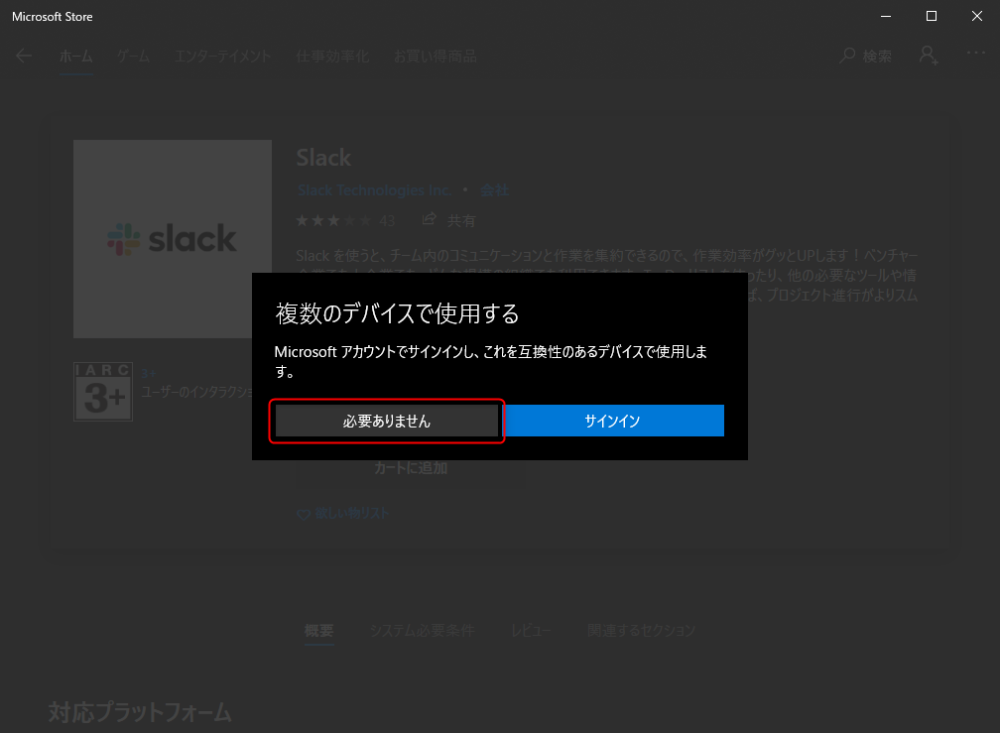</a>

ダウンロード → インストール中です。

<a href="images/start-video-chat-on-slack-with-lenovo-thinkpad-x1-4.png">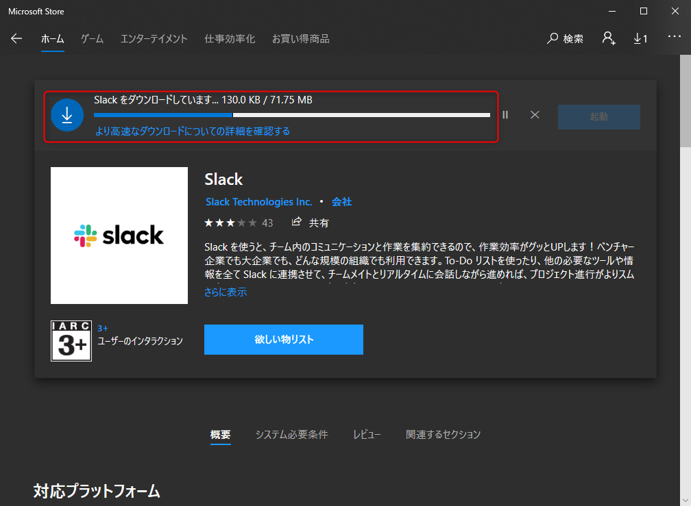</a>

インストールが完了したら [起動] をクリックして、 Slack を起動します。

<a href="images/start-video-chat-on-slack-with-lenovo-thinkpad-x1-5.png">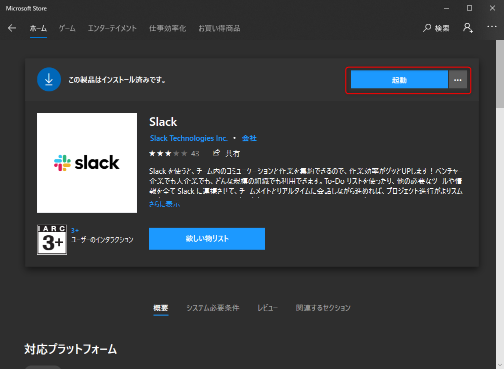</a>

ちなみに Store アプリ版 Slack の見た目はデスクトップアプリとほとんど (まったく？) 変わりません。

## 設定

マイクとカメラを使用する前に **Lenovo VANTAGE** での設定が必要な場合があります。

下記の設定を確認します。

### オーディオ設定

デバイス → デバイス設定 → オーディオ から **[マイクロホン]** が **ON** になっていることを確認します。

<a href="images/start-video-chat-on-slack-with-lenovo-thinkpad-x1-6.png">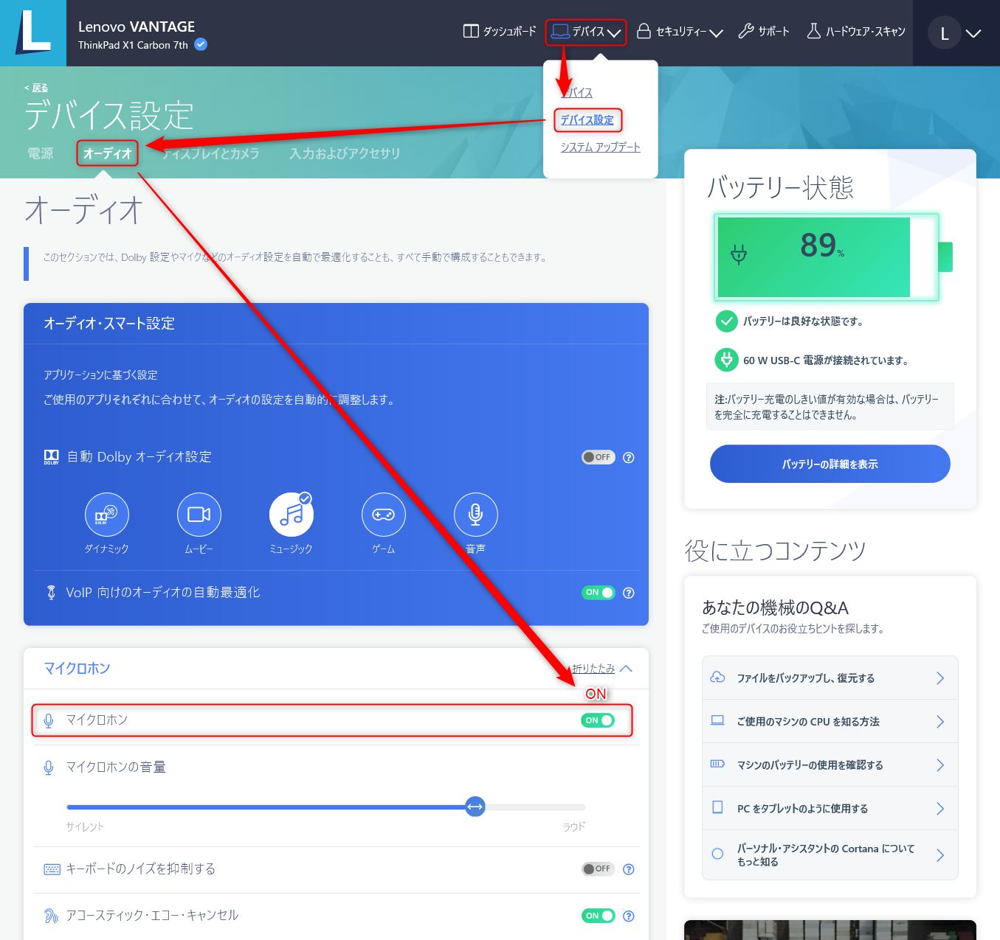</a>

### カメラ設定

デバイス → デバイス設定 → ディスプレイとカメラ から **[カメラ・プライバシー・モード]** が **OFF** になっていることを確認します。

<a href="images/start-video-chat-on-slack-with-lenovo-thinkpad-x1-7.png">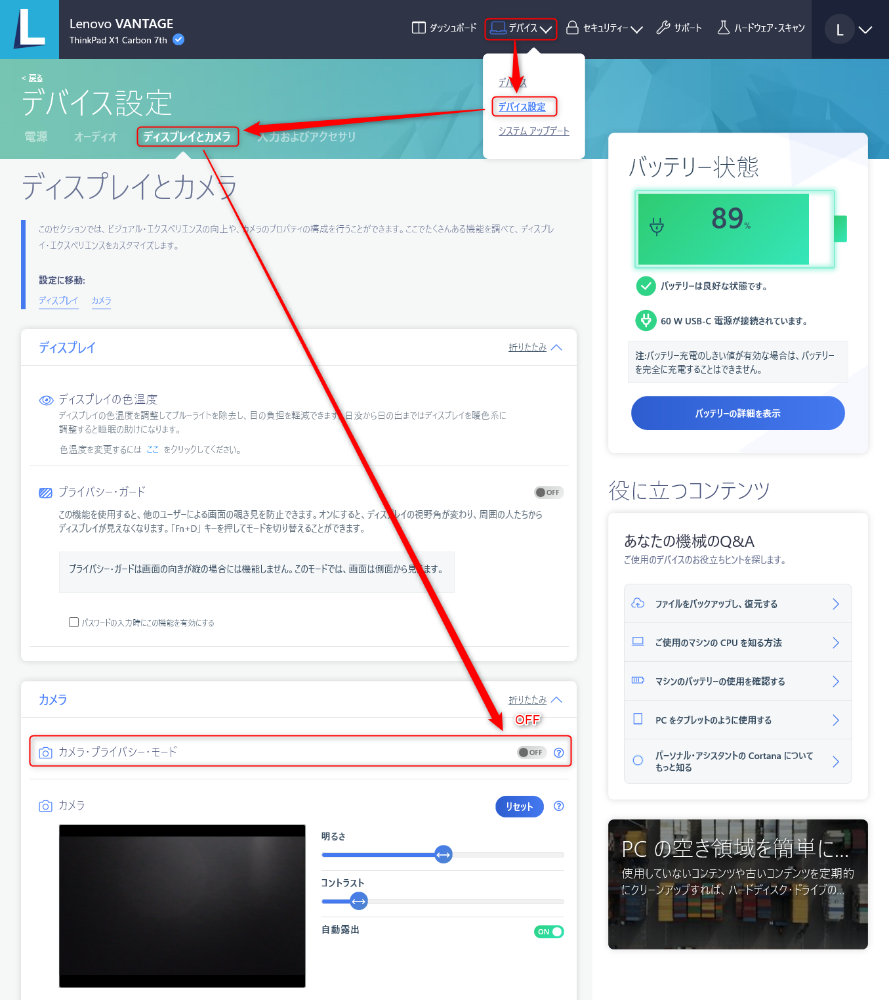</a>

ちなみに 2018 年モデル以降の X1 Carbon には **ThinkShutter** と呼ばれる物理カメラシャッターがついていますので、映らないときはこちらも開けましょう。

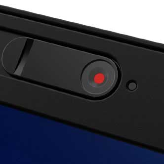

> [Lenovo - ThinkShutter | Facebook](https://www.facebook.com/lenovo/videos/thinkshutter/10155713535374635/)

## Slack ビデオ通話

### 通話の開始

**Slack でビデオチャットを開始する**にはチャンネルや DM (ダイレクト・メッセージ) を開いた状態で右上の**受話器アイコンをクリック**するだけです。

<a href="images/start-video-chat-on-slack-with-lenovo-thinkpad-x1-8.png">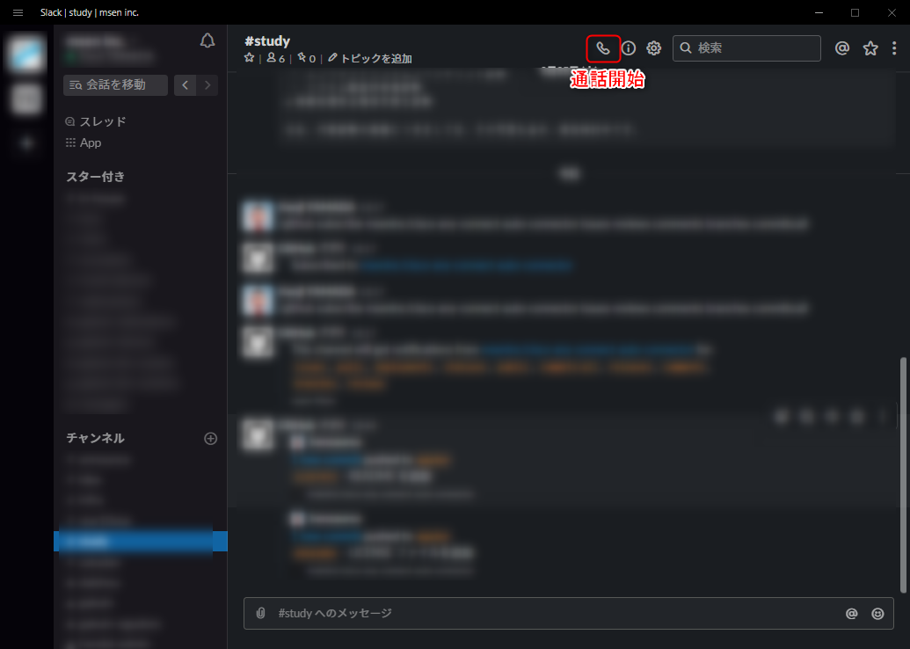</a>

下記のような通話画面が開き、誰かが応答してくれると会話ができるようになります。

<a href="images/start-video-chat-on-slack-with-lenovo-thinkpad-x1-9.png">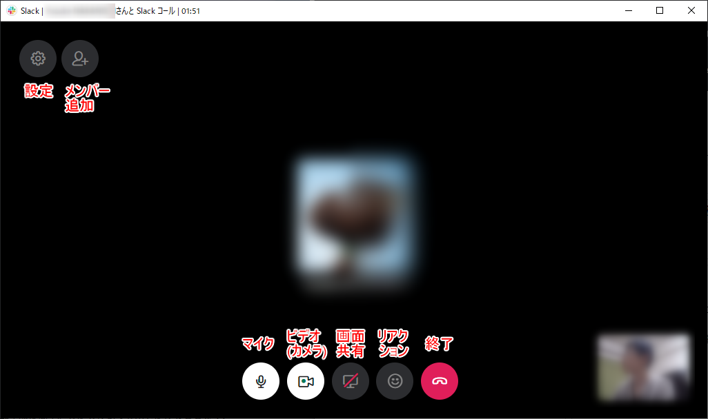</a>

Slack らしく「**リアクション**」なんかもできるので、楽しいですね！画面共有もワンボタンでできるので手軽です。

**ビデオ通話をするときは左から2番目のカメラアイコンをクリックして有効 (白色)** にします。ビデオもマイクも好きなときに ON/OFF ができます。

### ビデオ通話の設定

ちなみにギヤのアイコン (設定) をクリックすると**オーディオやビデオ (カメラ) の設定**ができます。

<a href="images/start-video-chat-on-slack-with-lenovo-thinkpad-x1-10.png">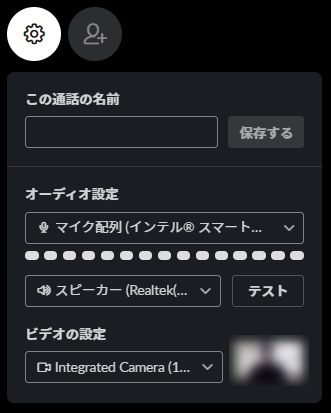</a>

ThinkPad X1 の本体のマイク・カメラで通話する場合、下記の設定にします。ヘッドセットなどを使う場合は、適宜それらの名称を選択します。

- マイク： **マイク配列 (インテル スマート・サウンド・テクノロジー**
- スピーカー: **スピーカー (Realtek Audio)**
- ビデオ: **Integrated Camera** (Integerated **IR** Camera は Windows Hello 顔認証用の赤外線カメラですのでビデオチャットには使えません)

「声が聞こえない」「マイクが入らない」「カメラが (相手に) 映らない」などの場合はここでデバイスを切り替えてみてください。

### 複数人での会話

[メンバー追加] ボタンを押すか、他のメンバーが参加してくることで、複数人での会話ができます。

<a href="images/start-video-chat-on-slack-with-lenovo-thinkpad-x1-11.png">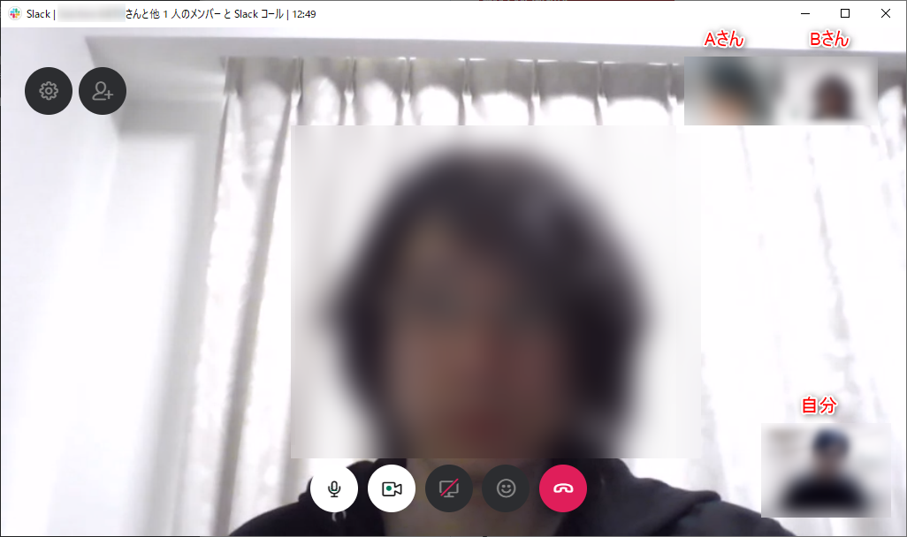</a>

ビデオは**今話している人が自動的にアクティブ**になり大きく表示されます。

右上の**参加者サムネイルをクリックすると太い白枠**がつきますので、これで**その人のビデオを固定して表示**することもできます。固定を解除する (自動に戻す) には太枠になっているものを再度クリックします。

### 通話記録

通話が終了してもタイムライン上に下記のような通話記録が残りますので、別途記録せずに済み、効率的です。

<a href="images/start-video-chat-on-slack-with-lenovo-thinkpad-x1-12.png">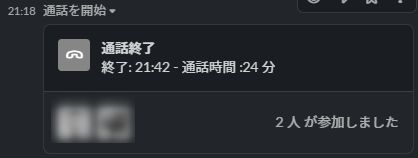</a>

### 通話品質

我が家の回線速度 (某 e● 光) はお世辞にも早いとは言えませんが、ビデオ通話は音声にも画質にも不満はありませんでした。

## まとめ

**Slack のビデオ通話機能**が **ThinkPad X1 Carbon** で快適に使用できることがわかりました。

それではみなさまコロナウイルスに負けず、快適なリモートワークでバリバリ仕事に励みましょう！