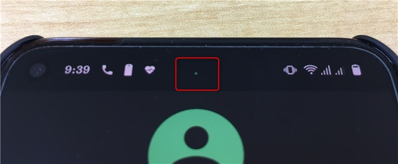

先日、下記の記事でも紹介したように **Google Pixel 5** を購入しました。

- [Google Pixel 5 を Dual SIM で使うために楽天モバイル (eSIM) に MNP してみた](https://mseeeen.msen.jp/mnp-to-rakute-mobile-esim-with-google-pixel-5/)

概ね気に入って使っているのですが、残念だったことが一つ...**画面にチカチカするピクセルが**。。。

これはなつかしの"輝点"では...！

しかも画面上部の真ん中という以外と目立つ位置に。

これは修理にだすべきかどうか...その答えがここにあります。

## 症状

[video width="480" height="480" mp4="https://mseeeen.msen.jp/wp-content/uploads/2020/11/pixel5_blinking_dot.mp4"][/video]

 

上の動画を見てもらうのが一番早いですが、光っているのはここ　↓

このステータスバーの若干した気味、画面中央にそれはあります。

緑色で高速明滅を繰り返す 0.5 mm ほどの点。

実際には常に出続けているわけではなく、なにかの拍子に突然あらわれ、気づいたら消えています。

これを輝点といわずして、なんというか。

仕様です。

## 輝点の正体

そう、**仕様**です。

答えはここにあります。

> 画面の上部にある白いドットについて（Pixel 5）
> 
**Pixel 5 スマートフォンの画面の下には、上部中央に白いドットがあります。これは近接センサーです。近接センサーをオンにすると、ディスプレイを通してこのドットが見えます。このドットは点滅したり、点灯したままになったりします。**
通話時や、画面がロックされているとき、特定のアプリで使用されているときに、スマートフォンの画面を顔に近づけると、近接センサーにより画面がオフになります。画面がオフになると、電池を長持ちさせることができます。また、画面の誤ったタップも防止できます。
近接センサーは、すべての Pixel スマートフォンに搭載されています。**Pixel 5 は端から端までディスプレイになっているため、センサーは画面の下にあります**。詳しくは、Pixel 5 スマートフォンの図をご覧ください。
> 
> [Pixel の画面が正常に動作しない場合に問題を解決する - Pixel Phone ヘルプ](https://support.google.com/pixelphone/answer/6010316?hl=ja)

**近接センサー**とな。

日本語では「センサーは画面の**下**にあります。」となっていますが、英語の説明では「 you can see the Pixel 5’s sensor **under** the screen.」。そう、**画面の奥**にあるのです。

つまり**近接センサーがセンシングに使う光が画面を透けて見えてしまっている**わけです。よくよく見ると、 ○ だったり ● だったりしています。

ただ、私の場合「白いドット」でなく「**緑色のドット**」ですし、ホーム画面でも表示されることがあるのですが、たしかに**電話をかけてみると必ず光ります**ので、間違いなさそうです。

ちなみによほど問い合わせが多いのか、ヘルプページ上部にも書いてあります。

念のためヘルプにもある「[Pixel 5 スマートフォンの図](https://support.google.com/pixelphone/answer/7157629)」を見てみると...

間違いなく、こやつですね。

設計どおり、画面のちょうど真ん中、というわけですね。

## まとめ

というわけで
 **Pixel 5 画面上部の点滅してみえる緑のドットは近接センサーの光**
(仕様) でした。

いくら全面ディスプレイとはいえ、もうちょっとなんとかならなかったんでしょうか。。。

まぁ、不良と思って付き合うよりだいぶスッキリはしました。