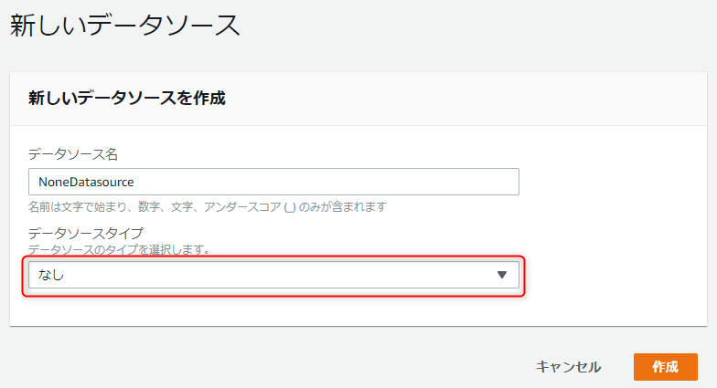
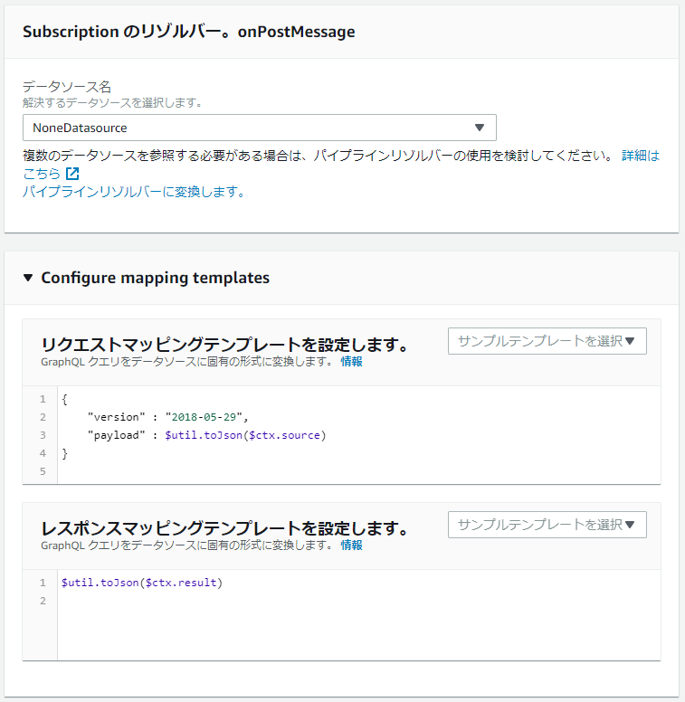

今回はデモアプリで AppSync (GraphQL) の Subscription を使ってみたときに、なぜか購読しているオブジェクトがうまく取得できずハマったので、リゾルバーが必要な場合の設定方法なども併せてご紹介します。

**AWS AppSync** で GraphQL を "試してみた" 系の記事は多いのですが、なかなか実用的なアプリになりそうな例は少ないのが現状です。

AWS のドキュメントやチュートリアルにもあまり詳しいことは載っていない上、英語の情報もイマイチ少ないので、ハマったときは結構ツライです。公式で使えるリソースは下記の 2 ページぐらいでしょうか。

- [Real-Time Data - AWS AppSync](https://docs.aws.amazon.com/appsync/latest/devguide/aws-appsync-real-time-data.html)
- [AWS AppSync を使用して、外部データベースの更新をサブスクライバーにリアルタイムで通知する](https://aws.amazon.com/jp/premiumsupport/knowledge-center/appsync-notify-subscribers-real-time/)

## 前提条件

- AWS AppSync
- GraphQL について基本的な知識をお持ちの方

GraphQL や Subscription はなんぞやという説明は割愛しますので、興味がある方は下記のような良記事をご参照ください。

- [GraphQLにおけるSubscription処理について(実装例: Amplify + AppSync) - Qiita](https://qiita.com/yoshii0110/items/3d9ec03215537646b65c)

## GraphQL スキーマ

サンプルのため、スキーマは極めて簡略化したものを想定します。

```graphql
type User {
  userId: ID!
  name: String!
}

type Message {
  messageId: ID!
  userId: ID!
  content: String
  user: User!
}

type Mutation {
  postMessage(content: String) : Message
}

type Subscription {
  onPostMessage(userId: ID!): Message
    @aws_subscribe(mutations: ["postMessage"])
}
```

ここで Subscription の表現は下記の部分のみです。

```graphql
type Subscription {
  onPostMessage(userId: ID!): Message
    @aws_subscribe(mutations: ["postMessage"])
}
```

ご覧のように `Subscription.onPostMessage` には **`@aws_subscribe(mutations: ["postMessage"])`** というディレクティブがついています。

これで `postMessage` ミューテーションが実行されたときに Subscription が実行されるように AppSync に指示しています。

また、`Subscription.onPostMessage` は `userId` を引数にとりますので、 **`userId` が一致する `Message` のみを購読**することができます。

ざっくり言えば

1. `onPostMessage` という Subscription を購読すれば、
1. `postMessage` ミューテーションが実行されたときに、
1. `Message` の `userId` が一致すれば、
1. `Message` が publish される。

ということです。


## Subscription からのデータ取得

### 基本的な Subscription

さて、 GraphQL の実装はリゾルバーで行いますが、 **Query や Mutation と異なり Subscription の場合はリゾルバーをアタッチする必要がありません**（ここ重要）。

よって、下記のようなクエリで Subscribe しておき、

```graphql
subscription MySubscription {
  onPostMessage(userId: "123456") {
    messageId
    content
  }
}
```

次のようにミューテーションすれば

```graphql
mutation MyMutation {
  postMessage(content: "hogehoge") {
    messageId
    content
  }
}
```

こんなデータが送られてくるはずです。（たぶん）

```json
{
    "data": {
        "onPostMessage": {
            "messageId": "***************",
            "content": "hogehoge",
        }
    }
}
```

### Subscription でフィールドが取得できない

しかし、さきほどの Subscription を少し書き換えると、途端にエラーが発生します。

```graphql
subscription MySubscription {
  onPostMessage(userId: "123456") {
    messageId
    content
    userId
  }
}
```

さきほどと異なるのは **`Message` のフィールド `userId` を取得するようにした**ことだけです。

この状態で先ほどと同様のミューテーションをもう一度叩きます。

```graphql
mutation MyMutation {
  postMessage(content: "hogehoge") {
    messageId
    content
  }
}
```

なんということでしょう。同じ Mutation なのにエラーになったではありませんか。

```json
{
    "data": {
        "onPostMessage": null
    },
    "errors": [
        {
            "message": "Cannot return null for non-nullable type: 'ID' within parent 'Message' (/onPostMessage/userId)",
            "path": [
                "onPostMessage",
                "userId"
            ]
        },
    ]
}
```

エラーを見ると

> Cannot return null for non-nullable type: 'ID' within parent 'Message' (/onPostMessage/userId)
> 'Message' の null 許容でない 'ID' 型に対して null を返すことはできません

とおっしゃっておられます。

いやいや、 **`Message` には `userId` は必須だし！ DynamoDB には `userId` 格納されてるし！** とか喚いてみても、むなしいだけです。

結論を言うと **Mutation 側で選択セットに含まれていないフィールドは Subscription で選択できない** ということです。

これは **AppSync が Mutation の Resolver で解決したものを Subscription にそのまま投げる** 仕様だからだと思います。逆に言えば、この仕様だから「Subscription の場合はリゾルバーをアタッチする必要がない」わけですね。

ということで、ここでは Mutation にも `userId` を加えて

```graphql
mutation MyMutation {
  postMessage(content: "hogehoge") {
    messageId
    content
    userId
  }
}
```

とすれば、 Subscription でも `userId` が取得できます。

原因がわかれば簡単なことなのですが、 Subscription のデータがどこから来ているか不明だったため、けっこう時間を食いました。

よって、下層のフィールドも取得したければ、下記のように **Mutation と Subscription で選択セットをそろえてやれば OK** ですね。
（もちろん Mutation 側で解決するため `Message.user` には別途リゾルバーが必要です）

```graphql
subscription MySubscription {
  onPostMessage(userId: "123456") {
    messageId
    content
    userId
    user {
        name
    }
  }
}
mutation MyMutation {
  postMessage(content: "hogehoge") {
    messageId
    content
    userId
    user {
        name
    }
  }
}
```

## Subscription でリゾルバーを使う

先述の通り、 Subscription にリゾルバーは必須ではありませんが、場合によっては購読できる対象を制限したり、結果を変更したりしたい場合があります。

### データソースの追加

Subscription のように外部データソースからデータを取得する必要がない場合、データソースとして **None** を設定します。

「データソースの追加」でデータソースタイプを「**なし (NONE)**」にして、適当な名前をつけてデータソースを追加します。



ここでは `NoneDatasource` としました。

### Subscription にリゾルバーをアタッチ

今回の `onPostMessage` Subscription にリゾルバーをアタッチします。データソースは先ほど作成した `NoneDatasource` を選びます。




**リクエスト**マッピングテンプレートは、基本的に入力をそのまま出力すればよいので、下記のようにします。呼び出し元のデータは **`$ctx.source`** (`$context.source`) に入ってくるようなので、これを JSON でそのまま書き出します。

AWS のチュートリアルではなぜか `$ctx.args` になっているので、混乱しました。

```js
{
    "version" : "2018-05-29",
    "payload" : $util.toJson($ctx.source)
}
```

**レスポンス**マッピングテンプレートで結果の加工や認可などの処理を加えます。

図ではそのまま出力するよう `$util.toJson($ctx.result)` としています。必要に応じてテンプレートを修正してください。

ユーザー ID などでフィルタリングする場合は下記の記事を参考にしてみてください。

- [AppSyncで自分のデータだけSubscription - Qiita](https://qiita.com/ronny/items/7a21cce4e607b0d6d632)


## AppSync Subscription の TypeScriptサンプルコード

参考までに **TypeScript で AppSync の Subscription を購読する**コード例を載せておきます。

実際に React のデモアプリで利用したコードほぼそのままです。

```ts
import { API, GraphQLResult } from "@aws-amplify/api";

type OnPostMessageSubscriptionVariables = {
    userId: string,
};

type OnPostMessageSubscription = {
    onPostMessage?: Message | null,
};

type OnPostMessageSubscriptionEvent = {
    value: { data: OnPostMessageSubscription }
};

const query = /* GraphQL */ `
    subscription OnPostMessage($userId: ID!) {
        onPostMessage(userId: $userId) {
            messageId
            userId
            content
            user {
                name
            }
        }
    }
`;

const client = API.graphql({
    query,
    variables: {
        userId: "123456",
    } as OnPostMessageSubscriptionVariables,
});

if ('subscribe' in client) {
    const subscription = client.subscribe({
        next: (event: OnPostMessageSubscriptionEvent) => {
            const { value: { data } } = event;
            if (data.onPostMessage) {
                const message = data.onPostMessage;
                console.log(message);
            }
        },
        error: (error) => onError(error),
    });
    // 不要になったら subscription.unsubscribe();
}
```

`API.graphql()` は Query, Mutation では `GraphQLResult<T>` が返ってきますが、 **Subscription では `Observable<T>`** が返ってきます。

`Observable` を解決するために `@types/zen-observable` などを入れてみましたが、結局うまく解決できなかっため、いくつかの記事でも見られた「**`subscribe` メソッドがあるかどうか**」で記述しました。

`next` のイベントオブジェクトなどは、上記のように `type` で定義しておけば気持ちよく書けます。


## まとめ

今回は **AWS AppSync (GraphQL) の Subscription でのオブジェクトの取得方法やリゾルバーの設定方法**をご紹介しました。

国内外ともにまだまだ情報の少ない GraphQL や AppSync 、慣れればとても便利な API が作成できます。

どんどん使って慣れていきましょう！
