**Gatsby は React で作られた静的サイトジェネレーター (Static Site Generator)**です。ここ数年でとても人気のある SSG フレームワークです。

- [Front End Framework With The Speed To Delight | Gatsby | Gatsby](https://www.gatsbyjs.com/)

要するに WordPress のようにサーバー側で動的に HTML を組み立ててブラウザに返すのではなく、ビルド時に HTML を吐き出しておき、それを返すようにすることで高速な Web サイトを提供しようというものです。

それだけ聞くと、昔から Web をやっている人間には先祖返りにも感じられますが Git や Netlify/Amplify のようなサーバーレスホスティング、 Contentful のようなヘッドレス CMS などが充実してきた今だからこそ有効になったのだと思います。

さて今回はそんな **Gatsby の入門として、スターター（テンプレート）を使ってサイト作成と AWS Amplify でのホスティング**までをやってみます。

## 前提条件

開発環境は下記の通りです。

- Ubuntu 20.04
- WSL 2
- Windows 10 20H2
- Visual Studio Code

## Gatsby

### Gatsby CLI のインストール

サイトを作成するため、 npm で gatsby コマンドをインストールします。ただ `npx gatsby` でも代用できますので必須ではありません。

```
$ npm install -g gatsby-cli
```

### サイトの作成

gatsby コマンドの **`new`** に**ディレクトリ名**と**スターター（テンプレート）の URL** を渡すと、そのテンプレートからサイトを作成してくれます。

とりあえずはサンプルから作成したほうがわかりやすいと思いますので、今回は公式のブログ向けスターターである [gatsby-starter-blog](https://github.com/gatsbyjs/gatsby-starter-blog) を使います。

```
$ gatsby new gatsby-blog https://github.com/gatsbyjs/gatsby-starter-blog
```

ちなみに npx の場合は

```
$ npx gatsby new gatsby-blog https://github.com/gatsbyjs/gatsby-starter-blog
```

とするだけです。

インストールが完了すると下記のように表示されます。

```
info Initialising git in gatsby-blog

info Create initial git commit in gatsby-blog
info
Your new Gatsby site has been successfully bootstrapped. Start developing it by running:

  cd gatsby-blog
  gatsby develop
```

この時点で git はすで初期化され、初期状態がコミットされています。

なお、スターターは下記のライブラリーページから選ぶことができます。

- [Gatsby Starters: Library | Gatsby](https://www.gatsbyjs.com/starters/?v=2)

### 開発環境の起動

さっそく開発環境を起動してみます。

```
$ cd gatsby-blog
$ npm run develop
```

開発環境が **http://localhost:8000/** で起動します。

<a href="images/blog-hosting-with-gatsbyjs-and-aws-amplify-1.png">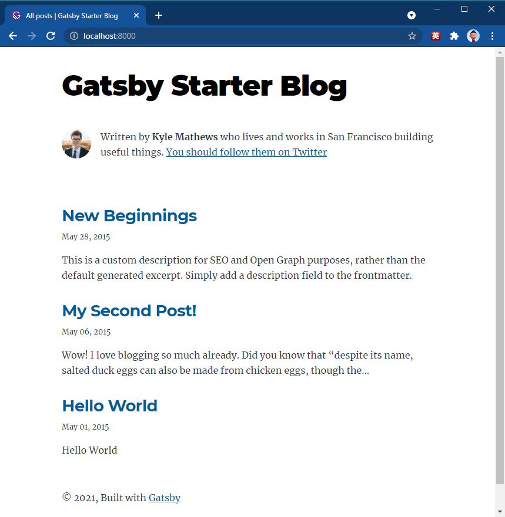</a>

起動しました🤘 簡単でした😋

### コンテンツの編集

ディレクトリ構成は下記のようになっています。試しに `content/blog/hello-world/index.md` を書き換えてみましょう。

<a href="images/blog-hosting-with-gatsbyjs-and-aws-amplify-2.png">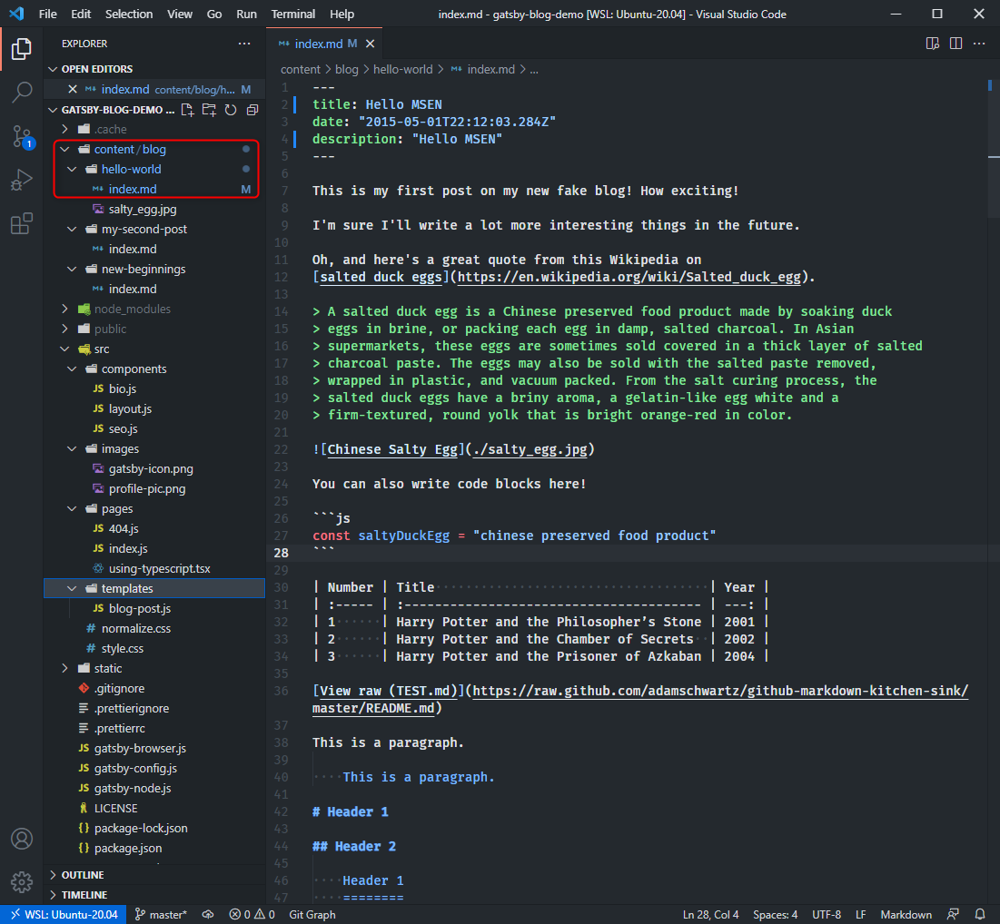</a>

ファイル先頭にある Frontmatter の title や description を書き換えました。

```
---
title: Hello MSEN
date: "2015-05-01T22:12:03.284Z"
description: "Hello MSEN"
---
```

ファイルを保存するとブラウザー側もライブリロードされて即表示されます。

<a href="images/blog-hosting-with-gatsbyjs-and-aws-amplify-3.png">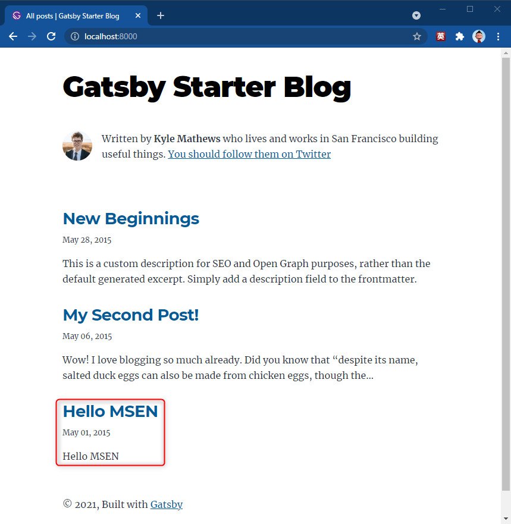</a>

この執筆体験はいいですね❗


### リポジトリを作成してプッシュ

このサイト用の **Git リポジトリを作成**してください。今回は GitHub でリポジトリが https://github.com/mseninc/gatsby-demo として進めます。

とりあえずそのままプッシュします。

なおデフォルトブランチが master だったため、 main に変更しています。

```
$ git branch --move master main
$ git remote add origin https://github.com/mseninc/gatsby-demo.git
$ git push -u origin main
```

<a href="images/blog-hosting-with-gatsbyjs-and-aws-amplify-4.png">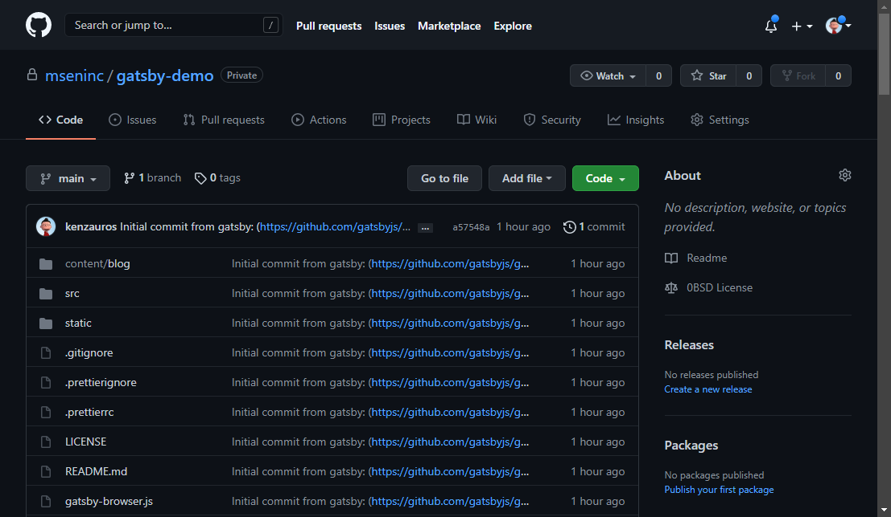</a>

初期状態がプッシュされれば 🆗 です。


## Amplify でのホスティング

基本的には公式ページに従えば大丈夫です。

- 
[Deploying to AWS Amplify | Gatsby](https://www.gatsbyjs.com/docs/how-to/previews-deploys-hosting/deploying-to-aws-amplify/)

### Amplify にアプリを追加

早速 Amplify でホスティングしてみます。 **Amplify コンソールの "Host your web app" から "Get started"** を選びましょう。

<a href="images/blog-hosting-with-gatsbyjs-and-aws-amplify-5.png">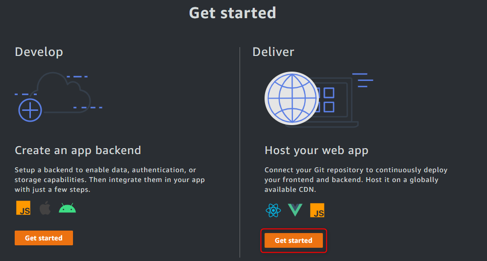</a>

GitHub → Continue を選択します。

<a href="images/blog-hosting-with-gatsbyjs-and-aws-amplify-6.png">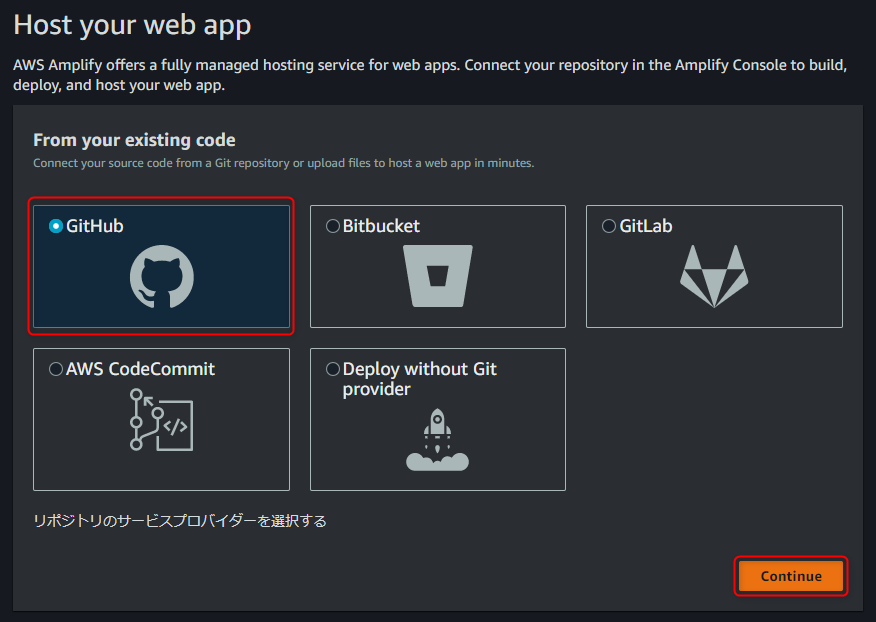</a>

GitHub の認証が入りますので、確認の上、権限を与えてください。

リポジトリ・ブランチ選択画面でさきほどのリポジトリを選び、[次へ] をクリックします。

<a href="images/blog-hosting-with-gatsbyjs-and-aws-amplify-7.png">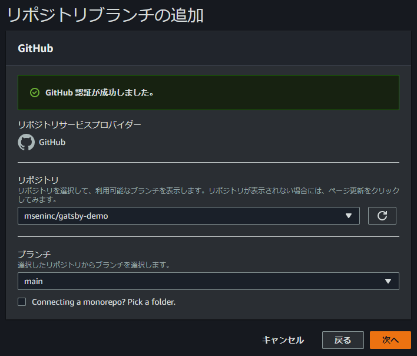</a>

ビルド設定は変更する必要がありませんでしたので、そのまま [次へ] をクリックします。

<a href="images/blog-hosting-with-gatsbyjs-and-aws-amplify-8.png">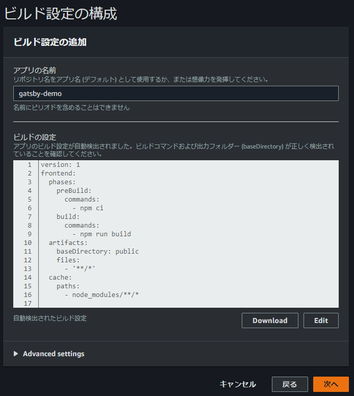</a>

設定を確認し、 [保存してデプロイ] をクリックします。

<a href="images/blog-hosting-with-gatsbyjs-and-aws-amplify-9.png">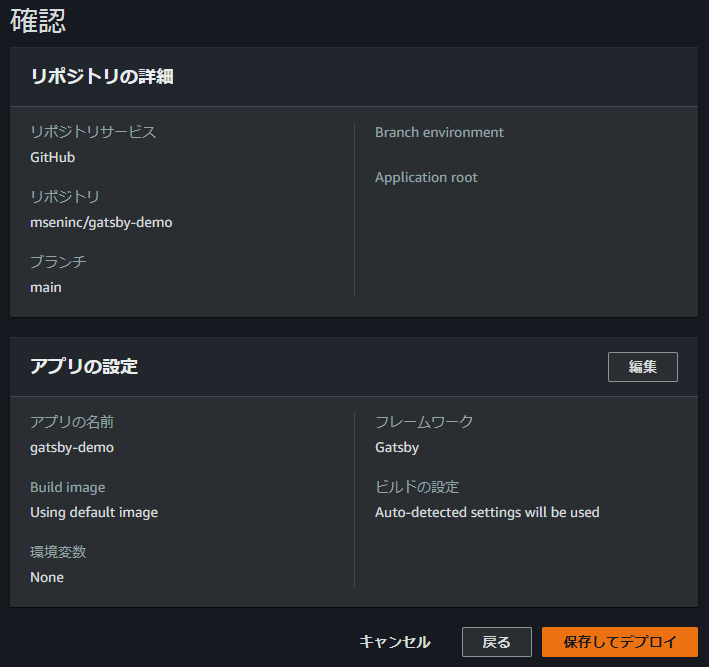</a>

ビルドがはじまり...

<a href="images/blog-hosting-with-gatsbyjs-and-aws-amplify-10.png">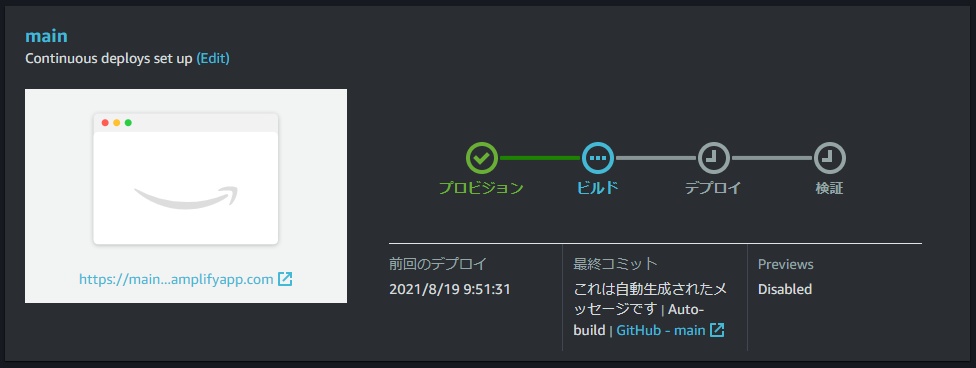</a>

検証まで完了すれば 🆗 です。赤で示したデプロイ先の URL を開きましょう。

<a href="images/blog-hosting-with-gatsbyjs-and-aws-amplify-11.png">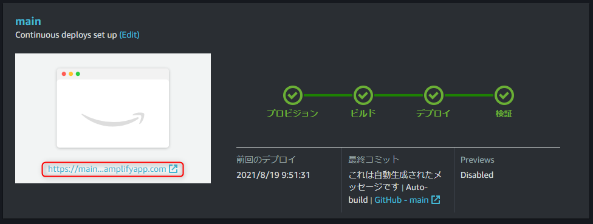</a>

無事表示されました😃

<a href="images/blog-hosting-with-gatsbyjs-and-aws-amplify-12.png">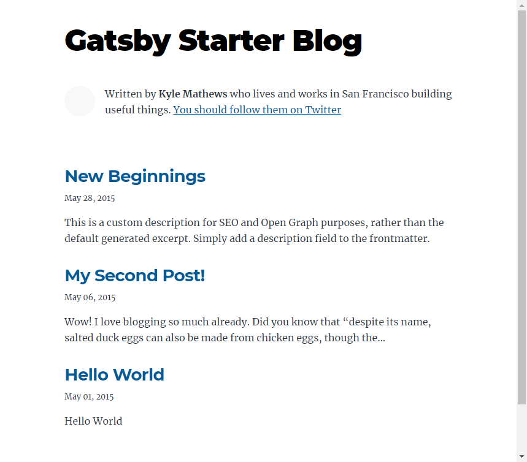</a>

### 下層ページがリダイレクトされる

しかし、よく見るとなにかがおかしいことに気づきます。そう、トップページのアバターが表示されていません。

しかも、 `/my-second-post/` のような**下層ページでページをリロードすると、トップページにリダイレクト**されてしまいます。

まぁ、 Amplify あるあるです。

Amplify コンソールの **"書き換えて、リダイレクト"** を確認すると下図のようになっているはずです。（「追いかけて ヨコハマ」みたいですね）

初期状態でこの 2 つ目のリライト設定が入っているため、下層が index.html に飛ばされています。

[編集] をクリックし、

<a href="images/blog-hosting-with-gatsbyjs-and-aws-amplify-13.png">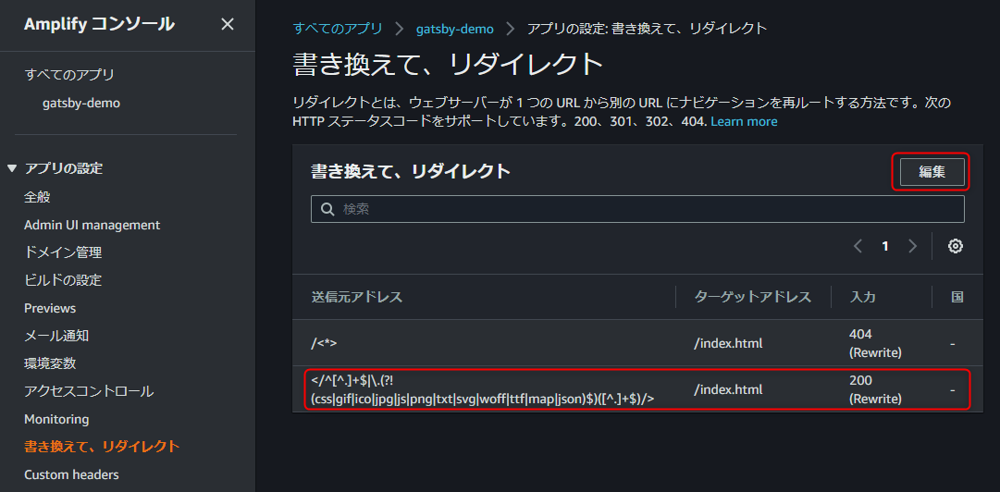</a>

2 件目を [ロールの削除] で削除し、 [保存] します。

<a href="images/blog-hosting-with-gatsbyjs-and-aws-amplify-14.png">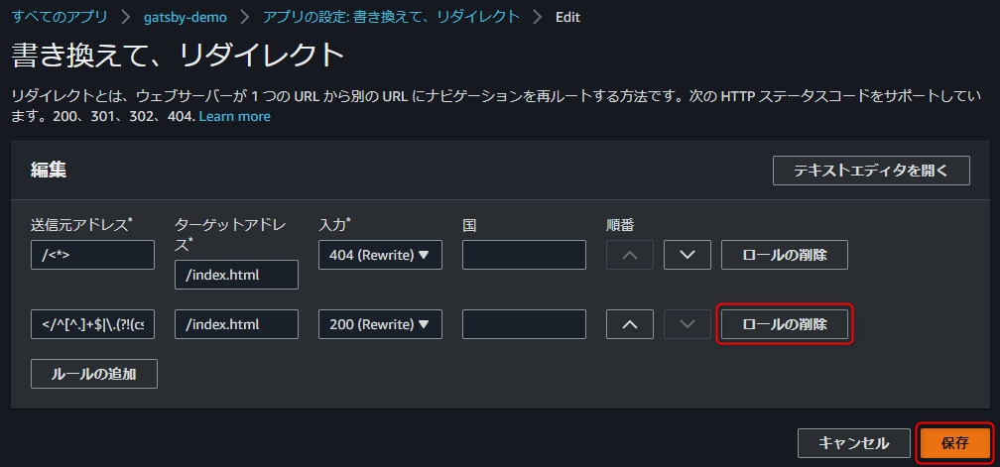</a>

最初の 1 つだけになれば 🆗 です。

<a href="images/blog-hosting-with-gatsbyjs-and-aws-amplify-15.png">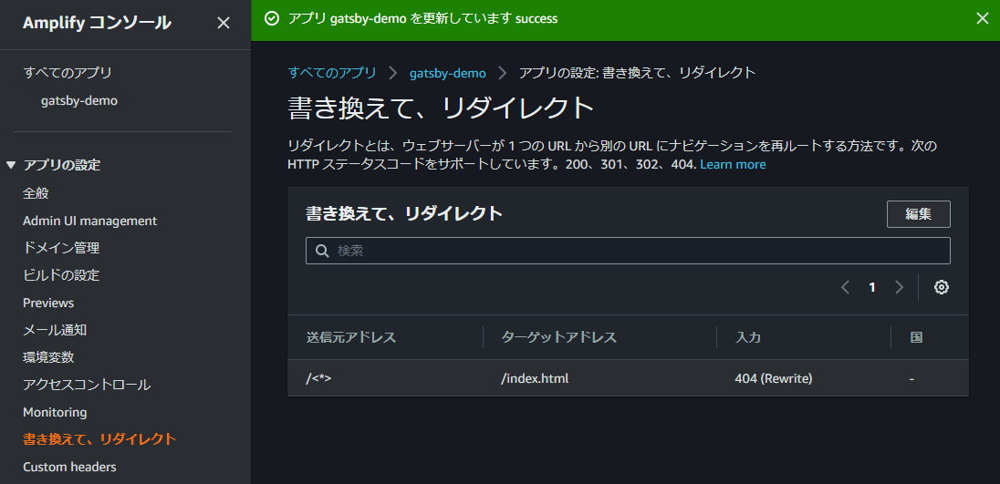</a>

無事 Kyle Mathews のアバターが表示されました🙌下層ページでリロードしても大丈夫です👍

<a href="images/blog-hosting-with-gatsbyjs-and-aws-amplify-16.png">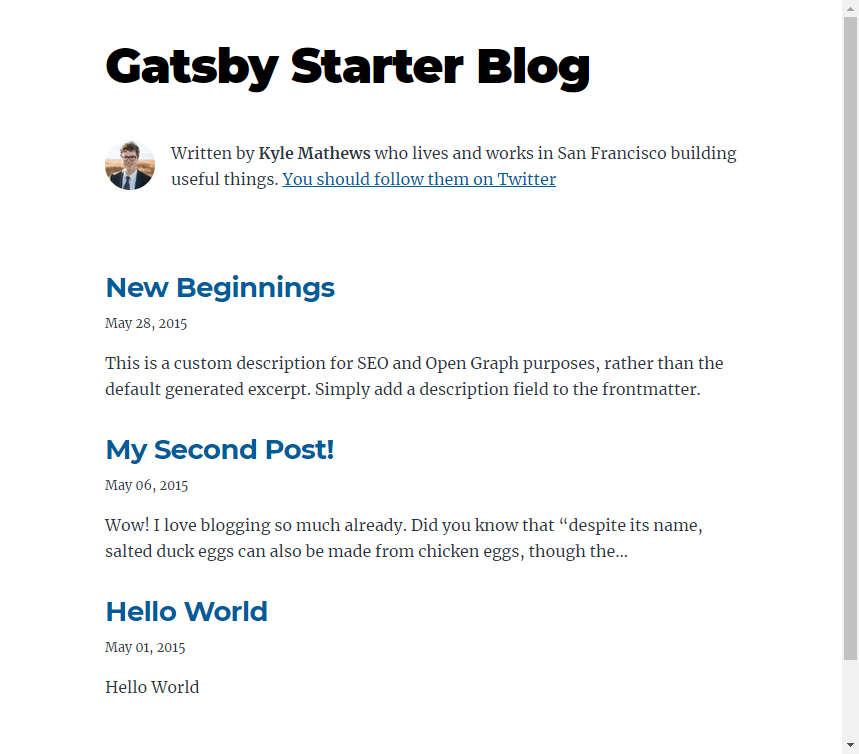</a>

試しに Chrome で JavaScript を向こうにしてアクセスしてみましたが、無事コンテンツが表示されていました。


### 画像最適化

ちなみにこの [gatsby-starter-blog](https://github.com/gatsbyjs/gatsby-starter-blog) テンプレートにはデフォルトで **`gatsby-plugin-image` プラグインが入っており、ビルドした時点でファイル解像度ごとに最適化された画像が生成**されています。

`/hello-world/` ページを開くと卵の画像があるので、これのソースを見てみるとたしかに `srcset` が記述され、各サイズの画像が生成されていることがわかります。

<a href="images/blog-hosting-with-gatsbyjs-and-aws-amplify-17.jpg">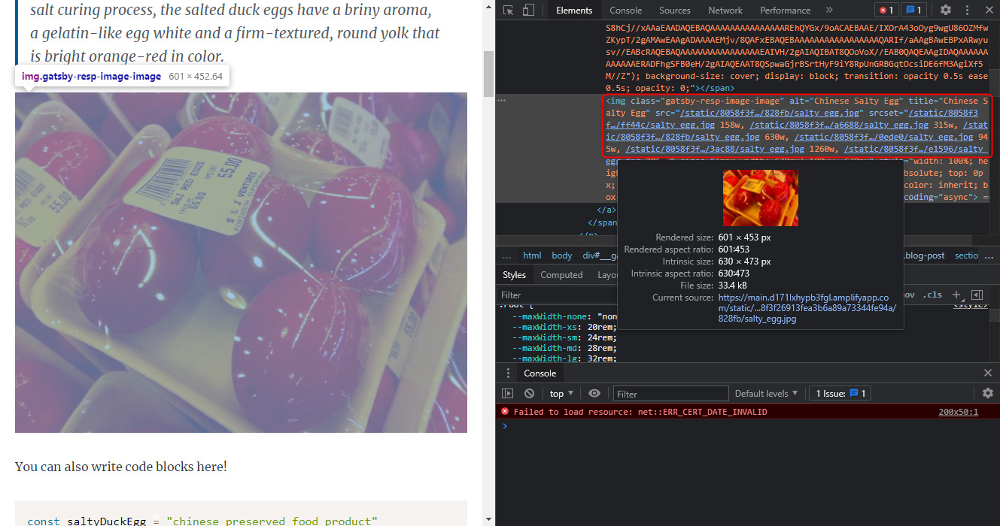</a>

記事側はただの Markdown としてしか書いていないのにすごいですね。

<a href="images/blog-hosting-with-gatsbyjs-and-aws-amplify-18.png">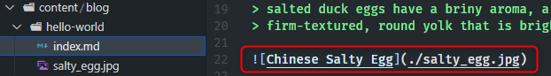</a>

## まとめ

今回は静的サイトジェネレーターである Gatsby を Amplify でホストしてみました。

よくある "やってみた" 系の記事でしたが、詰まるところがなく、 Gatsby の出来のよさには驚きました。

プラグインによってかなりいろいろなことができること、 GraphQL でコンテンツを取得できることが魅力ですね。 React に慣れていればカスタマイズ等も容易ですね。今後もいろいろ試してみたいと思います。

ちなみに公式に AMP 対応ができないことが難点のように思われましたが、そもそも Google が AMP を重視しない方針に転換したようなので、デメリットとは呼べなくなりそうです。

- [Googleの「AMP優遇」がまもなく終了 - GIGAZINE](https://gigazine.net/news/20210519-google-amp-no-longer-preferential-treatment/)

日本人が [Gatsby を検索](https://www.google.com/search?q=gatsby)すると「男のカッコイイをサポート」してくれる商品しか出てこないのが玉にキズです。うーん、マンダム😏

