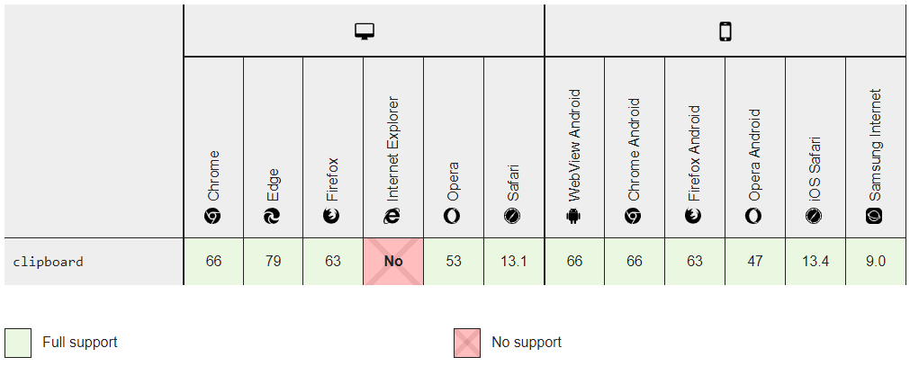

ユーザーフレンドリーな業務アプリを作ろうと思うと**クリップボード**とのやり取りは意外と重要だったりします。

Web アプリではセキュリティの観点からブラウザ経由でクリップボードにアクセスするのがあまり許可されていない時代もあり、小さな Flash を使った実装なんかもありましたが、現代のほとんどのブラウザーでは共通インターフェースでアクセスできます。

今回は**JavaScript で文字列をクリップボードにコピーする方法**をご紹介します。

## 概要

ということで現代のブラウザーでは下記の **Clipboard API (Navigator.clipboard)** を用います。

- [Navigator.clipboard - Web API | MDN](https://developer.mozilla.org/ja/docs/Web/API/Navigator/clipboard)

この API のメソッドは現代風に **Promise を返す**ので async/await での実装が可能です。

Clipboard API の対応状況は下記のとおりです。

<a href="images/copy-text-to-clipboard-with-javascript-in-2021-1.png"></a>

はい、当然のごとく、 IE は鬼門ですね。

## IE が無視できる場合

シンプルに **`navigator.clipboard.writeText`** を直接叩けば OK です。

前述の通り **`clipboard.writeText` メソッドは Promise を返す**ので async/await が使える環境であれば、下記のように try-catch で書けます。

- [Clipboard.writeText() - Web APIs | MDN](https://developer.mozilla.org/en-US/docs/Web/API/Clipboard/writeText)

```js
async function copyToClipboard(text) {
  try {
    await navigator.clipboard.writeText(text)
    alert('コピーしました')
  } catch (error) {
    alert((error && error.message) || 'コピーに失敗しました')
  }
}
```

実にシンプルでいいですね。

async/await が使えない場合は then-catch でいきましょう。

```js
function copyToClipboard(text) {
  return navigator.clipboard.writeText(text).then(function() {
    alert('コピーしました')
  }).catch(function(error) {
    alert((error && error.message) || 'コピーに失敗しました')
  })
}
```

バイナリデータをコピーしたい場合は下記のページが参考になります。

- [Unblocking clipboard access](https://web.dev/async-clipboard/#writetext())


## IE が無視できない場合

無視したい気分は山々ですが、 IE を無視できないという場合は IE のみ `window.clipboardData` を利用することにしてラッパーを作ることにします。

```js
function copyToClipboard(text) {
  if (window.clipboardData) {
    window.clipboardData.setData('Text', text)
    return true
  } else if (navigator.clipboard) {
    return navigator.clipboard.writeText(text)
  } else {
    return false
  }
}
```

## 参考

- [Clipboard - Web API | MDN](https://developer.mozilla.org/ja/docs/Web/API/Clipboard)