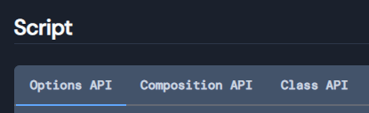
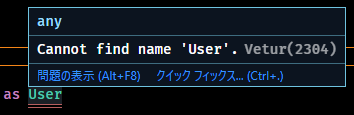
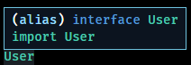
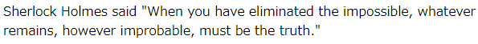

**Nuxt.js でTypeScript で開発する方法**を紹介します。本稿は2021年5月時点の情報です。どんどん新しくなっていきますので、執筆時のバージョン等を確認してお読みください。

本稿執筆時点では `create-nuxt-app` で TypeScript を含めた Nuxt の開発環境のセットアップが可能ですが、最低限必要なものを知りかったため、スクラッチから構築しました。

## 概要

- 所要時間: 約15分
- 対象:
    - Nuxt を使ったアプリ開発をしたことがある方
    - TypeScript にそんなに詳しくない方
    - Nuxt + TypeScript に興味はあるが、未着手の方

### 環境

- Windows 10 Pro
- Node.js 14.16.0
- [nuxt](https://ja.nuxtjs.org/) 2.15.4
- @nuxt/typescript-build 2.1.0
- @nuxt/types 2.15.4

### Vue コンポーネントの API について

TypeScript で Vue コンポーネントの script を記述する際、[公式リファレンス](https://typescript.nuxtjs.org/ja/cookbook/components#script)にもあるように3種類の API が選べます。

<a href="images/current-nuxt-type-script-at-minimum-1.png"></a>

- **Options API**: `Vue.extend` するやり方
- **Composition API**: `defineComponent` を使うやり方  
`@vue/composition-api` が必要
- **Class API**: クラス定義を使うやり方  
`vue-property-decorator`, `vue-class-component` が必要

「選べる」と書くといいように聞こえますが、このインターフェースが統一されていないせいで、導入時も検索時も、どれがフィットした情報なのかを見分けるのに苦労します。

まず、**Composition API と Class API は別途、上述の拡張プラグイン**が必要です。

Class API が一番 TypeScript らしくて魅力的なのですが、 `@Component` や `@Prop` などのいわゆる「デコレータ」の記述が必要になること、下記の記事にあるように「Class API が Vue 3 の RFC にリジェクトされた」ということから、今から採用するのはつらそうです。

- [デコレータ使わない Vue.js + TypeScript で進んだ「LINEのお年玉」キャンペーン - LINE ENGINEERING](https://engineering.linecorp.com/ja/blog/vue-js-typescript-otoshidama/)

というわけで、できるだけクリーンに息の長い TypeScript で書こうと思うと、結局のところ Options API を選択するのがよさそうです。**本稿でも Options API (Vue.extend) で進めます**。

## Nuxt のセットアップ

前述のとおり **Nuxt については公式セットアップ手順の [スクラッチから](https://ja.nuxtjs.org/docs/2.x/get-started/installation/#%E3%82%B9%E3%82%AF%E3%83%A9%E3%83%83%E3%83%81%E3%81%A7%E5%A7%8B%E3%82%81%E3%82%8B) を参考にしてインストール**します。

- [インストール - NuxtJS](https://ja.nuxtjs.org/docs/2.x/get-started/installation/)

ここで `package.json` は下記のようなシンプルな状態とします。

```js
{
  "name": "nuxt-typescript",
  "dependencies": {
    "nuxt": "^2.15.4"
  },
  "scripts": {
    "dev": "nuxt",
    "build": "nuxt build",
    "generate": "nuxt generate",
    "start": "nuxt start"
  }
}
```

要するにディレクトリを作って、 `yarn init` と `yarn add nuxt` だけして、 `package.json` に `scripts` を追記しただけです。

## TypeScript のセットアップ

### インストール

公式のセットアップ手順を参考に `yarn add` します。

- [セットアップ - Nuxt TypeScript](https://typescript.nuxtjs.org/ja/guide/setup)

```
$ yarn add --dev @nuxt/typescript-build @nuxt/types
```

### nuxt.config.js

`nuxt.config.js` を作成し、マニュアル通り `buildModules` に `@nuxt/typescript-build` を追加します。

```js
export default {
  ssr: false,
  target: 'static',
  components: true,
  buildModules: [
    '@nuxt/typescript-build'
  ],
}
```

その他、今回は SPA が前提のため `ssr: false`, `target: 'static'` を追記しています。

`components: true` は `true` にしておくことで `~/components` の Vue コンポーネントが自動的にロードされるようになります。
([components プロパティ - NuxtJS](https://ja.nuxtjs.org/docs/2.x/configuration-glossary/configuration-components/))

### tsconfig.json

`tsconfig.json` もマニュアル通りに作成します。

```
{
  "compilerOptions": {
    "target": "ES2018",
    "module": "ESNext",
    "moduleResolution": "Node",
    "lib": [
      "ESNext",
      "ESNext.AsyncIterable",
      "DOM"
    ],
    "esModuleInterop": true,
    "allowJs": true,
    "sourceMap": true,
    "strict": true,
    "noEmit": true,
    "baseUrl": ".",
    "paths": {
      "~/*": [
        "./*"
      ],
      "@/*": [
        "./*"
      ]
    },
    "types": [
      "@types/node",
      "@nuxt/types"
    ]
  },
  "exclude": [
    "node_modules"
  ]
}
```

### vue-shim.d.ts

これまたマニュアル通りに `types/vue-shim.d.ts` ファイルを作成し、下記のように Vue のモジュールを定義します。

```
declare module "*.vue" {
  import Vue from 'vue'
  export default Vue
}
```

インストールはこれで完了です。

## TypeScript でコンポーネントを作って配置してみる

### UserMessage コンポーネント

ほぼ [コンポーネント - Nuxt TypeScript](https://typescript.nuxtjs.org/ja/cookbook/components) のサンプルのままですが、下記のような簡単なコンポーネントを作ります。

`components\UserMessage.vue`

```
<template>
  <div>
    {{ fullName }} said "{{ message }}"
  </div>
</template>

<script lang="ts">
import Vue, { PropOptions } from 'vue'

export default Vue.extend({
  props: {
    user: {
      type: Object,
      required: true
    } as PropOptions<User>
  },

  data () {
    return {
      message: 'When you have eliminated the impossible, whatever remains, however improbable, must be the truth.'
    }
  },

  computed: {
    fullName (): string {
      return `${this.user.firstName} ${this.user.lastName}`
    }
  }
})
</script>
```

`props`, `data`, `computed` と、一通り Vue の基本的な要素をもったコンポーネントです。

### index.vue

次にこれを配置するページを作成します。

`pages\index.vue`

```
<template>
  <div>
    <UserMessage :user="user" />
  </div>
</template>

<script lang="ts">
import Vue from 'vue'

export default Vue.extend({
  data () {
    return {
      user: { firstName: 'Sherlock', lastName: 'Holmes' } as User
    }
  },
})
</script>
```

### 型定義ファイルの配置

ここまできて、 VSCode などを使っているとおそらくコンポーネントとページの `User` で型の警告が出ているでしょう。 (今回の環境では拡張機能 Vetur を使用しています)

<a href="images/current-nuxt-type-script-at-minimum-2.png"></a>

当然ながら `User` を定義していないので、 TypeScript 的に「そんな型は知らん！」というわけですね。

では、試しに `types\user.d.ts` という名前で型定義ファイルを作成します。内容は `interface User` を `export` するだけのシンプルなものです。

```js
export interface User {
  firstName: string
  lastName: string
}
```

次に型宣言を読み込むため、コンポーネントとページに **`import { User } from '@/types/user'` を追記**し、下記のようにします。

```js
import Vue from 'vue'
import { User } from '@/types/user'
```

これでエディター上のエラーが消えるはずです。

<a href="images/current-nuxt-type-script-at-minimum-3.png"></a>

もし消えなければエディターを再起動するかファイルパスを確認しましょう。

### 動作確認

ここまでできたら **Nuxt の開発環境を起動**してみます。

```
$ yarn dev
```

`http://localhost:3000/` にアクセスして下記のように表示されれば OK です。

<a href="images/current-nuxt-type-script-at-minimum-4.png"></a>

## まとめ

いまさらではありますが、「**TypeScript で Nuxt.js**」をやってみました。

これまでも何度かプロダクションへの採用を検討したのですが、メンバーの学習コストの高さに加え、開発環境の構築の煩雑さや不安定さ、バージョンアップで仕様がガラリと変わる可能性などを考慮して採用してきませんでした。

Nuxt が公式にサポートしたことで導入コストはグッと敷居は下がった印象ですが、

- TypeScript 自体の情報がまだまだ少なく古い情報も多い
- TypeScript＋ Vue (Nuxt) となるとさらに限られた情報になる
- Options API (Vue.Extend) や Class API, Composition API の情報が錯綜している
- as で無理やり型指定をする場面が多くあり、静的型付けのメリットを享受しづらい

といった理由から、とりあえず複数メンバーの関わるプロジェクトでの採用はもう少し先になりそうです。

静的型付けになれた身からすると、できるだけ Web 開発も静的型付け言語で進めたいですが、開発効率が下がっては本末転倒なので、悩ましいところです。