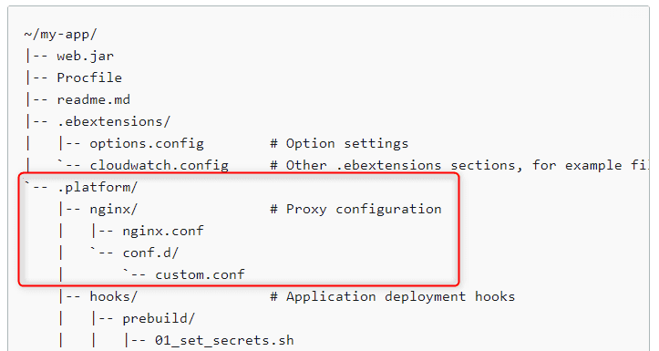

Elastic Beanstalk の PHP 環境で Laravel を動かそうと思ったところ、 nginx の設定ファイルの配置だけでハマりました。

同じように時間を浪費する方がでないようにメモ書き程度ですが、記事にしておきます。

## 結論

全部読んでいる時間のない方へ。

*`location` ディレクティブの nginx conf ファイルは* **`.platform/nginx/conf.d/elasticbeanstalk` に配置すれば OK** です。

ちなみに今回利用した Beankstalk のプラットフォームは *64bit Amazon Linux 2 v3.3.6 running PHP 7.4* です。

## Elastic Beanstalk で Laravel を動かす

Elastic Beanstalk への Laravel アプリデプロイについては公式ドキュメントがあります。ズバリなタイトルですね。

- [Elastic Beanstalk への Laravel アプリケーションのデプロイ - AWS Elastic Beanstalk](https://docs.aws.amazon.com/ja_jp/elasticbeanstalk/latest/dg/php-laravel-tutorial.html)

しかし、この公式手順では一般的な Laravel アプリはどうやっても動きません。`/public` ディレクトリ直下に `index.php` 以外のページは存在しないため、すべて 404 になります。 **Laravel ではパスを `index.php` にリダイレクトするのが必須**なのです。

*Elastic Beanstalk でリバースプロキシに Nginx を使っている場合*、下記のような **`location` ディレクティブ**が必要です。
これで URI に指定されたパスが見つからない場合は、 `index.php` にリライトされます。

```:title=laravel.conf
location / {
    try_files $uri $uri/ /index.php?$query_string;
}
```

### .platform/nginx/conf.d/ に conf ファイルを配置

さて、問題はこのファイルをどうやって Beanstalk で構築される EC2 に配置するか、ということです。

公式情報を見る限り `.platform/nginx/conf.d/` へ配置すればよさそうに見えます。（※ Amazon Linux 2 から `.platform` ディレクトリに変更されたようです。）

- [Elastic Beanstalk Linux プラットフォームの拡張 - AWS Elastic Beanstalk](https://docs.aws.amazon.com/ja_jp/elasticbeanstalk/latest/dg/platforms-linux-extend.html#platforms-linux-extend.example)



この `.platform` フォルダはアーティファクトバンドル (Laravel のソースを zip ファイルで固めたもの) のルートに配置します。 Laravel の app や bootstrap ディレクトリと同階層です。

しかし `.platform/nginx/conf.d/` に配置してアーティファクトをアップしてみても下記のようなエラーに見舞われます。

```
2021/10/18 00:03:38.750159 [ERROR] An error occurred during execution of command [app-deploy] - [start proxy with new configuration]. Stop running the command. Error: copy proxy conf from staging failed with error validate nginx configuration failed with error Command /bin/sh -c /usr/sbin/nginx -t -c /var/proxy/staging/nginx/nginx.conf failed with error exit status 1. Stderr:nginx: [emerg] "location" directive is not allowed here in /var/proxy/staging/nginx/conf.d/laravel.conf:11
nginx: configuration file /var/proxy/staging/nginx/nginx.conf test failed
```

抜粋すると、 `"location" directive is not allowed here` 、つまり *`location` ディレクティブはここには書けまへんで*、というわけです。

なんとなくこの設定ファイルの書き方の問題ではない香りがします。

### ディレクトリによって読み込まれる箇所が違う

EC2 のインスタンスにログインして `/var/proxy/staging/nginx/nginx.conf` を見てみました。

```{numberLines:1}{22,40}:title=/var/proxy/staging/nginx/nginx.conf
$ cat /var/proxy/staging/nginx/nginx.conf
#Elastic Beanstalk Nginx Configuration File

user                    nginx;
error_log               /var/log/nginx/error.log warn;
pid                     /var/run/nginx.pid;
worker_processes        auto;
worker_rlimit_nofile    32633;

events {
    worker_connections  1024;
}

http {
    include       /etc/nginx/mime.types;
    default_type  application/octet-stream;

    log_format  main  '$remote_addr - $remote_user [$time_local] "$request" '
                      '$status $body_bytes_sent "$http_referer" '
                      '"$http_user_agent" "$http_x_forwarded_for"';

    include       conf.d/*.conf;

    map $http_upgrade $connection_upgrade {
        default     "upgrade";
    }

    server {
        listen        80 default_server;
        access_log    /var/log/nginx/access.log main;

        client_header_timeout 60;
        client_body_timeout   60;
        keepalive_timeout     60;
        gzip                  off;
        gzip_comp_level       4;
        gzip_types text/plain text/css application/json application/javascript application/x-javascript text/xml application/xml application/xml+rss text/javascript;

        # Include the Elastic Beanstalk generated locations
        include conf.d/elasticbeanstalk/*.conf;
    }
}
```

なるほど、 `.platform/nginx/conf.d` 配下の `*.conf` ファイルは 22 行目と 40 行目で import されていることがわかります。 22 行目は `http` ディレクティブ内で 40 行目は `server` ディレクティブ内です。

`location` ディレクティブは `server` ディレクティブ内にしか書けませんので `"location" directive is not allowed here` というわけです。

つまり、正しくは下記のように設計されているわけですね。

- `.platform/nginx/conf.d/*.conf` は別の `server` 設定などを記述したい場合に配置
- `.platform/nginx/conf.d/elasticbeanstalk/*.conf` は `location` 設定や HTTP の設定を記述したいときに配置

要するに今回は **`.platform/nginx/conf.d/elasticbeanstalk` に配置すれば OK** ということになります。

もっとカスタムしたい場合は、 `.platform/nginx/nginx.conf` を配置すれば、 `nginx.conf` 自体を上書きできるはずです。

## まとめ

ということで、もう少し本番環境向けの conf ファイルを配置して、無事 Laravel が動作しました。

```:title=.platform/nginx/conf.d/elasticbeanstalk/laravel.conf
location / {
    if ($http_x_forwarded_proto != https) {
        return 301 https://$host$request_uri;
    }
    try_files $uri $uri/ /index.php?$query_string;
    gzip_static on;
}
```

お疲れさまでした。

### 参考サイト

- [Laravel + AWS Elastic Beanstalkの環境構築](https://zenn.dev/tomipetit/articles/b3ceb96bf50e7c)
- [Amazon Linux 2なElasticBeanstalk PHPプラットフォームでLaravelを動作させる方法 : akiyan.com](https://www.akiyan.com/blog/archives/2020/06/amazon-linux-2%E3%81%AAelasticbeanstalk-php%E3%83%97%E3%83%A9%E3%83%83%E3%83%88%E3%83%95%E3%82%A9%E3%83%BC%E3%83%A0%E3%81%A7laravel%E3%82%92%E5%8B%95%E4%BD%9C%E3%81%95%E3%81%9B%E3%82%8B%E6%96%B9.html)
