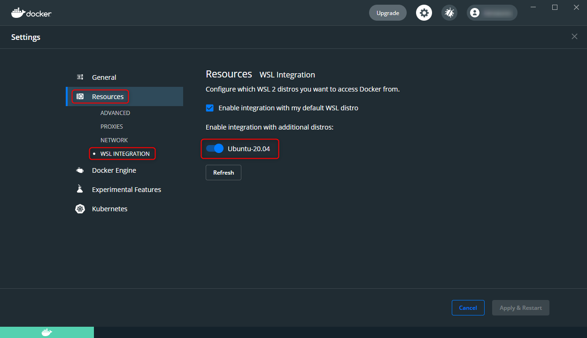

タイトルのままですが、 **WSL 2 上の Ubuntu 20.04 で docker コマンドを有効にする方法**をご紹介します。

## 環境

- Windows 10 Pro 20H2
- Ubuntu 20.04 on WSL 2
- Docker Desktop 3.4.0

## 背景

特になにも設定していない状態で WSL 2 の Ubuntu などで docker コマンドを叩くと下記のように怒られます。

```
$ docker run なんとか

The command 'docker' could not be found in this WSL 2 distro.
We recommend to activate the WSL integration in Docker Desktop settings.

See https://docs.docker.com/docker-for-windows/wsl/ for details.
```

WSL 2 のディストリビューション内で docker コマンドを使用するには、先に **WSL Integration** (WSL 統合) を設定しておく必要があるからです。

- [WSL で Docker コンテナーを使ってみる | Microsoft Docs](https://docs.microsoft.com/ja-jp/windows/wsl/tutorials/wsl-containers)

## 対応

Docker Desktop の設定画面を開き、 [Resources] → [WSL INTEGRATION] から 希望のディストリビューション（ここでは Ubuntu 20.04）のスイッチを ON にします。



これで docker コマンドが思う存分叩けるようになったはずです！

### おまけ

ちなみにすでに Ubuntu などにログインしていた場合、 WSL Integration を有効にしてもパーミッションがはまっていなくて怒られます。

```
wsl docker: Got permission denied while trying to connect to the Docker daemon socket at unix:///var/run/docker.sock: Post http://%2Fvar%2Frun%2Fdocker.sock/v1.24/containers/create?name=なんとか: dial unix /var/run/docker.sock: connect: permission denied. See 'docker run --help'.
```

WSL Integration を有効にした時点で docker グループには所属しているので、一度入り直すと解消します。

