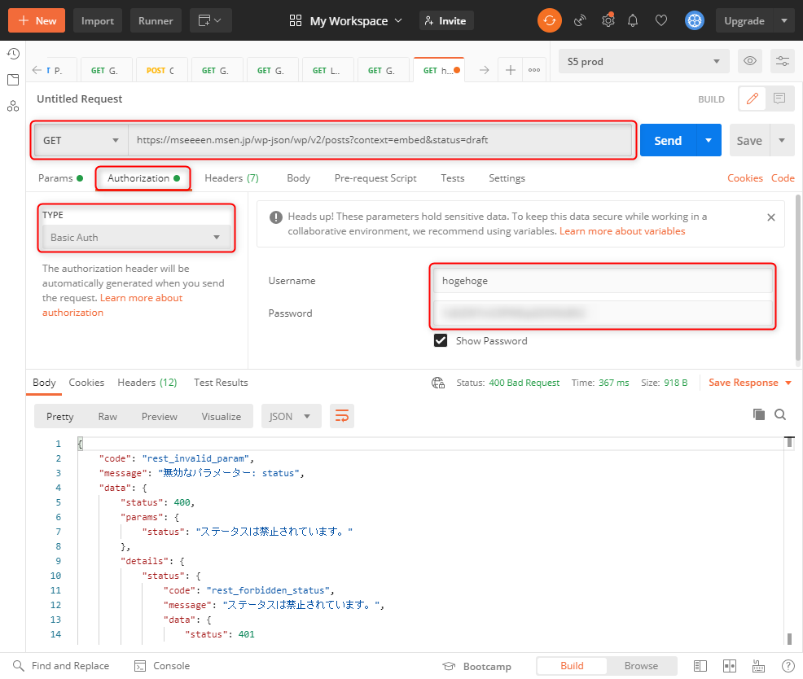
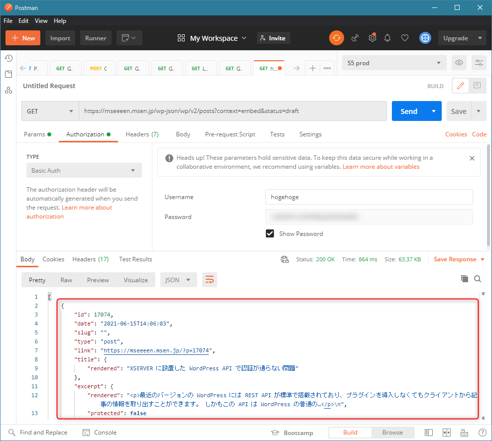

最近のバージョンの **WordPress には REST API が標準で搭載**されており、プラグインを導入しなくても記事の情報を取り出すことができます。

しかもこの API は WordPress の普通のページと同様に公開されているため、特に認証なしでアクセスすることができます。たとえば、「このブログの新着記事情報」は次のような URL で確認することができます。

[/wp-json/wp/v2/posts?context=embed](/wp-json/wp/v2/posts?context=embed)

ただ、たとえば下書き状態の記事を取り出したり、記事を更新したりしたい場合は、当然ながら投稿者ユーザーで認証する必要があります。

今回は **XSERVER に設置した WordPress でこの認証が通らず、割とハマった**ため解決方法をご紹介します。

## 解決方法

最近、古畑任三郎ばかり見ているため、結論から参りましょう。

はい。**WordPress の設置されているディレクトリの `.htaccess` の先頭に下記を追記**してください。

```apache
<IfModule mod_rewrite.c>
RewriteEngine On
RewriteCond %{HTTP:Authorization} .
RewriteRule .* - [E=HTTP_AUTHORIZATION:%{HTTP:Authorization}]
</IfModule>
```

たったこれだけです。古畑任三郎でした。


## 概要

さすがにこれで終わっては田村さんに申し訳が立たないので、少しご説明します。

### リファレンス

WordPress の API については公式が一番まとまっています。

- [REST API Handbook | WordPress Developer Resources](https://developer.wordpress.org/rest-api/)

記事を取得する Posts API はこちら。

- [Posts | REST API Handbook | WordPress Developer Resources](https://developer.wordpress.org/rest-api/reference/posts/)

で、今回問題の認証周りがこちら。

- [Authentication | REST API Handbook | WordPress Developer Resources](https://developer.wordpress.org/rest-api/using-the-rest-api/authentication/)

ただしこの認証周りは若干古いのでご注意を。

認証方法の一つであるアプリケーションパスワードはプラグインを入れよ、と紹介されていますが、現バージョンの WordPress では組み込まれているため、標準で利用できます。

今回はこのアプリケーションパスワードによる認証を用いますので、事前に**ユーザーのプロフィールページ (`/wp-admin/profile.php`) でアプリケーションパスワードを生成**しておきます。

詳細はこちら

- [Application Passwords: Integration Guide – Make WordPress Core](https://make.wordpress.org/core/2020/11/05/application-passwords-integration-guide/)

### 例

前述のとおり、たとえばこのブログの記事一覧を取得したいときは /wp-json/wp/v2/posts?context=embed を呼び出します。

ブラウザのアドレスバーにでも貼り付けて開くと MSeeeeN の「公開済みの記事」の一覧が取得できます。

ここで「下書きの記事」を取得したい場合、リクエストは `status=draft` をつけて /wp-json/wp/v2/posts?context=embed&status=draft とします。

さて、これを開くとどうなるか。おそらくブラウザで開くと読めないですが、内容は下記のようになっています。

```json
{
    "code": "rest_invalid_param",
    "message": "無効なパラメーター: status",
    "data": {
        "status": 400,
        "params": {
            "status": "ステータスは禁止されています。"
        },
        "details": {
            "status": {
                "code": "rest_forbidden_status",
                "message": "ステータスは禁止されています。",
                "data": {
                    "status": 401
                }
            }
        }
    }
}
```

なんのエラーなのかわかりにくいですが、要するに **`status` パラメーターは認証がない限り禁止されてるよ**、ということです。

### Authorization ヘッダーをつける

さて、では認証をつけて試してみます。

ブラウザで試すのは難しいので、 **[Postman](https://www.postman.com/)** を利用します。



**Authorization** タブで Type を **Basic auth** にして Username に WordPress のログインユーザー名を、 Password にアプリケーションパスワードを入力します。

いざリクエスト！

...

無情にも同じエラーが表示されます。

Password をログインパスワードに変えてみたり、 curl で試してみたり axios で試してみたりしましたが、さっぱりうまくいきませんでした。

## 原因と解決

### 原因

どうも WordPress 側やリクエスト側ではなく、サーバーっぽいなと思って調べたところ、最終的にたどりついたのが、こちら。

- [Authorization ヘッダが取得できない環境への対応 · Issue #1607 · EC-CUBE/ec-cube](https://github.com/EC-CUBE/ec-cube/issues/1607)

EC-CUBE なのでまったく関係ないんですが、要するに **Authorization ヘッダーが欠落していて PHP まで届いてない問題** だそうです。

XSERVER の Apache でヘッダーが削除されているのかしら？

### 解決方法

ということで、「なくなっちゃう前になんとかしよう」というのが、解決策です。

具体的には `.htaccess` の冒頭に下記のように追記します。
内容としては **`Authorization` ヘッダーがついていれば、環境変数 `HTTP_AUTHORIZATION` にヘッダーの内容を設定する** というものです。

```apache
<IfModule mod_rewrite.c>
RewriteEngine On
RewriteCond %{HTTP:Authorization} .
RewriteRule .* - [E=HTTP_AUTHORIZATION:%{HTTP:Authorization}]
</IfModule>
```

WordPress のディレクトリだと `# BEGIN WordPress` という記述があると思うので、その前に記述しましょう。

追加後の `.htaccess` のイメージはこちら

```apache
# Set authorization to environmental variable
<IfModule mod_rewrite.c>
RewriteEngine On
RewriteCond %{HTTP:Authorization} .
RewriteRule .* - [E=HTTP_AUTHORIZATION:%{HTTP:Authorization}]
</IfModule>

# BEGIN WordPress
<IfModule mod_rewrite.c>
RewriteEngine On
RewriteBase /
RewriteRule ^index\.php$ - [L]
RewriteCond %{REQUEST_FILENAME} !-f
RewriteCond %{REQUEST_FILENAME} !-d
RewriteRule . /index.php [L]
</IfModule>
# END WordPress
```

### 再チャレンジ

`.htaccess` を書き換えたら、いざ再チャレンジ！



成功しました...！無事下書き状態のこの記事が取得できています。

2時間ほど無駄にしましたが、ともかく解決してよかったです。