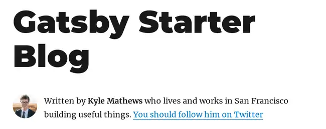

**Gatsbyjs で記事ごとの著者のアバター画像を表示したい**と思ったところ、簡単なことのようですが、意外と手こずりました。

最適なやり方ではないとは思いますが、 1 つのやり方をご紹介します。

なお、記事が長くなってしまったので、二本立てでお送りいたします。

1. 各記事に著者情報を表示する 👈いまここ
2. [著者情報にアバター画像を表示する](https://mseeeen.msen.jp/gatsbyjs-author-bio-and-avatar-for-each-post-2)

## 概要

Gatsby の [gatsby-starter-blog](https://www.gatsbyjs.com/starters/gatsbyjs/gatsby-starter-blog) スターターでは著者が Kyle Mathews 固定になっています。



これを記事ごとの著者 (author) に合わせた著者情報とアバター画像が表示されるようにします。


## 前提条件

### 環境

- Node.js 14
- Gatsby 3.11.1

### 仕様

- ベースは [gatsby-starter-blog](https://www.gatsbyjs.com/starters/gatsbyjs/gatsby-starter-blog) スターターを使用
- 各記事ページに著者情報を表示する
- 著者は全員 GitHub のアカウントを持っている
- 各記事の著者は frontmatter の `author` で GitHub の ID を指定する
- アバター画像は GitHub のアバターを利用する

今回の想定は取り扱う著者が全員 IT 技術者のため、上記のような仕様にしています。

GitHub のアバターでない場合は、適宜読み替え、応用していただければ幸いです。


## 著者情報を YAML から読み込む

まず、**著者情報を YAML から読み込んで各ページに表示する**部分については、リファレンスの Node mapping の項に例として挙がっているので、そのまま利用できます。

- [Mapping node types - Gatsby Config API | Gatsby](https://www.gatsbyjs.com/docs/reference/config-files/gatsby-config/#mapping-node-types)

### 記事に著者情報をつける

今回は**著者情報は GitHub の ID で指定**しますので、 **frontmatter** は下記のようにします。

```md
---
title: My First Post
author: kenzauros
---

POST BODY here
```

### 著者情報ファイルの作成

**著者情報を列挙した YAML ファイルを作成**します。とりあえず 3 名ほど書いておきました。

今回は `src/data/author.yaml` として配置します。

```yaml
- id: kenzauros
  name: Kenji Yamada
  bio: 旅行にいきたい
- id: norikazum
  name: Norikazu Masuda
  bio: 男前でんがな
- id: kyoshin
  name: Kiyoshi Koyama
  bio: パチプロ
```

`bio` はサンプル通り自己紹介として使用します。他に必要な属性がある場合は追記しましょう。

### transformer をインストール

著者情報はファイルから読み込むので、対応した transformer をインストールします。 **YAML の場合は [gatsby-transformer-yaml](https://www.gatsbyjs.com/plugins/gatsby-transformer-yaml/)** になります。

```
npm install gatsby-transformer-yaml
```

モジュールの説明にあるように **`gatsby-config.js`** に設定します。

`plugins` に `gatsby-transformer-yaml` を加え、さらに `gatsby-source-filesystem` で YAML ファイルを配置したディレクトリからファイルを読み込めるように設定しておきます。

また、 `mapping` に `MarkdownRemark.frontmatter.author` が `AuthorYaml` (`author.yaml`) で解決されるように指定します。

```js
module.exports = {
  plugins: [
    `gatsby-transformer-yaml`,
    {
      resolve: `gatsby-source-filesystem`,
      options: {
        path: `./src/data/`,
      },
    },
    // ... other plugins
  ],
  mapping: {
    "MarkdownRemark.frontmatter.author": `AuthorYaml`,
  },
}
```

以上で著者情報の設定は完了です。

これでたとえば下記のようにクエリできます。

```graphql
query ($id: String!) {
  markdownRemark(id: { eq: $id }) {
    id
    html
    frontmatter {
      title
      description
      author {
        # author.yaml の情報が展開される
        id
        name
        bio
      }
    }
  }
}
```

### 記事側から Bio コンポーネントに著者情報を渡す

次にフッターにさきほどの著者情報を表示するようにします。

まず **`src/templates/blog-post.js` の `pageQuery` を編集して `author` の情報を取得**するようにします。

```js
export const pageQuery = graphql`
  query BlogPostBySlug(
    $id: String!
    $previousPostId: String
    $nextPostId: String
  ) {
    markdownRemark(id: { eq: $id }) {
      id
      excerpt(pruneLength: 160)
      html
      frontmatter {
        title
        date(formatString: "MMMM DD, YYYY")
        description
        author {
          id
          name
          bio
        }
      }
// 以下略
```

この取得した情報を Bio コンポーネントに渡すようにします。

```jsx
  const author = post.frontmatter.author;

  return (
        {/* 略 */}
        <footer>
          { author
            ? <Bio
                github={author.id}
                name={author.name}
                bio={author.bio}
                />
            : null }
        </footer>
        {/* 略 */}
  )
```

### bio コンポーネントの修正

スターターに用意されている Bio コンポーネントは `siteMetadata` から静的に取得した Kyle Mathews の情報が固定的に表示されるようになっています。

さきほど記事ページ側から渡した `author` の値を表示できるよう `src/components/bio.js` を下記のように修正します。

とりあえず `StaticImage` のあたりをばっさり削ってシンプルにしました。

```jsx
import * as React from "react"

const Bio = (props) => {
  const bio = props.bio || null;
  const github = props.github;
  const name = props.name || '名無しの権兵衛';
  const githubUrl = github ? `https://github.com/${github}` : null;

  return (
    <div className="bio">
      <div>
        <p>
          <strong>{name}</strong>
          { github ? <> (<a href="{githubUrl}" target="_blank" rel="noopener">{github}</a>)</> : null }
        </p>
        <p>{bio}</p>
      </div>
    </div>
  )
}

export default Bio
```

これでこんな感じになるはずです。


アバター画像がないので少し寂しい感じですが、無事記事ごと著者が表示できました🙌

[後半](https://mseeeen.msen.jp/gatsbyjs-author-bio-and-avatar-for-each-post-2)へ続きます👉