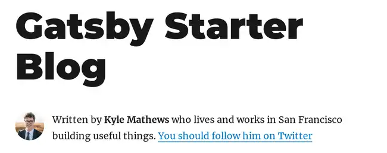
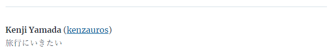

**Gatsbyjs で記事ごとの著者のアバター画像を表示する**方法について、二本立てでお送りしております。

1. [各記事に著者情報を表示する](https://mseeeen.msen.jp/gatsbyjs-author-bio-and-avatar-for-each-post-1)
2. 著者情報にアバター画像を表示する 👈いまここ

## 概要

[前回](https://mseeeen.msen.jp/gatsbyjs-author-bio-and-avatar-for-each-post-1)のおさらいです。

Gatsby の [gatsby-starter-blog](https://www.gatsbyjs.com/starters/gatsbyjs/gatsby-starter-blog) スターターでは著者が Kyle Mathews 固定になっています。

<a href="images/gatsbyjs-author-bio-and-avatar-for-each-post-2-1.png"></a>

これを記事ごとの著者 (author) に合わせた著者情報とアバター画像が表示されるようにします。

<a href="images/gatsbyjs-author-bio-and-avatar-for-each-post-2-2.png"></a>

前回はこんな感じで著者情報をアバター画像なしで表示するところまでをやりました👇

<a href="images/gatsbyjs-author-bio-and-avatar-for-each-post-2-3.png"></a>

## 前提条件

こちらも再掲です。

### 環境

- Node.js 14
- Gatsby 3.11.1

### 仕様

- ベースは [gatsby-starter-blog](https://www.gatsbyjs.com/starters/gatsbyjs/gatsby-starter-blog) スターターを使用
- 各記事ページに著者情報を表示する
- 著者は全員 GitHub のアカウントを持っている
- 各記事の著者は frontmatter の `author` で GitHub の ID を指定する
- アバター画像は GitHub のアバターを利用する

今回の想定は取り扱う著者が全員 IT 技術者のため、上記のような仕様にしています。

GitHub のアバターでない場合は、適宜読み替え、応用していただければ幸いです。


## アバター画像を読み込む

さていよいよ本題です。**アバター画像を GitHub から読み込んでキャッシュし、さきほどの Bio コンポーネントに表示**していきます。

基本的には [Gatsby Node - Preprocessing External Images | Gatsby](https://www.gatsbyjs.com/docs/how-to/images-and-media/preprocessing-external-images/#gatsby-node) の方法を参考にします。


### 画像ファイルのフィールドを追加

まず **`gatsby-node.js` を編集して frontmatter に画像"ファイル"ノードを追加**します。ここでは名前は `avatarImage` とします。

```js
exports.createSchemaCustomization = ({ actions }) => {
  const { createTypes } = actions

  createTypes(`
    type MarkdownRemark implements Node {
      frontmatter: Frontmatter
      fields: Fields
    }

    type Frontmatter {
      title: String
      description: String
      date: Date @dateformat
      avatarImage: File @link(from: "avatarImage__NODE")
    }

    type Fields {
      slug: String
    }
  `)
}
```

**`avatarImage: File @link(from: "avatarImage__NODE")`** が追加部分です。

この `avatarImage__NODE` がリンク元となるフィールドになります。フィールド名は任意ですが、他のフィールドとかぶる可能性のないものにします。

なお `Frontmatter.author` は `mapping` でリンクしているので、この GraphQL の Type 宣言には登場していないことに留意してください。

次に同じく **`gatsby-node.js` の `onCreateNode` で `avatarImage__NODE` の中身を設定**します。

```js
// 冒頭で createRemoteFileNode の require が必要です
const { createRemoteFileNode } = require(`gatsby-source-filesystem`) 

exports.onCreateNode = async ({
  node,
  actions,
  getNode,
  store,
  cache,
  createNodeId,
}) => {
  const { createNode, createNodeField } = actions

  if (node.internal.type === `MarkdownRemark`) {
    const value = createFilePath({ node, getNode })

    createNodeField({
      name: `slug`,
      node,
      value,
    })

    if (node.frontmatter.author) {
      const url = `https://avatars.githubusercontent.com/${node.frontmatter.author}`;
      const fileNode = await createRemoteFileNode({
        url, // string that points to the URL of the image
        parentNodeId: node.id, // id of the parent node of the fileNode you are going to create
        createNode, // helper function in gatsby-node to generate the node
        createNodeId, // helper function in gatsby-node to generate the node id
        cache, // Gatsby's cache
        store, // Gatsby's Redux store
      })
      if (fileNode) {
        node.frontmatter.avatarImage__NODE = fileNode.id
      }
    }
  }
}
```

`slug` の部分はスターターテンプレートでもともと記述されている記事のスラグを指定する部分ですね。

それ以外なかなかややこしいですが、基本的には **`createRemoteFileNode` でファイルノードを作成し、先ほどの `avatarImage__NODE ` というフィールドに代入**しているだけです。

`createRemoteFileNode` のパラメーターが並びますが、ほとんどは `onCreateNode` のパラメーターをそのまま渡せば大丈夫です。

ここで `url` は https://avatars.githubusercontent.com/ に `node.frontmatter.author` をくっつけて生成しています。
たとえば私の GitHub ID `kenzauros` なら下記のようになります。

[https://avatars.githubusercontent.com/kenzauros](https://avatars.githubusercontent.com/kenzauros)

この時点では **`node.frontmatter.author` は author.yaml の情報に解決されていない**ことに注意が必要です。
よってこの **`node.frontmatter.author` には記事の frontmatter で指定した `author` がそのまま入っています**。

GraphQL の宣言で `avatarImage` を `node.frontmatter.author` の下層でなく `node.frontmatter` の下層に定義しているのもこれが理由です。


### GraphQL クエリーでアバター画像を取得

いよいよアバター画像を復活させましょう。

まず **`src/templates/blog-post.js` の `pageQuery` に `avatarImage` を追加**します。

```GraphQL
    markdownRemark(id: { eq: $id }) {
      id
      excerpt(pruneLength: 160)
      html
      frontmatter {
        title
        date(formatString: "MMMM DD, YYYY")
        description
        author {
          id
          name
          bio
        }
        avatarImage {
          childImageSharp {
            gatsbyImageData(width: 50, height: 50, layout: FIXED)
          }
        }
      }
    }
```

ここで **`avatarImage` はファイルオブジェクト**です。これに `childImageSharp`, `gatsbyImageData` を指定して最適化された画像に変換します。

次にこのクエリーで取得した画像を Bio コンポーネントに渡します。

```jsx
<footer>
  { author
    ? <Bio
        github={author.id}
        name={author.name}
        bio={author.bio}
        avatarImage={post.frontmatter.avatarImage}
        />
    : null }
</footer>
```

### Bio コンポーネントの修正

次に Bio コンポーネントで `props` から渡された画像を表示します。

元々はローカルの静的ファイルだったため `StaticImage` コンポーネントが使われていましたが、**動的ファイルを表示させるため `GatsbyImage` コンポーネント**を使います。

```jsx
import * as React from "react"
import { GatsbyImage, getImage } from "gatsby-plugin-image"

const Bio = (props) => {
  const bio = props.bio || null;
  const github = props.github;
  const name = props.name || '名無しの権兵衛';
  const githubUrl = github ? `https://github.com/${github}` : null;
  const avatarImage = getImage(props.avatarImage)

  return (
    <div className="bio">
      <GatsbyImage
        image={avatarImage}
        className="bio-avatar"
        width={50}
        height={50}
        alt={github}
        />
      <div>
        <p>
          <strong>{name}</strong>
          { github ? <> (<a href="{githubUrl}" target="_blank" rel="noopener">{github}</a>)</> : null }
        </p>
        <p>{bio}</p>
      </div>
    </div>
  )
}

export default Bio
```

GatsbyImage の `image` には `IGatsbyImageData` 型を渡す必要がありますので、 `avatarImage` から **`getImage()` で `file.childImageSharp.gatsbyImageData` を取得**しています。

このあたりは [gatsby-plugin-image](https://www.gatsbyjs.com/plugins/gatsby-plugin-image/) プラグインのページを参照してください。

さて、これで下記のように表示されれば OK です😃

<a href="images/gatsbyjs-author-bio-and-avatar-for-each-post-2-2.png"></a>

お疲れ様でした😅
