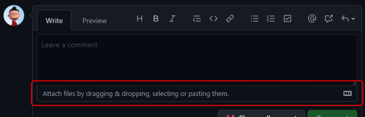
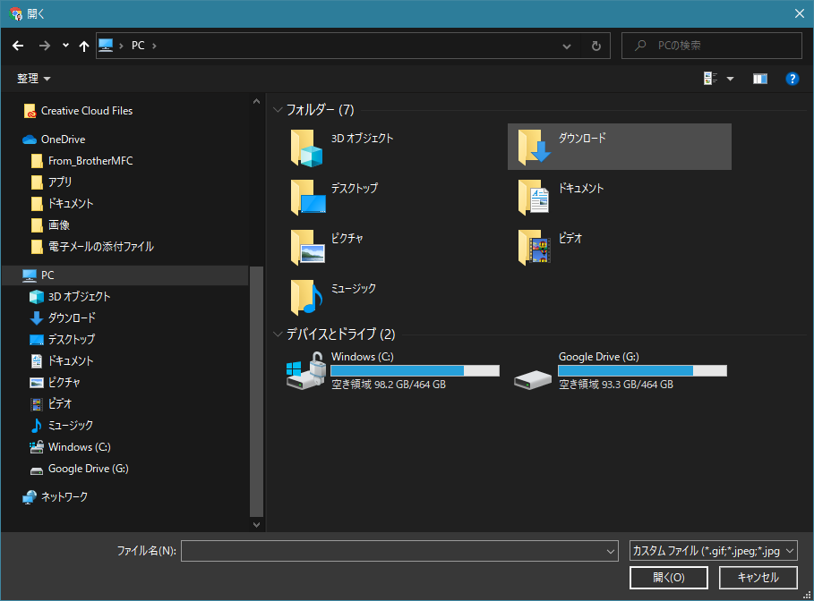
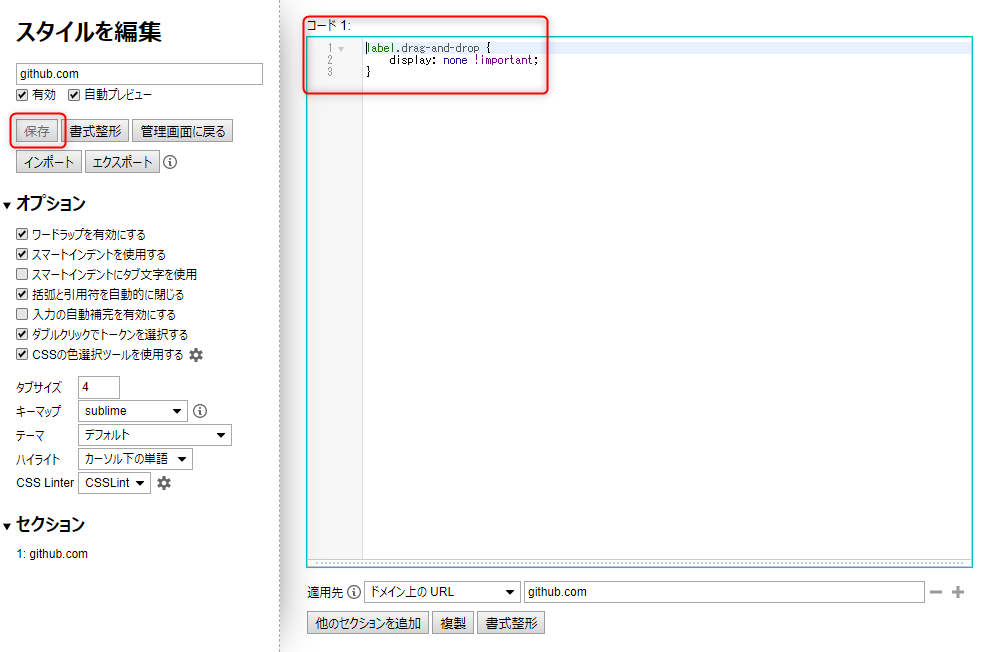
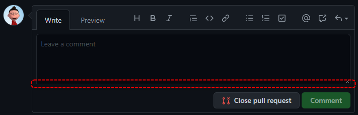

GitHub をお使いの方なら一度はクリックしたことがあるだろう、**コメント欄の下のファイルアップロードボタン**。

私は誤ってここをクリックしてしまう困った癖があり、**毎回ファイル選択ダイアログが開く**ので、プチストレスでした。

ということで、スタイルシートを上書きできる Chrome 拡張機能 **Stylus** を使って、消えていただくことにしました。

## 背景

主題の**ファイルアップロードボタン**とはこれのことです。

[caption id="attachment_17256" align="aligncenter" width="711"]<a href="images/hide-file-upload-bar-in-github-comment-1.png"></a> GitHub コメント欄のファイルアップロードボタン[/caption]

これをクリックするとおなじみのファイル選択ダイアログが開きます (Windows)。アップロードするファイルを選択する機能なので当たり前なのですが。

[caption id="attachment_17262" align="aligncenter" width="909"]<a href="images/hide-file-upload-bar-in-github-comment-2.png"></a> Windows のファイル選択ダイアログが開いてしまう[/caption]

しかし**アップロードはドラッグ＆ドロップでもできますし、個人的にはわざわざここをクリックしてファイルを選択したくなったことがありません。**

にもかかわらず、私はなぜかこの部分を誤ってクリックしてしまうことが多く、我ながら毎回「なんでやねん！」とツッコミをいれる毎日です。

そんな毎日に疲れたため、消えていただくことに決定しました。

## 実践

### Stylus のインストール

GitHub で設定できればいいのですが、そんな細かい設定はありませんので、 Chrome の拡張機能を使って github.com 内のみ、特定のスタイルシート (CSS) を適用するようにします。

まず下記のリンクから **Chrome に Stylus をインストール**します。

- [Stylus - Chrome ウェブストア](https://chrome.google.com/webstore/detail/stylus/clngdbkpkpeebahjckkjfobafhncgmne?hl=ja)

### CSS の設定

インストールが完了すると検索バーの右にアプリアイコンが出ます。
（アイコンが表示されていなければ  を押してみてください）

**GitHub のなんらかのページ (https://github.com 下のどこか) をタブで開いた状態で、このアイコンをクリック**します。

下記のようなウィンドウが開いたら **[次のスタイルを書く]** で **[github.com]** をクリックします。

[caption id="attachment_17258" align="aligncenter" width="256"]<a href="images/hide-file-upload-bar-in-github-comment-4.png"></a> Stylus で github.com の CSS を追加[/caption]

これで **github.com だけで有効なスタイルを定義できる**ので、下記のように定義します。

```css
label.drag-and-drop {
    display: none !important;
}
```

[caption id="attachment_17259" align="aligncenter" width="999"]<a href="images/hide-file-upload-bar-in-github-comment-5.png"></a> Stylus で github.com の CSS を設定[/caption]

右側のコード欄に記述したら、 **[保存]** ボタンをクリックします。

## 結果

間違っていなければこれでファイルアップロードボタンが消えているはずです。

[caption id="attachment_17257" align="aligncenter" width="711"]<a href="images/hide-file-upload-bar-in-github-comment-6.png"></a> GitHub のコメント欄のファイルアップロードボタンが消えた[/caption]

無理矢理下部を消しただけなので見た目は少々悪いですが、気になる場合は調整してください。

これで健やかな GitHub ライフを送れます。

どなたかのお役に立てれば幸いです。