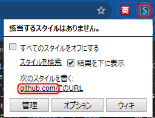
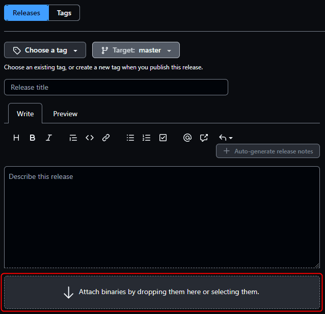

GitHub をお使いの方なら一度はクリックしたことがあるだろう、**コメント欄の下のファイルアップロードボタン**。

私は誤ってここをクリックしてしまう困った癖があり、**毎回ファイル選択ダイアログが開く**ので、プチストレスでした。

ということで、スタイルシートを上書きできる Chrome 拡張機能 **Stylus** を使って、消えていただくことにしました。

## 背景

主題の**ファイルアップロードボタン**とはこれのことです。


これをクリックするとおなじみのファイル選択ダイアログが開きます (Windows)。アップロードするファイルを選択する機能なので当たり前なのですが。


しかし**アップロードはドラッグ＆ドロップでもできますし、個人的にはわざわざここをクリックしてファイルを選択したくなったことがありません。**

にもかかわらず、私はなぜかこの部分を誤ってクリックしてしまうことが多く、我ながら毎回「なんでやねん！」とツッコミをいれる毎日です。

そんな毎日に疲れたため、消えていただくことに決定しました。

## 実践

### Stylus のインストール

GitHub で設定できればいいのですが、そんな細かい設定はありませんので、 Chrome の拡張機能を使って github.com 内のみ、特定のスタイルシート (CSS) を適用するようにします。

まず下記のリンクから **Chrome に Stylus をインストール**します。

- [Stylus - Chrome ウェブストア](https://chrome.google.com/webstore/detail/stylus/clngdbkpkpeebahjckkjfobafhncgmne?hl=ja)

### CSS の設定

インストールが完了すると検索バーの右にアプリアイコンが出ます。


**GitHub のなんらかのページ (https://github.com 下のどこか) をタブで開いた状態で、このアイコンをクリック**します。

下記のようなウィンドウが開いたら **[次のスタイルを書く]** で **[github.com]** をクリックします。



これで **github.com だけで有効なスタイルを定義できる**ので、下記のように定義します。

```css
:not(file-attachment) > label.drag-and-drop {
    display: none !important;
}
```


右側のコード欄に記述したら、 **[保存]** ボタンをクリックします。

<ins>

2022/6/1 `:not(file-attachment) > ` を追加しました。

アップロードボタンを消すには `label.drag-and-drop` だけでいいのですが、 [Release ページ](https://github.com/kenzauros/rharbor/releases/new) のアップロードボタンまで消えてしまって不便なので、こちらは残すようにしました。




</ins>

## 結果

間違っていなければこれでファイルアップロードボタンが消えているはずです。


無理矢理下部を消しただけなので見た目は少々悪いですが、気になる場合は調整してください。

これで健やかな GitHub ライフを送れます。

どなたかのお役に立てれば幸いです。
