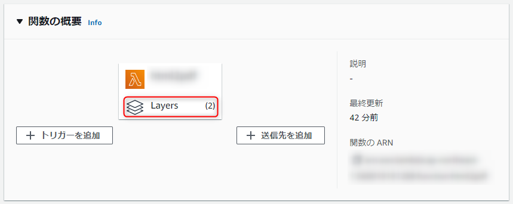
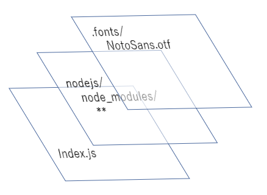
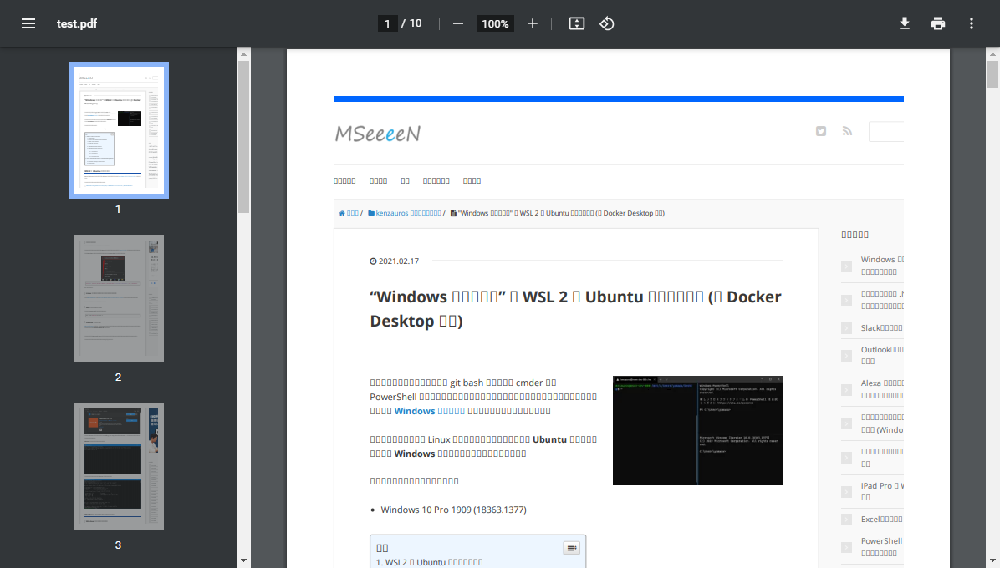
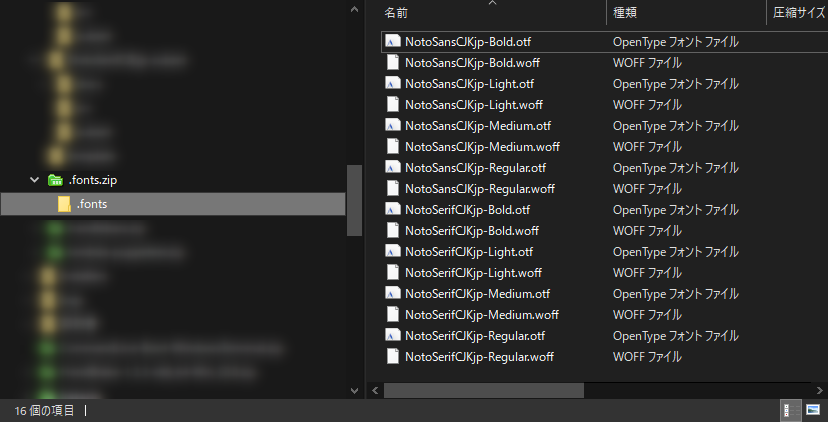
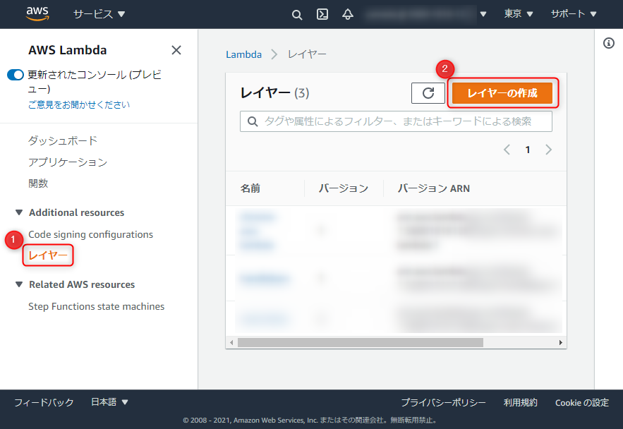
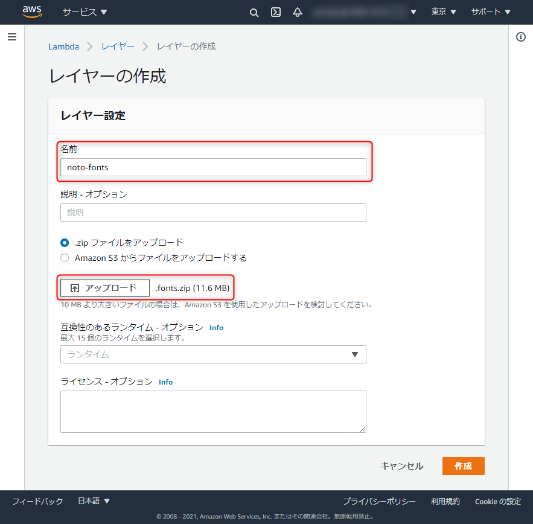
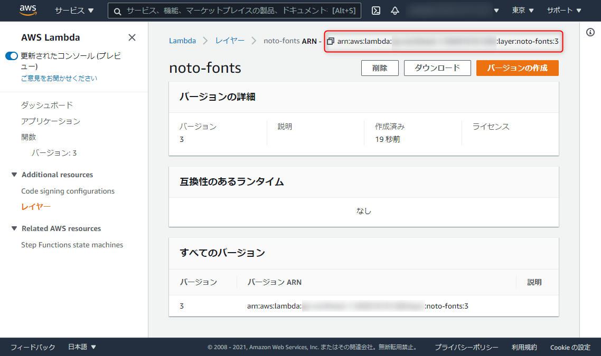

**サーバーレスで HTML を PDF に変換したくなった**ので、 **AWS Lambda** でできないか試してみました。

少し画像が多く、説明が長くなってしまったため、三部作でお送りします。

1. 概要・日本語フォントの準備 ← この記事
2. [Puppeteer の準備](https://mseeeen.msen.jp/html-to-pdf-with-puppeteer-and-japanese-fonts-in-aws-lambda-using-layers-2)
3. [Lambda 関数の作成](https://mseeeen.msen.jp/html-to-pdf-with-puppeteer-and-japanese-fonts-in-aws-lambda-using-layers-3)

## 概要

**HTML を入力として PDF を出力する** という目的のため、サーバーレスという前提のもと、 AWS Lambda での実装方法を検討しました。

サーバーレスにこだわったのは、今回の想定では PDF 変換処理の使用頻度があまり高くなく、サーバーの遊休時間に課金されることが無駄なコストとなってしまうためです。

Lambda であればよほど頻度が高くならない限り、ほぼタダです。

出力した PDF は HTTP のレスポンスとして返してもよいですが、 API にするとも限らないので今回は **S3 のバケットにファイルとして書き出す**方式にしました。

## Lambda の構成

さて、今回の目的を AWS Lambda で達成するためには**「日本語フォント」**と**「Puppeteer」**が必要です。

フォントは Lambda 関数のプロジェクトの **`.fonts` に配置**します。このディレクトリに配置することで、システムフォントとして読み込まれるので、 CSS でフォント名を指定するだけでフォントが利用できます。

Puppeteer は Node.js のモジュールであるため、 **`npm install` でインストールされた `node_modules` 配下のファイルが必要に**なります。

これに加えて、実際に HTML → PDF 変換を行うための Lambda 関数のハンドラ (`index.js` など) が必要になります。

これらすべてを Lambda 関数のパッケージにすると「日本語フォント」と「Puppeteer」だけで 60 MB 程度になり、 AWS のコンソールからアップしづらくなるだけでなく、コンソールからハンドラをちょこっと修正したりするのも不便になります。

**「日本語フォント」と「Puppeteer」部分は一度決まってしまえばあまり差し替えることはないので、 Lambda レイヤーに配置して使う**ことにします。

**Lambda レイヤーは Lambda 関数で共通して使うファイルやフォルダを登録しておくための仕組み**で、いわゆる「共通ライブラリ」のようなものだと思えばいいでしょう。

コンソールの「関数の概要」にある "Layers" というやつから設定できます。

こうしておけば、 **Lambda 関数自体は（ほぼ）ハンドラを含んだファイルのみにすることができます**ので、差し替えもコンソール上での編集も容易です。

レイヤーを使用した Lambda 関数のイメージは下図のようになります。

## 日本語フォントの話

PDF 変換（というかヘッドレスブラウザ）を日本人が使うにあたって、避けて通れないのが「**日本語フォント**」の問題です。

Windows などのリッチな環境に慣れていると忘れがちですが、 Lambda は Slim な Amazon Linux 2 の上で動作するため、当然ながら日本語フォントのようなマッチョなファイルは含まれていません。

そのまま **Web サイトを表示すると豆腐（□）だらけ**になります。

ということで日本語フォントをなんらかの方法で外部から注入してやる必要があります。今回は日本語フォントとして、下記の理由で **Noto Font** を採用します。

- ライセンス的に加工が容易（サブセットが作りやすい）
- 明朝体とゴシック体の両方が選べる
- モダン（それなりにカッコイイ）

ちなみに **Noto Font は豆腐を避けるべく開発された "No-豆腐 (tofu) Font"** です（※ホント）

- [Google Noto Fonts](https://www.google.com/get/noto/)

フォント作成は非常にコストのかかる大変な仕事であるにもかかわらず、**美しく、漢字も潤沢にそろったフォントがオープンソースで提供されていることは大変ありがたく、すばらしいこと**です。

ただ **Noto Font はそのままではめちゃくちゃファイルサイズのデカいフォントですので、今回は必要な漢字のみにしたサブセット**を用います。

自分で作成することもできますが、すでに作って公開してくださっている有志の方がいらっしゃるので、ありがたく使わせていただきます。セキュリティが心配な方や必要な文字が含まれていない場合は　[サブセットフォントメーカー](https://opentype.jp/subsetfontmk.htm) を使って自分で作りましょう。

- **Noto Sans** (サンセリフ/ゴシック体)
    - [ixkaito/NotoSansCJKjp-subset: Noto Sans CJK JP サブセット (OTF, WOFF, EOT)](https://github.com/ixkaito/NotoSansCJKjp-subset)
    - [axcelwork/Noto-Snas-subset: のとさんのサブセットです](https://github.com/axcelwork/Noto-Snas-subset)
- **Noto Serif** (セリフ/明朝体)
    - [ixkaito/NotoSerifCJKjp-subset: Noto Serif CJK JP サブセット (OTF, WOFF)](https://github.com/ixkaito/NotoSerifCJKjp-subset)

今回は [@ixkaito](https://github.com/ixkaito) 氏のサブセットを利用させていただきました。 **Sans/Serif ともに `git clone` して `subset` フォルダにあるフォントのうち、必要なファイルのみを使用**します。

## 日本語フォントを格納した Lambda レイヤーの作成

ではいよいよ Lambda レイヤーを作成していきます。

**適当なフォルダに `.fonts` フォルダを作成し、そこに必要なフォントファイルを入れます。この `.fonts` フォルダごと Zip で圧縮します。**今回は下記のような内容になりました。

Lambda のコンソールから**「レイヤー」**を開き、**「レイヤーの作成」**をクリックします。

適当な名前を入力し、**「アップロード」**ボタンを押してさきほど圧縮した `.fonts` の Zip ファイルを選択します。特に設定は不要なので、**「作成」**をクリックします。

レイヤーが作成できたら **ARN をコピー** しておきます。

この **ARN をのちほど Lambda 関数側に設定**します。

フォントレイヤーの作成は以上です。続きは下記のリンクからご覧ください。

1. 概要・日本語フォントの準備 ← この記事
2. [Puppeteer の準備](https://mseeeen.msen.jp/html-to-pdf-with-puppeteer-and-japanese-fonts-in-aws-lambda-using-layers-2)
3. [Lambda 関数の作成](https://mseeeen.msen.jp/html-to-pdf-with-puppeteer-and-japanese-fonts-in-aws-lambda-using-layers-3)