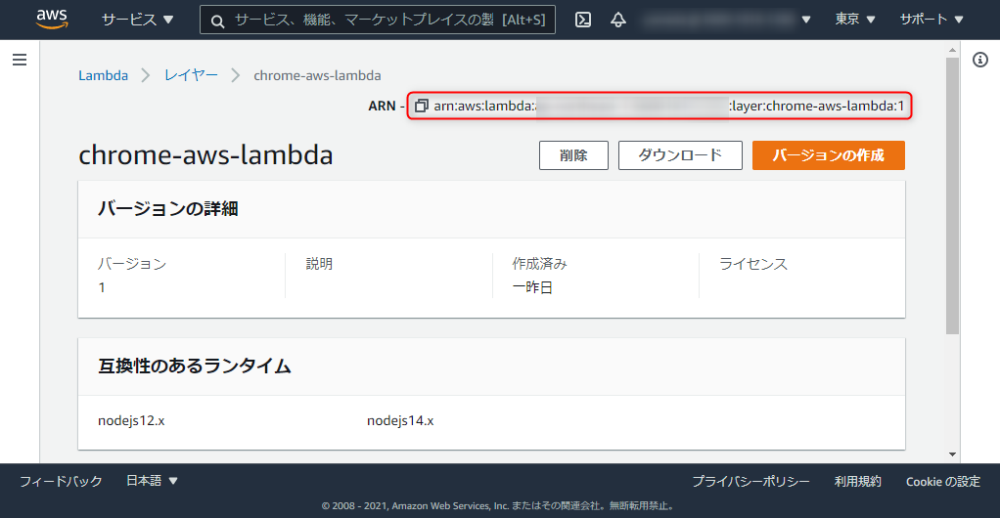

**AWS Lambdaを使ってサーバーレスで HTML を PDF に変換する**ため、三部構成で実現方法をご紹介しています。

1. [概要・日本語フォントの準備](https://mseeeen.msen.jp/html-to-pdf-with-puppeteer-and-japanese-fonts-in-aws-lambda-using-layers-1)
2. Puppeteer の準備 ← この記事
3. [Lambda 関数の作成](https://mseeeen.msen.jp/html-to-pdf-with-puppeteer-and-japanese-fonts-in-aws-lambda-using-layers-3)

[前回](https://mseeeen.msen.jp/html-to-pdf-with-puppeteer-and-japanese-fonts-in-aws-lambda-using-layers-1) で日本語フォント用の Lambda レイヤーを用意したので、次に **PDF 変換を実際に行うライブラリとなる Puppeteer のレイヤーを準備**します。

## 自動化ツールの選定

いまさらですが、 **HTML → PDF の変換にはヘッドレスブラウザ**（GUI のないブラウザ）を使うのが一般的で、実際には Headless Chrome を使うことがほとんどでしょう。 **Markdown の場合は Markdown → HTML → PDF** という流れをとります。

ヘッドレスブラウザは GUI がないので、なんらかのツールで外部から操作してやる必要があります。

ググってみると自動化ツールとして古参の **[Selenium](https://github.com/SeleniumHQ/)** を用いた例が多く、いくつか試したのですが、結局すんなりとうまくいく雰囲気はありませんでした。

最近は **Chrome DevTools チームが開発している [Puppeteer](https://pptr.dev/) が利用できる**ため、今回はこちらを利用することにしました。パペットマペット！

- [Puppeteer 公式ページ](https://pptr.dev/)
- [puppeteer/troubleshooting.md at v1.12.1 · puppeteer/puppeteer](https://github.com/puppeteer/puppeteer/blob/v1.12.1/docs/troubleshooting.md#running-puppeteer-on-aws-lambda)

Puppeteer の GitHub リポジトリに詳細な説明があり、 AWS Lambda での動かし方も提案されています。今回は上記の **"Running Puppeteer on AWS Lambda"** で紹介されている 下記のラッパーを使用することにしました。

- [alixaxel/chrome-aws-lambda: Chromium Binary for AWS Lambda and Google Cloud Functions](https://github.com/alixaxel/chrome-aws-lambda)

## Puppeteer のレイヤー作成

では早速 **Puppeteer 用のレイヤー**を作ります。

ざっくり言えば [alixaxel/chrome-aws-lambda](https://github.com/alixaxel/chrome-aws-lambda) を Zip に固めるだけですが、 **Node.js のモジュールは Zip ファイルの `nodejs/node_modules` に格納**する必要があります。

README の [AWS Lambda Layer](https://github.com/alixaxel/chrome-aws-lambda#aws-lambda-layer) にも手順があるのですが、 `npm install` が抜けていて make がうまくいかないので、下記の順番でコマンドを叩きます。

```
git clone --depth=1 https://github.com/alixaxel/chrome-aws-lambda.git
cd chrome-aws-lambda/
npm install
make chrome_aws_lambda.zip
```

Windows ではたぶん make は叩けないのでどこか適当な Linux でやりましょう。私は WSL2 上の Ubuntu でやりました。

これでうまくいけば **`chrome_aws_lambda.zip` が生成**されるはずです。中身がちゃんと `nodejs/node_modules` となっていれば OK です。これだけで 50MB 近くになりました。


さて、フォントのときと同様に Lambda のコンソールから**「レイヤー」**を開き、**「レイヤーの作成」**をクリックします。


適当な名前を入力し、**「アップロード」**ボタンを押してさきほど生成された `chrome_aws_lambda.zip` を選択します。必須ではないですが、「互換性のあるランタイム」で「Node.js」を選択しておけばいいでしょう。入力できたら**「作成」**をクリックします。


レイヤーが作成できたら **ARN をコピー** しておきます。



この **ARN をのちほど Lambda 関数側に設定**します。Puppeteer レイヤーの作成は以上です。

Puppeteer レイヤーの作成は以上です。続きは下記のリンクからご覧ください。

1. [概要・日本語フォントの準備](https://mseeeen.msen.jp/html-to-pdf-with-puppeteer-and-japanese-fonts-in-aws-lambda-using-layers-1)
2. Puppeteer の準備 ← この記事
3. [Lambda 関数の作成](https://mseeeen.msen.jp/html-to-pdf-with-puppeteer-and-japanese-fonts-in-aws-lambda-using-layers-3)