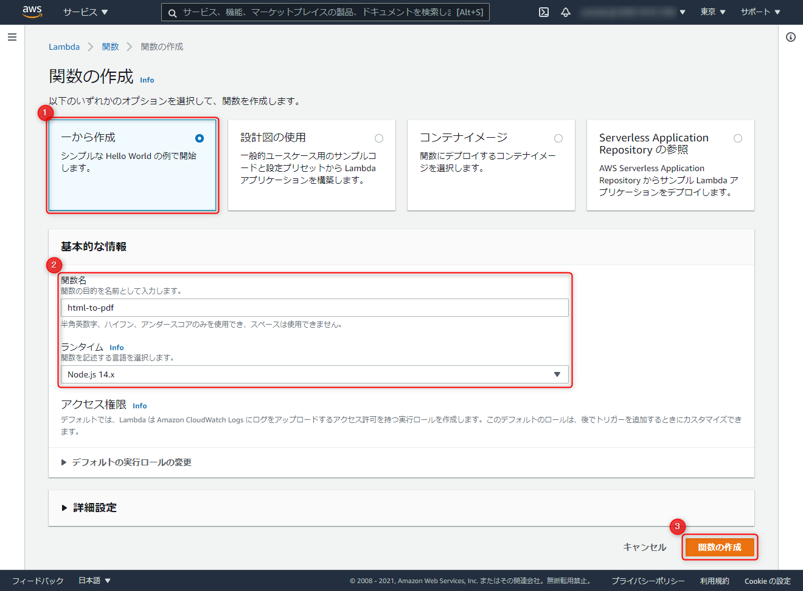
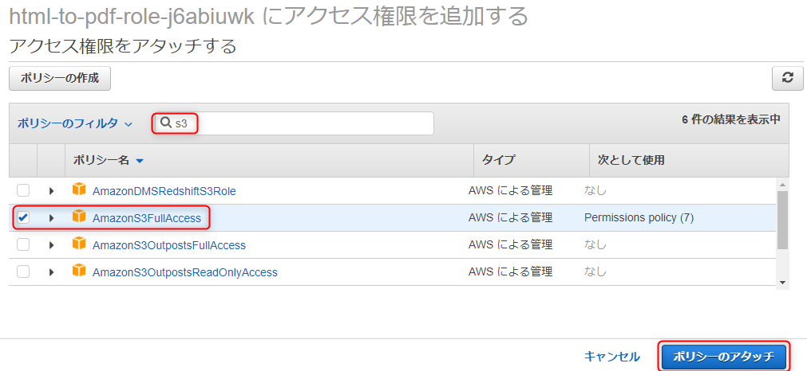
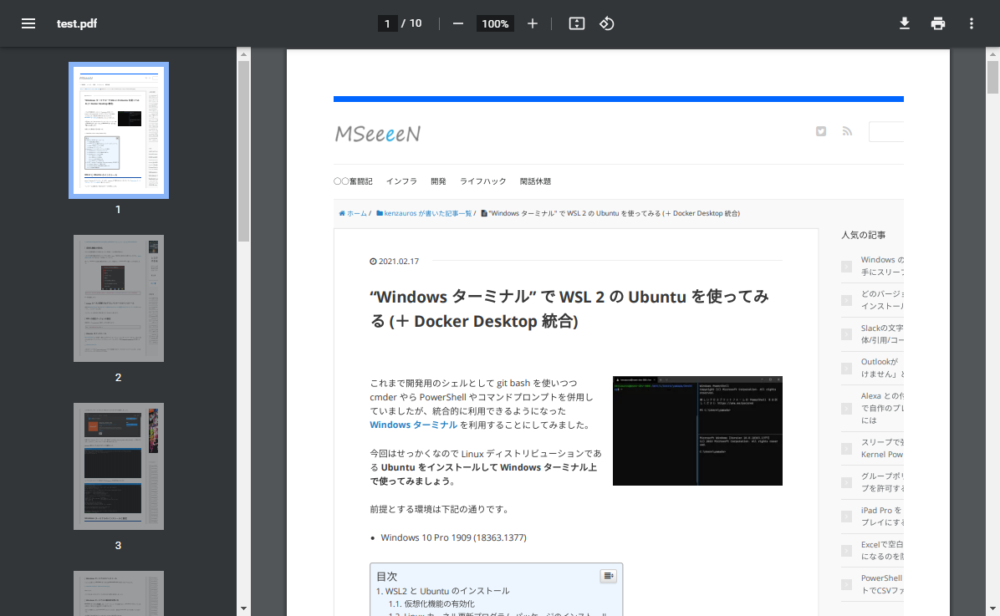

こんにちは、kenzauros です。

**AWS Lambdaを使ってサーバーレスで HTML を PDF に変換する** ということで三部構成でお送りしております。

1. [概要・日本語フォントの準備](/html-to-pdf-with-puppeteer-and-japanese-fonts-in-aws-lambda-using-layers-1)
2. [Puppeteer の準備](/html-to-pdf-with-puppeteer-and-japanese-fonts-in-aws-lambda-using-layers-2)
3. Lambda 関数の作成 ← この記事

[前回](/html-to-pdf-with-puppeteer-and-japanese-fonts-in-aws-lambda-using-layers-2) までで日本語フォントと Puppeteer のレイヤーを準備できたので、ようやく**実際に PDF を出力する Lambda 関数を作成**します。

## 構成のおさらい

ここで構成をおさらいしておきます。今回の構成では 2 つのレイヤーを使用するため、 Lambda 関数全体のイメージは下記のようになります。


これまでの 2 記事で図の上 2 つをレイヤーとして作成してきました。

ではいよいよ関数本体を実装します。

## Lambda 関数の実装

### S3 バケットの準備

今回は**生成された PDF ファイルを S3 のバケットに書き出します**ので、先に S3 でバケットを作っておきましょう。

**`generated-pdf` という名前のバケットだと仮定**して進めます。

### Lambda 関数の作成

Lambda のコンソールから **「関数の作成」** をクリックします。


**「一から作成」** で適当な関数名（ここでは `html-to-pdf` ）を設定し、ランタイムは Node.js にして **「関数の作成」** をクリックします。



### レイヤーの追加

では **「レイヤーの追加」** をクリックしてさきほど作成した 日本語フォントと Puppeteer のレイヤーを追加していきます。


**「ARN を指定」でレイヤーの ARN を指定**（レイヤー作成後に生成された ARN）して **「追加」** をクリックします。レイヤー分繰り返します。


下記のようになれば OK です。


### Lambda 関数の設定

次にメモリや権限などを設定しておきます。 **「設定」→「基本設定」** を開きます。

デフォルトではメモリが 128 MB しか割り当たっておらず、ブラウザの動作には厳しいため、 **メモリは 512 MB 程度に設定**します。 Puppeteer の推奨は 1 GB ぐらいだった気がします。

また実行時間では 3 秒では足りないため、**タイムアウトも 1 分程度**にしましょう。

**ロールに S3 への書き込み権限を与える**ため、画面下部のリンクから **「ロールを表示」** しましょう。


### ロールの設定

ロール設定で **「ポリシーをアタッチします」** をクリックします。


本来はちゃんと必要なバケットに対してのみ＆オブジェクト書き込みのみの権限を割り当てるべきですが、ここでは簡略化のため、 **`AmazonS3FullAcess` を割り当てます**。



とりあえず下記のようになれば OK でしょう。


### 環境変数の設定

S3 のバケット名を環境変数経由で渡すため、 **「設定」→「環境変数」** から下記のように `BUCKET_NAME` をキーとしてバケット名を設定します。
（バケット名は先に作成したものを設定してください）


### ハンドラ関数の設定

関数のコードソースから **`index.js` を開き、とりあえず下記のソースをコピペして「Deploy」** します。


```
const chromium = require('chrome-aws-lambda')
const AWS = require('aws-sdk')
const s3 = new AWS.S3()
const Bucket = process.env.BUCKET_NAME

exports.handler = async (event) => {
  let result = null
  let browser = null
  try {
    browser = await chromium.puppeteer.launch({
      args: chromium.args,
      defaultViewport: chromium.defaultViewport,
      executablePath: await chromium.executablePath,
      headless: chromium.headless,
      ignoreHTTPSErrors: true,
    })
    let page = await browser.newPage()
    if (event.content) {
      await page.setContent(event.content)
    } else {
      await page.goto(event.url || 'https://example.com')
    }
    const buffer = await page.pdf({
      format: 'A4',
      displayHeaderFooter: false,
      printBackground: true,
      preferCSSPageSize: true,
      margin: { top: '1.5cm', bottom: '1.5cm', right: '1.5cm', left: '1.5cm' },
    })
    const params = {
      Bucket,
      Key: 'test.pdf',
      Body: buffer,
    }
    try {
      var data = await s3.putObject(params).promise()
      console.log(data)
    } catch (error) {
      console.log(error)
    }
    result = await page.title()
  } finally {
    if (browser !== null) {
      await browser.close()
    }
  }
  return result
}
```

これで **Lambda 関数の作成と設定は完了**です。

### テスト

**「テスト」** から適当にテストイベントを作成し、ペイロードに下記のような `url` を含む JSON を指定して、 **「呼び出し」** ます。

```
{
  "url": "/windows-terminal-with-ubuntu/"
}
```


どきどきの実行中。。。


**無事完了！**


メモリが振り切ってます。弊社ブログの描画は 512 MB では足りなかったそうです。。。

これで **S3 バケットに `test.pdf` が生成**されているはずです。


ダウンロードしてみると...



**おぉぉぉ、美しい。。。 No tofu。。。**

お疲れさまでした。

### HTML からの生成

ちなみにさきほどは URL を渡しましたが、 `url` の代わりに `content` に HTML を渡すことで任意のドキュメントを描画できます。

```json
{
  "content": "<!DOCTYPE html><html lang='en'><head><meta charset='UTF-8'>...以下略..."
}
```

CSS も `<style>` でベタ書きするか、 link 貼れば読み込むことが可能です。

### Puppeteer のカスタマイズ

実質的に Puppeteer で PDF 出力している部分は下記の部分のみです。

```js
    const buffer = await page.pdf({
      format: 'A4',
      displayHeaderFooter: false,
      printBackground: true,
      preferCSSPageSize: true,
      margin: { top: '1.5cm', bottom: '1.5cm', right: '1.5cm', left: '1.5cm' },
    })
```

カスタマイズは下記のような参考サイトをご参照ください。

- [page.pdf - Puppeteer 公式](https://pptr.dev/#?product=Puppeteer&version=v8.0.0&show=api-pagepdfoptions)
- [ヘッドレスブラウザの Puppeteer を利用して WEB ページを PDF 出力してみる。 - Qiita](https://qiita.com/t-toyota/items/8c7aa6fe8ada2775ea2c)
- [Puppeteer のスニペット集 | knooto](https://knooto.info/puppeteer-snippets/)

### Noto Font の指定

せっかく Noto Fonts をいれたのにデフォルトの Web ページ描画ではおそらくゴシック体の Noto Sans しか使用されないはずです。

 Noto Serif を使用するには下記のように **CSS で `'Noto Serif CJK JP'` と指定**するだけです。

```css
html {
  font-family: 'Noto Serif CJK JP', serif; /* Noto Serif (明朝体) */
}

h1 {
  font-family: 'Noto Sans CJK JP', sans-serif; /* Noto Sans (ゴシック体) */
}
```

これでキレイな文書出力が可能になりますね。

## まとめ

ちょっと長くなりましたが、 **AWS Lambda を使ってサーバーレスで HTML を PDF に変換する方法**をご紹介しました。

1. [概要・日本語フォントの準備](/html-to-pdf-with-puppeteer-and-japanese-fonts-in-aws-lambda-using-layers-1)
2. [Puppeteer の準備](/html-to-pdf-with-puppeteer-and-japanese-fonts-in-aws-lambda-using-layers-2)
3. [Lambda 関数の作成](/html-to-pdf-with-puppeteer-and-japanese-fonts-in-aws-lambda-using-layers-3)

あとは前段で URL やコンテンツを受け付ける関数や、後段で S3 に置かれたファイルを処理する関数などを用意して Step Functions でつなぐなどしてやれば PDF 変換サービスが出来上がるかもしれません。

いずれにしろ、**今回の関数は HTML → PDF 変換に特化**したものなので、使い回すことができるでしょう。

このトリロジーがお役に立てれば幸いです。
