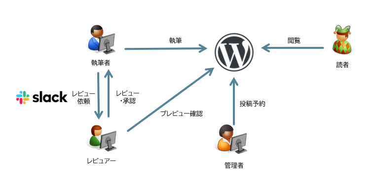
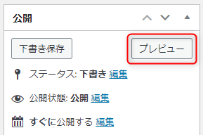

**WordPress で運営していた自社ブログを Gatsby.js で静的サイトに移行**した話です。

WordPress から別システムへの移行を検討している方や Gatsby の導入を検討している方の参考になれば幸いです。

長くなりましたので何回かに分けてお送りします。

まず WordPress からの脱却に際し、移行先と運用を検討しましたのでその過程を紹介します。

## この記事がおすすめの人とそうでない人

この移行は特に下記のような前提の場合に役に立つかもしれません。

- WordPress によるサイト管理に疲れている
- 記事を *Markdown* で書きたい
- 執筆する人が *GitHub ユーザー*
- 記事を公開前に*レビュー*する文化がある

逆に下記のような場合はおすすめしません。

- WordPress バンザイ
- Markdown???
- 執筆者が非エンジニア（Git に慣れていない）
- 管理者が非エンジニア（React ってなに？おいしいの？）

## ブログサイトに関係する人のロール

さて、普段あまり意識することはないのですが、ブログサイトのユーザーにはいくつかの「**ロール（役割）**」が存在します。

- *読者*  
  記事を読んだり、検索したり、シェアしたりするブログサイトの主役です。今まさにこれを読んでくださっているあなたです。
- *執筆者*  
  記事を書く人です。当サイトの場合、基本的には社内のメンバーですが、社外メンバーの場合もあり得ます。
- *レビュアー*  
  執筆者が書いた記事をレビューする人です。当サイトの場合は社内のメンバーです。
- *管理者*  
  サイトを立ち上げた人、システムを管理する人です。当サイトの場合、社内の数名のメンバーです。

当ブログではこの 4 つのロールを前提に検討しました。個人ブログでは「管理者」＝「執筆者」＝「レビュアー」でしょうし、大規模なサイトではさらに「編集者」や「イラストレーター」も存在するかもしれません。

また、いずれもロールであってもサイトの「ユーザー」には変わりありませんので、本連載では「ブログサイトに関係する人」全体を「**ユーザー**」と呼ぶことにします。

## 従来の運用

まず更新前の WordPress による運用は下記のようにしていました。

1. 執筆者が記事を執筆
2. 書き終わったらレビュアーに Slack でレビュー依頼
3. レビュアーがプレビューを確認しながら記事をレビュー
4. レビューが終われば承認の旨を執筆者に連絡
5. レビューが終わった記事を管理者が投稿予約
6. 予約日時に公開 → 読者が記事を閲覧

コミュニケーションのために Slack が登場する以外は WordPress だけで完結しており、構成としてはわかりやすいものでした。

## WordPress の憂鬱

*WordPress は高機能な CMS* で、プラグインやノウハウも充実しており、レンタルサーバーなどでは標準機能でインストールできたりするので、「始めやすさ」では随一だと思います。長い歴史があり、私個人もまだいくつかのサイトでお世話になっています。

ただ、「高機能な CMS だ」というのはあくまで「管理者」にとっての関心事であり、肝心の「読者」にとっては何の関係もないことです。読者にとっては、*欲しい情報（ページ）をすぐに（高速に）入手できる*ことだけが唯一の関心事であり、 CMS 自体の機能性はまったく関係がありません。

そして、その速度という点において、サーバーサイドで動的にページを組み立てる *WordPress (PHP) は絶対的に不利*です。また、「管理者」の立場にあっても WordPress の高機能性はそのまま管理の複雑さ、面倒くささに直結します。

今回は **WordPress を脱却することを前提に、まずユーザーのロールごとに WordPress のどこがイマイチなのかを考えました**。

- 読者
    - 重い
    - 遅い
- 執筆者
    - ログインが面倒
    - Gutenberg エディターがイケてない
    - Markdown 機能がイケてない
    - 編集にインターネット環境が必要
    - 画像アップロードが面倒
    - 画像リサイズや最適化が面倒
    - レビュー依頼が面倒
- レビュアー
    - ログインが面倒
    - 下書きのプレビューが面倒
    - 指摘箇所を明示しづらい
- 管理者
    - 執筆者が誤って公開してしまう可能性がある
    - バックアップが面倒
    - セキュリティアップデートが面倒
    - データベースを管理したくない

たまたま私自身がすべてのロールに当てはまるユーザーであったため、ここはストレスに感じている部分を吐き出せばよいだけでした😂

## UX を改善するために

さて、これらのストレスを解消するためにはどうすればよいのか。イマイチさを整理して、いくつかに分類してみます。

- *速度問題*（最優先事項）
- *ログイン問題*（読者以外はなにをするにもログインが必要）
- *執筆問題*（Markdown での編集,　画像の最適化・アップロード・挿入など）
- *レビュー問題*（公開前のプレビューが容易に表示できない、レビューが面倒）
- *ワークフロー問題*（執筆 → レビュー → 編集 → 承認 → リリース といったしくみがない）
- *管理問題*（バックアップ、セキュリティアップデート、データベース等）

これらを **1 つずつ改善していくことで、読者だけでなく、執筆者やレビュアーの UX （ユーザーエクスペリエンス）も改善する**のが今回の目的です。

### 速度問題

まず、ブログにおいて読者の UX に直結する「*速度*」はなにより優先して考えるべき問題です。

速度にもいくつかの尺度があります。検索ページなどからの流入がほとんどであれば「待たされる」時間が TTFB（最初の応答が返るまでの時間）の低減が優先でしょうか。

*ネットワーク遅延低減*のために「速い DNS サーバーを使う」「近い Web サーバーを使う」、*動的コンテンツ生成時間低減*のために「処理速度の高い Web サーバーを使う」などが挙げられます。

前者はどんな環境でも重要ですが、後者については「そもそもコンテンツ生成を動的にしない」という手法が選択できます。古典的に HTML だけを返せばよいわけです。要するに [阿部寛さん](http://abehiroshi.la.coocan.jp/) のページです。

しかし現代のサイトは阿部さんのサイトのようにシンプルではなく、 HTML を人間が都度作成するというのも現実的ではありません。
そこで **「HTML を生成する」という古典的なことを機械的に実現するのが、「静的サイトジェネレーター (SSG; Static Site Generator)」** です。

本記事をお読みの方に SSG の説明は不要と思いますので割愛しますが、当サイトではタイトルのとおり **SSG として Gatsby.js を採用**しました。

ページロード時間（読み込みが完了するまでの時間）について、コンテンツサイズを小さくするという課題もありますが、これは記事ごとの画像などに依存するところが大きいため、サイト全体としては後で考えます。

### ログイン問題

**WordPress にはログインが必要**です。これは「公開記事を読む」という以外の操作では必須です。

権限の必要な管理操作をするのに認証が必要なのはしかたないのですが、記事を書いたり、レビューしたりするたびにログインするというのは、やはり面倒です。

当サイトでは WordPress のログインを Google アカウントでの認証にしていましたので、ボタンをポチッと押すだけだったのですが、個人的にはそれすらも面倒に感じていました。

*ユーザーのアイデンティティ（そのユーザーが本当に誰であるか）は確保しつつ、なるべくシームレスに利用できる*というのが理想です。

弊社はソースコードやドキュメント管理のプラットフォームとして GitHub を長年利用しています。 GitHub なしの業務は考えにくいので、*少なくとも GitHub には常にログインしていることが保証されている*わけです。

これを利用しない手はありません。というわけで GitHub を認証のベースとすることを第一の候補にしました。

### 執筆問題

執筆にかかるストレスは記事を書く頻度や質にも影響します。**執筆体験を向上させることは良質なコンテンツを多く生む**ためにも検討すべき課題です。

CMS のエディターは必ずしも編集効率がいいとは言えません。 WordPress でいえば v5 系から導入された Gutenburg エディターは、初めてブログを始める人にはとっつきやすいのかもしれませんが、ちょっとおせっかいが過ぎます。

個人的には絶望的に使いにくくなったと思いますし、 [Gutenburg プラグインの「評価」](https://ja.wordpress.org/plugins/gutenberg/) の 2.1 を見れば、主観的な意見でもないことがわかります。

弊社は v5 系にアップデートした後も [Classic Editor プラグイン](https://ja.wordpress.org/plugins/classic-editor/) （こちらは高評価）と [Jetpack](https://ja.wordpress.org/plugins/jetpack/) の機能を併用して Markdown で記事を書き続けてきました。

しかし Jetpack の Markdown 機能も満足できるものではなく、下記のような仕様もあって、執筆者としても管理者としても少々困ったものでした。

- Markdown の仕様が GitHub っぽくない (GitHub Flavored Markdown ではない)
- データベースに保存されるコードブロックの HTML エンティティがエンコードされる (post_content_filtered)

Classic Editor を使っても編集画面のスクロールには不具合があり、執筆中の改行でスクロールがなぜかジャンプしてしまったり、それなりにストレスフルな執筆環境でした。

そもそも WordPress は HTML を直接編集する CMS がベースであり、 Markdown で書こうというのが後付けなのですから、ある程度はやむを得ない部分です。

であれば、**最初から Markdown で書けばいいじゃん**、というのが当然の帰結であり、最近の CMS やブログサービスは Markdown が標準になっているものも多いですね。

では WordPress ではなく、どの CMS を使うのか、ということになります。 1 つは *Qiita や Zenn のような既存のコミュニティサイトを活用する*ことが考えられますが、弊社の場合、自社メディアとして運用したいという前提がありますので、選択肢から外れました。

ヘッドレス CMS である Contentful などを導入することも検討しましたが、よく考えれば「CMS を開く」という動作も、「記事を書く」という目的だけを考えると、余計なアクションに思えます。

ということで **「記事を書く」ということに追加のツールはいらないんじゃないか**ということに思い至りました🙂

Markdown は普段から使っている VS Code で快適に書くことができますし、 Git ならバージョン管理も容易です。当ブログの場合は*執筆者全員が Git を使い慣れている*というアドバンテージもあります。これなら PC さえあればインターネット接続なしに「記事を書き始める」こともできますし、とりあえず VS Code を開いてメモっておけば、それが記事になります。

「スマホから書けない」というデメリットはありますが、いずれにしろスマホからの入力効率は PC には遠くおよびませんし、当サイトの執筆メンバーでスマホから書いている人はゼロのようです。思いついたコトについてはノートアプリにメモっておいて、 PC で書けばいいでしょう。

さらに GitHub では Codespaces が利用できるため *VS Code をインストールしなくても編集できる* というメリットもあります。

- [「便利すぎる」─ GitHubから直接「Visual Studio Code」を起動できる新機能が話題に - ITmedia NEWS](https://www.itmedia.co.jp/news/articles/2108/12/news145.html)

ということで、「**Markdown をファイルで Git 管理する**」という前提に相成りました。執筆には記事内で使用する「画像」の問題も含まれますが、この点については後続の記事で触れます。

### レビュー問題

先述のとおり、弊社では執筆後にレビュアーがレビュー・コメント・訂正依頼をして、公開までに記事をブラッシュアップするようにしています。

このとき重要なのが、プレビュー機能です。**レビュアーがなるべく読者目線で記事を読むためにも Markdown 状態のものより、実際のサイトに公開されるイメージで見えるのが理想**なわけです。

WordPress には標準でプレビュー機能が備わっていますが、基本的にはログイン後、編集画面からプレビューを開く必要があります。

これはレビュアーもログインを必要とし、確認するのに数ステップかかることを意味します。

弊社の場合、レビュアーは専属の人間がいるわけではなく、各メンバーが半ばボランティアのような形でレビューにあたっています。本来の業務ではありませんので、レビューが面倒だとどうしても後回しになりがちです。

ログインなしでプレビューできる [Public Post Preview プラグイン](https://ja.wordpress.org/plugins/public-post-preview/) を導入してたものの、既定では 48 時間で URL が期限切れになり、結局表示できないということが多くありました。

また、レビュー効率を考えると、*レビュアーがいかに簡単に修正箇所を指摘し、執筆者にフィードバックできるか*も重要です。これまでは Slack ベースで投げられたレビュー依頼に対し、 Slack のスレッドで本文を引用して指摘や修正依頼をしていました。しかし、同じ表現が複数箇所にでてくる場合など該当部分がわかりづらかったり、そもそも引用が面倒だったりといった煩雑さがありました。

弊社では普段、ソースコードやドキュメントのレビューは、 GitHub の Pull Request 機能を利用しています。 *Pull Request のレビュー機能は、レビュアーが対象行を明示してコメントしたり、修正案を提示したりできます*。提示された案で問題なければ、執筆者が GitHub 上でそのまま取り込めます。

実際に社内でドキュメント管理に利用しているため、文章の校閲にも便利に使えることは証明済みでした。

ということで、レビューについては「**GitHub の Pull Request を利用できる形にする**」ということを前提で考えることにしました。

### ワークフロー問題

先述のとおり、当ブログには *執筆 → レビュー → 編集 → 承認 → リリース といったワークフロー*があります。

WordPress にも「レビュー待ち」などのステータスはあるのですが、投稿者の権限を制限してしまうといろいろと不便なため、結局は「運用で」ワークフローを回していました。

しかし投稿者や管理者が公開スケジュール前に誤って公開する（何度かやらかしました）など、致命的ではないものの、ルール化だけでは厳しい部分がありました。

前項までの検討を振り返ってみると、実は「執筆 → レビュー → 編集 → 承認」までのワークフローを満たしていることに気付きました。

言うまでもなく、残る **「リリース」についても Pull Request のマージによって実現できますの**で、すべてのワークフローが GitHub 上で完結できると考えました。

### 管理問題

最後に、サイト管理者だけの問題ですが、一番やっかいな管理系の課題です。

#### セキュリティ

まず筆頭問題児の*セキュリティについては、主に WordPress 自身とプラグインの脆弱性が原因*です。脆弱性やバグはプログラムである以上、しかたがないことですが、アップデートするのも前後での不具合確認などを含めると、それなりの手間がかかります。

最近ではある程度、自動でアップデートされるので手間は軽減されましたが、ゼロデイ攻撃なども考えられますし、アップデートだけでセキュリティが担保されているのかを量ることができません。サイトが破壊されるだけならまだしも、 XSS や DDoS 攻撃の踏み台となって、人様に迷惑をかけることだけは避けなければなりません。

ということでこの問題に対する一番の解決策は、言わずもがな **「WordPress を使わない」**、もっと言えば **「サーバー側プログラムを使わない」** ということに尽きます。幸い、ここまで検討してきた内容で WordPress （＝サーバー側プログラム）は不要になりますので、セキュリティ脆弱性についてはほぼ心配がなくなるということになります。

※ただし「コメント」機能に関しては、別途検討が必要です。

#### バックアップ

最後に**バックアップ**については、これまで [BackWPup](https://ja.wordpress.org/plugins/backwpup/) プラグインを利用してきました。データベースとファイル一式のバックアップを自動で取得してくれる優秀なプラグインです。

「バックアップをどうやって取るか」はこのプラグインが担ってくれますが、「バックアップしたものを**どこに保存するか**」問題は常について回ります。同じサーバー上に置いておけばリストアは便利ですが、サーバー障害の際に全データを失うことになります。現実的な選択肢として社内サーバーへダウンロードしてくる、という方法をとっていましたが、これも社内サーバーの障害によりロストする可能性がゼロではありません。

今回、*記事を Git と GitHub で管理する*という前提にしたことで、このバックアップ問題は自動的にほぼ解消しました。なぜなら、**記事を Git 管理とすることで、各執筆者の手元（ローカル）には自動的に全記事のクローンがバックアップされる**ことになるからです。

弊社の場合、さらに GitHub のリポジトリを定期的にバックアップするしくみを運用していますので、強力なバックアップ構成がほぼ手間をかけず実現できることになります。

余談ですが GitHub の場合、公開リポジトリであれば [GitHub Archive Program](https://github.blog/jp/2020-07-20-github-archive-program-the-journey-of-the-worlds-open-source-code-to-the-arctic/) により、北極圏にまで運ばれて 1000 年間保存されます🔒

まぁバックアップとしては使えないにしても、自分たちの書いた記事が 1000 年間残るというのは人類の歴史にちょっとだけでも貢献できている気になれるのではないでしょうか👍

## 補足機能

あともう少し WordPress には存在した運用に必要な機能があります。

### 下書き機能

ブログで「**下書き**」というのはけっこう重要です。とりあえず思いついたことを書き留めておいたり、推敲前の文章を置いておいたり、することが記事の卵になります。実際、当社の WordPress でも下書き状態の記事が多くありました。

今回の検討により、記事は Git/GitHub 管理になったため、 **「下書き」という状態は「Pull Request 発行前」** と見なすことができます。

手元のブランチで置いておいてもいいですし、プッシュしておいても問題ありません。メインブランチは保護しておけばいいので、誤って公開してしまうリスクもゼロになります。

というわけで「下書き」機能も、特になにもせずに実現できました👏

### 予約投稿

あとは**予約機能**です。弊社では待機記事の数に応じて、月・水・金もしくは火・木の正午に記事をリリースするようにしていました。

ただし予約自体は管理者が手動で行っていたため、誤って前月の日付を指定して即時公開してしまったり、レビュー済みを見落として予約されないまま残っていたり、といったヒューマンエラーがありました。

*予約機能については GitHub の機能での解決は難しいため、 GitHub Actions を用いて解決する*ことにしました。この点についてはまた後続の記事で紹介します。

## まとめ

長くなりましたが、この運用検討は継続したブログ運営のためにはとても重要だったため、気合いをいれて検討しました。

次の記事ではコンテンツについて検討をまとめるつもりです。
