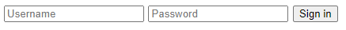
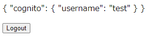

**Nuxt.js で AWS Cognito のユーザープールのアカウントで認証を実装**する方法を紹介します。本稿は2021年5月時点の情報です。

## 概要

- 所要時間: 約15分
- 対象:
    - Nuxt を使ったアプリ開発をしたことがある方
    - AWS Cognito でユーザープールを作成したことがある方
    - AWS CLI でアカウント設定済み

### 環境

- Windows 10 Pro
- Node.js 14.16.0
- [nuxt](https://ja.nuxtjs.org/) 2.15.4
- [@nuxtjs/auth-next](https://auth.nuxtjs.org/) 5.0.0
- [@a1ter/nuxt-auth-aws-cognito-scheme](https://www.npmjs.com/package/@a1ter/nuxt-auth-aws-cognito-scheme) 0.0.12

### nuxt/auth について

**nuxt/auth** には旧バージョンの @nuxtjs/auth と新バージョンの **@nuxtjs/auth-next** があります。

[現行の公式ドキュメント](https://auth.nuxtjs.org/)はすべて後者の @nuxtjs/auth-next を対象としたものになっていますが、ネット上の情報は旧バージョンの方が多く、特にストラテジ設定の周辺が変わっているので、ややこしいです。

今回は新バージョンの **@nuxtjs/auth-next** をベースにしています。

また、**nuxt auth はデフォルトでは Cognito に対応していない**ため、スキーマを自作するか、適当なパッケージを利用する必要があります。

「nuxt auth cognito」などで検索すると [@sirdiego/nuxt-auth-cognito-scheme](https://www.npmjs.com/package/@sirdiego/nuxt-auth-cognito-scheme) というスキーマが引っかかりますが、こちらは旧バージョン用なのでそのまま利用することはできません。

今回は **[@a1ter/nuxt-auth-aws-cognito-scheme](https://www.npmjs.com/package/@a1ter/nuxt-auth-aws-cognito-scheme)** を利用させていただきました。

認証系なので念のためソースコードも確認しましたが、内部的に Cognito の認証ライブラリである amplify/auth を使っているシンプルな構成なので、あまり問題はなさそうです。

## AWS Cognito ユーザープールの作成

先に認証に使う **Cognito のユーザープールを作成**します。

Cognito のコンソールの [ユーザープールを作成する] を選び、適当なユーザープール名を入力して「デフォルトを確認する」を選びます。ここでは名前を `NuxtAuthUserPool` としました。


属性の設定の編集ボタンを押します。


サインイン方法の設定で**ユーザー名（任意のユーザー名）**にチェックを入れておきます。


下記のようになっていればとりあえず OK でしょう。


次にアプリクライアントの設定で「アプリクライアントの追加」を選びます。


クライアント名も適当に設定し、 **「クライアントシークレットの生成」からチェックを外して**おきます。


上記を設定して、保存するとユーザープールが作成されます。

### アプリクライアントの設定

左メニューの「アプリの統合」から「アプリクライアントの設定」を選びます。

「有効な ID プロバイダ」で「**Cognito User Pool**」を選び、「コールバック URL」には **`http://localhost:3000`** を入れておきます。

**OAuth のフローは `Implicit grant`、スコープは `email openid profile`** として保存します。このあたりは必要に応じて設定してください。


今回の例ではドメインの設定は不要です。

### 接続情報の確認

あとで環境変数に設定するために必要なパラメーターを確認しておきます。

- **リージョン**: Cognito を作成した AWS のリージョン
- **ユーザープールID**: ユーザープールの「全体設定」にある「プールID」
- **クライアントID**: 「全体設定」→「アプリクライアント」で確認できる「アプリクライアントID」

### ユーザーの作成とコンファーム

AWS CLI でテスト用の**ユーザーを Coginito に作成**します。コンソールからも行えますが、アカウントのコンファームができず、どのみち CLI を使うため、作成から CLI で行いました。

今回は管理者権限でユーザーを作成しますので、 `admin-create-user` でユーザーを作り、 `admin-set-user-password` でステータスを CONFIRMED にします。

```
$ aws cognito-idp admin-create-user --region <リージョン> --user-pool-id <ユーザープールID> --username <ユーザー名>
{
    "User": {
        "Username": "<ユーザー名>",
        "Attributes": [
            {
                "Name": "sub",
                "Value": "<ユーザーのGUID>"
            }
        ],
        "UserCreateDate": "2021-05-04T09:07:09.481000+09:00",
        "UserLastModifiedDate": "2021-05-04T09:07:09.481000+09:00",
        "Enabled": true,
        "UserStatus": "FORCE_CHANGE_PASSWORD"
    }
}

$ aws cognito-idp admin-set-user-password --region <リージョン> --user-pool-id <ユーザープールID> --username <ユーザー名> --password <パスワード> --permanent

$ aws cognito-idp admin-get-user --region <リージョン> --user-pool-id <ユーザープールID> --username <ユーザー名>
{
    "Username": "<ユーザー名>",
    "UserAttributes": [
        {
            "Name": "sub",
            "Value": "<ユーザーのGUID>"
        }
    ],
    "UserCreateDate": "2021-05-04T09:07:09.481000+09:00",
    "UserLastModifiedDate": "2021-05-04T09:08:04.723000+09:00",
    "Enabled": true,
    "UserStatus": "CONFIRMED"
}
```

## Nuxt のセットアップ

Nuxt については [create-nuxt-app](https://ja.nuxtjs.org/docs/2.x/get-started/installation/#create-nuxt-app-%E3%82%92%E4%BD%BF%E3%81%86) でもよいですし、[スクラッチから](https://ja.nuxtjs.org/docs/2.x/get-started/installation/#%E3%82%B9%E3%82%AF%E3%83%A9%E3%83%83%E3%83%81%E3%81%A7%E5%A7%8B%E3%82%81%E3%82%8B)でもかまいませんので、適当なプロジェクトを作ってインストールしておきます。

個人的にはスクラッチからインストールするほうが好みです。

- [インストール - NuxtJS](https://ja.nuxtjs.org/docs/2.x/get-started/installation/)

ここで `package.json` が下記の状態とします。

```js
{
  "name": "nuxt-auth-cognito",
  "dependencies": {
    "nuxt": "^2.15.4"
  },
  "scripts": {
    "dev": "nuxt",
    "build": "nuxt build",
    "generate": "nuxt generate",
    "start": "nuxt start"
  }
}
```

### vue ファイルの準備

とりあえずデモのため、 `pages` ディレクトリに簡単な `index.vue` と `login.vue` を準備します。

`pages/index.vue`

```
<template>
  <div>
    <p>{{ $auth.user }}</p>
    <button @click.prevent="$auth.logout()">Logout</button>
  </div>
</template>
```

`pages/login.vue`

```
<template>
  <form>
    <input type="text" v-model="username" placeholder="Username" required autofocus>
    <input type="password" v-model="password" placeholder="Password" required>
    <button @click.prevent="signIn">Sign in</button>
  </form>
</template>
```

### Vuex の有効化

Vuex を有効にするため **`store` ディレクトリを作成し、空の `index.js` を作成**しておきます。

```
$ mkdir store
$ touch store/index.js
```

- [ストア - NuxtJS](https://ja.nuxtjs.org/docs/2.x/directory-structure/store/)

## nuxt auth のセットアップ

[Setup - nuxt auth docs](https://auth.nuxtjs.org/guide/setup) に従い、 nuxt/auth をインストールします。

```
$ yarn add @nuxtjs/axios
$ yarn add --exact @nuxtjs/auth-next
```

### @a1ter/nuxt-auth-aws-cognito-scheme のインストール

nuxt auth はデフォルトでは Cognito に対応していないため、 @a1ter/nuxt-auth-aws-cognito-scheme をインストールします。

```
$ yarn add @a1ter/nuxt-auth-aws-cognito-scheme
```

### nuxt.config.js の作成

まだ存在しない場合は `nuxt.config.js` に下記のように記述します。

```js
{
  ssr: false,
  target: 'static',
  modules: [
    '@nuxtjs/axios',
    '@nuxtjs/auth-next',
  ],
  router: {
    middleware: ['auth'],
  },
  auth: {
    redirect: {
      login: '/login',
      logout: '/login',
      callback: '/callback',
      home: '/',
    },
    strategies: {
      cognito: {
        scheme: '@a1ter/nuxt-auth-aws-cognito-scheme/scheme/scheme',
        credentials: {
          userPoolId: process.env.COGNITO_USER_POOL_ID,
          userPoolWebClientId: process.env.COGNITO_CLIENT_ID,
          region: process.env.COGNITO_REGION
        },
        endpoints: {
          user: false,
        },
      },
    },
  },
}
```

今回は SPA を想定しますので、 `ssr: false`, `target: 'static'` とします。

modules に axios と auth-next を追加、 router の middleware に `auth` を指定することで全てのページで auth モジュールを有効にします。

auth モジュールの設定は `auth` に記述します。 `redirect` はデフォルトのままでも動作しますので、定義しなくてもかまいません。

`strategies` に認証ストラテジを指定します。今回は前述のパッケージを用いて AWS Cognito で認証を行うため、上記のように指定します。 Cognito に関する設定は環境変数経由で渡します。

- [Schemes - nuxt auth docs](https://auth.nuxtjs.org/guide/scheme#creating-your-own-scheme)

### .env の設定

`.env` に `nuxt.config.js` で使われる環境変数を定義します。

```
COGNITO_USER_POOL_ID=<ユーザープールID>
COGNITO_CLIENT_ID=<クライアントID>
COGNITO_REGION=<リージョン>
```

## ログインの実装

ログインを実装します。

`pages/login.vue`

```
<script>
export default {
  data() {
    return {
      username: '',
      password: '',
    }
  },
  methods: {
    async signIn() {
      try {
        const { username, password } = this
        await this.$auth.loginWith('cognito', {
          data: {
            username,
            password,
          }
        })
      } catch (error) {
        console.error(error)
      }
    }
  }
}
</script>
```

- [Schemes - nuxt auth docs](https://auth.nuxtjs.org/guide/scheme#creating-your-own-scheme)

基本的には `this.$auth.loginWith()` を実行するだけです。

第1引数のストラテジ名は `nuxt.config.js` のスキーマで指定した名称を、第2引数 (`options`) の `data` にユーザー名とパスワードを渡します。

`loginWith` は Promise を返すので、 async/await で待機させ、エラー処理には try-catch を使います。

## 動作確認

ここまでできたら動作するはずなので **`yarn dev` して起動**します。

`.nuxt` ディレクトリが生成され、 `i Listening on: http://localhost:3000/` と表示されたら、 **`http://localhost:3000/` にアクセス**します。

自動的に `/login` にリダイレクトされるはずなので、ユーザー名とパスワードを入力して Sign in ボタンを押します。



成功するとホーム (`/`) にジャンプするはずです。図のように `$auth.user` の中身が表示されていれば OK です。



Vuex によって Local Storage にトークンなどが保存されます。


ここで Logout を押すと Vuex のログイン情報がクリアされ、ログイン画面にリダイレクトされます。


## まとめ

2021年5月時点で最新の **Nuxt.js と nuxt/auth を使って Cognito のユーザープールのアカウントでログインを実装**する方法を紹介しました。

事前準備も多く、まだまだ「簡単に」とはいかない印象ですが、ひとまず認証を Cognito に委任できるだけで認証用のユーザーストアをアプリ側に保持する必要がなくなるため、サーバーレスの第一歩としてはとても有用だと思います。
