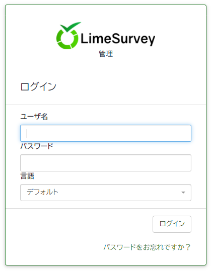
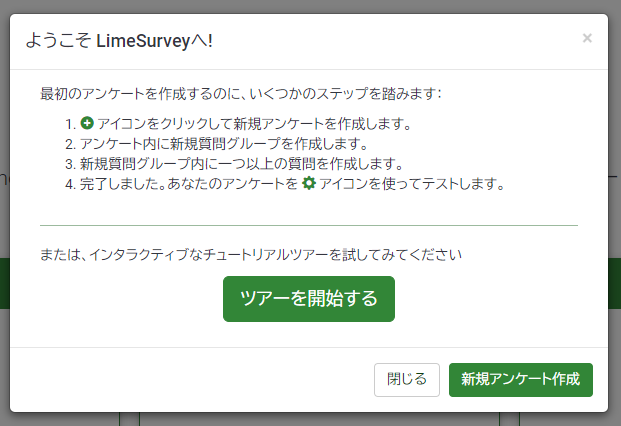

オープンソースのアンケートシステムである **LimeSurvey** 、カスタムなしでも結構融通が利くので弊社でも利用しています。

さて、今回は **LimeSurvey のデータベースを新しいデータベースに変更した後、プログラムはそのままで LimeSurvey を再セットアップ**する手順を紹介します。

LimeSurvey を初期化して使う場合にも使用できます。

## 環境

- PHP 7.4.13
- MySQL 5.7 (変更前、変更後とも)
- LimeSurvey 3.17.9+190731

※変更後のデータベースはテーブルが存在しない空の状態を想定しています。

すでに動作しているデータベースを初期化する場合は既存のテーブルをすべて削除すれば OK です。

## データベース情報の変更

言わずもがな **LimeSurvey のデータベース接続情報は `application/config/config.php`** に書かれています。

```php
return array(
	'components' => array(
		'db' => array(
			'connectionString' => 'mysql:host=サーバー名;port=3306;dbname=データベース名;',
			'emulatePrepare' => true,
			'username' => 'ユーザー名',
			'password' => 'パスワード',
			'charset' => 'utf8mb4',
			'tablePrefix' => 'lime_',
		),
```

接続するデータベースを変更する場合は、この部分を新しい接続情報に書き換えます。

書き換えた時点で LimeSurvey は設定テーブルが読み込めなくなるので `table settings_global not found in database` ようなエラーを吐くようになります。

## 再インストール

新しいデータベースにテーブルを再構築して、利用できるようにします。残念ながら GUI からはできないので、 CLI を利用します。

**CLI は `application/commands` 下にある `console.php`** を使います。管理者のアカウントを作成するための情報を引数で渡します。

コマンドの構文は `php console.php install <Admin のユーザー名> <Admin のパスワード> <Admin のフルネーム> <Admin のメールアドレス>` です。

```bash
$ cd 
$ php console.php install admin Password123 Admin admin@sample.com
$
```

エラーがなければ特に出力もなく初期化が完了します。

`http://limesurvey のアドレス/index.php/admin` にアクセスするとログイン画面が表示されるはずです。先ほど設定したアカウントでログインします。



初回のログイン時は少し時間がかかります。ログイン後、ようこそ画面が表示されれば完了です。



## 参考

- [Installation using a command line interface (CLI) - LimeSurvey Manual](https://manual.limesurvey.org/Installation_using_a_command_line_interface_(CLI)?_ga=2.72314320.278808320.1612238925-313515135.1612238925)
