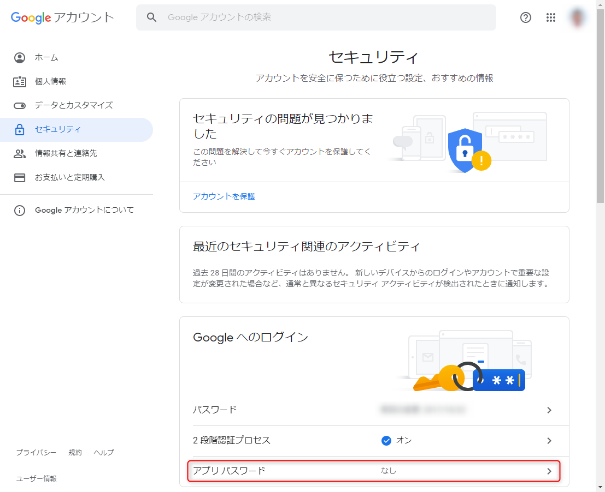
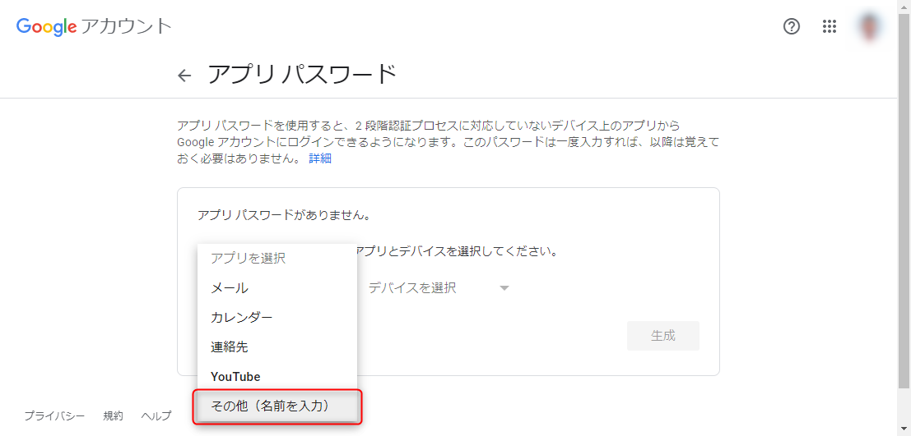
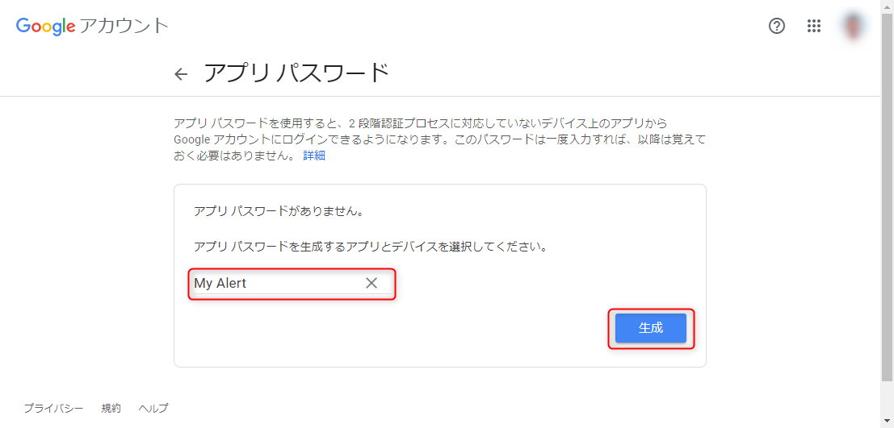
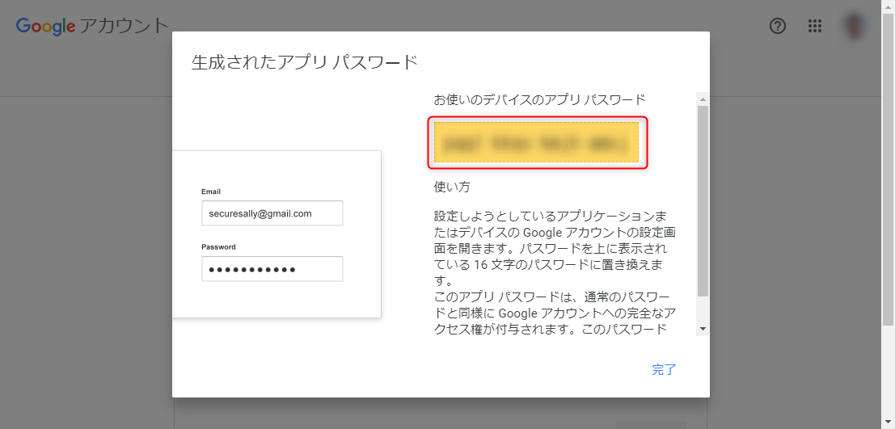
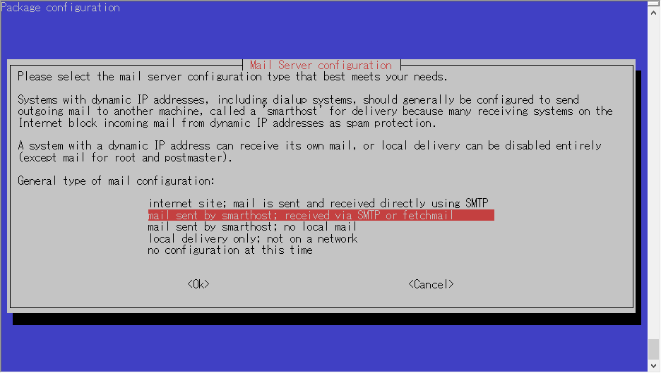

**Raspberry Pi からメールアラートを飛ばしたかったので、 mail コマンドでメールが送信できるよう設定**を行いました。

が、 ssmtp と mailutils でやっても一向にうまくいかなかったため、少々ハマりました。

下記の記事が大変助けになりました。というかほぼそのままです。ありがとうございます。

- [RaspberryPi でメール送信しようとしたら GMail + sSMTP でハマった件 - Qiita](https://qiita.com/Kazuya_Murakami/items/bc520430fc1efdd0d118)

## 環境

- Raspberry Pi 3
- Raspberry Pi OS (32-bit)
- ホスト名: raspberrypi

下記の過去記事の手順でインストールした状態です。

- [Raspberry Pi Imager を使って Raspberry Pi OS をインストールする (ヘッドレスインストール対応 2020年6月版)](https://mseeeen.msen.jp/install-raspberry-pi-os-with-raspberry-pi-imager/)

**メールサーバーは Gmail** を利用します。**Google (Gmail) アカウントは2段階認証設定済み**を前提とします。

## Google のアプリパスワードの発行

**Google にログインした状態で [セキュリティ設定](https://myaccount.google.com/security) を開き、 [アプリ パスワード]** を選択します。

<a href="images/send-mail-via-smtp-with-exim4-on-raspberry-pi-1.png"></a>

**[アプリを選択] で「その他」**を選択し、適当なアプリ名を入力して **[生成]** を押します。今回は "My Alert" としました。

<a href="images/send-mail-via-smtp-with-exim4-on-raspberry-pi-2.png"></a>

<a href="images/send-mail-via-smtp-with-exim4-on-raspberry-pi-3.png"></a>

**16 文字のアプリパスワードが生成**され、画面にが表示されます。これをアカウントのパスワードとして利用できます。

<a href="images/send-mail-via-smtp-with-exim4-on-raspberry-pi-4.png"></a>

<span style="color:red">当然ながら、**このパスワードによってアカウント情報にアクセスできるようになるため、取り扱いには注意**しましょう。同設定画面からいつでも削除できますので、不要になったアプリパスワードはすぐに削除しましょう。</span>

## インストールと設定

apt で **exim4 と mailutils をインストールし、 exim4 の設定**を開きます。

```
$ sudo apt install exim4 mailutils -y
$ sudo dpkg-reconfigure exim4-config
```

設定は図のようなダイアログ形式です。

<a href="images/send-mail-via-smtp-with-exim4-on-raspberry-pi-5.png"></a>

exim 4 では下記のように設定します。ご自分の環境に合わせて書き換えてください。

```
General type of mail configuration:
  mail sent by smarthost; received via SMTP or fetchmail

System mail name:
  raspberrypi.local (独自ドメインがあればそれを設定)

IP-addresses to listen on for incoming SMTP connections:
  127.0.0.1 ; ::1

Other destinations for which mail is accepted:
  raspberrypi.local

Machines to relay mail for:
  (未入力)

IP address or host name of the outgoing smarthost:
  smtp.gmail.com:587

Hide local mail name in outgoing mail?
  No

Keep number of DNS-queries minimal (Dial-on-Demand)?
  No

Delivery method for local mail:
  mbox format in /var/mail/

Split configuration into small files?
  No
```

次に **`/etc/exim4/passwd.client` に SMTP の認証用アカウントを設定**します。

Gmail の場合、下記の 3 種類を設定するとよいようです。 **`<メールアドレス>` には Gmail のアカウントを、 `<アプリ パスワード>` には冒頭で取得した 16 文字のアプリパスワード**を記述します。（3 種類とも同じアカウント、パスワードで OK です。）

```
$ sudo vi /etc/exim4/passwd.client

gmail-smtp.l.google.com:<メールアドレス>:<アプリ パスワード>
*.google.com:<メールアドレス>:<アプリ パスワード>
smtp.gmail.com:<メールアドレス>:<アプリ パスワード>
```

exim4 の設定を反映させます。

```
$ sudo update-exim4.conf
```

これでインストールと設定は完了です。

## 送信テスト

ちゃんと設定できていればこれでメールが送信できるはずです。

```
$ echo "Hello world!" | mail -s "Test Subject" your-email@example.com
```

