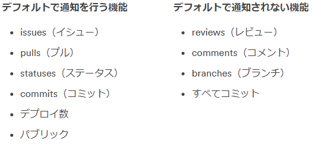
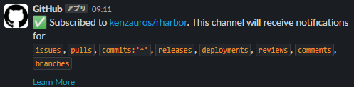
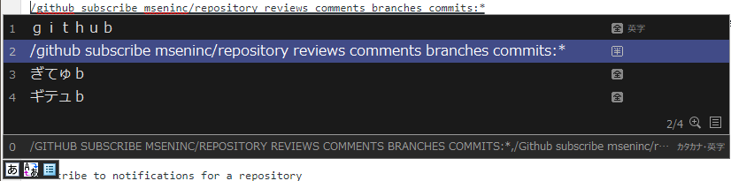

弊社では GitHub で起こったアクションはそれぞれ紐付いた Slack のチャンネルに通知がくるようにしています。

GitHub と Slack の連携は公式でも日本語で案内されていますが、正直使い方はわかりにくいです。

さらに最近 Slack の GitHub アプリが新しくなり、少し使い方が変わった部分がありますので、あらためてインストール方法と使い方をおさらいします。

## GitHub アプリのインストール

インストール作業は次のとおりです。

- [GitHub と Slack を連携させる | Slack](https://slack.com/intl/ja-jp/help/articles/232289568-GitHub-%E3%81%A8-Slack-%E3%82%92%E9%80%A3%E6%90%BA%E3%81%95%E3%81%9B%E3%82%8B)

1. https://slack.github.com/ から [Add to Slack] で Slack にアプリを追加
2. アクセス権限を確認して [Continue]

ちなみに公式の手順にはこのあと「3. アプリがアクセスできるチャンネルを選択」とありますが、私の環境ではこの手順はありませんでした。

さらに連携したい **Slack のチャンネルごとに `/invite @GitHub` を実行して GitHub アプリを追加**する必要があります。

## /github スラッシュコマンド

**実際に Slack のチャンネルに通知を飛ばすには `/github` スラッシュコマンドでリポジトリを購読する**必要があります。

Slack の適当なチャンネルか DM で **`/github help`** とタイプして Enter を押すと `/github` コマンドのヘルプが見られます。

### リポジトリ通知を購読する

**`/github subscribe owner/repository` がリポジトリを購読するコマンド**です。通知を受信したいチャンネルで実行します。

たとえば私 (@kenzauros) の rharbor というリポジトリであれば `/github subscribe kenzauros/rharbor` のようにします。

組織アカウントでも同様で、たとえば弊社のリポジトリであれば `/github subscribe mseninc/first-serverless-app-2021` のようになります。

### デフォルトの通知では不足な場合

ただ、 `subscribe` だけではプルリクに対するレビューやコメントが通知されません。弊社ではコミットの通知も出したいので、これでは不足です。



ということで `/github subscribe` にオプションをつける必要があります。オプションは下記のようになっています。

オプション | 説明 | デフォルト
-- | -- | --
`issues` | Issue のオープン/クローズ | 有効
`pulls` | Pull request のオープン/マージ/Ready for Review | 有効
`commits` | デフォルトブランチへのコミット | 有効
`releases` | リリースの公開 | 有効
`reviews` | Pull Request のレビュー | 無効
`comments` | Issue/Pull Request へのコメント | 無効
`branches` | ブランチの作成/削除 | 無効
`commits:*` | すべてのブランチへのコミット | 無効
`+label:"your label"` | `issues`, `pulls`, `comments` をラベルでフィルタリング | 無効

- [integrations/slack: Bring your code to the conversations you care about with the GitHub and Slack integration](https://github.com/integrations/slack#configuration)

というわけで**全部購読したい**のであれば下記のようなコマンドになります。

```
/github subscribe owner/repository reviews comments branches commits:*
```

下記のように応答が返ってくれば OK です。



正直リポジトリが多いと管理がめっちゃ面倒です。

私は毎回 Slack の検索で `subscribe` を検索して過去に打ったものを使い回していましたが、 IME の辞書にでも登録したほうが幸せになれるかもしれません。



## 旧 Github Notification との相違点

### 2回叩かなくてよくなった

前の GitHub Notifications は一度 `/github subscribe` コマンドを叩いたあと、再度 `reviews` などをつけて有効にする機能を追加する必要がありましたが、現在の GitHub アプリは一度で設定できるようになったようです。

### 全てのブランチへのコミット通知が commits:* になった

前の GitHub Notifications では **全てのブランチへのコミット通知** は `commits:all` でしたが、現行では `commits:*` になりました。

`all` というブランチがあったらどういう動作になっていたのか不明ですが、たしかにこのほうがいいですね。

<!--nextpage-->
## その他コマンドサンプル

`/github help` で表示できるコマンドについて、日本語で要約したものです。

### リポジトリ通知購読系

- リポジトリ通知を購読  
`/github subscribe owner/repository`
- 指定したオーナーのすべてのリポジトリ通知を購読  
`/github subscribe owner`
- プルリクのレビュー通知を含めてリポジトリ通知を購読  
`/github subscribe owner/repository reviews`
- 指定したパターンのブランチのコミット通知を含める  
`/github subscribe owner/repository commits:"mybranch/*"`
- `bug` ラベルのついた Issue, PR に関するコメントのみ通知  
`/github subscribe owner/repository +label:"bug"`
- チャンネル内の購読状況の一覧を表示  
`/github subscribe list`
- チャンネル内の購読状況の一覧を表示 (有効になっている機能の詳細も表示)  
`/github subscribe list features`
- リポジトリに関する通知の全購読 (本記事の内容)
`/github subscribe owner/repository reviews comments branches commits:*`

解除は subscribe を unsubscribe に変更するだけです。

### その他操作系

Slack で操作できてどこまで嬉しいかわかりませんが、一応 Issue の操作なんかもできます。

- Issue のクローズ  
`/github close [issue link]`
- Issue の再オープン  
`/github reopen [issue link]`
- 新しい Issue の作成  
`/github open owner/repository`
- チャンネル内で GitHub のプレビューをリッチに表示するかどうかの設定  
`/github settings`
- `/github` コマンドのヘルプ  
`/github help`


## まとめ

あらためて Slack の GitHub 連携の使い方を確認しました。通知にお困りの方に役立てば幸いです。
