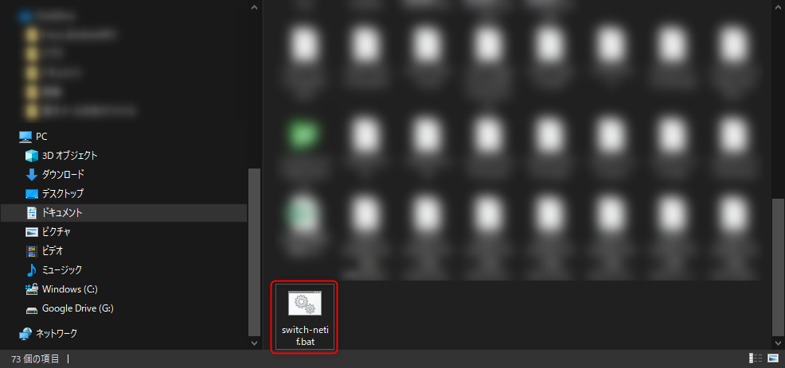
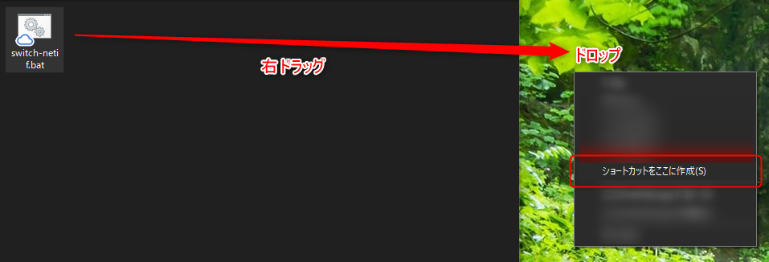
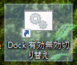
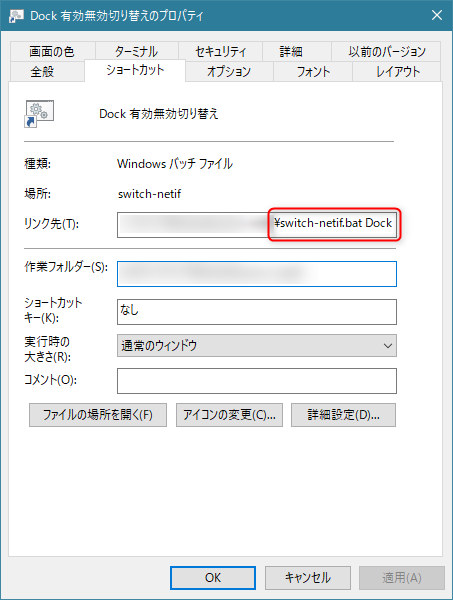
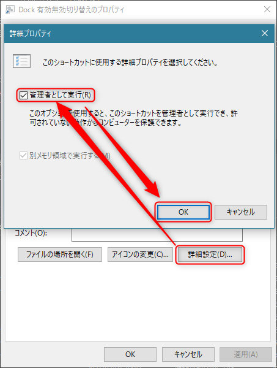
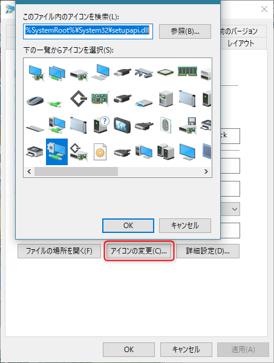
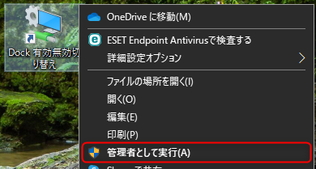
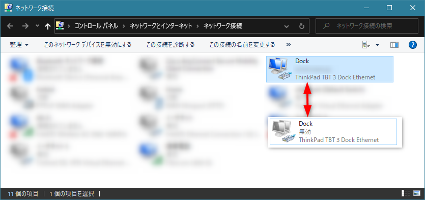

なんだかレガシーな感じの記事ですが、最近社内の DNS 事情のため、有線 LAN のネットワークアダプタの有効無効を切り替えることがよくあります。

まぁ、ネットワーク接続 (`ncpa.cpl`) で開いて、右クリックから「無効にする」あるいは「有効にする」を選ぶだけ、といえばだけなのですが、それすらも面倒なのが、職業病です。

ということで 1 工程でも減らすべく、**バッチファイルでネットワークアダプタの有効無効を切り替え**てみます。

## バッチファイルの作成

といっても難しいこともあまりないので、さくっといきましょう。

適当なフォルダに**新しいテキストファイルを作り**、`switch-netif.bat` とでも名付けます。名前はなんでもかまいません。拡張子を `.bat` にするのをお忘れなく。

<a href="images/switch-network-adapter-enabled-in-windows-with-batch-file-1.png"></a>

できたファイルを右クリックして「編集」などからエディタを開き、下記のソースをコピペして保存します。

```bat
@ECHO OFF
ECHO %~1
netsh interface show interface "%~1" | findstr "有効">%TEMP%\dock_interface_status.txt
set /P x=<%TEMP%\dock_interface_status.txt

IF "%x%" EQU "" (
  ECHO 有効化しています...
  netsh interface set interface "%~1" enabled
) ELSE (
  ECHO 無効化しています...
  netsh interface set interface "%~1" disabled
)
IF ERRORLEVEL 1 PAUSE
```

ソースコードは見てのとおり、 `netsh` コマンドを叩いていっているだけです。

1. `netsh interface show interface` で指定した名前のインターフェイスの情報を取得し、"有効" という文字列がある行を検索して一時ファイルに書き出し
2. 一時ファイルの内容を変数に格納
3. 変数の内容がなければ（無効なとき）有効化、変数の内容があれば（"有効" なとき）無効化する

処理は上記だけなので簡単ですね。言語設定が日本語でないときは `findstr` の検索文字列を `"Enabled"` とかに変える必要があるかもしれません。

このバッチファイルは **ネットワークアダプタの名前を引数として渡す** ようにしてあるので、ショートカットを作成して引数を渡すようにします。

## ショートカットの作成

さきほど作ったバッチファイルを **右** ドラッグして、デスクトップなどにドロップし、コンテキストメニューから **「ショートカットをここに作成」** を選択します。

<a href="images/switch-network-adapter-enabled-in-windows-with-batch-file-2.png"></a>

ショートカットができるので、また**ファイル名を好きなものに変更**します。今回は「Dock」という名前のネットワークアダプタを切り替えたいので、「Dock 有効無効切り替え」としました。

<a href="images/switch-network-adapter-enabled-in-windows-with-batch-file-3.png"></a>

ショートカットを右クリックしてプロパティを開き、**「リンク先」でバッチファイル名の後にスペースを空けてネットワークアダプタ名を追加**（ここでは `Dock`）します。

<a href="images/switch-network-adapter-enabled-in-windows-with-batch-file-4.png"></a>

ついでにその下の「詳細設定...」から詳細プロパティを開き、**「管理者として実行」**にチェックをいれておきます。
（ネットワークアダプタの切り替えには管理者権限が必要なため）

<a href="images/switch-network-adapter-enabled-in-windows-with-batch-file-5.png"></a>

さらについでに「アイコンの変更」からクリックしたくなるようなアイコンに変更しておきましょう（オプション）

アイコンリソースは `%SystemRoot%\System32\imageres.dll` や `%SystemRoot%\System32\setupapi.dll` あたりがおすすめです。

<a href="images/switch-network-adapter-enabled-in-windows-with-batch-file-6.png"></a>

作成したショートカットをダブルクリックするか、右クリックから **「管理者として実行」** を選んで実行します。

<a href="images/switch-network-adapter-enabled-in-windows-with-batch-file-7.png"></a>

UAC の確認が表示されますが、気にせず実行すればネットワークアダプタの有効・無効が切り替わるはずです。

<a href="images/switch-network-adapter-enabled-in-windows-with-batch-file-8.png"></a>

## 補足: ネットワークアダプタ名にスペースが含まれる場合

Windows なので (?) `イーサネット 4` のようにネットワークアダプタ名にスペースが含まれる場合があります。

この場合、単純にショートカットに `"イーサネット 4"` のように書いてもうまく引数が渡せず、動作しません。

**ネットワークアダプタ名にスペースが含まれる場合は cmd.exe の `/c` オプションで実行する**ように「リンク先」を書き換えてください。

```
cmd.exe /c C:\Softwares\switch-netif\switch-netif.bat "イーサネット 4"
```

誰かのお役に立てれば幸いです。