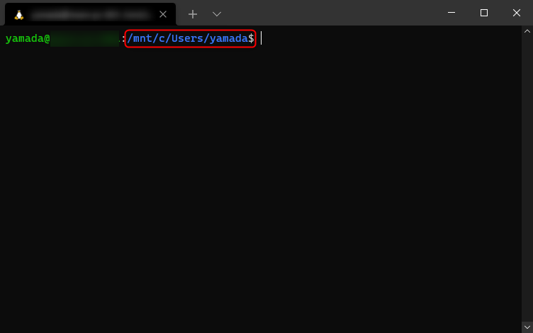
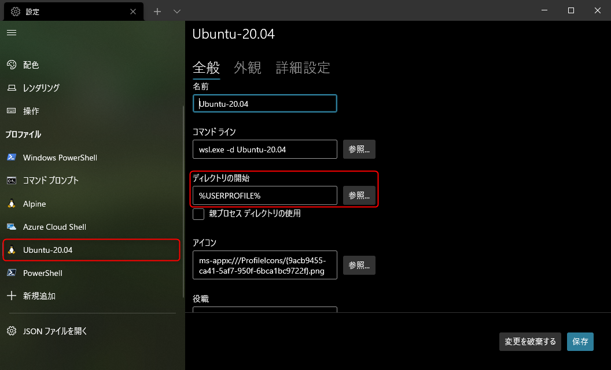
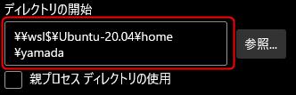
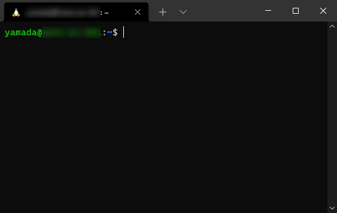

最近、 Web 系の開発では WSL 2 上の Ubuntu で作業することが多くなりました。ターミナルには **[Windows Terminal](https://github.com/microsoft/terminal)** を使っています。

ただ、 Windows Terminal で WSL のシェルを開くと**既定のディレクトリが `/mnt/c/Users/<ユーザー名>` になってしまうため、これをホームディレクトリ `~/` に変更**しました。

## 前提

この記事は下記の環境を想定しています。

- Windows 10 Pro 20H2
- Windows Terminal 1.8.1521.0
- Ubuntu 20.04 on WSL 2

## 概要

先に書いた通り、Windows Terminal で WSL のターミナルを開くと、下記のように既定のディレクトリが `/mnt/c/Users/<ユーザー名>` になってしまいます。

これは Windows 側の `C:\Users\<ユーザー名>` に相当します。

ただ、 Linux 上で作業するのであれば、あまり Windows のユーザーフォルダにいてもうれしくないので、毎回ホームディレクトリに移動していました。

まぁ `cd ~/hogehoge` とするだけですが、やはり毎回は面倒なので、デフォルトでホームディレクトリになっていてほしいところです。

## 原因と設定

原因は単純で、**開始ディレクトリとして `%USERPROFILE%` が設定されているから**です。

ということで設定を変更します。

**`Ctrl + ,` で設定を開き、対象のプロファイル（今回は Ubuntu-20.04）を選択**します。

**「ディレクトリの開始」**が開始時のディレクトリです。 ("Starting Directory" の略だと思いますが、誤訳っぽいですね)

**`%USERPROFILE%`** ＝ `C:\Users\<ユーザー名>` になっていることが確認できます。

ここをホームディレクトリ (`/home/<ユーザー名>`) に変更すればいいだけですが、この**「ディレクトリの開始」は Windows 側のパス指定**でないといけませんので Windows 側のパス指定で、 Linux 側のホームディレクトリを指定します。

WSL 側のファイルシステムは Windows 側から `\\wsl$\` でアクセスできます。よって、今回の `Ubuntu-20.04` の場合は **`\\wsl$\Ubuntu-20.04\home\<ユーザー名>`** のようになります。

上記のようにパスを変更したら、 [保存] します。

これでホームディレクトリで Linux にアクセスできるようになっているはずです。

どなたかのお役に立てれば幸いです。