こんにちは、kenzauros です。

これまで開発用のシェルとして git bash を使いつつ cmder やら PowerShell やコマンドプロンプトを併用していましたが、統合的に利用できるようになった **[Windows ターミナル](https://docs.microsoft.com/ja-jp/windows/terminal/)** を利用することにしてみました。

今回はせっかくなので Linux ディストリビューションである **Ubuntu をインストールして Windows ターミナル上で使ってみましょう**。

前提とする環境は下記の通りです。

- Windows 10 Pro 1909 (18363.1377)

## WSL2 と Ubuntu のインストール

WSL2 と Ubuntu をインストールします。 Ubuntu が不要な方はここをスキップして [Windows ターミナルのインストールと設定](#Windows) に進んでください。

インストールは基本的に下記の公式ページを参考にします。

- [Windows Subsystem for Linux (WSL) を Windows 10 にインストールする | Microsoft Docs](https://docs.microsoft.com/ja-jp/windows/wsl/install-win10)

### 仮想化機能の有効化

もともと開発環境などで有効になっている場合、この手順は不要です。

いままで仮想化機能を利用したことがない場合、 BIOS で仮想化の有効化が必要かもしれません。 [BIOS 仮想化 有効](https://www.google.com/search?q=bios+%E4%BB%AE%E6%83%B3%E5%8C%96+%E6%9C%89%E5%8A%B9) でググるなどして有効化してください。

続いて、Windows の仮想化機能を有効にします。管理者として PowerShell を開き、以下を実行します。

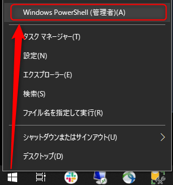

```
dism.exe /online /enable-feature /featurename:VirtualMachinePlatform /all /norestart
```

PC を再起動します。

### Linux カーネル更新プログラム パッケージのインストール

前述の [Microsoft Docs](https://docs.microsoft.com/ja-jp/windows/wsl/install-win10) から [x64 マシン用 WSL2 Linux カーネル更新プログラム パッケージ](https://wslstorestorage.blob.core.windows.net/wslblob/wsl_update_x64.msi) をダウンロードし、インストールします。

インストーラー形式なので特に迷うところはないと思います。

### WSL の規定バージョンの設定

管理者として PowerShell を開き、以下を実行します。

```
wsl --set-default-version 2
```

### Ubuntu のインストール

[Microsoft Docs](https://docs.microsoft.com/ja-jp/windows/wsl/install-win10) の「手順 6 - 選択した Linux ディストリビューションをインストールする」にある一覧からお好きなディストリビューションをインストールします。今回は **Ubuntu 20.04 LTS** を利用します。

- [Ubuntu 20.04 LTS](https://www.microsoft.com/store/apps/9n6svws3rx71)

入手をクリックすると Microsoft Store アプリが起動するので、そこからインストールします。このあたりワンストップにできないんですかね...

とりあえずインストールできたら下記のようになりますので [起動] しましょう。

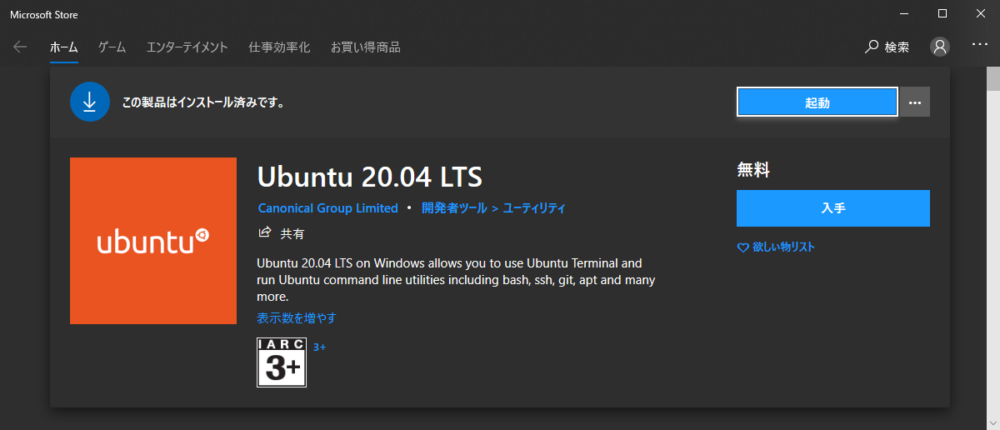

起動すると Ubuntu のターミナルっぽい画面に "Installing, this may take a few minutes..." と表示されます。とはいえ、このインストールは一瞬で終わりました。

**Ubuntu 用のユーザー名とパスワードを設定**します。

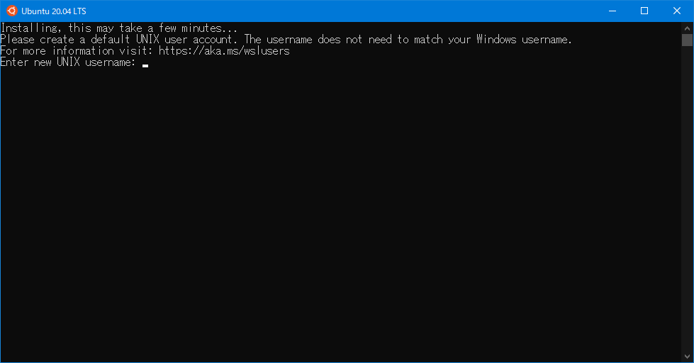

ユーザー名とパスワードが設定できれば Ubuntu が利用可能になります。

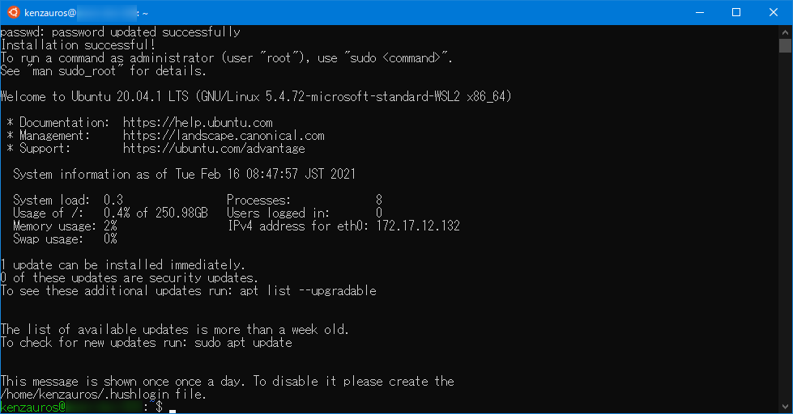

## Windows ターミナルのインストールと設定

### Windows ターミナルのインストール

いよいよ本題です。**Windows ターミナルも Microsoft Store からインストール**します。

- [Windows Terminal - Microsoft Store ja-JP](https://www.microsoft.com/ja-jp/p/windows-terminal/9n0dx20hk701?rtc=1&activetab=pivot:overviewtab)

終わりです。

というのもあっけないので、少し使い方のご説明と設定をしましょう。

### Windows ターミナルの基本的な使い方

**Windows ターミナルを起動**します。スタートメニューから起動するか、 [Windows] + [R] (ファイル名を指定して実行) から `wt` を叩くと起動できます。

おそらく標準のシェルが PowerShell になっているので、最初は PowerShell のタブが開いているはずです。

タブ横の下向き矢印をクリックするとシェルの一覧が表示されます。

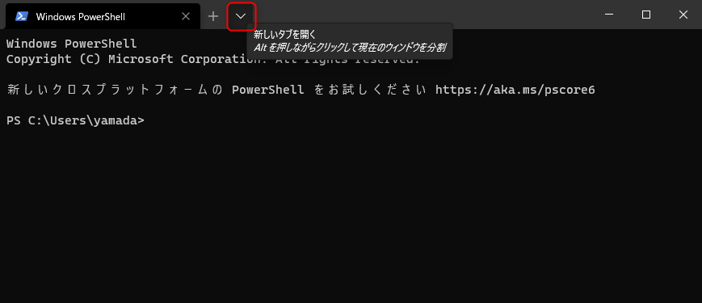

選択すると新しいタブが開き、そのシェルが起動します。ちなみに **Alt キーを押しながら選択すると画面を分割**できます。

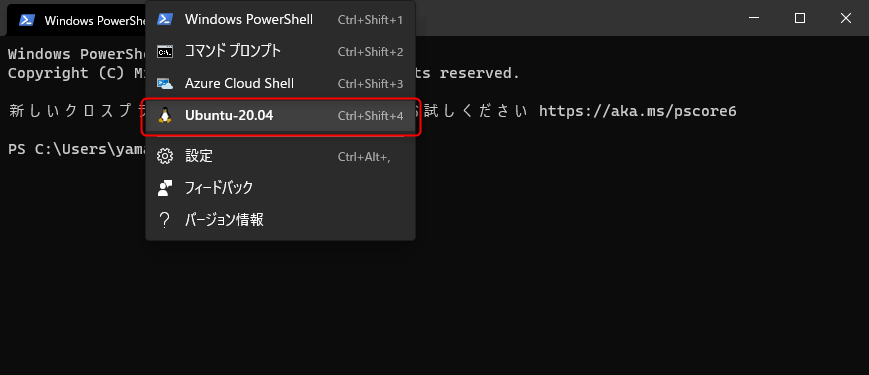

**今のシェルを分割する場合は [Alt] + [Shift] + [;](+) キー（垂直方向）または [Alt] + [Shift] + [-] キー（水平方向）**を押します。[Alt] + [Shift] + [D] で現在のシェルを長辺方向に分割して複製します。

なお、どんどん分割していくと下図のように分割されます。もはやカオスです。残念ながら、今のところ分割したペインの入れ替えはできないようですが、サイズ調整は **[Alt] + [Shift] + 方向キー** で可能です。

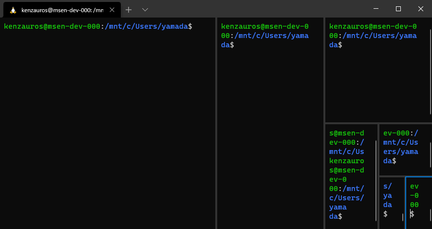

分割されたシェルを閉じるときは、`exit` してやれば、その分割部分は消えてくれます。

なお、エクスプローラーの右クリックメニューにも **"Open in Windows Terminal" が追加されているはずなのでこれを選択することで、そのフォルダを起点としたターミナルを開く**ことができます。

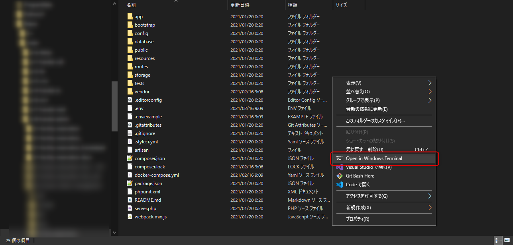

ただ、これで開いたあと別のシェルを開いてもカレントディレクトリが引き継がれないので若干不便です...

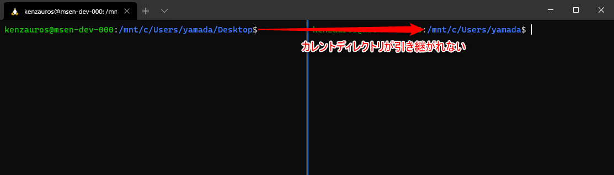

一応開始ディレクトリは設定できるようですが、「引き継ぐ」ということができないようです。

- [Starting directory - Windows Terminal General Profile Settings | Microsoft Docs](https://docs.microsoft.com/ja-jp/windows/terminal/customize-settings/profile-general#starting-directory)

すでにかなり議論されていますが、実装はされないそうなので、 bash レベルで同じディレクトリを開くようにするしかないようです。

- [Open new terminal tab in same directory as existing tab (OSC 7?) · Issue #3158 · microsoft/terminal](https://github.com/microsoft/terminal/issues/3158#issuecomment-768670092)

### Windows ターミナルの設定

#### 設定ファイルを開く

ちなみに **Windows ターミナルの設定**はユーザープロファイルの奥深くにある **`settings.json` に記述されていて、さきほどの下向き矢印から [設定] で開く**ことができます。

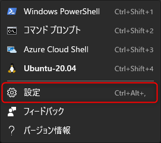

選択すると json ファイルが関連付けられているテキストエディターで `settings.json` が開きます。

※この [設定] のショートカットキーに [Ctrl] + [Alt] + [,] と記載されているのですが、このショートカットキーではなぜか `defaults.json` が開きます。こちらは自動生成されるファイルのようで、ファイルの冒頭にも `// THIS IS AN AUTO-GENERATED FILE! Changes to this file will be ignored.` と書かれています。たぶんバグでしょう。

#### 設定ファイルの内容

さて `settings.json` は下記のようになっています。（コメントは省略しています。）

最初は英語のコメントが多いので、むむ？！と思うかもしれませんが、構成はシンプルです。

```json
{
    "$schema": "https://aka.ms/terminal-profiles-schema",

    "defaultProfile": "{61c54bbd-c2c6-5271-96e7-009a87ff44bf}",

    "copyOnSelect": false,

    "copyFormatting": false,

    "profiles":
    {
        "defaults":
        {
            // Put settings here that you want to apply to all profiles.
        },
        "list":
        [
            {
                // Make changes here to the powershell.exe profile.
                "guid": "{61c54bbd-c2c6-5271-96e7-009a87ff44bf}",
                "name": "Windows PowerShell",
                "commandline": "powershell.exe",
                "hidden": false
            },
            {
                // Make changes here to the cmd.exe profile.
                "guid": "{0caa0dad-35be-5f56-a8ff-afceeeaa6101}",
                "name": "コマンド プロンプト",
                "commandline": "cmd.exe",
                "hidden": false
            },
            {
                "guid": "{b453ae62-4e3d-5e58-b989-0a998ec441b8}",
                "hidden": false,
                "name": "Azure Cloud Shell",
                "source": "Windows.Terminal.Azure"
            },
            {
                "guid": "{07b52e3e-de2c-5db4-bd2d-ba144ed6c273}",
                "hidden": false,
                "name": "Ubuntu-20.04",
                "source": "Windows.Terminal.Wsl"
            }
        ]
    },

    "schemes": [],

    "actions":
    [
        { "command": {"action": "copy", "singleLine": false }, "keys": "ctrl+c" },
        { "command": "paste", "keys": "ctrl+v" },
        { "command": "find", "keys": "ctrl+shift+f" },
        { "command": { "action": "splitPane", "split": "auto", "splitMode": "duplicate" }, "keys": "alt+shift+d" }
    ]
}
```

#### シェルを非表示にする

見たままですが **`profiles.list` に利用可能なシェル一覧**が記載されています。

**`hidden` を `true` にすることで非表示**にできます。また名前も自由に設定できます。

GUID はあとで説明する `defaultProfile` に設定するために使用します。通常は変更する必要はないでしょう。

私は Azure Cloud Shell を使わないので、非表示にしました。

```json
            {
                "guid": "{b453ae62-4e3d-5e58-b989-0a998ec441b8}",
                "hidden": true,
                "name": "Azure Cloud Shell",
                "source": "Windows.Terminal.Azure"
            },
```

#### 既定のシェルを変更する

既定だと Windows ターミナルを起動したときに PowerShell が開くので、これを Ubuntu に変更します。

なんのことはないですが、 **`defaultProfile` に指定されている GUID を Ubuntu のものに書き換え**ます。
（ここでは `{07b52e3e-de2c-5db4-bd2d-ba144ed6c273}`）

```json
{
    "$schema": "https://aka.ms/terminal-profiles-schema",

    "defaultProfile": "{61c54bbd-c2c6-5271-96e7-009a87ff44bf}",
```

これで **Windows ターミナルを起動したときに Ubuntu が開く**はずです。

## おまけ： Ubuntu で Windows の Docker Desktop を利用する

**WSL2 の Linux ディストリビューション上で Windows の Decker Desktop を統合利用**することができます。

この設定をせずに Ubuntu などから docker コマンドを叩くと `Docker is not running!` などと怒られます。

### Docker を WSL 2 上で動作させる

まずは **Docker を WSL 2 で動かす**ように変更します。（Hyper-V モードになっている場合のみ）

Docker Desktop のダッシュボードから設定を開きます。

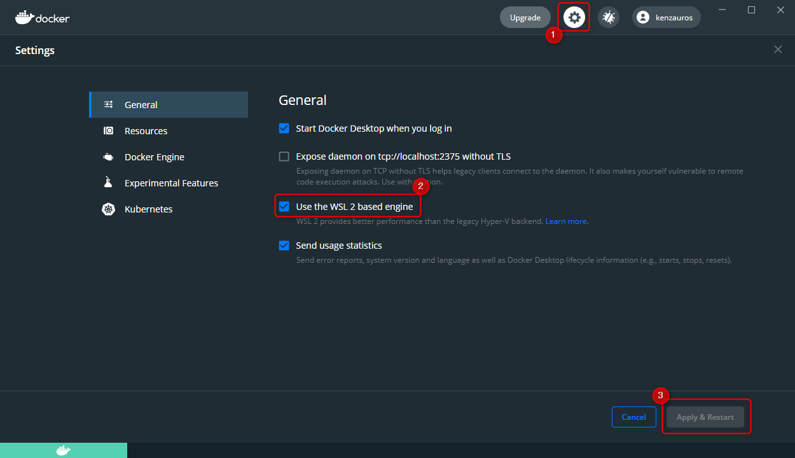

"Use the WSL 2 based engine" にチェックを入れ、 [Apply & Restart] します。

### Decker Desktop の統合設定を有効にする

次に **Resources / WSL INTEGRATION** から、統合機能を有効にするディストリビューション（ここでは Ubuntu-20.04 ）にチェックを入れ、また [Apply & Restart] で Docker を再起動します。

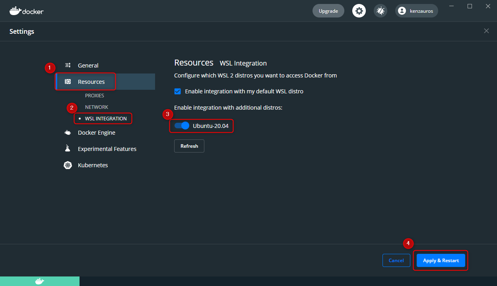

これで下記のように Ubuntu から Docker が実行できるようになりました。

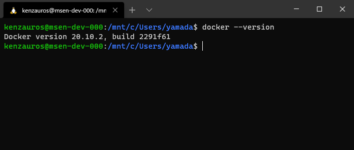

なお、プロンプトを見ればわかるとおり、 Ubuntu などの Linux シェルを開くと、 **Windows のファイルシステムが `/mnt` 以下にマウントされている**ので、 Linux 側から直接ファイル操作が可能です。
