日々の健康管理のためスマートバンドを愛用しています。 2年ほど **[Huawei Band 3 Pro](https://consumer.huawei.com/jp/wearables/band3-pro/specs/) を使ってきました**が、スマホが Huawei でなくなり、アドバンテージがなくなったため、発売されたばかりの **Xiaomi Mi Band 6** に乗り換えました。

**まだ日本語版がないため、今回中国語版を英語表示で使っています**が、結論から言うとまったく問題なく使用できています。せっかくなので、 Huawei のスマートバンドとの比較を交えつつ、使用レポをお送りします。

## Huawei Band 3 Pro のイケてなかった点

Huawei Band 3 Pro は2年前としては珍しく GPS が内蔵されており、これだけで（スマホなしに）ジョギングすることもでき便利でしたが、イケてなかった点もありました。

- **バンドがちょっと残念**  
当初、ウレタンバンドの表面には模様があり、高級感があったのですが、時間とともに擦れてなくなってしまい平滑なバンドになってしまいました。また、余ったバンドを止めるための遊革が切れてしまい、余分なバンドが邪魔なのでカットして使っていました。実使用上、不便はなかったものの、お世辞にもスタイリッシュとは言えない有様でした。
- **水で画面が反応する**  
水泳のフォームをも見分けるとの折り込みだったのですが、画面の感度がよすぎるのか、水中はもちろん水面でも画面が誤反応するため、勝手にモードが切り替わったりして実用的ではありませんでした。
- **Google Fit との連携がイマイチ**  
スマホが Google Pixel 5 になったのもありますが、以前より Fit への依存が大きくなったので、 Fit 側への連携が弱いのが難点でした。具体的には歩数は連携されるが、睡眠や心拍は（ほぼ）連携されないといった具合です。

## Xiaomi Mi Band 6

**安くて高性能なスマートバンドとして高名な（？）シャオミ (Xiaomi) の Mi Band シリーズ**。

前バージョンの [Mi Band 5](https://www.mi.com/jp/mi-smart-band-5/) は 4000円程度なので、母用にも Amazon で買いました。ただ Mi Band 5 は画面サイズが小さく、文字が非常に小さいのが、特に年配者にとっては不便です。

そんな折、4月に入って **[Mi Band 6 が発表]((https://www.gizmodo.jp/2021/04/mi-band-6.html))**されました。有機 EL ディスプレイが 1.1 インチから 1.56 インチの大型化し、サンプル写真でも劇的に見やすくなっていました！

- [Xiaomi Mi Smart Band 6](https://www.mi-store.com.au/xiaomi-mi-smart-band-6)

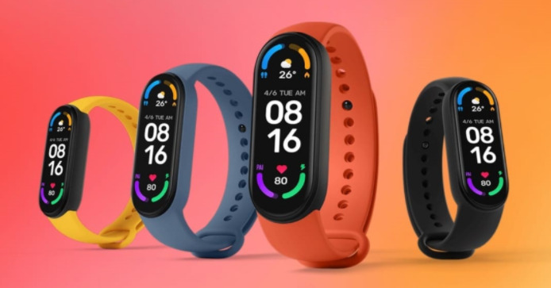

※リンクは Xiaomi オーストラリアのサイトです。

### Huawei Band 3 Pro との比較

世代が違うのであまり参考にならないかもしれませんが、私の新旧モデルで比較してみます。

  | Huawei Band 3 Pro | Xiaomi Mi Band 6
-- | -- | --
サイズ | 45.0x19.0x11.0 | 47.4x18.6x12.7
重量 | 25g | 12.8g (ボディのみ)
画面サイズ | 0.95 インチ | 1.56 インチ
解像度 | 240x120 | 486x152
防水性能 | 5気圧 | 5気圧
バッテリー持続時間 (公称) | 10日 | 14日

ボディサイズは少し大きくなりましたが、画面サイズも大きくなり、解像度がかなり向上しています。

### 中国語版の購入

日本版が発表されていないため、とりあえず**自分用に中国語版を購入し、英語表示で使う**ことにしました。ちなみに Mi Band 6 はヨーロッパで発売されるグローバル版もあり、こちらは NFC がないだけのようですが、英語で使う分にはどちらも変わらないだろうということで中国語版にしました。

中国語版は **AliExpress** でマシそうな店 (XiaomiRussian Store) から購入しました。 AliExpress 自体、万人にオススメはしませんが、日本で手に入らない中国やヨーロッパの商品がしかも安く入手できるので、たまに利用しています。

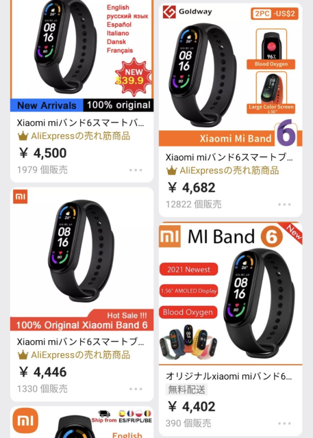

Mi Band 6 の場合、概ね 40 ドルちょっとの店なら大丈夫そうな気がします。今回は割引 -$1.50 で **$40.49 (4500円程度)** でした。**発注から約2週間程度で届きました**。

### 開梱

**到着した Mi Band 6**。箱が若干ひしゃげているのが不安を誘います。いざ、開梱！

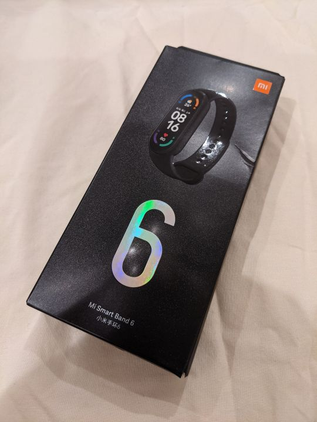

じゃーーーん。**本体・充電ケーブル・中国語の説明書**、というシンプルな構成です。いや、必要十分です。

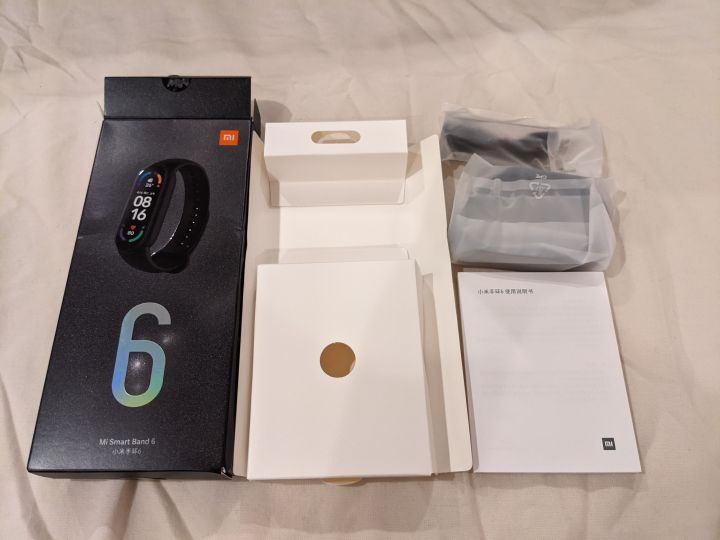

本体に触れてみると...おぉ、光った。綺麗なディスプレイです。**ま、中国語ですがね。**

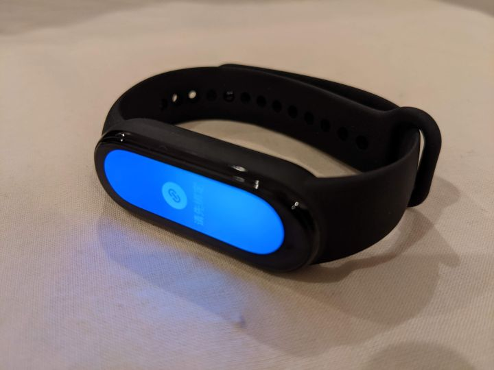

なんか接続してほしそうなアイコンは移ってますが、さっぱり不明。メニューもきっちり中国語です。

もっと [ST lab](https://watayuki.xsrv.jp/ST_manual/index.html) やっとけばよかった！なんて思いつつ、一朝一夕には理解できそうにないので、 Google 翻訳アプリでリアルタイム翻訳しましたが、やっぱりよくわからん。

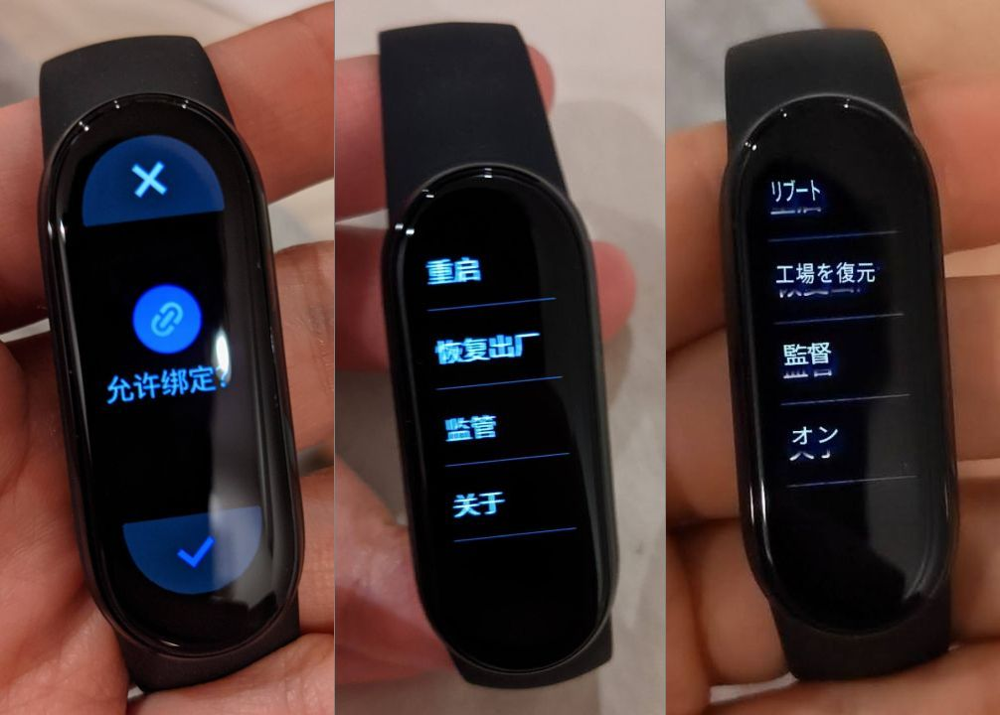

### Mi Fit アプリインストール

ということでスマートバンド側はあきらめて**アプリ側から攻めます**。 **Xiaomi のフィットネス管理アプリは Mi Fit** と呼ばれるアプリなので、これをインストールします。 Wii Fit みたいですね。

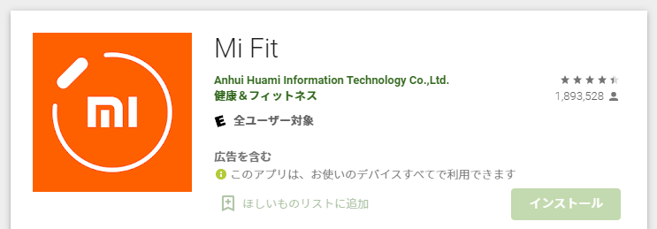

- [Mi Fit - Google Play のアプリ](https://play.google.com/store/apps/details?id=com.xiaomi.hm.health&hl=ja&gl=US)
- [‎「Mi Fit」をApp Storeで](https://apps.apple.com/jp/app/mi-fit/id938688461)

この**Mi Fit、ストアでの評価も高いのですが、実際結構イイ**です。

### ユーザー登録

これまで **Mi Fit を使っていなかった場合はアカウントを作成**します。

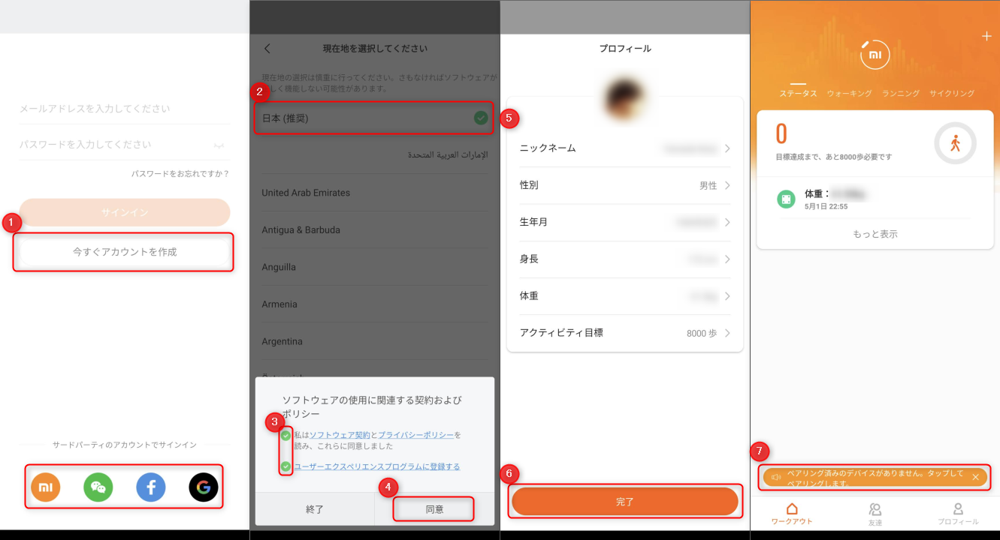

1. 「今すぐアカウントを作成」、もしくは Google や Facebook ログインをタップします。私は Google アカウントで登録しました。
2. 現在地として **「日本」** を選び、
3. ポリシーを読んで
4. チェックを入れます。
5. プロフィールを入力し
6. 完了をタップします。以上で登録が完了します。
7. ホーム画面で下部に表示されたメッセージをタップしてデバイスを追加します。

現在地で日本を選んでいると（もしくは端末の言語設定かも？）自動的にアプリの UI も日本語になっています。

### バンドの登録とアップデート

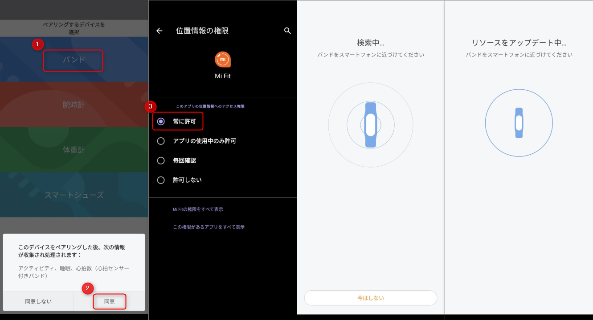

1. デバイスの種類で **「バンド」** を選び
2. 「同意」をタップします。
3. 位置情報の許可が促されるので、**常に許可**を選びます。（画面は Google Pixel 5）

バンドを検索したあと、勝手にアップデートをはじめるので、しばらくスマホとバンドを近くにおいたままにしておきます。

### バンドの言語設定

アップデートが終わるとバンドが登録され、下記のように設定が確認できるようになります。ではバンド自体の言語設定を切り替えます。

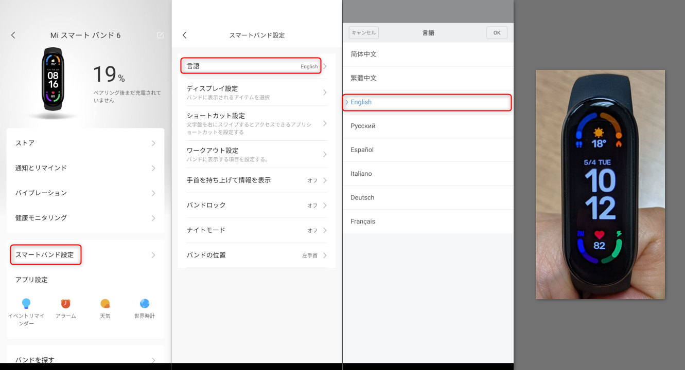

**「スマートバンド設定」から「言語」をタップし、「English」を選べば OK** です。画面が英語になってわかりやすくなりました！！

## 実際の使用感

### 付け心地

**スナップホック式のストラップ**をつけるのに最初少しコツがいりましたが、すぐに慣れました。遊革もなく、バンドが余ることがないので、よいと思います。

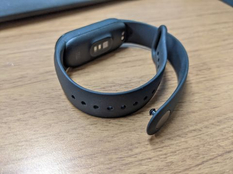

装着時の重さもほぼ感じませんし、この記事をキーボードを打っていても気になることはありませんでした。

### 歩数計

ちょっとしたハイキングに出かけたので、 **Huawei Band 3 Pro を左手に Xiaomi Mi Band 6 を右手**にはめて、実験してみたところ、**3万歩歩いて、300歩（＝1％）以内**の差でした。

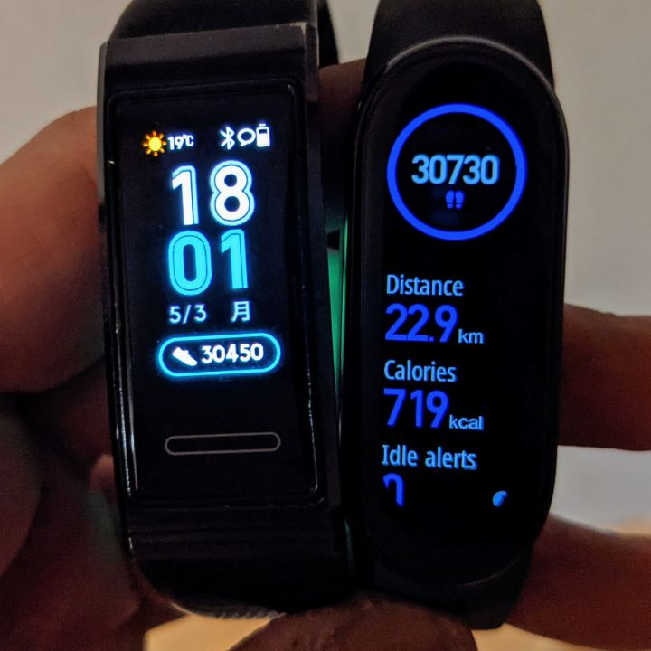

装着するタイミングが若干違ったので、ほぼ一致していると考えてよさそうです。標準器がないので、はっきり言えませんが、どちらも精度は優秀なようです。

### 睡眠記録

こちらも **Huawei Band 3 Pro (左) と Xiaomi Mi Band 6 (右)** で同時計測して比較しました。

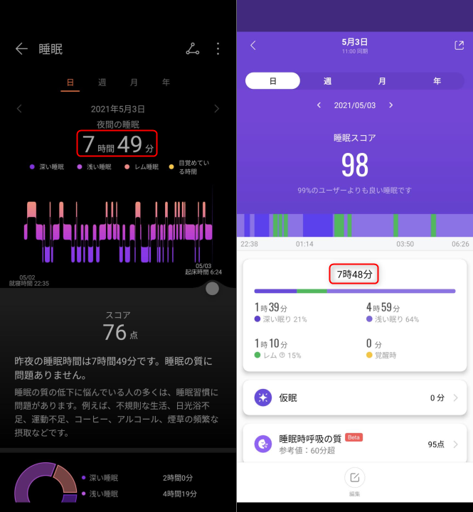

**合計睡眠時間は1分差で、入眠や起床の時刻も数分の差**でしたので、概ねよく把握できているようです。

ただ、深い睡眠や浅い睡眠、レム睡眠などの評価が若干異なりましたので、評価アルゴリズムが違うのかもしれません。

また、**スコアは Huawei が76点で辛口、シャオミのほうが98点で甘口**となっております。画面の文言から、なんとなく Huawei は個人の睡眠に対する絶対評価で、 Xiaomi は全ユーザー間の相対評価なような気がします。

### SpO2

今回の **Mi Band 6 は SpO2 の計測が可能**です。継続的な計測はできず、手動にはなりますが、**手軽に血中酸素を測定できるのはおもしろい**です。

私はだいたい 96％ ほどで、妻からは「低い。病気ちゃう」と言われていますが、たぶん大丈夫でしょう。

### まとめ

まだ数日なので長期間使った場合とで使用感は変わるかもしれませんが、今のところ快適に使用できています。

水中でもそのうち試してみたいと思います。そのうち日本語版が発売されるとよいですね。

日々の健康管理やアクティビティの記録に **Xiaomi Mi Band 6** を試してみてはいかがでしょうか。
