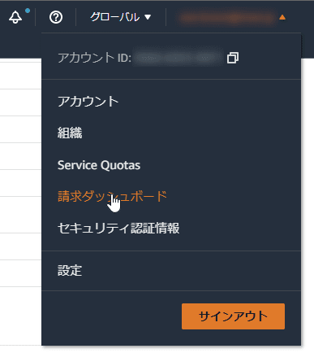
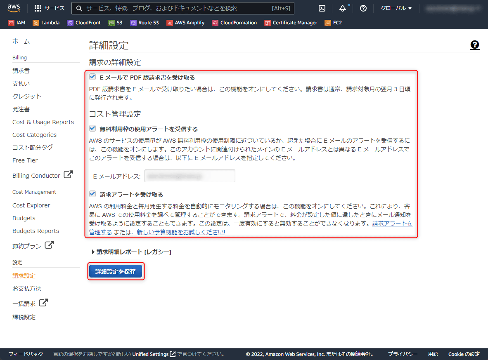
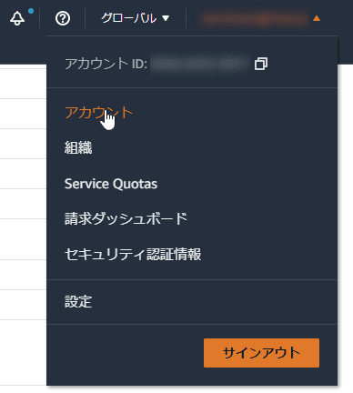
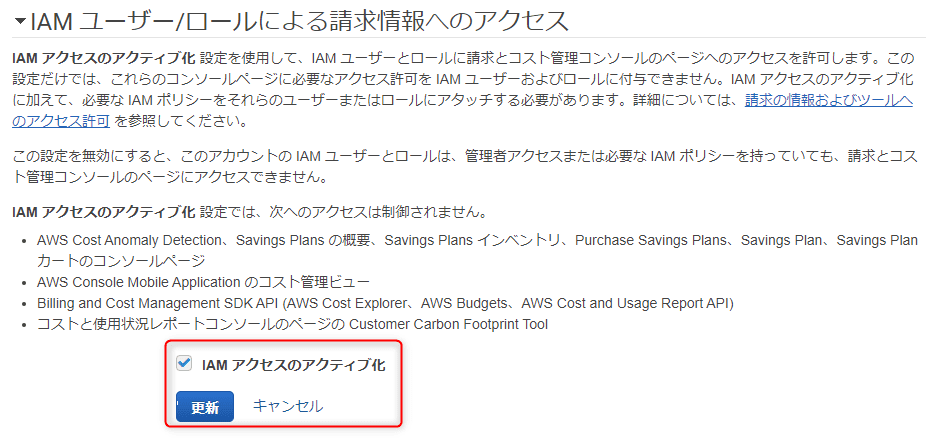

今回は AWS アカウントを作成後に行う、**請求情報設定と IAM ユーザーへの請求情報アクセスの許可**について紹介します。

基本的には公式ガイドに従えばよいのですが、非常にわかりづらいので画像付きで手順を紹介します。

## 前提

新しく作成した AWS アカウントを前提とします。

本記事の内容に関する AWS の公式ガイドです。 IAM ユーザー/ロールに対する請求情報 (Billing) 系の権限は 1 つ目のリンクを参考にして別途設定してください。

- [アカウントの請求情報の表示を IAM ユーザーに許可する](https://aws.amazon.com/jp/premiumsupport/knowledge-center/iam-billing-access/)
- [E メールで送付される請求書を取得する - AWS 請求](https://docs.aws.amazon.com/ja_jp/awsaccountbilling/latest/aboutv2/emailed-invoice.html)
- [AWS の予想請求額をモニタリングする請求アラームの作成 - Amazon CloudWatch](https://docs.aws.amazon.com/ja_jp/AmazonCloudWatch/latest/monitoring/monitor_estimated_charges_with_cloudwatch.html#turning_on_billing_metrics)

## 設定手順

### 請求に関する通知やアラートを受け取るようにする

ルートアカウントでログインし、右上のアカウント名のメニューから「**請求ダッシュボード**」をクリックします。

下記の項目を設定します。 CloudWatch による請求額のアラームを作成するため、「請求アラートを受け取る」は必ず ON にしておきましょう。

- E メールで PDF 版請求書を受け取る
- 無料利用枠の使用アラートを受信する
- **請求アラートを受け取る**

「E メールで PDF 版請求書を受け取る」は予算管理の体制によりますが、ビジネス用途なら受け取るようにしておいたほうがいいでしょう。

「無料利用枠の使用アラートを受信する」では無料枠の制限を超えるときに通知を受け取ることができます。無料枠のアラートがうるさく感じる場合はオフにするといいでしょう。通常はルートアカウントのメールアドレスを設定しておけばよいと思います。

#### 請求アラートについて

**「請求アラートを受け取る」を ON にすることで、 CloudWatch にメトリクスが作成され、請求額のモニタリングやアラームを設定できる**ようになります。ちなみにこの *「請求アラート」は一度有効にすると無効にできません*。

慣れていないと「請求アラート」と「請求アラーム」がややこしいと思いますが、ざっくり言うと下記のような違いです。

- **請求アラート**：請求アラームを設定するために必要な情報を CloudWatch に出力する。この画面で設定する。
- **請求アラーム**：請求アラートを元に「予想請求額が一定額を超えたときに通知する」などのアラームを作成する。 [CloudWatch アラーム](https://us-east-1.console.aws.amazon.com/cloudwatch/home?region=us-east-1#alarmsV2:?~(namespace~'AWS*2fBilling)) で設定する。

なお、 CloudWatch アラームの設定については下記の記事を参照してください。

- [AWS CloudWatch アラームを設定して予想請求額の通知をメールで受信する](https://mseeeen.msen.jp/create-aws-budget-alarm)

### IAM ユーザーやロールに請求情報へのアクセスを許可する

この部分の設定はけっこう忘れていることが多く、 **IAM のポリシーで権限がついているにもかかわらず「IAM ユーザーから請求情報が見えない」** ということが起こります。

デフォルトではルートユーザーのみが請求情報にアクセスできるため、追加の設定が必要です。この設定はなぜか **「請求ダッシュボード」でなく「アカウント」設定画面** にあります。

当たり前ですが、 IAM ユーザーに請求情報へのアクセスを許可したくない場合は有効にしないでください。また、*許可した場合でもアクセスできるユーザーやロールを適切に設定*してください。

右上のアカウント名のメニューから「**アカウント**」をクリックしてアカウント設定画面を開きます。

「IAM ユーザー/ロールによる請求情報へのアクセス」のところで「**IAM アクセスのアクティブ化**」にチェックを入れ、 [更新] をクリックします。

これで IAM ユーザー/ロールによる請求情報へのアクセスが有効になりました👏

