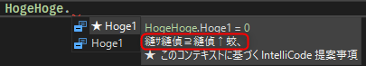

こんにちは、kenzauros です。

Visual Studio で C# と C++/CLI 混在のソリューションを扱っていたところ、 *C++/CLI の XML ドキュメントコメントで書いた内容が盛大に文字化け*しました。

原因は EditorConfig によって文字コードが自動統一されていたことでした。結論としては「**BOM 付き UTF-8** を使いましょう」ということです。

## 対象者

- Visual Studio 2019 以降で C++/CLI をご利用の方
- EditorConfig (`.editorconfig`) をご利用の方

## 事象

たとえば下記のような列挙型のメンバーに XML コメントを書いたとします。

```cpp:title=C++のクラスにコメントを書いた例
public enum class HogeHoge
{
    /// <summary>
    /// ほげほげな値
    /// </summary>
    Hoge1
};
```

これをビルドして、別プロジェクトの C# から参照してみると...。



`縺ｻ縺偵⊇縺偵↑蛟､` ！

意味不明です。使いやすくするためにコメントを書いているのに、これでは余計に混乱を招きます。

試しに生成された XML を確認しても見事に日本語が文字化けしています。

```xml:title=生成された.xmlファイル
<member name="F:HogeHoge.Hoge1">
    <summary>
        縺ｻ縺偵⊇縺偵↑蛟､
    </summary>
</member>
```

これは文字コードしかない！ということで、このファイルを BOM 付きの UTF-8 で保存しなおし、再度ビルドします。


はい、無事直りました。

## 原因と対策

そもそも Visual Studio は昔から「**BOM 付き UTF-8**」が好みなため、既定の状態ではこの問題は発生しないと思います。

このソリューションではソースコードのフォーマットが統一できるよう、下記のようにルートフォルダーの **EditorConfig** でフォーマットを定義していました。

```ini:title=.editorconfig
root = true

[*]
indent_style = space
indent_size = 2
end_of_line = lf
charset = utf-8
trim_trailing_whitespace = true
insert_final_newline = true

[*.{cs,vb,xaml,cpp,hpp,c,h}]
indent_size = 4
end_of_line = crlf
```

見てのとおり、 `[*.{cs,vb,xaml,cpp,hpp,c,h}]` では `charset` を定義していないため、 `[*]` の `utf-8` (BOM なし UTF-8) が使われます。このため、すべてのファイルは「BOM なし UTF-8」で保存されていました。

ちなみに Visual Studio 2017 から EditorConfig は標準でサポートされており、`.editorconfig` ファイルを配置すれば、自動的にルールが適用されます。

C# では BOM なしでも文字化けしないので、問題ないと判断していましたが、 C++ だと文字化けしてしまうようです。

そこで C++ 関連のファイルのみ「**BOM 付き UTF-8**」になるよう、 **`utf-8-bom`** を指定しました。

```ini:title=.editorconfigに追記したC++用定義
[*.{cpp,hpp,c,h}]
charset = utf-8-bom
```

これで、 Visual Studio で上書き保存すれば、これらの拡張子のファイルは「BOM 付き UTF-8」として保存されます。

BOM ってなんやねん、という方は用語事典をご参照ください。

- [XML用語事典 \[BOM (Byte Order Mark)\]](https://atmarkit.itmedia.co.jp/aig/01xml/bom.html)

## まとめ

日本語を扱っているといつの時代も避けては通れない「文字化け」。今回は EditorConfig で「**BOM 付き UTF-8**」を指定する方法を紹介しました。

なお、 EditorConfig の `charset` には下記の値が指定できます。

- `latin1`
- `utf-8`
- `utf-8-bom`
- `utf-16be`
- `utf-16le`

> charset: set to latin1, utf-8, utf-8-bom, utf-16be or utf-16le to control the character set.
> <cite>[EditorConfig](https://editorconfig.org/)</cite>

残念ながら、 Shift_JIS や EUC には対応していません。まぁ昨今の開発ではほとんど利用することはないと思いますが...。

どなたかのお役に立てば幸いです。
