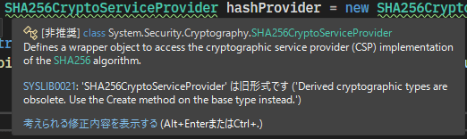

こんにちは、 kenzauros です。

過去に [**C# で SHA256 や MD5 のハッシュ文字列を得る**](https://mseeeen.msen.jp/compute-hash-with-csharp-6-or-later/) 方法を紹介しましたが、 .NET 6 で一部が非推奨になったため更新版を紹介します。

## ソースコード

更新版は下記のとおりです。ついでに、拡張メソッドにしました。

- [C# で SHA256 のハッシュ文字列を得る - gist](https://gist.github.com/kenzauros/09377008ff036a730d0c7de7e6ecdb89) (`GetSHA256HashedString_net6.cs`)

```cs:title=StringExtensions.cs
using System.Linq;
using System.Security.Cryptography;
using System.Text;

public static class StringExtensions
{
    static readonly HashAlgorithm hashAlgorithm = SHA256.Create();
    public static string GetSHA256HashedString(this string value)
        => string.Join("", hashAlgorithm.ComputeHash(Encoding.UTF8.GetBytes(value)).Select(x => $"{x:x2}"));
}
```

## 使い方

下記のように使用できます。

```cs
string hash = "test".GetSHA256HashedString();
Console.WriteLine(hash);
// will show "9f86d081884c7d659a2feaa0c55ad015a3bf4f1b2b0b822cd15d6c15b0f00a08"
```

16 進文字列を大文字にしたい場合は `$"{x:x2}"` を `$"{x:X2}"` と変えれば OK です。

## 背景

`SHA256CryptoServiceProvider` などを*直接インスタンス化することが非推奨*になりました。

- [SHA256CryptoServiceProvider クラス (System.Security.Cryptography) | Microsoft Docs](https://docs.microsoft.com/ja-jp/dotnet/api/system.security.cryptography.sha256cryptoserviceprovider?view=net-6.0)

インスタンス化しようとすると下記のようなエラーになります。

> Derived cryptographic types are obsolete. Use the Create method on the base type instead.
>
> 

「代わりに基本クラスの `Create` メソッドを使いたまえ」とのことですので、愚直に従いましょう。 `SHA256.Create()` と、直感的に書けるようになりました。 SHA256 の場合、内部的には `SHA256Managed` が使用されるようです。

- [SHA256Managed クラス (System.Security.Cryptography) | Microsoft Docs](https://docs.microsoft.com/ja-jp/dotnet/api/system.security.cryptography.sha256managed?view=net-6.0)

## その他のハッシュ関数

.NET の [System.Security.Cryptography](https://docs.microsoft.com/ja-jp/dotnet/api/system.security.cryptography?view=net-6.0) 名前空間にはほかにもハッシュアルゴリズムが用意されています。`SHA256` の部分を置き換えるだけでそれらを利用できます。

ハッシュ方式 | 生成方法
--- | ---
MD5 | `MD5.Create()`
SHA1 | `SHA1.Create()`
SHA256 | `SHA256.Create()`
SHA384 | `SHA384.Create()`
SHA512 | `SHA512.Create()`

## byte 配列も対応するとき

byte 配列にも対応する場合は、 byte 配列を引数としたメソッドを定義して、そちらをベースにするとよいでしょう。

```cs:title=SHA256Extensions.cs
public static class SHA256Extensions
{
    static readonly HashAlgorithm hashAlgorithm = SHA256.Create();

    public static string GetSHA256HashedString(this byte[] value)
        => string.Join("", hashAlgorithm.ComputeHash(value).Select(x => $"{x:x2}"));

    public static string GetSHA256HashedString(this string value)
        => GetSHA256HashedString(Encoding.UTF8.GetBytes(value));
}
```
