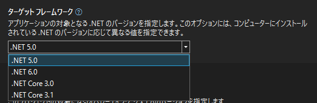

## 概要

**Visual Studio 2022** がリリースされてしばらく経ち、 .NET 5 のプロジェクトを .NET 6 に移行する機会も増えてきました。

.NET の更新自体はプロジェクトのプロパティーで [ターゲットフレームワーク] を変更すれば済みますが、これだけではソリューションファイルが更新されません。



*更新されなくても特に不具合はない*のですが、ついでなので最新にしておきたいところです。

ということで今回は**ソリューションファイルのバージョンアップ方法**を紹介します。
ちなみに *2019 → 2022 だけでなく 2015, 2017, 2019 等でも共通*の方法です。

## ソリューションのバージョンアップ

### Visual Studo 2019 ソリューションの確認

Visual Studio 2019 で作ったソリューションファイル (`*.sln`) を開くと下記のようになっています。
*VS 2019 は Version 16* です。

```{2-3}:title=*.sln
Microsoft Visual Studio Solution File, Format Version 12.00
# Visual Studio Version 16
VisualStudioVersion = 16.0.32126.315
MinimumVisualStudioVersion = 10.0.40219.1
```

### ソリューションのバージョンの上げ方

ソリューションファイルは下記の 3 手順で簡単にバージョンアップできます。

1. ソリューションファイル (`*.sln`) を **Visual Studio 2022** で開く
2. *Visual Studio を開いたまま ソリューションファイル (`*.sln`) を削除する*
3. Visual Studio で「*すべて保存*」する → ソリューションファイルが再生成される


以上です。

### Visual Studo 2022 ソリューションの確認

生成された新しいソリューションファイルを確認してみると、ちゃんと **Version 17 (＝ 2022)** になっていることがわかります。

```{2-3}:title=*.sln
Microsoft Visual Studio Solution File, Format Version 12.00
# Visual Studio Version 17
VisualStudioVersion = 17.1.32210.238
MinimumVisualStudioVersion = 10.0.40219.1
```

ソリューションとしては下記の部分だけが異なります。
※プロジェクト種別の GUID も変更されることがあります。

```diff
- # Visual Studio Version 16
- VisualStudioVersion = 16.0.31105.61
+ # Visual Studio Version 17
+ VisualStudioVersion = 17.1.32210.238
```

どなたかのお役に立てれば幸いです。
