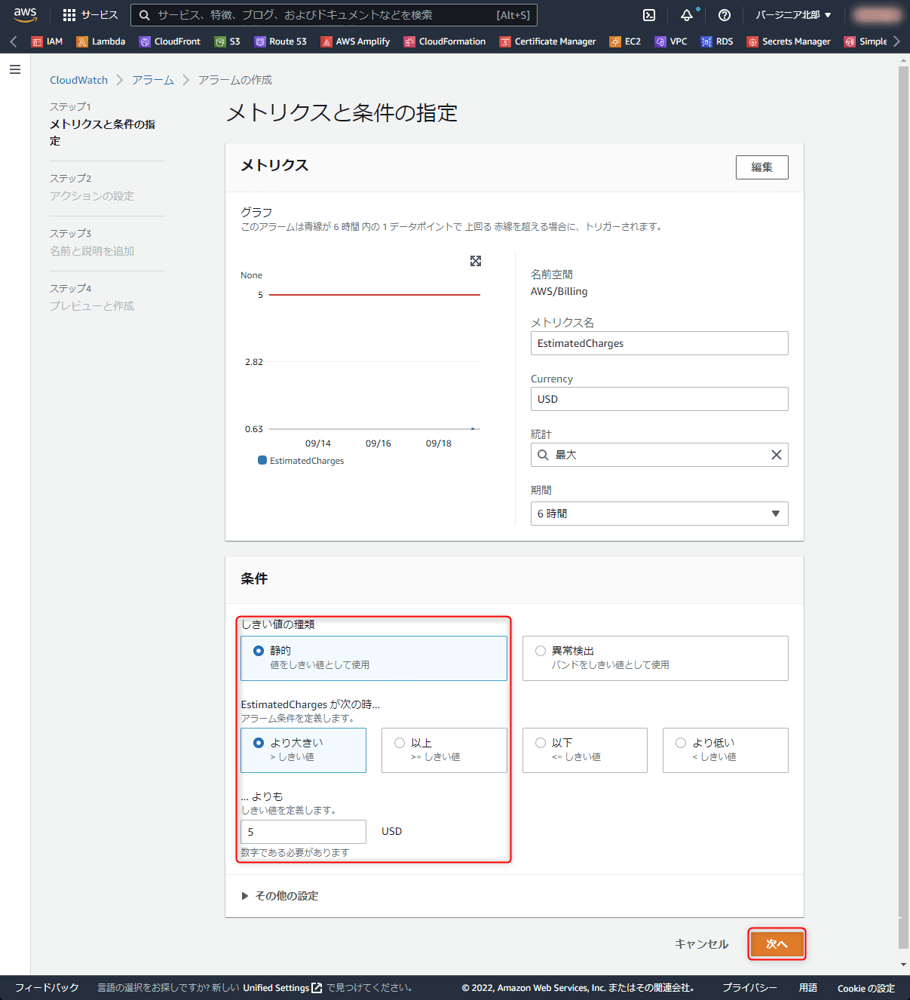
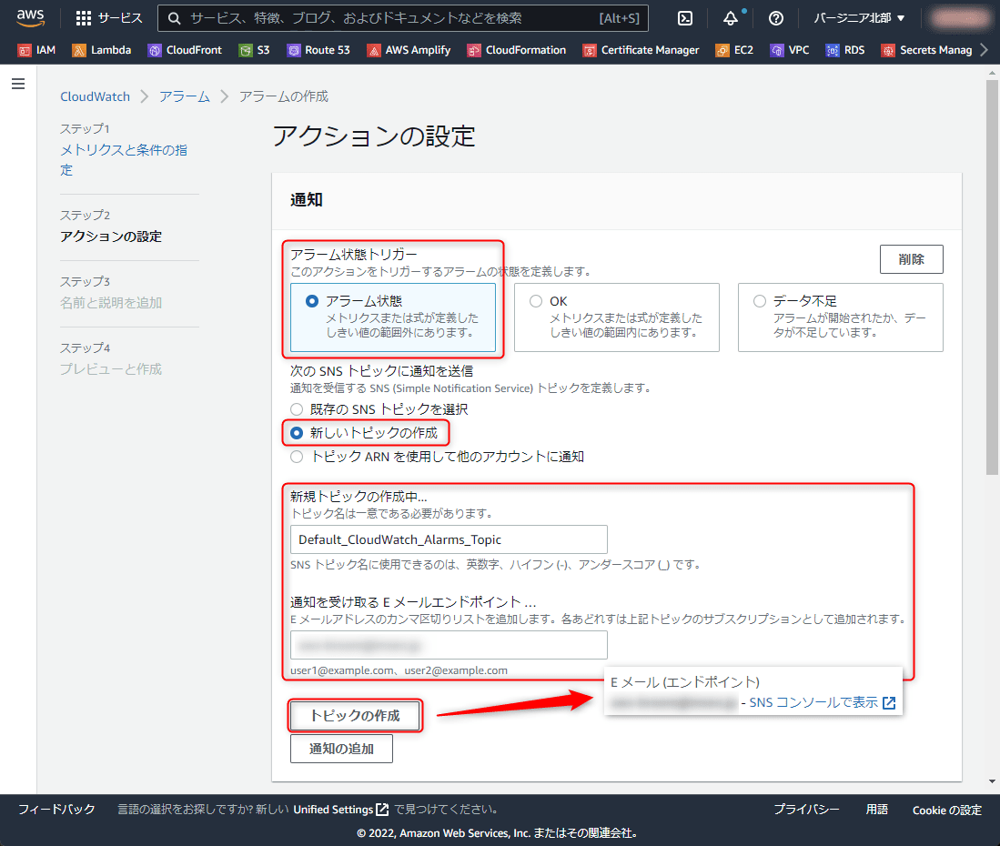
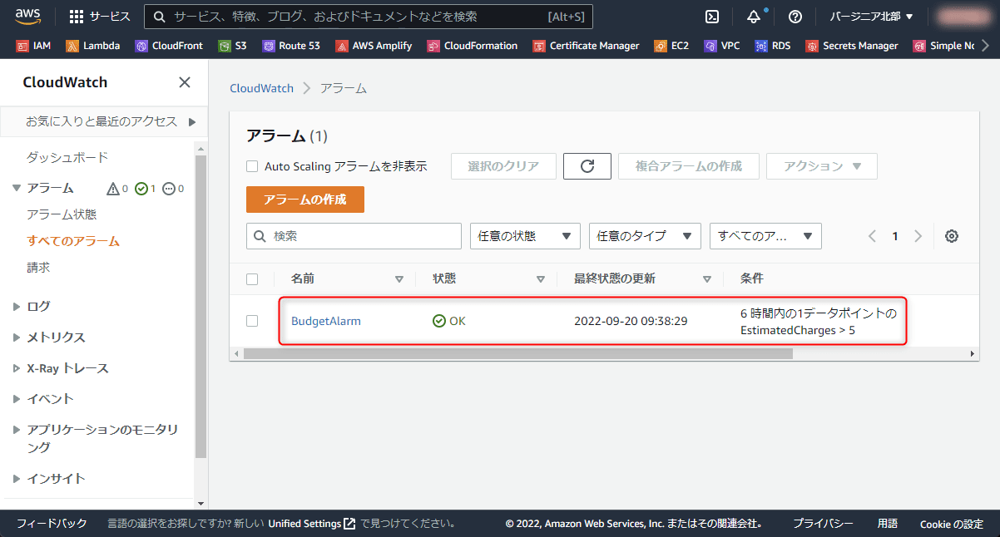

AWS コンソールから新しく作成した AWS アカウントの**請求額アラーム**を設定します。**予定請求額が一定額を超えたときにメールで通知**されるようにします。

いろいろ試したりしていると、クラウド破産にもなりかねませんので、 AWS アカウント作成時に設定しておきましょう。

## 前提

AWS コンソールから実施します。

基本的には下記の公式手順と同様です。

- [AWS の予想請求額をモニタリングする請求アラームの作成 - Amazon CloudWatch](https://docs.aws.amazon.com/ja_jp/AmazonCloudWatch/latest/monitoring/monitor_estimated_charges_with_cloudwatch.html)

このアラームでは下記の流れで通知が発生します。

- 一定の請求額を超えるとき、 CloudWatch アラームがアラーム状態になる
- アラーム状態になったとき、 SNS トピックへ通知が発行される
- SNS トピックを購読しているメールアドレスに通知が送信される

## AWS コンソールからの請求額アラーム設定手順

まず **CloudWatch アラームのコンソール** (https://us-east-1.console.aws.amazon.com/cloudwatch/home?region=us-east-1#alarmsV2:?~(namespace~'AWS*2fBilling)) を開きます。

請求情報にアクセスするため、**バージニア北部リージョン (us-east-1)** を使用します。

請求アラームの画面を開いたら、 [アラームの作成] を選択します。

**メトリクス部分で `EstimatedCharges` が表示されていることを確認**し、条件を設定します。「...よりも」の金額部分は任意の金額に変更してください。ここでは 5 USD にしました。

もし `EstimatedCharges` が表示されていない場合は、先に請求アラートを有効化する必要があります。

アラームの動作を設定します。「アラーム状態トリガー」は「**アラーム状態**」、 SNS トピックは「**新しいトピックの作成**」を選択します。すでに存在する SNS トピックを使用する場合は、そちらを選択してください。

新しいトピックの作成のところにトピック名が自動的に入力されていますので、任意の名前にしたい場合は変更します。通知を受け取るメールアドレスを入力し、 [トピックの作成] をクリックします。

トピックの作成が完了すると矢印で示した「**E メール (エンドポイント)**」のような表示に変わります。

おそらくこの段階で入力したメールアドレスに下記のようなメールが届いているはずですので、 [**Confirm subscription**] をクリックし、 SNS のサブスクリプションを有効にします。

[次へ] で「名前と説明を追加」に進みます。名前は好きなものを入力します。ここでは **`BudgetAlarm`** としました。

入力できたら [次へ] をクリックします。

設定内容を再度確認します。問題なければ [**アラームの作成**] をクリックします。

アラームが作成され、ダッシュボードに戻ります。さきほど作成したアラームが表示されていることを確認します。

「データ不足」と表示されている場合もしばらくすると「OK」に変わります。

## まとめ

今回は公式手順と同様に CloudWatch アラームを設定して、予定請求額が一定額を超えるときにメールで通知を受け取れるようにしました。

この記事の内容は 2022 年 9 月時点のものです。すでに存在する同種の記事と比べて目新しいところはありませんが、社内手順書の一部として執筆しました。

CloudFormation などで作成してもいいのですが、AWS コンソールからでも 1 分ぐらいで終わるため、同時に複数アカウントに設定する場合を除いてはこちらのほうが手軽だと思います。
