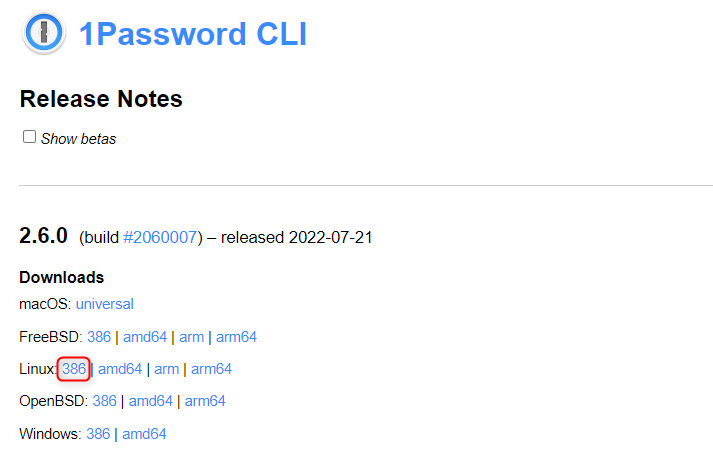

こんにちは、kenzauros です。

この記事は [1Password CLI で Vault とアクセス権のあるユーザーを一覧表示する](https://mseeeen.msen.jp/get-1password-vault-user-list/) の更新版です。
CLI ツールのバージョンが 2 系になったことで、コマンドが便利になり、**ユーザーの権限も取得できるようになった**ため、更新しました。

## 概要


**1Password** で認証情報を管理していると、便利なのがカテゴリーごとに分けておける Vault 機能です。

ただ、 Vault 自体が多くなってくると、全体を俯瞰しにくくなり、紐付いているユーザーも把握しにくくなります。
今回は *Shell Script で Vault とユーザーの一覧を簡単に取得*できるようにしてみました。

1Password からの情報取得には、公式 API か公式から提供されている **1Password の CLI ツール**が利用できます。
API でもいいのですが、実行環境の準備も面倒なので今回は CLI ツールを利用しました。


## 前提

- Ubuntu 20.04 on WSL (Windows 11 Pro)
- 1Password CLI: 2.6.0
- jq: 1.6

1Password の CLI はデータを JSON で返すことができますので、データ操作のために *jq* をインストールしておきましょう。

## 1Password CLI の準備

### インストール

CLI ツールを公式の手順にしたがってインストールします。

- [Get started with 1Password CLI 2 | 1Password Developer Documentation](https://developer.1password.com/docs/cli/get-started#install)
- [Upgrade to 1Password CLI 2 | 1Password Developer Documentation](https://developer.1password.com/docs/cli/upgrade/#step-1-choose-an-upgrade-strategy)


下記のページから CLI ツールの *zip ファイル の URL* を取得します。今回は WSL 上の Ubuntu で実行するため、 Linux 386 版を使用します。

- [1Password CLI Release Notes](https://app-updates.agilebits.com/product_history/CLI2)



適当なディレクトリーで **`wget` して `unzip` し、実行ファイルの `op` を `/usr/local/bin/` に `mv`** します。

```sh:title=bash
~$ cd /tmp

/tmp$ wget https://cache.agilebits.com/dist/1P/op2/pkg/v2.6.0/op_linux_386_v2.6.0.zip 👈 URL は最新のものに変更してください

/tmp$ unzip op_linux_386_v2.6.0.zip

/tmp$ ll op
-rwxr-xr-x 1 hoge hoge 10936320 Jul 21 23:53 op*

/tmp$ sudo mv op /usr/local/bin/

/tmp$ op --version
2.6.0
```

`op --version` でバージョンが確認できれば OK です。

### サインイン

まず **`account add` コマンドと `op signin` コマンドで 1Password にサインイン** します。

- [Sign in to your 1Password account manually | 1Password Developer Documentation](https://developer.1password.com/docs/cli/sign-in-manually)

ここでは 1Password のアカウントが `MY_TEAM`、ユーザー名が `user@example.com` とします。

```sh:title=bash
$ op account add
Enter your sign-in address (example.1password.com): MY_TEAM.1password.com
Enter the email address for your account on MY_TEAM.1password.com: user@example.com
Enter the Secret Key for user@example.com on MY_TEAM.1password.com: **-*****-*****-*****-*****-*****-*****
Enter the password for user@example.com at MY_TEAM.1password.com: ********
Now run 'eval $(op signin)' to sign in.
```

Secret Key と Password は 1Password の自身のものを使用します。メッセージに表示されているように `eval` します。

```sh:title=bash
$ eval $(op signin)
Enter the password for user@example.com at MY_TEAM.1password.com: ********
```

ちなみにセッション時間が短く、しばらくすると再認証を求められますので、 *再認証はまた `eval $(op signin)` を実行*しましょう。

`op vault ls` を叩いて、 vault のリストが取得できれば OK です。

```sh:title=bash
$ op vault ls
ID                            NAME
ksbrv6k3lxoiquv3prjiil5644    AWS
qmqkrqrkft7d2g745b47ttuoqs    Azure
```

## Vault とユーザーのリストアップ スクリプト

### スクリプトを実行してみる

好きなディレクトリーに `list-vaults.sh` (名前はご自由に) を作成し、下記のような内容で保存します。

```sh:title=list-vaults.sh
#!/bin/bash

ORG_IFS=$IFS
IFS=$'\n'
vaults=(`op vault ls --format json | jq -r -S '.[] | .name' | sort`)
for vault in "${vaults[@]}"; do
  detail=`op vault get $vault --format json | jq -r '.name+": "+.description'`
  echo "- $detail"
  users=(`op vault user list $vault --format json | jq -r -S '.[] | select(.state == "ACTIVE") | .name + " (" + ( .permissions | map( split("_") | .[1][0:1] | ascii_upcase ) | @csv) + ")"' | sort`)
  for user in "${users[@]}"; do
    echo "    - $user"
  done
done
IFS=$ORG_IFS
```

さっそく、実行してみましょう。

サインインが終わっている状態なら、下記のように *Vault とその Vault にアクセスできるユーザーと権限*の一覧が順番に表示されます。

```sh:title=bash
~/$ ./list-vaults.sh
- AWS: AWS 関連
    - Kenji YAMADA ("V","E","M")
    - Norikazu MASUDA ("V","E","M")
- Azure: Microsoft Azure
    - Kenji YAMADA ("V","E","M")
    - Kiyoshi KOYAMA ("V","E")
    - Norikazu MASUDA ("V","E")
- In House: 社内関連
    - Kenji YAMADA ("V","E")
    - Kiyoshi KOYAMA ("V","E")
    - Norikazu MASUDA ("V","E")
    - Soseki NATSUME ("V","E")
    - Osamu DAZAI ("V","E")
～以下略～
```

毎回リクエストが走るので結構時間がかかります。

### ポイント

基本的には下記の 3 コマンドをつなげてリスト形式で `echo` しているだけです。

なお、スクリプトで使うときは jq で使いやすいようにコマンドに `--format json` をつけて JSON 形式でデータを取得すると便利です。

#### Vault 一覧の取得

**Vault 一覧は `op vault ls` で取得**します。

- [vault | 1Password CLI | 1Password Developer Documentation](https://developer.1password.com/docs/cli/reference/management-commands/vault#vault-list)

これで得られる JSON は下記のようなシンプルな内容です。 `op vault ls | jq '.'` で表示してみるとわかりやすいでしょう。

```json:title=JSON
[
  {
    "id": "6htyezadte2dj3n3afzm3j6n44",
    "name": "AWS",
    "content_version": 977
  },
  {
    "id": "za6o6te6g42kdwkbnmefvfpliq",
    "name": "Azure",
    "content_version": 149
  },
  {
    "id": "2bfqg76bkormb5yv5rdt42st24",
    "name": "In House",
    "content_version": 52
  },
]
```

これを jq で分解して、各 Vault の `name` 部分のみを取り出します。 `name` を取り出すのは、後続のコマンドでこの Vault 名を使用するためです。

下記のようにすれば Vault 名の一覧が出力されるはずです。

```sh:title=bash
$ op vault ls --format json | jq -r -S '.[] | .name' | sort
AWS
Azure
In House
```

#### Vault 詳細の取得

今回は Vault の説明を取得したいので、さらに Vault の詳細を調べます。 **Vault の詳細は `op vault get <Vault名>` で取得**します。

- [Get details: Use 1Password CLI](https://support.1password.com/command-line/#get-details)

得られる JSON は下記のようになります。

```sh:title=bash
$ op vault get "Azure" --format json | jq '.'
{
  "id": "qmqkrqrkft7d2g745b47ttuoq",
  "name": "Azure",
  "content_version": 52,
  "description": "Azure 関連",
  "attribute_version": 1,
  "items": 21,
  "type": "USER_CREATED",
  "created_at": "2017-11-05T11:26:56Z",
  "updated_at": "2022-08-01T08:34:48Z"
}
```

今回は `name` と `description` が取り出せればよいので下記のようにします。

```sh:title=bash
$ op vault get "Azure" --format json | jq -r '.name+": "+.description'
Azure: Azure 関連
```

jq の `'.name+": "+.description'` で `name` と `description` を結合して出力しているだけです。

#### Vault に紐付いたユーザー一覧の取得

**Vault に紐付いたユーザーは `op vault user list <Vault名>` で取得**します。得られる JSON は下記のようになります。

```sh:title=bash
$ op vault user list "Azure" --format json | jq '.'
[
  {
    "uuid": "OUX2JSFNPVHUTF8SSRRIPH4CWU",
    "name": "Kenji YAMADA",
    "email": "yamada@example.com",
    "type": "MEMBER",
    "state": "ACTIVE",
    "permissions": ["allow_viewing", "allow_editing", "allow_managing"]
  },
  {
    "uuid": "M2OTSDZZRTG7VJXVYZJAWCTCFA",
    "name": "Inai HITO",
    "email": "unknown@example.com",
    "type": "MEMBER",
    "state": "SUSPENDED",
    "permissions": ["allow_viewing", "allow_editing"]
  }
]
```

ここで**アクティブなユーザーは `state` が `ACTIVE`**、停止されているユーザーは `SUSPENDED` になっています。
そこで `state` が `ACTIVE` のみのユーザーをフィルタリングしてから `name` のみを取り出します。

```sh:title=bash
$ op vault user list "Azure" --format json | jq -r -S '.[] | select(.state == "ACTIVE") | .name' | sort
Kenji YAMADA
```

1Password CLI のバージョン 2 では各 Vault に対するユーザーの権限も取得できるようになりました。

ユーザーの Vault に対する権限が `permissions` に含まれているため、これも合わせて出力するには下記のようにすれば実現できます。

```sh:title=bash
$ op vault user list "Azure" --format json | jq -r -S '.[] | select(.state == "ACTIVE") | .name + " (" + ( .permissions | map( split("_") | .[1][0:1] | ascii_upcase ) | @csv) + ")"' | sort
```

少しややこしいですが `allow_viewing` のような文字列から下記の流れで `V` を生成しています。

`( .permissions | map( split("_") | .[1][0:1] | ascii_upcase )`

1. `_` で分割
2. 2 個目の要素の 1 文字目のみ取得
3. 大文字に変換

まぁこのあたりはご要望に応じてカスタムしてください。

## まとめ

**1Password が公式に提供している CLI ツールを使って、 Vault やユーザー・権限の一覧を取得する方法**を紹介しました。

バージョン 2 の CLI では、コマンド体系が少し変わり、取得できるデータが拡充されました。

どなたかのお役に立てれば幸いです。
