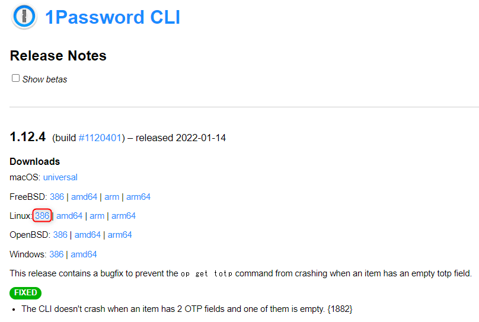

## 概要

**1Password** で認証情報を管理していると、便利なのがカテゴリーごとに分けておける Vault 機能です。

ただ、 Vault 自体が多くなってくると、全体を俯瞰しにくくなり、紐付いているユーザーも把握しにくくなります。
今回は *Shell Script で Vault とユーザーの一覧を簡単に取得*できるようにしてみました。

1Password からの情報取得には、公式 API か公式から提供されている **1Password の CLI ツール**が利用できます。
API でもいいのですが、実行環境の準備も面倒なので今回は CLI ツールを利用しました。

## 前提

- Ubuntu 20.04 on WSL (Windows 10 Pro)
- 1Password CLI: 1.12.4
- jq: 1.6

1Password の CLI はデータを JSON で返しますので、データ操作のために *jq* をインストールしておきましょう。

## 1Password CLI の準備

### インストール

CLI ツールを公式の手順にしたがってインストールします。

- [1Password CLI: Getting started](https://support.1password.com/command-line-getting-started/)

下記のページから CLI ツールの *zip ファイル の URL* を取得します。今回は WSL 上の Ubuntu で実行するため、 Linux 386 版を使用します。

- [1Password CLI Release Notes](https://app-updates.agilebits.com/product_history/CLI)



適当なディレクトリーで **`wget` して `unzip` し、実行ファイルの `op` を `/usr/local/bin/` に `mv`** します。

```sh
~$ cd /tmp

/tmp$ wget https://cache.agilebits.com/dist/1P/op/pkg/v1.12.4/op_linux_386_v1.12.4.zip 👈 URL は最新のものに変更してください

/tmp$ unzip op_linux_386_v1.12.4.zip

/tmp$ ll op
-rwxr-xr-x 1 hoge hoge 8544256 Jan 15 06:33 op*

/tmp$ sudo mv op /usr/local/bin/

/tmp$ op --version
1.12.4
```

`op --version` でバージョンが確認できれば OK です。

### サインイン

まず **`op signin` コマンドでサインイン** します。

- [1Password CLI: Sign in to your account](https://support.1password.com/command-line-getting-started/#sign-in-to-your-account)

ここでは 1Password のアカウントが `EXAMPLE`、ユーザー名が `user@example.com` とします。

```sh
$ op signin EXAMPLE.1password.com user@example.com

Enter the Secret Key for user@example.com at EXAMPLE.1password.com: XX-XXXXXX-XXXXXX-XXXXX-XXXXX-XXXXX-XXXXX
Enter the password for user@example.com at EXAMPLE.1password.com:
# This command is meant to be used with your shell's eval function.
# Run 'eval $(op signin EXAMPLE)' to sign in to your 1Password account.
# Use the --raw flag to only output the session token.
```

Secret Key と Password は 1Password の自身のものを使用します。メッセージに表示されているように `eval` します。

```sh
$ eval $(op signin EXAMPLE)
Enter the password for user@example.com at EXAMPLE.1password.com: 
```

ちなみにセッション時間が短く、しばらくすると再認証を求められますので、 *再認証はまた `eval $(op signin EXAMPLE)` を実行*しましょう。


## Vault とユーザーのリストアップ スクリプト

### スクリプトを実行してみる

好きなディレクトリーに `list-vaults.sh` (名前はご自由に) を作成し、下記のような内容で保存します。

```sh:title=list-vaults.sh
#!/bin/bash

ORG_IFS=$IFS
IFS=$'\n'
vaults=(`op list vaults | jq -r -S '.[] | .name' | sort`)
for vault in "${vaults[@]}"; do
  detail=`op get vault $vault | jq -r '.name+": "+.desc'`
  echo "- $detail"
  users=(`op list users --vault $vault | jq -r -S '.[] | select(.state == "A") | .name' | sort`)
  for user in "${users[@]}"; do
    echo "    - $user"
  done
done
IFS=$ORG_IFS
```

さっそく、実行してみましょう。

サインインが終わっている状態なら、下記のように *Vault とその Vault にアクセスできるユーザー*の一覧が順番に表示されます。

```sh
~/$ ./list-vaults.sh
- AWS: AWS 関連
    - Kenji YAMADA
    - Norikazu MASUDA
- Azure: Microsoft Azure
    - Kenji YAMADA
- In House: 社内関連
    - Kenji YAMADA
    - Kiyoshi KOYAMA
    - Norikazu MASUDA
    - Soseki NATSUME
    - Osamu DAZAI
～以下略～
```

毎回リクエストが走るので結構時間がかかります。

今回はアクティブなユーザー (`.state == "A"`) のみ取得していますが、絞らなければアカウントを停止しているユーザーも表示されます。

### ポイント

基本的には下記の 3 コマンドをつなげてリスト形式で `echo` しているだけです。

#### Vault 一覧の取得

**Vault 一覧は `op list vaults` で取得**します。

- [List objects: Use 1Password CLI](https://support.1password.com/command-line/#list-objects)

これで得られる JSON は下記のようなシンプルな内容です。 `op list vaults | jq '.'` で表示してみるとわかりやすいでしょう。

```json
[
  {
    "uuid": "ksbrv6k3lxoiquv3prjiil5644",
    "name": "AWS"
  },
  {
    "uuid": "qmqkrqrkft7d2g745b47ttuoq",
    "name": "Azure"
  },
  {
    "uuid": "qmqkswskft7d2garpeb47ttuoq",
    "name": "In House"
  }
]
```

これを jq で分解して、各 Vault の `name` 部分のみを取り出します。 `name` を取り出すのは、後続のコマンドでこの Vault 名を使用するためです。

下記のようにすれば Vault 名の一覧が出力されるはずです。

```
$ op list vaults | jq -r -S '.[] | .name' | sort
AWS
Azure
In House
```

#### Vault 詳細の取得

今回は Vault の説明を取得したいので、さらに Vault の詳細を調べます。 **Vault の詳細は `op get vault <Vault名>` で取得**します。

- [Get details: Use 1Password CLI](https://support.1password.com/command-line/#get-details)

得られる JSON は下記のようになります。

```json
$ op get vault "Azure" | jq '.'
{
  "uuid": "qmqkrqrkft7d2g745b47ttuoq",
  "name": "Azure",
  "type": "U",
  "desc": "Azure 関連",
  "avatar": "qmqkswskft7d2garpeb47ttuoq.png"
}
```

今回は `name` と `desc` が取り出せればよいので下記のようにします。

```sh
$ op get vault "Azure" | jq -r '.name+": "+.desc'
Azure: Azure 関連
```

jq の `'.name+": "+.desc'` で `name` と `desc` を結合して出力しているだけです。

#### Vault に紐付いたユーザー一覧の取得

**Vault に紐付いたユーザーは `op list users --vault <Vault名>` で取得**します。得られる JSON は下記のようになります。

```JSON
$ op list users --vault "Azure" | jq '.'
[
  {
    "uuid": "OUX2JSFNPVHUTF8SSRRIPH4CWU",
    "firstName": "Kenji",
    "lastName": "YAMADA",
    "name": "Kenji YAMADA",
    "email": "yamada@example.com",
    "avatar": "",
    "state": "A",
    "type": "R"
  },
  {
    "uuid": "M2OTSDZZRTG7VJXVYZJAWCTCFA",
    "firstName": "Inai",
    "lastName": "HITO",
    "name": "Inai HITO",
    "email": "unknown@example.com",
    "avatar": "gpn5oidwk5amzg6oyqzgzqy75u.png",
    "state": "S",
    "type": "R"
  }
]
```

ここで**アクティブなユーザーは `state` が `A` (Active)**、停止されているユーザーは `S` (Suspend) になっています。
そこで `state` が `A` のみのユーザーをフィルタリングしてから `name` のみを取り出します。

```sh
$ op list users --vault "Azure" | jq -r -S '.[] | select(.state == "A") | .name' | sort
Kenji YAMADA
```

## まとめ

**1Password が公式に提供している CLI ツールを使って、 Vault やユーザーの一覧を取得する方法**を紹介しました。

*本当はアクセス権 (Read only/Edit) も取得できるとうれしい*のですが、リファレンスには記述されておらず、データにもそれらしきものが含まれていないため、難しそうです。

API には [1Password Connect API reference](https://support.1password.com/connect-api-reference/#vault-object) にオブジェクトの詳しいリファレンスがあるものの、 CLI で得られるオブジェクトの詳しい情報はなさそうでした😭

どなたかのお役に立てれば幸いです。
