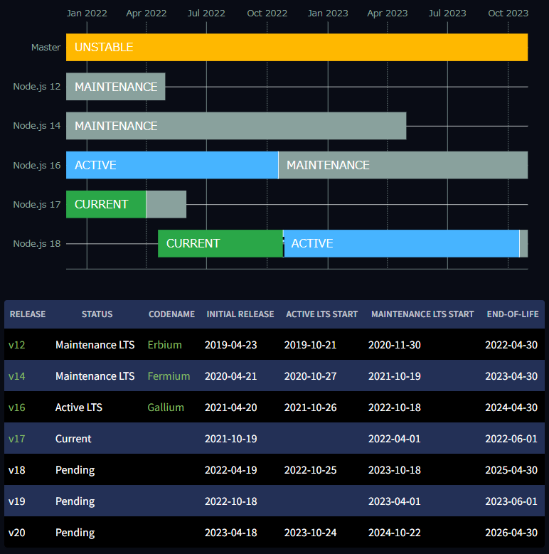

AlmaLinux や Rocky Linux で Node.js をインストールしようと思ったら、バージョン 10 がインストールされてしまった！なんて場合の対処法を紹介します。

本記事では **dnf で Node.js 16 をインストール**します。

nvm などのバージョン管理を導入する方法もありますが、今回は dnf だけで完結できるので本番環境にも使いやすいと思います。

## 結論

結論から言うと下記の 3 コマンドだけで OK です (Node.js 16 の場合)。

```:title=bash
$ dnf module list nodejs
$ sudo dnf module enable nodejs:16 -y
$ sudo dnf install nodejs -y
```

## 前提

今回の環境は **AlmaLinux 8.4** です。 Red Hat Enterprise Linux 8 系であれば同様だと思います。

*dnf で nodejs の情報を見てみると `10.24.0`* となっています。

```:title=bash
$ dnf info nodejs
メタデータの期限切れの最終確認: 0:00:03 時間前の 2022年03月24日 15時24分37秒 に実施しました。
利用可能なパッケージ
名前         : nodejs
エポック     : 1
バージョン   : 10.24.0
リリース     : 1.module_el8.3.0+2047+b07ac28e
Arch         : x86_64
サイズ       : 8.8 M
ソース       : nodejs-10.24.0-1.module_el8.3.0+2047+b07ac28e.src.rpm
リポジトリー : appstream
概要         : JavaScript runtime
URL          : http://nodejs.org/
ライセンス   : MIT and ASL 2.0 and ISC and BSD
説明         : Node.js is a platform built on Chrome's JavaScript runtime
             : for easily building fast, scalable network applications.
             : Node.js uses an event-driven, non-blocking I/O model that
             : makes it lightweight and efficient, perfect for data-intensive
             : real-time applications that run across distributed devices.
```

Node.js 10 はすでにサポート期限を過ぎており、もはや公式ページにその面影もありません。



- [Releases | Node.js](https://nodejs.org/en/about/releases/)

*v12 も 2022/4/30 に EOL を迎えますので、記事公開時点での選択肢はほとんど v14 か v16 しかありません。*

注） **Node.js は偶数バージョンが長期サポート (LTS; long-term support)** バージョンです。

## dnf で Node.js 16 をインストールする

### バージョンの確認

まず dnf のリポジトリにある nodejs のバージョンを確認します。

```:title=bash
$ dnf module list nodejs
メタデータの期限切れの最終確認: 0:02:32 時間前の 2022年03月24日 15時24分37秒 に実施しました。
AlmaLinux 8 - AppStream
Name                Stream              Profiles                                          Summary
nodejs              10 [d]              common [d], development, minimal, s2i             Javascript runtime
nodejs              12                  common [d], development, minimal, s2i             Javascript runtime
nodejs              14                  common [d], development, minimal, s2i             Javascript runtime
nodejs              16                  common [d], development, minimal, s2i             Javascript runtime

ヒント: [d]efault, [e]nabled, [x]disabled, [i]nstalled
```

これで **10, 12, 14, 16 が利用可能**なこと、 *10 がデフォルト (`[d]`)* になっていることがわかりました。

### Node.js 16 の有効化

`dnf module enable` コマンドで有効にするモジュールを設定します。 v16 を有効化する場合は `dnf module enable nodejs:16` とします。

```:title=bash
$ sudo dnf module enable nodejs:16
メタデータの期限切れの最終確認: 1:47:32 時間前の 2022年03月24日 13時39分49秒 に実施しました。
依存関係が解決しました。
========================================================================================================================
 パッケージ                  アーキテクチャー           バージョン                    リポジトリー                サイズ
========================================================================================================================
モジュールストリームの有効化中:
 nodejs                                                 16

トランザクションの概要
========================================================================================================================

これでよろしいですか? [y/N]: y
完了しました!
```

これでモジュールストリームが無事 *Node.js 16 に切り替わりました*。

### Node.js 16 のインストール

あとは普通に `dnf install nodejs` としてインストールするだけです。

```:title=bash
$ sudo dnf install nodejs
メタデータの期限切れの最終確認: 1:47:42 時間前の 2022年03月24日 13時39分49秒 に実施しました。
依存関係が解決しました。
========================================================================================================================
 パッケージ              Arch          バージョン                                                リポジトリー     サイズ
========================================================================================================================
インストール:
 nodejs                  x86_64        1:16.13.1-3.module_el8.5.0+2605+45d748af                  appstream         12 M
弱い依存関係のインストール:
 nodejs-docs             noarch        1:16.13.1-3.module_el8.5.0+2605+45d748af                  appstream        8.7 M
 nodejs-full-i18n        x86_64        1:16.13.1-3.module_el8.5.0+2605+45d748af                  appstream        7.6 M
 npm                     x86_64        1:8.1.2-1.16.13.1.3.module_el8.5.0+2605+45d748af          appstream        1.9 M

トランザクションの概要
========================================================================================================================
インストール  4 パッケージ

ダウンロードサイズの合計: 30 M
インストール後のサイズ: 144 M
これでよろしいですか? [y/N]: y
パッケージのダウンロード:
(1/4): nodejs-docs-16.13.1-3.module_el8.5.0+2605+45d748af.noarch.rpm                    2.0 MB/s | 8.7 MB     00:04
(2/4): nodejs-full-i18n-16.13.1-3.module_el8.5.0+2605+45d748af.x86_64.rpm               1.5 MB/s | 7.6 MB     00:05
(3/4): npm-8.1.2-1.16.13.1.3.module_el8.5.0+2605+45d748af.x86_64.rpm                    1.0 MB/s | 1.9 MB     00:01
(4/4): nodejs-16.13.1-3.module_el8.5.0+2605+45d748af.x86_64.rpm                         1.9 MB/s |  12 MB     00:06
------------------------------------------------------------------------------------------------------------------------
合計                                                                                    4.2 MB/s |  30 MB     00:07
トランザクションの確認を実行中
トランザクションの確認に成功しました。
トランザクションのテストを実行中
トランザクションのテストに成功しました。
トランザクションを実行中
  scriptletの実行中: npm-1:8.1.2-1.16.13.1.3.module_el8.5.0+2605+45d748af.x86_64                                    1/1
  準備             :                                                                                                1/1
  インストール中   : nodejs-docs-1:16.13.1-3.module_el8.5.0+2605+45d748af.noarch                                    1/4
  インストール中   : nodejs-full-i18n-1:16.13.1-3.module_el8.5.0+2605+45d748af.x86_64                               2/4
  インストール中   : npm-1:8.1.2-1.16.13.1.3.module_el8.5.0+2605+45d748af.x86_64                                    3/4
  インストール中   : nodejs-1:16.13.1-3.module_el8.5.0+2605+45d748af.x86_64                                         4/4
  scriptletの実行中: nodejs-1:16.13.1-3.module_el8.5.0+2605+45d748af.x86_64                                         4/4
  検証             : nodejs-1:16.13.1-3.module_el8.5.0+2605+45d748af.x86_64                                         1/4
  検証             : nodejs-docs-1:16.13.1-3.module_el8.5.0+2605+45d748af.noarch                                    2/4
  検証             : nodejs-full-i18n-1:16.13.1-3.module_el8.5.0+2605+45d748af.x86_64                               3/4
  検証             : npm-1:8.1.2-1.16.13.1.3.module_el8.5.0+2605+45d748af.x86_64                                    4/4

インストール済み:
  nodejs-1:16.13.1-3.module_el8.5.0+2605+45d748af.x86_64
  nodejs-docs-1:16.13.1-3.module_el8.5.0+2605+45d748af.noarch
  nodejs-full-i18n-1:16.13.1-3.module_el8.5.0+2605+45d748af.x86_64
  npm-1:8.1.2-1.16.13.1.3.module_el8.5.0+2605+45d748af.x86_64

完了しました!
```

無事 Node.js がインストールされました。

```:title=bash
$ node --version
v16.13.1
$ npm -v
8.1.2
```

ついでに npm もアップデートしておくといいかもしれません。

```:title=bash
$ sudo npm update -g npm
```


## まとめ

**AlmaLinux の dnf で Node.js 14 や 16 をインストールする方法**を紹介しました。
ソースコードからコンパイルする必要もなく、リポジトリの追加も不要で、とても手軽ですね。

どなたかのお役に立てれば幸いです。

### 参考

- [Best Way to Install Node.js and NPM on Rocky Linux 8 or AlmaLinux](https://www.how2shout.com/linux/best-way-to-install-node-js-and-npm-on-rocky-linux-8-or-almalinux/)
