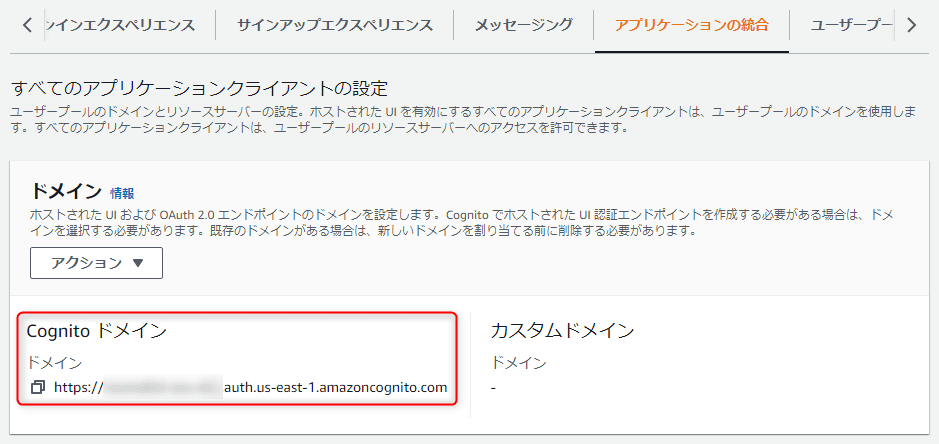
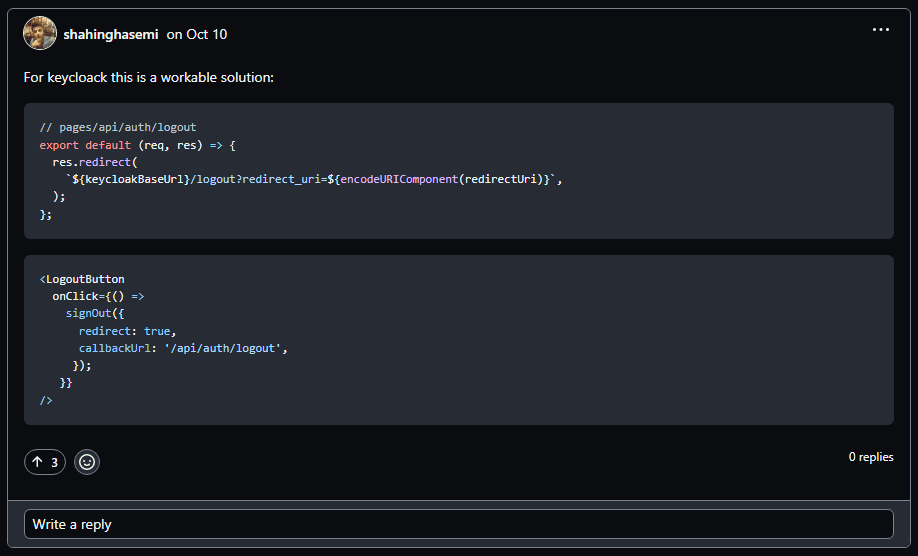

こんにちは、 kenzauros です。

最近は Next.js に **[NextAuth.js](https://next-auth.js.org/)** を組み合わせて認証周りを実装しています。

NextAuth の認証プロバイダーとして **Amazon Cognito** を使っています。が、そもそも Cognito 関連の情報が少ないこともあって、割といろんなところでハマります。

今回は「**NextAuth でサインアウトしても認証先 (OpenID Connect provider) でログアウトできていない**」問題を解決します。

## 前提

- Next.js 12.3.1
- NextAuth.js (next-auth) 4.16.4

なおこの記事では便宜上、 NextAuth 側の認証解除を「*サインアウト*」、 OIDC (OAuth) プロバイダー側の認証解除を「*ログアウト*」と表現します。

## 問題点

今回の問題は下記の場合に発生します。

1. NextAuth でサインイン
2. Cognito のログイン画面でユーザー A としてログイン
3. NextAuth でサインアウト
4. NextAuth でサインイン
5. 自動的にユーザー A としてサインインされる❗

一般的なアプリだと特に問題にならないかもしれませんし、この方が都合のよいアプリもありますが、*一旦サインアウトした後に別のアカウントでサインインし直したい*というニーズに対応できません。

原因は「**認証プロバイダー (Cognito) 側のセッションが残っている**」ことです。要するに自分で作ったアプリからサインアウトした後も Cognito にはログインした状態が続いているというわけです。

**サインインと同様にフェデレーテッド (federated) なサインアウト**が必要になります。

NextAuth のリポジトリでも、この問題は 2020 年から議論されているようですが、結局標準機能としては実装されていません。おそらくプロバイダーによってログアウトエンドポイントの仕様が異なるので一律に実装しづらいのではないかと思います。

- [Federated logout (OpenID Connect) · Discussion #3938 · nextauthjs/next-auth](https://github.com/nextauthjs/next-auth/discussions/3938)

ディスカッションではいくつかの解決策が示されています。結果的に私が採用したものは、下記の方の提案です。

[](https://github.com/nextauthjs/next-auth/discussions/3938#discussioncomment-2231398)


## 解決法

やっていることはシンプルです。 NextAuth のログアウト処理後に「**プロバイダーのログアウトエンドポイント (URL)**」にリダイレクトすることでログアウトしてしまおう、という話です。

提案のものを少し改良していますが、 NextAuth の API エンドポイントである `[...nextauth].ts` に下記のようなコールバックを追加するだけです。

```ts:title=/api/auth/[...nextauth].ts
  callbacks: {
    redirect({ url, baseUrl }) {
      // Sign out from OAuth provider (Cognito)
      // call `signOut({ callbackUrl: "signOut" });` then this callback called
      // https://github.com/nextauthjs/next-auth/discussions/3938#discussioncomment-2231398
      if (url.startsWith(baseUrl)) return url;
      if (url === 'signOut' && process.env.COGNITO_LOGOUT_ENDPOINT_URL) {
        // Sign out from auth provider
        const logoutEndpointUrl = process.env.COGNITO_LOGOUT_ENDPOINT_URL || "";
        const params = new URLSearchParams({
          client_id: process.env.COGNITO_CLIENT_ID || "",
          redirect_uri: `${process.env.NEXTAUTH_URL}/api/auth/callback/cognito`,
          response_type: "code",
        });
        return `${logoutEndpointUrl}?${params.toString()}`;
      }
      // Allows relative callback URLs
      if (url.startsWith('/')) return new URL(url, baseUrl).toString();
      // Redirect to root when the redirect URL is still an external domain
      return baseUrl;
    },
  },
```

### サインアウトの流れ

サインアウトボタンからの流れは下記のようになります。

1. サインアウトボタンが押される
2. `signOut` (NextAuth のサインアウト関数) のコールバック URL に `"signOut"` を指定して呼び出す (`signOut({ callbackUrl: "signOut" });`)
3. NextAuth のサインアウト後 `signOut` にリダイレクト
4. `redirect` コールバック内で `signOut` の場合は「プロバイダーのログアウトエンドポイント」にリダイレクト
5. プロバイダーからログアウトできる👏

### Amazon Cognito のログアウトエンドポイントの確認

**ログアウトエンドポイント**の仕様は認証プロバイダーによって異なります。 Amazon Cognito の場合は下記のページに説明があります。

- [Logout endpoint - Amazon Cognito](https://docs.aws.amazon.com/cognito/latest/developerguide/logout-endpoint.html)

クエリーパラメーターを含めたログアウト用の URL は下記のようになります。

`COGNITO_LOGOUT_ENDPOINT_URL?client_id=COGNITO_CLIENT_ID&redirect_uri=REDIRECT_URI&response_type=code`

ここで `COGNITO_CLIENT_ID` は NextAuth の Cognito 設定で使用しているはずですので、環境変数などから流用できるでしょう。

`REDIRECT_URI` もおそらく環境変数の `NEXTAUTH_URL` に NextAuth のコールバック URI (`/api/auth/callback/cognito`) を結合すれば得られます。

あと必要な情報は `COGNITO_LOGOUT_ENDPOINT_URL` だけです。これは `hogehoge.auth.us-east-1.amazoncognito.com` みたいなドメインに `/logout` を結合したものです。このドメインは Cognito ユーザープールの「*アプリケーションの統合*」で確認できます。



`COGNITO_LOGOUT_ENDPOINT_URL` は環境変数として指定することにします。

```:title=.env.local
COGNITO_LOGOUT_ENDPOINT_URL=https://hogehoge.auth.us-east-1.amazoncognito.com/logout
```


## 別の解決法（問題あり）

実は上記の解決法に至るまでに下記の方法を試していました。

[](https://github.com/nextauthjs/next-auth/discussions/3938#discussioncomment-3836431)

この方法でも無事認証プロバイダーのサインアウトは実現できます。

ただしこの方法は「**サインアウト後に再度サインインしてもまたサインアウトしてしまう**」という難点がありました。

一応この方法についても概要を説明します。

### サインアウトの流れ

サインアウトボタンからの流れは下記のようになります。

1. サインアウトボタンが押される
2. `signOut` (NextAuth のサインアウト関数) を呼び出す
3. NextAuth のサインアウト後 `/api/auth/logout` にリダイレクト
4. `/api/auth/logout` から「プロバイダーのログアウトエンドポイント」にリダイレクト
5. プロバイダーからログアウトできる👍


### 認証プロバイダーログアウト用のルートを用意する

**認証プロバイダーログアウト用のルートとして `/pages/api/auth/logout.ts`** を用意します。

ディスカッションで提案されていたものは JavaScript だったので、 TypeScript に直し、パラメーターを `URLSearchParams` でまとめるようにしたものが下記です。

```ts:title=/pages/api/auth/logout.ts
// Sign out from OIDC provider (Cognito)
// redirected from signOut() like `signOut({ redirect: true, callbackUrl: "/api/auth/logout", });`
import type { NextApiRequest, NextApiResponse } from "next";

const logoutEndpointUrl = process.env.COGNITO_LOGOUT_ENDPOINT_URL || "";

const params = new URLSearchParams({
  client_id: process.env.COGNITO_CLIENT_ID || "",
  redirect_uri: `${process.env.NEXTAUTH_URL}/api/auth/callback/cognito`,
  response_type: "code",
});
const logoutUrl = `${logoutEndpointUrl}?${params.toString()}`;

export default (req: NextApiRequest, res: NextApiResponse) => {
  res.redirect(logoutUrl);
};
```

### サインアウトボタンを実装する

サインアウトボタンは提案通り、 `signOut` 関数に `redirect` と `callbackUrl` を指定するだけです。

```jsx:title=サインアウトボタン
<Button onClick={() => signOut({ redirect: true, callbackUrl: '/api/auth/logout' })}>
  サインアウト
</Button>
```

これでサインアウトボタンを押せば、 Cognito 側でもログアウトが行われ、 Cognito のログイン画面まで自動で遷移するはずです。

ただし、この方法では最後のルートが `/api/auth/logout` になっているため、再度サインイン後に `/api/auth/logout` へ飛んでしまい、またログアウトしてしまいます。
そうすると前述のとおり、何度やってもログインできない状態が続きますので、この方法はルーターを書き換えるなど、追加の対処が必要です。

ただそれなら先に紹介した方法のほうが `[...nextauth].ts` で完結し、シンプルですのでそちらを採用することにしました。

## まとめ

今回は「**NextAuth でサインアウトしたときに認証プロバイダーでログアウトしたい場合**」の解決法を紹介しました。

ワークアラウンドですが、どなたかのお役に立てれば幸いです。
