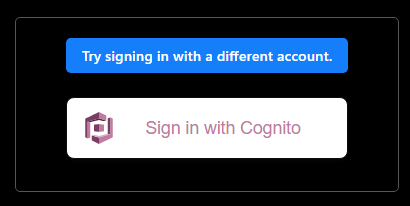

こんにちは、 kenzauros です。

**NextAuth.js** を使い、 **Cognito によるユーザー認証**を実装していたのですが、どうしても **nonce mismatch** というエラーになりました。

結局解決できず、 Amplify ライブラリーを使った実装に変更しましたが、せっかくなので調べたことなどをメモしておきたいと思います。

## 環境

- React.js 18.2.0
- Next.js 12.3.1
- **NextAuth.js 4.17.0**

## 構成とエラーの内容

NextAuth.js の構成としては特別なことはなく、下記のように `[...nextauth].ts` でプロバイダーとして `CognitoProvider` を設定しただけです。

```ts:title=/api/auth/[...nextauth].ts
export default NextAuth({
  providers: [
    CognitoProvider({
      clientId: process.env.COGNITO_CLIENT_ID,
      clientSecret: process.env.COGNITO_CLIENT_SECRET,
      issuer: process.env.COGNITO_ISSUER,
    })
  ],
  // ...
});
```

この状態で `signIn('cognito');` としてやればこの `CognitoProvider` を使った認証が可能です。 Cognito の UserPool を使った認証は問題ありませんでした。

今回のアプリケーションでは ID プロバイダー (IdP) として Google の SAML 認証を利用していました。

この場合、 **初回認証時に nonce mismatch というエラー** が発生しました。画面上は下記のようになります。



ここで "Sign in with Cognito" をクリックすると、なぜかそのままログインでき、ユーザー情報も正常に取得できます。また、このエラーは ** Cognito と IdP 間で認証が行われるときのみ発生し、 Cognito にセッションが残っている状態では発生しません**でした。

しかしセッション確立時にこのような画面になるのはアプリケーションとして終わっています😭

コンソール側でエラーを確認すると下記のような内容が確認できます。

```
[next-auth][error][OAUTH_CALLBACK_ERROR] 
https://next-auth.js.org/errors#oauth_callback_error nonce mismatch, expected undefined, got: Iq1Ej0YGthNW5ZWRtdJk-RAM-yRmSZj13X8JlIWb72x5ZqI6d2uKbu7-IME6c53wfsgL1wHFv44USeeB7JGqiwVxQZJMdNrJ1HAjkCa7d9ZAF-3fYyVgZGw6Li1WCBzdNgrneqeJfD4GlBGJK3TUd7YBUwPewd__tOXhFQMII9I {
  error: RPError: nonce mismatch, expected undefined, got: Iq1Ej0YGthNW5ZWRtdJk-RAM-yRmSZj13X8JlIWb72x5ZqI6d2uKbu7-IME6c53wfsgL1wHFv44USeeB7JGqiwVxQZJMdNrJ1HAjkCa7d9ZAF-3fYyVgZGw6Li1WCBzdNgrneqeJfD4GlBGJK3TUd7YBUwPewd__tOXhFQMII9I
      at Client.validateIdToken (/home/hoge/text-app/src/node_modules/openid-client/lib/client.js:785:13)
      at async Client.callback (/home/hoge/text-app/src/node_modules/openid-client/lib/client.js:488:7)
      at async oAuthCallback (/home/hoge/text-app/src/node_modules/next-auth/core/lib/oauth/callback.js:127:16)
      at async Object.callback (/home/hoge/text-app/src/node_modules/next-auth/core/routes/callback.js:52:11)
      at async NextAuthHandler (/home/hoge/text-app/src/node_modules/next-auth/core/index.js:201:28)
      at async NextAuthNextHandler (/home/hoge/text-app/src/node_modules/next-auth/next/index.js:23:19)
      at async /home/hoge/text-app/src/node_modules/next-auth/next/index.js:59:32
      at async Object.apiResolver (/home/hoge/text-app/src/node_modules/next/dist/server/api-utils/node.js:366:9)
      at async DevServer.runApi (/home/hoge/text-app/src/node_modules/next/dist/server/next-server.js:481:9)
      at async Object.fn (/home/hoge/text-app/src/node_modules/next/dist/server/next-server.js:735:37) {
    name: 'OAuthCallbackError',
    code: undefined
  },
  providerId: 'cognito',
  message: 'nonce mismatch, expected undefined, got: Iq1Ej0YGthNW5ZWRtdJk-RAM-yRmSZj13X8JlIWb72x5ZqI6d2uKbu7-IME6c53wfssL1wHFv44USeeB7JGqiwVxQZJMdNrJ1HAjkCa7d9ZAF-3fYyVgZGw6Li1WCBzdNgrneqeJfD4GlBGJK3TUd7YBUwPewd__tOXhFQMII9I'
}
```

`expected undefined, got: Iq1Ej0Y.......` とあるように、 nonce のチェックでエラーになっているようです。しかも期待値 (`expected`) が `undefined` で、 Cognito からは何らかの nonce が返されているようです。

## 試行錯誤

この問題は下記の Discussion で、すでに長いこと議論がなされていました。

- [Cognito + Third party IDPs - Nonce Mismatch Error · Discussion #3551 · nextauthjs/next-auth](https://github.com/nextauthjs/next-auth/discussions/3551)

[一部のコメント](https://github.com/nextauthjs/next-auth/discussions/3551#discussioncomment-1965364) ではライブラリー内部で `nonce: null` にすると回避できるとしていますが、 nonce チェックをあえて無効化するのは望ましくありません。

念のため、プロバイダーオプションの `checks` に `'none'` を指定することでも無効化できるようだったので試してみましたが、エラーは変わりませんでした。

```ts:title=/api/auth/[...nextauth].ts
export default NextAuth({
  providers: [
    CognitoProvider({
      checks: 'none', // 👈 試してみたが効果はなし
      clientId: process.env.COGNITO_CLIENT_ID,
      clientSecret: process.env.COGNITO_CLIENT_SECRET,
      issuer: process.env.COGNITO_ISSUER,
    })
  ],
})
```

読み進めていくと Cognito の仕様としては下記のようになっているようです。

> Nonce (nonce)
> 
> The nonce claim comes from a parameter of the same name that you can add to requests to your OAuth 2.0 `authorize` endpoint. When you add the parameter, the `nonce` claim is included in the ID token that Amazon Cognito issues, and you can use it to guard against replay attacks.
>
> **If you do not provide a `nonce` value in your request, Amazon Cognito automatically generates and validates a `nonce` when you authenticate through a third-party identity provider, then adds it as a `nonce` claim to the ID token.**
> 
> The implementation of the `nonce` claim in Amazon Cognito is based on OIDC standards.
> <cite>[Using the ID token - Amazon Cognito](https://docs.aws.amazon.com/cognito/latest/developerguide/amazon-cognito-user-pools-using-the-id-token.html)</cite>

**3rd パーティーの IdP にリクエストする際、元のリクエストに `nonce` が含まれていなければ、自動的に生成してリクエストに含める**そうです。

ということは NextAuth 側から nonce が指定できればいいというわけですが、残念ながら現状ではこれを実現する方法がないようです。

## 断念

これ以外にも、いくつかライブラリー中のコードを変えてみたり、無理矢理 Cookie に `next-auth.nonce` を生成してみたりと試行錯誤しましたが、ダメでした。

あまりカスタムして使うのも好ましくないため、このアプリケーションでは Amplify ライブラリーを使った Cognito 認証に切り替えました。そちらではうまくログインできています。

NextAuth.js を使って統一的な認証環境にしたかったのですが、まさか SAML 認証でハマるとは思いませんでした😂

また進展あれば更新します。どなたかのお役に立てれば幸いです。
