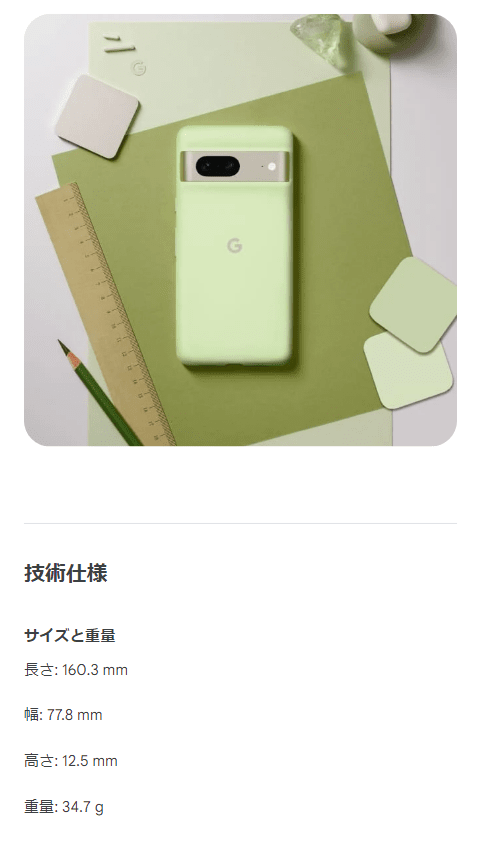
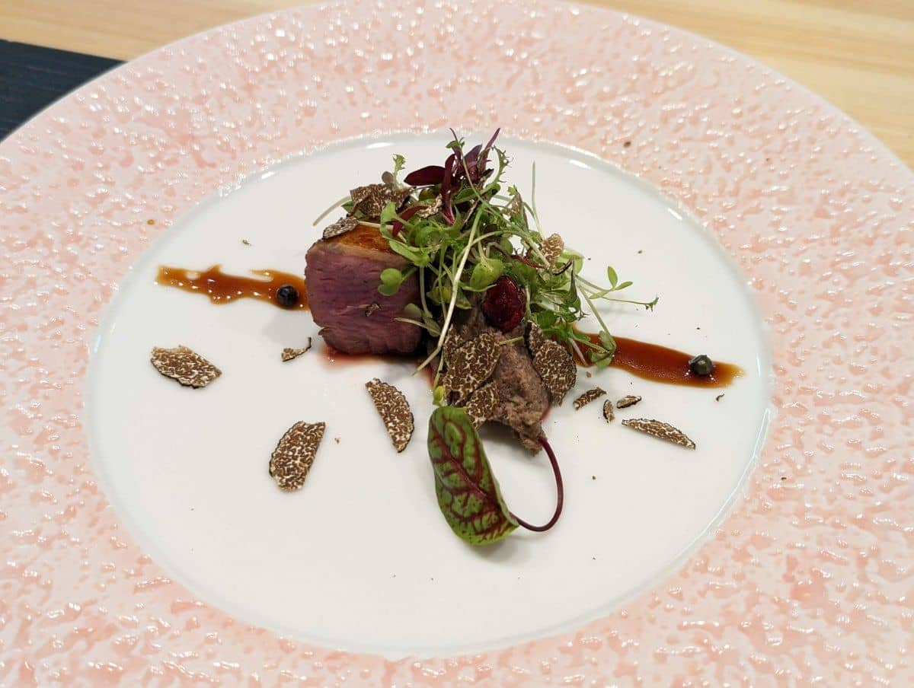

こんにちは、 kenzauros です。

先日 **Pixel 5 から Pixel 7 に乗り換え**ました。最初は不満爆発で Pixel 5 に戻そうかと思いましたが、なんとか Pixel 7 にも慣れてきたので、レビューしたいと思います🚀

- [Google Pixel 7 - Google ストア](https://store.google.com/jp/product/pixel_7?hl=ja)

ちょっと残念な点も多いですが、これから購入する方の参考になればいいなと思います。

## Pixel 5 の苦悩

2 年間愛用した Pixel 5 はサイズ感も質感もすごく気に入っていました。

通常使う分にはまったく問題はありませんでしたが、 *GitHub の Pull Request などの重いページを開くとブラウザーがフリーズ*を繰り返すという問題があり、処理性能のつらさを感じていました。

あまつさえ *Google 謹製の Gmail も、長いスレッドを開くとフリーズする*という悲しい感じでした。余談ですが、こういうこともあり、弊社のような業態では「スマホ一本で仕事できる！」というのはつらい気がします。

## Pixel 7 発売時のキャンペーンで購入

Pixel 7 発売時、割り引きと下取り＋キャンペーンのクレジットを合わせ、実質ほぼ 0 円以下で買う方法がいろいろと話題になりました。

Google ストアやローカルガイドで出ていた 10% オフのクーポンや povo のクーポンを併用できるバグ (?) があり、価格は最大 25％オフになる場合もあったようです。また Pixel 4 や 5 の下取り価格が最大 61,500 円と高額に設定されたことから、メルカリなどで中古の Pixel 4 などを買って下取りに回す方法も出たようです。

発売からしばらく悩んだ後、2週間後に Pixel 7 を購入しました。 **10% オフクーポンのみ使用し、税込み 74,250 円でした。さらに 21,000 円のクレジットがもらえました💰**

下取りキャンペーンで Pixel 5 を下取りに出せば 61,500 円のクレジット🤑が返ってくる可能性が高いため、実質 0 円以下で購入できることになります。昨今のスマホとしてはかなりお値打ち感のある内容です。

購入時は配送まで 1 ヵ月ぐらいになっていましたが、何度か日程が変更され、結局 10 日ほどで届きました🚚

## Pixel 7 と Pixel 5 のサイズ・重量比較

乗り換えにあたって、一番懸念していたのは、**サイズと重さ**でした。

私自身の手が一般的な男性のそれより小さめなため、これまでもなるべく小型な機種を好んで使ってきました。一番手にしっくりきていたのは iPhone 5 です😂

iPhone 13 mini も販売は不振だったそうで、小さなスマホは今のところ淘汰される運命にあるようです。

さて、 Pixel 7 と 5 を比較してみると下表のようになります。

機種 | 画面 | 高さ | 幅 | 厚さ | 重量
-- | --: | --: | --: | --: | --:
Pixel 5 | 6.0 インチ | 144.70 mm | 70.40 mm | 8.0 mm | 151 g
Pixel 7 | 6.3 インチ | 155.64 mm | 73.16 mm | 8.7 mm | 197 g
差 | **+ 0.3 インチ** | **+ 10.94 mm** | **+ 2.76 mm** | **+ 0.7 mm** | **+ 46 g**

はい、デカい、重い、です。特に重さは **50 g 近く増えています**。 iPhone 13 でも 173 g なのでかなり重めです。どちからというと 203 g の iPhone 13 Pro に近いですね。

正直 0.3 インチアップさせるために、なぜこんなにデカくなるのか疑問です。

## 実際に触った感覚

### 外観

**Pixel 7 の背面はガラスになっていて、ツルツル**です。カバーをつけない状態の質感としては梨地処理の Pixel 5 のほうが好みです。
まぁカバーを付けるのであまり関係ないんですが😂

角の R （丸み）も Pixel 5 のほうが人に優しいです。

あとカメラの出っ張り部分が背面と直角になっており、この部分にホコリやゴミがたまりやすいです。こちらもカバーを付ければ気にならないのですが、プロダクトデザインとしてどうなんでしょうか。

### サイズ感・重さ

数値だけではなかなかイメージをつかみにくいですが、やはり Pixel 5 に比べると、かなり重量感があります。実際に数日使うと、左手の付け根が腱鞘炎みたいになりました。数日で解消はしましたが💀

特に安価なカバーだとそれ自体が 30 g ぐらいあり、サイズもさらに肥大するので、かなり不満に感じました。純正ケースは 34.7 g もあります。

### 指紋認証

指紋認証については、よければ👇の動画をご覧ください。いずれも机に置いた状態から持ち上げて指紋認証でロックを解除したときの動きです。

Pixel 5

<video src="images/pixel5.mp4" autoplay playsinline muted controls frameborder="0" style="max-width:100%;"></video>

Pixel 7

<video src="images/pixel7.mp4" autoplay playsinline muted controls frameborder="0" style="max-width:100%;"></video>

Pixel 7 のほうはこれでもスムーズに解除できているほうです。

Pixel 5 はスリープ状態からいきなり認証できるので、背面のセンサーに触れた瞬間、解除できます。 一方、 **Pixel 7 では一度ロック画面を表示させる必要がある**ので、ワンテンポ遅れてしまいます。ポケットから取り出しながら解除する、なんてこともできなくなりました(笑)

指紋認識の反応速度と精度もやはり Pixel 7 が劣ります。感覚的にはロック解除まで 0.5 秒ぐらいはラグがあります。

指紋の読み取りがうまくいかなかったときも、 Pixel 7 の場合は 2 回ミスった時点でキーパッドが表示され、指紋を受け付けてくれなくなります。 Pixel 5 では何度かやり直せばよかったのですが、 Pixel 7 では 2 回ごとにロック画面へ戻る手間が生じるので、結構面倒です。

指紋認証のユーザーエクスペリエンスは確実に Pixel 5 が上でした。まぁそもそも顔認証しかない iPhone よりはいくらかマシですが😶

### 動作

Gmail や GitHub のプルリクは固まることがなくなりました(笑)

しかし残念ながら、それ以外は特に速くなったと感じることもありませんでした。

### カメラ性能

カメラについては、通常使用ではあまりわかりませんが、レンズが明るくなったのか、**暗所での撮影はかなりキレイ**になっています。

下の写真はそこそこ暗いバーのような店内で、オートで撮影したものです。まったく加工していませんが、手ブレをのぞけば肉の質感や野菜の繊維まで、ディテールがきれいに再現されており、ホワイトバランスも驚くほど正確です。

※本ブログの画像最適化のせいで若干画質が悪く見えるかもしれません。

まるでかなり明るい部屋にいるように撮影できているので、逆に暗い雰囲気を出したいときは調整しないといけないかもしれません📷

## ようやく使えるようにしてくれた THE FROST AIR

そんなこんなで本気で Pixel 5 に戻そうかと思っていたところ、一番ストレスだったサイズと重さを解消してくれたのが、こちらのカバーです。

- [THE FROST AIR - ほぼ裸、極薄スマホケース](https://casefinite.jp/products/frostair?variant=43632394928298)

**THE FROST AIR は「ほぼ裸」の名に恥じないシースルーな感じのカバー**です。ほぼ気にならないぐらいのサイズと重さ（なんと **8 g**❗）を実現しています。

**カバーを交換するだけで、サイズも重さも、劇的に改善**しました。質感もマットになるので、持ち心地も本体だけよりイイ感じです👍

電源やボリュームボタンはカバーされませんが、あまり押す機会はないですし、逆にこのほうが押しやすいかもしれません。

カメラやディスプレイの保護も最低限ですので、吹っ飛ばすとダメージが大きそうですが、通常使用では本体まで傷つくことはなさそうです。ただしケース自体は割と擦り傷が目立ちます。

税込み 3,249 円ですが、これは価値があると思います。ありがとうございます🙌

## なんとか慣れました

指紋認証についてもさらに 2 週間ほどしてようやく慣れてきました。というより、解除する頻度が減りました😅

しかし Pixel 5 が好きすぎて、結局下取りには出しませんでした。いまだに Pixel 5 をつかむとそのフィット感に感動します。

今度はブラックフライデーセールで安くなるようです。

また追加情報があれば、レポートします🖊️
