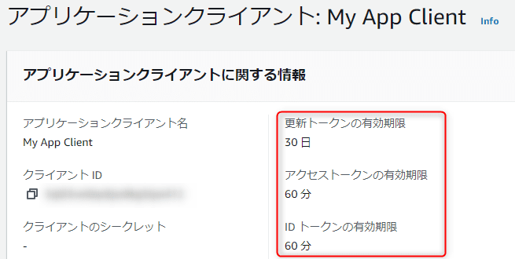

## 前提

タイトルにもあるとおり、今回のテーマは「**Amplify を使わず React で AWS Cognito 認証を使う**」です。

- *Amplify 自体は使いません*
- *Amplify CLI も使いません*
- *Amplify の JS ライブラリ (aws-amplify) のみ使います*
- 既存の Cognito ユーザープールを流用します

また、画面は素の HTML だけにしました。 UI フレームワークはプロジェクトによって異なること、 UI のコードが含まれると本質的な部分がわかりづらくなることから、今回は最低限にしています。

対象とする読者は下記のとおりです。

- React, React Hooks がある程度使える方
- Congino のユーザープールは設定できる方
- Amplify のプラットフォームを使いたいわけではない方
- 結局 React で Cognito 使うのに最低限なにが必要かわからない私のような方

### Amplify は使わない

よくある流れだと `amplify init` してアプリを初期化し、 `amplify add auth` で Cognito を追加...とするところですが、今回は Amplify を使いません。

というのも、 **React (というより Node.js) から Cognito を使う上では、アプリのプラットフォームとしての Amplify は必要でない** からです。

Amplify と組み合わせて使う前提のドキュメントが多いこと、 Amplify と組み合わせて「やってみた」系の記事が多くいので、 Amplify ありきなのかと思ってしまいがちです。

また、ログインの UI に [@aws-amplify/ui-react](https://www.npmjs.com/package/@aws-amplify/ui-react) を使っている例も多く、いざ別の UI フレームワークで構築するとなったときに「？？？」となりがちです。そのため本記事では @aws-amplify/ui-react は使いません。

ただし、**今回は認証用のライブラリーとして npm パッケージの aws-amplify に含まれる `Auth` 部分を使います**。このライブラリーは Amplify と関係なく、単純に便利なためです。

### Cognito は既存流用

Cognito のユーザープールは、すでに存在するものを利用します。

まだ存在しない場合は、 Cognito でユーザープールを作成し、コンソール等からアカウントを作成しておきます。コンソールからのユーザー作成は下記の記事が参考になります。

- [AWS CLIを使ってCognitoユーザーステータスのFORCE_CHANGE_PASSWORDをCONFIRMEDにしてみる | DevelopersIO](https://dev.classmethod.jp/articles/change-cognito-user-force_change_passwore-to-confirmed/)

また、アプリケーションクライアントも下記の設定で作成してあるものとします。

- パブリッククライアント
- クライアントのシークレット: *クライアントのシークレットを生成しない*
- 認証フロー: `ALLOW_USER_SRP_AUTH`
- OAuth 付与タイプ: 認証コード付与 (Authorization Code Grant)
- 許可されているコールバック URL: `http://localhost:3000` (React の開発環境 URL)

フロントエンドでは下記の情報を使用します。

- AWS リージョン
- ユーザープール ID
- アプリケーションクライアント ID

余談ですが、 Cognito の管理 UI はやっと他の AWS サービスとデザインが統一され、少し見やすくなりましたね。

### 環境

今回の環境はこんな感じです。

- Windows 10 Pro
- Ubuntu 20.04 on WSL2
- Node.js 14.18.3
- TypeScript 4.5
- React 17.0.2
- react-router-dom 6.2.1
- Visual Studio Code

特に react-router-dom は v6 系で破壊的変更が入っていますので、 v5 系を元にした記事も参照している場合はご注意ください。アップグレードについては公式ページで紹介されているほか、良記事が多くありますので、ご参照ください。

- [React Router | Upgrading from v5](https://reactrouter.com/docs/en/v6/upgrading/v5#upgrade-to-react-router-v6)
- [React Router v6がリリースされたので端的にまとめます - エンジニアの本棚](https://coders-shelf.com/react-router-v6-intro/)
- [React Router を v5 から v6 にアップデートしてみました | DevelopersIO](https://dev.classmethod.jp/articles/react-router-5to6/)

## 実践

### リポジトリ

今回のプロジェクトは以下のリポジトリに置いてありますので参考にしてください。

- [kenzauros/react-auth-with-cognito](https://github.com/kenzauros/react-auth-with-cognito)

### プロジェクト作成

今回は create-react-app で新しいアプリを作ります。

```sh
npx create-react-app my_app --template typescript
cd my_app
```

ここでは TypeScript テンプレートを指定していますが、 JS の場合は template オプションを省略してください。

### npm モジュールの追加

ルーター機能を利用するため、 react-router-dom をインストールしておきます。

```sh
npm install react-router-dom
npm install --save-dev @types/react-router-dom
```

aws-amplify モジュールもインストールします。

```sh
npm install aws-amplify
```

### ディレクトリ構成

ディレクトリ構成はシンプルに下記のようなものを想定します。実際は各プロジェクトのデザインに従ってください。

```:title=プロジェクトのディレクトリ構成
.
├── public
│   ├── favicon.ico
│   ├── index.html
│   ├── logo192.png
│   ├── logo512.png
│   ├── manifest.json
│   └── robots.txt
├── src
│   ├── aws-config
│   │   └── auth.ts 👈 AWS Cognito の設定
│   ├── components
│   │   └── PrivateRoute.tsx 👈 ログイン後しか見えないようにするラッパー
│   ├── hooks
│   │   └── use-auth.tsx 👈 auth フック
│   ├── pages
│   │   └── SignIn.tsx 👈 ログインページ
│   ├── App.css
│   ├── App.test.tsx
│   ├── App.tsx 👈 ルーティング
│   ├── index.css
│   ├── index.tsx 👈 コンテキストを設定
│   ├── logo.svg
│   ├── react-app-env.d.ts
│   ├── reportWebVitals.ts
│   └── setupTests.ts
├── .env.local 👈 ローカル環境用の .env
├── README.md
├── package-lock.json
├── package.json
└── tsconfig.json
```

今回は 👈 でマークのあるファイルを変更・追加します。

### Cognito の設定

aws-amplify の Auth モジュールに渡すための *Cognito の設定をファイルで定義* します。

ベタ書きでもいいのですが、環境によって切り替えるため、環境変数で設定できるようにします。

```ts:title=src/aws-config/auth.ts
const Auth = {
  region: process.env.REACT_APP_AUTH_REGION,
  userPoolId: process.env.REACT_APP_AUTH_USER_POOL_ID,
  userPoolWebClientId: process.env.REACT_APP_AUTH_USER_POOL_WEB_CLIENT_ID,
  cookieStorage: {
    domain: process.env.REACT_APP_AUTH_COOKIE_STORAGE_DOMAIN,
    path: '/',
    expires: 365,
    sameSite: "strict",
    secure: true
  },
  authenticationFlowType: 'USER_SRP_AUTH',
}

export default Auth;
```

この設定オブジェクトは下記の公式ページを参照してください。

- [Authentication - Create or re-use existing backend - JavaScript - AWS Amplify Docs](https://docs.amplify.aws/lib/auth/start/q/platform/js/#re-use-existing-authentication-resource)

ここでは認証情報の永続化に *Cookie* を使うようにしています。 Amplify モジュールのデフォルトでは localStorage が使われるようです。

なお、ここで設定する `expires` はあくまで Cookie の有効期間で、 Cognito から発行される JWT token の有効期間ではありませんのでご注意ください。 *JWT token の有効期間は Cognito のアプリケーションクライアント設定から設定可能* です。



### .env ファイルを追加

`.env.local` を作成してそれぞれのパラメーターを設定します。 *`.env` ファイルは `src` ディレクトリではなく、プロジェクトルートに作成 *します。

```ini:title=.env.local
REACT_APP_AUTH_REGION=<リージョン>
REACT_APP_AUTH_USER_POOL_ID=<ユーザープール ID>
REACT_APP_AUTH_USER_POOL_WEB_CLIENT_ID=<アプリケーションクライアント ID>
REACT_APP_AUTH_COOKIE_STORAGE_DOMAIN=localhost
```

それぞれ AWS ドメインは、ローカルの開発環境の場合は `localhost` でよいでしょう。

### 認証用フックの準備

次に **認証系の処理・コンテキスト・状態をまとめた useAuth フック** を準備します。これが今回の肝です。

`use-auth.tsx` を下記の内容で作成します。

```tsx:title=src/hooks/use-auth.tsx
import Amplify, { Auth } from 'aws-amplify';
import React, { createContext, useContext, useEffect, useState } from 'react';
import AwsConfigAuth from '../aws-config/auth';

Amplify.configure({ Auth: AwsConfigAuth });

interface UseAuth {
  isLoading: boolean;
  isAuthenticated: boolean;
  username: string;
  signUp: (username: string, password: string) => Promise<Result>;
  confirmSignUp: (verificationCode: string) => Promise<Result>;
  signIn: (username: string, password: string) => Promise<Result>;
  signOut: () => void;
}

interface Result {
  success: boolean;
  message: string;
}

const authContext = createContext({} as UseAuth);

export const ProvideAuth: React.FC = ({ children }) => {
  const auth = useProvideAuth();
  return <authContext.Provider value={auth}>{children}</authContext.Provider>;
};

export const useAuth = () => {
  return useContext(authContext);
};

const useProvideAuth = (): UseAuth => {
  const [isLoading, setIsLoading] = useState(true);
  const [isAuthenticated, setIsAuthenticated] = useState(false);
  const [username, setUsername] = useState('');
  const [password, setPassword] = useState('');

  useEffect(() => {
    Auth.currentAuthenticatedUser()
      .then((result) => {
        setUsername(result.username);
        setIsAuthenticated(true);
        setIsLoading(false);
      })
      .catch(() => {
        setUsername('');
        setIsAuthenticated(false);
        setIsLoading(false);
      });
  }, []);

  const signUp = async (username: string, password: string) => {
    try {
      await Auth.signUp({ username, password });
      setUsername(username);
      setPassword(password);
      return { success: true, message: '' };
    } catch (error) {
      return {
        success: false,
        message: '認証に失敗しました。',
      };
    }
  };

  const confirmSignUp = async (verificationCode: string) => {
    try {
      await Auth.confirmSignUp(username, verificationCode);
      const result = await signIn(username, password);
      setPassword('');
      return result;
    } catch (error) {
      return {
        success: false,
        message: '認証に失敗しました。',
      };
    }
  };

  const signIn = async (username: string, password: string) => {
    try {
      const result = await Auth.signIn(username, password);
      setUsername(result.username);
      setIsAuthenticated(true);
      return { success: true, message: '' };
    } catch (error) {
      return {
        success: false,
        message: '認証に失敗しました。',
      };
    }
  };

  const signOut = async () => {
    try {
      await Auth.signOut();
      setUsername('');
      setIsAuthenticated(false);
      return { success: true, message: '' };
    } catch (error) {
      return {
        success: false,
        message: 'ログアウトに失敗しました。',
      };
    }
  };

  return {
    isLoading,
    isAuthenticated,
    username,
    signUp,
    confirmSignUp,
    signIn,
    signOut,
  };
};
```

この `useAuth` は下記の記事のコンセプトを、ほぼそのまま流用させていただきました。ありがとうございます。

- [AWS Amplifyでログインフォームを実装する - Qiita](https://qiita.com/kde15/items/851aea71504cfa6ea680)

変更点は下記のとおりです。

- もともとは `username` が `email` となっていましたが、 Cognito の設定によってはログイン ID がメールアドレス以外もありえるので `username` に変更しました。
- なるべく "Amplify" や "Cognito" を意識したくないため、 Amplify の設定も含めて、すべてこの `use-auth.tsx` に押し込みました。これでこの `use-auth.tsx` の外では Amplify や Cognito をほぼ意識せずに開発できます。
- リロードすると `username` が空になっていたので、 `Auth.currentAuthenticatedUser()` したあとにユーザー名を設定するようにしました。

ちなみにオリジナルに従って `signUp`, `confirmSignUp` も実装していますが、今回は使用しません。

### ログイン時しか表示できないルートの準備

次に、 `useAuth` を使って、 *認証されている状態のときのみ表示し、それ以外はログイン画面にリダイレクトする* コンポーネントを作ります。

```tsx:title=src/components/PrivateRoute.tsx
import { Navigate } from 'react-router-dom';
import { useAuth } from '../hooks/use-auth';

const PrivateRoute: React.FC = ({ children }) => {
  const { isAuthenticated } = useAuth();
  return isAuthenticated ? <>{children}</> : <Navigate to="/signin" />;
};

export default PrivateRoute;
```

これはこれまでもさまざまな記事で `PrivateRoute` として紹介されてきたものと似たものですが、 react-router-dom が v6 になったため、少し変更になっています。

- v5 のころは `<Route>` を return すれば `App` の `<Switch>` で子要素として指定できました。 v6 の場合はそれができないため、認証状態なら子を描画し、非認証状態ならログインページにリダイレクトしています。
- `Redirect` は `Navigate` に変更されたので、書き換えています。

### ログイン画面

今回はログイン画面のみ作ります。ここでも `useAuth` を使います。

```tsx:title=src/pages/SignIn.tsx
import React, { useState } from 'react';
import { useNavigate } from 'react-router-dom';
import { useAuth } from '../hooks/use-auth';

export function SignIn() {
  const auth = useAuth();
  const navigate = useNavigate();
  const [username, setUsername] = useState('');
  const [password, setPassword] = useState('');

  const executeSignIn = async (event: React.FormEvent<HTMLFormElement>) => {
    event.preventDefault();
    const result = await auth.signIn(username, password);
    if (result.success) {
      navigate({ pathname: '/dashboard' });
    } else {
      alert(result.message);
    }
  };

  return (
    <form noValidate onSubmit={executeSignIn}>
      <div>
        <label htmlFor="username">メールアドレス: </label>
        <input
          id="username"
          type="email"
          value={username}
          onChange={(e) => setUsername(e.target.value)}
        />
      </div>
      <div>
        <label htmlFor="password">パスワード: </label>
        <input
          id="password"
          type="password"
          value={password}
          onChange={(e) => setPassword(e.target.value)}
        />
      </div>
      <button type="submit">ログイン</button>
    </form>
  );
}
```

特に難しいところはなくシンプルです。

### useAuth コンテキストを使えるようにする

`index.tsx` で **`App` を `ProvideAuth` でラップ** し、アプリ全体で `useAuth` のコンテキストが使えるようにします。

```tsx{4,10,12}:title=src/index.tsx
import React from 'react';
import ReactDOM from 'react-dom';
import App from './App';
import { ProvideAuth } from './hooks/use-auth';
import './index.css';
import reportWebVitals from './reportWebVitals';

ReactDOM.render(
  <React.StrictMode>
    <ProvideAuth>
      <App />
    </ProvideAuth>
  </React.StrictMode>,
  document.getElementById('root')
);

// If you want to start measuring performance in your app, pass a function
// to log results (for example: reportWebVitals(console.log))
// or send to an analytics endpoint. Learn more: https://bit.ly/CRA-vitals
reportWebVitals();
```

こちらもとてもシンプルでわかりやすいですね。

これで準備は完了です。

### App.tsx

最後に `App` を実装します。すでに作った `useAuth` と `PrivateRoute` を使います。

```tsx:title=src/App.tsx
import { BrowserRouter, Link, Route, Routes } from 'react-router-dom';
import './App.css';
import PrivateRoute from './components/PrivateRoute';
import { useAuth } from './hooks/use-auth';
import { SignIn } from './pages/SignIn';

function App() {
  const auth = useAuth();

  if (auth.isLoading) {
    return <div></div>;
  }

  const TopPage = () => (
    <div>
      <p>トップページ</p>
      <p>{auth.isAuthenticated ? 'ログイン済' : '未ログイン'}</p>
      <p>
        <Link to="/signin">ログイン</Link>
      </p>
    </div>
  );

  const PrivateDashboard = () => (
    <PrivateRoute>
      <div>ようこそ！ {auth.username} さん！</div>
      <button onClick={() => auth.signOut()}>ログアウト</button>
    </PrivateRoute>
  );

  return (
    <BrowserRouter>
      <Routes>
        <Route index element={<TopPage />} />
        <Route path="signin" element={<SignIn />} />
        <Route path="dashboard" element={<PrivateDashboard />}></Route>
        <Route path="*" element={<p>Page Not Found</p>} />
      </Routes>
    </BrowserRouter>
  );
}

export default App;
```

要約すると下記のようになります。

- ログインは `/signin` に飛ばすだけ
- ログアウトは `auth.signOut()` を呼ぶだけ
- ログイン後しか表示させないページは `PrivateRoute` で囲むだけ

上記の使い方を見ると、 react-router-dom v6 では `PrivateRoute` より `PrivatePage` のほうがコンポーネント名としては適しているかもしれません。

## 動作確認

`npm start` (or `yarn start`) でローカルの開発環境を起動し、ブラウザーで `http://localhost:3000` を開きます。

### トップページ (/)

これ以上ないほど素っ気ないトップページです。


[ログイン] を押すとログイン画面に遷移します。

### ログイン画面 (/signin)

ログイン画面も断捨離後のようです。

メールアドレスとパスワードを入力してログインしてみます。※ここではユーザー名としてメールアドレスを使っています。


失敗した時はこれまた業務的なメッセージが表示されます。


### ダッシュボード (/dashboard)

ダッシュボードとは何か考えさせられる画面ですが、ログイン後しか表示されないページの例です。


ユーザー名も表示できていることがわかります。ちなみに F5 でリロードしてもちゃんとユーザー名は表示されます。

[ログアウト] を押すとログアウトしてログイン画面に遷移します。

## まとめ

Amplify は便利なプラットフォームですが、フルスタックのため、プロジェクトによっては導入が難しいかもしれません。またプロジェクトが Amplify に拘束されるのも避けたいでしょう。

Cognito は Amplify と直接関係のない AWS サービスで、非常に便利なサーバーレス認証基盤です。

そこで、今回はシンプルに Cognito を認証部分として使うことだけにフォーカスしてみました。

細かい部分に改良の余地はまだまだあると思いますが、ひとまず、 React Hooks で Cognito 認証を使う一例になるのではないでしょうか。

もっとよい方法があれば教えてください。お読みいただき、ありがとうございました。
