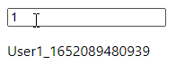
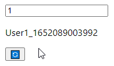

こんにちは、kenzauros です。

*Reack hooks で非同期にデータを取得してデータを表示するには副作用を扱う useEffect フックを使用*します。

通常、何らかの state が変更されたときにコンポーネントが再レンダリングされ、必要であれば useEffect が再実行されます。

ただ、**ユーザーが任意のタイミングでリフレッシュしたい**場合もあります。特に複数のユーザーから同じデータが更新されるようなアプリケーションでは、今の条件で最新のデータを取得しなおすのはよくある場面だと思います。

今回は **「Refesh ボタン」を追加して useEffect を再実行させる** 1 つの方法を紹介します。

🔄 👈こういうボタンですね。

## 想定する React アプリ

まず、下記のような単純な React アプリを想定します。



*ユーザー ID の入力欄があり、その値が変更されるとユーザー情報を API から取得し、名前を表示する*というものです。更新がわかりやすいようにユーザー名はタイムスタンプをつけて動的に生成しています。

```js{numberLines:1}:title=元のApp.js
import { useState, useEffect } from 'react'

function App() {
  const [userId, setUserId] = useState(0)
  const [user, setUser] = useState()

  useEffect(() => {
    const data = {
        id: userId,
        name: `User${userId}_${new Date().getTime()}`,
    } // 👈 本来は API からデータを取得してくる
    setUser(data)
  }, [userId])

  return (
      <div style={{margin: 16}}>
          <input value={userId} onChange={event => setUserId(event.target.value)} />
          <p>{user?.name || ""}</p>
      </div>
  )
}

export default App
```

この useEffect の第2引数 (依存リスト) には `userId` を指定してあるため、テキストボックスで *`userId` が変更されると useEffect が再実行*されます。

逆に言えば **`userId` が変更されない限り、 useEffect が再実行されません**。

ユーザー情報を再読込したい場合は、一度適当なユーザー ID に変更したあと、再度元のユーザー ID に戻す、なんて無駄な操作が必要になります。

## 更新 (Refresh) ボタンの実装

そこで、ここに *「Refresh ボタン」を追加して、ユーザー ID を変更せずにユーザー情報の再読込*をできるようにしましょう。

発想としては「**state が更新されないと再実行されないのなら、更新する state を追加しちゃえばいいじゃん**」です。

```js{numberLines:1}{6,14,20}:title=Refreshボタン追加後のApp.js
import { useState, useEffect } from 'react'

function App() {
  const [userId, setUserId] = useState(0)
  const [user, setUser] = useState()
  const [refreshKey, setRefreshKey] = useState(0)

  useEffect(() => {
    const data = {
        id: userId,
        name: `User${userId}_${new Date().getTime()}`,
    } // 👈 本来は API からデータを取得してくる
    setUser(data)
  }, [userId, refreshKey])

  return (
      <div style={{margin: 16}}>
          <input value={userId} onChange={event => setUserId(event.target.value)} />
          <p>{user?.name || ""}</p>
          <button type="button" onClick={() => setRefreshKey(old => old + 1)}>🔄</button>
      </div>
  )
}

export default App
```

はい、簡単ですね。下記のような動きになります。



まとめると下記のような実装です。

1. 「Refresh ボタン」用の state (`refreshKey`) を追加 (6 行目)
2. `refreshKey` を useEffect の依存リスト (第2引数) に追加 (14 行目)
3. 「Refresh ボタン」で `refreshKey` を更新 (20 行目)

この state は毎回更新されればなんでもよく、タイムスタンプでもいいと思いますが、この例のように数値をインクリメントしていくのが一番簡単でしょう。

## まとめ

これでまさに "REACTive" な動きが実現できました。

イベントドリブンに慣れていると onClick に「更新する」ロジックを書かなければいけないという考えになりがちです。 React では state を更新することで画面に反映するという考え方を忘れないようにしましょう。

簡単な内容でしたが、どなたかのお役に立てれば幸いです。
