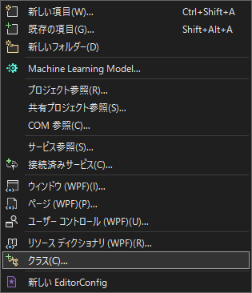
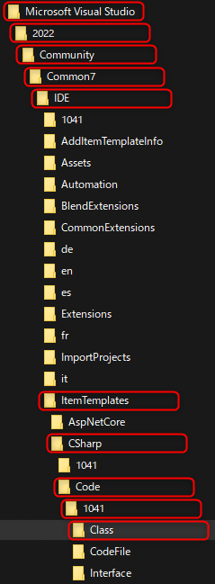

こんにちは、 kenzauros です。今回は **Visual Studio** の小ネタです。

C# でソリューションエクスプローラーから "追加" → "クラス(C)..." とすると、下記のようなクラスが生成されます。



```cs:title=デフォルトで生成されるclass
using System;
using System.Collections.Generic;
using System.Linq;
using System.Text;
using System.Threading.Tasks;

namespace IntelligentViewer
{
    internal class Class1
    {
    }
}
```

これでなにが不満だと言われそうですが、個人的には *「アクセス修飾子が internal」* なのが不便です。たとえばライブラリーを作っている場合なんかはほとんどが公開クラスですので、いちいち public に書き換えるのが面倒です。

そこで**クラスファイルのテンプレートを書き換えることで、デフォルトのアクセス修飾子を public にしてしまいましょう**、というお話です。

## クラスファイルのテンプレートを書き換える

クラスファイルのテンプレートはどこにあるのかというと下記のような樹海の奥にあります。 `<Edition>` 部分は `Professional` とか `Community` とかが入ります。

- Visual Studio 2022:<br>`C:\Program Files\Microsoft Visual Studio\2022\<Edition>\Common7\IDE\ItemTemplates\CSharp\Code\1041\Class\Class.cs`
- Visual Studio 2019:<br>`C:\Program Files (x86)\Microsoft Visual Studio\2019\<Edition>\Common7\IDE\ItemTemplates\CSharp\Code\1041\Class\Class.cs`



標準のテンプレートファイルは下記のようになっています。

```cs:title=Class.cs
using System;
using System.Collections.Generic;
$if$ ($targetframeworkversion$ >= 3.5)using System.Linq;
$endif$using System.Text;
$if$ ($targetframeworkversion$ >= 4.5)using System.Threading.Tasks;
$endif$
namespace $rootnamespace$
{
    class $safeitemrootname$
    {
    }
}
```

はて、 `internal` の記載がないですね...このファイルじゃないのか...？と思いますが、安心してください。このファイルです。

下記のように**アクセス修飾子を public に変更**してみます。ちなみに*変更には管理者権限が必要*です。

```cs{9}:title=Class.cs
using System;
using System.Collections.Generic;
$if$ ($targetframeworkversion$ >= 3.5)using System.Linq;
$endif$using System.Text;
$if$ ($targetframeworkversion$ >= 4.5)using System.Threading.Tasks;
$endif$
namespace $rootnamespace$
{
    public class $safeitemrootname$
    {
    }
}
```

これを保存した状態で Visual Studio から再度クラスを追加してみると...見事、 **public** class が生成されました！

`internal` がどこからきたのか疑問ではありますが、細かいことは気にしないでおきましょう。

## さらに自分好みにカスタムする

そのほかにも*不要な `using` を削除したり、 XML ドキュメントコメントを追加したり*、カスタムしておくと手間が省けます。
どれもほんの少しの時間ですが、チリツモです。

ということで、私は最終的に下記のようにしています。

```cs:title=Class.cs
namespace $rootnamespace$
{
    /// <summary>
    /// 
    /// </summary>
    public class $safeitemrootname$
    {
    }
}
```

どなたかのお役に立てれば幸いです。
