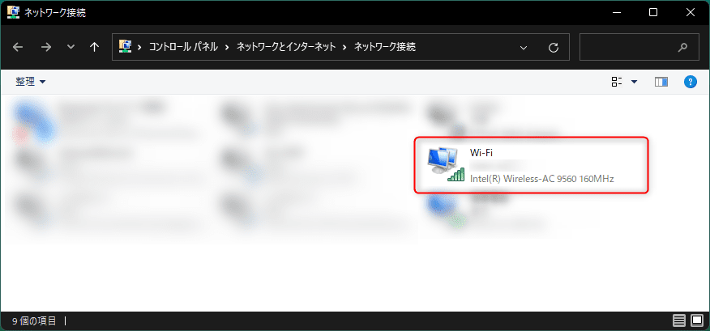

こんにちは、 kenzauros です。

とある事情で **「ネットワークアダプターの詳細設定」の設定変更を自動化**したくなったため、 **PowerShell** での実現方法をまとめました。

あまり使う人もいないとは思いますが😅、何かの助けになれば幸いです。

## はじめに

まず「ネットワークアダプターの詳細設定」とはなんなのか。ざっくり言えば下記の画面にある「**詳細設定**」タブのプロパティのことです。


この画面を見たことがない方には、おそらくこの記事は役に立たないと思います。ごめんなさい。

今回はここの **「プロパティ」に対する「値」を PowerShell のスクリプトから（なるべく）一発で変更**できるようにします。

評価環境は Windows 11 Pro です。この「詳細設定」に関する公式のドキュメントは下記のページです。

- [NIC 詳細プロパティ | Microsoft Learn](https://learn.microsoft.com/ja-jp/windows-server/networking/technologies/hpn/hpn-nic-advanced-properties)

### ネットワークアダプターの詳細設定の開き方

ちなみに「ネットワークアダプターの詳細設定」画面の開き方は下記の 2 通りです。

- 「デバイスマネージャー」から対象のアダプターのプロパティを開く
- 「ネットワーク接続」から対象の接続のプロパティを開いて「構成...」をクリックする


Windows 11 の現代では「ネットワーク接続」に到達するのも難しいため、 **`Win + R`** (ファイル名を指定して実行) で **`ncpa.cpl` と入力して開く**のが一番速いでしょう。

自分の設定したい対象のネットワーク接続の名前を確認しておきましょう。この記事では以下の `Wi-Fi` というネットワーク接続を対象にします。



## ネットワークアダプターの詳細設定 PowerShell コマンドの使い方

まず **PowerShell を管理者権限**で開きます。

Windows 10 ならスタートボタンを右クリックして "PowerShell (管理者)" をクリックすれば OK です。
Windows 11 ならスタートメニューに "powershell" と入力して「管理者として実行する」を選べばいいでしょう。（Windows Terminal でもかまいません）


ネットワークアダプターの詳細設定に関する PowerShell コマンドは下記の 2 つです。

- 値の取得 : **`Get-NetAdapterAdvancedProperty`**
- 値の設定 : **`Set-NetAdapterAdvancedProperty`**

### プロパティ値の取得

まず、設定できるプロパティの一覧を取得してみます。 `Wi-Fi` に関するプロパティ一覧を取得するには `Get-NetadapterAdvancedProperty Wi-Fi` を実行します。

```{1}:title=PowerShell
PS> Get-NetadapterAdvancedProperty Wi-Fi

Name                      DisplayName                    DisplayValue                   RegistryKeyword RegistryValue
----                      -----------                    ------------                   --------------- -------------
Wi-Fi                     Sleep on WoWLAN Disconnect     Disabled                       *DeviceSleep... {0}
Wi-Fi                     Packet Coalescing              Enabled                        *PacketCoale... {1}
Wi-Fi                     ARP offload for WoWLAN         Enabled                        *PMARPOffload   {1}
Wi-Fi                     NS offload for WoWLAN          Enabled                        *PMNSOffload    {1}
Wi-Fi                     GTK rekeying for WoWLAN        Enabled                        *PMWiFiRekey... {1}
Wi-Fi                     Wake on Magic Packet           Enabled                        *WakeOnMagic... {1}
Wi-Fi                     Wake on Pattern Match          Enabled                        *WakeOnPattern  {1}
Wi-Fi                     Global BG Scan blocking        Never                          BgScanGlobal... {0}
Wi-Fi                     Channel Width for 2.4GHz       Auto                           ChannelWidth24  {1}
Wi-Fi                     Channel Width for 5GHz         Auto                           ChannelWidth52  {1}
Wi-Fi                     Mixed Mode Protection          RTS/CTS Enabled                CtsToItself     {0}
Wi-Fi                     Fat Channel Intolerant         Disabled                       FatChannelIn... {0}
Wi-Fi                     Transmit Power                 5. Highest                     IbssTxPower     {100}
Wi-Fi                     802.11n/ac Wireless Mode       1. Disabled                    IEEE11nMode     {0}
Wi-Fi                     MIMO Power Save Mode           Auto SMPS                      MIMOPowerSav... {0}
Wi-Fi                     Roaming Aggressiveness         3. Medium                      RoamAggressi... {2}
Wi-Fi                     Preferred Band                 1. No Preference               RoamingPrefe... {0}
Wi-Fi                     Throughput Booster             Disabled                       ThroughputBo... {0}
Wi-Fi                     U-APSD support                 Disabled                       uAPSDSupport    {0}
Wi-Fi                     802.11a/b/g Wireless Mode      6. Dual Band 802.11a/b/g       WirelessMode    {34}
```

上記のように表形式で表示されます。並びが異なるので少しわかりづらいですが、下記の画面の「プロパティ」部分の一覧が `DisplayName` として表示されていることがわかります。


**特定のプロパティの値のみを表示したい場合は `RegistryKeyword` を指定**します。
たとえば `802.11n/ac Wireless Mode` の値のみを取得する場合はその `RegistryKeyword` である `IEEE11nMode` を指定します。

```:title=PowerShell
PS> Get-NetadapterAdvancedProperty Wi-Fi -RegistryKeyword IEEE11nMode

Name                      DisplayName                    DisplayValue                   RegistryKeyword RegistryValue
----                      -----------                    ------------                   --------------- -------------
Wi-Fi                     802.11n/ac Wireless Mode       1. Disabled                    IEEE11nMode     {0}
```

### プロパティ値の設定

次に、このプロパティの値を変更してみます。

**値の設定には `Set-NetadapterAdvancedProperty` コマンド**を使います。接続名と `RegistryKeyword` の指定は `Get-NetadapterAdvancedProperty` と同様です。

変更後の値を **`RegistryValue`** で指定します。 `IEEE11nMode` を `1` に変更する場合は下記のようにします。

```{1}:title=PowerShell
PS> Set-NetadapterAdvancedProperty Wi-Fi -RegistryKeyword IEEE11nMode -RegistryValue 1
```

成功した場合は、実行しても特に結果は表示されません。無効な値を指定した場合など、エラーのときは下記のようになります。

```{1}:title=PowerShell
PS> Set-NetadapterAdvancedProperty Wi-Fi -RegistryKeyword IEEE11nMode -RegistryValue 100
Set-NetadapterAdvancedProperty : No matching keyword value found. The following are valid keyword values: 0, 1, 2
発生場所 行:1 文字:1
+ Set-NetadapterAdvancedProperty Wi-Fi -RegistryKeyword IEEE11nMode -Re ...
+ ~~~~~~~~~~~~~~~~~~~~~~~~~~~~~~~~~~~~~~~~~~~~~~~~~~~~~~~~~~~~~~~~~~~~~
    + CategoryInfo          : InvalidArgument: (MSFT_NetAdapter...754E8DE72}:...):ROOT/StandardCi...ertySettingData) [
   Set-NetAdapterAdvancedProperty]、CimException
    + FullyQualifiedErrorId : Windows System Error 87,Set-NetAdapterAdvancedProperty
```

`The following are valid keyword values: 0, 1, 2` のように表示されますので、このプロパティでは `0` `1` `2` のいずれかを指定できることがわかります。

設定できたかどうかは再度 `Get-NetadapterAdvancedProperty` で確認します。

### プロパティに設定可能な値の調べ方

先のように無効な値を指定してエラーを吐かせてもいいのですが、それが何を表すのかがわかりませんし、もし有効な値を指定すれば値が変わってしまいます。

というわけで、**レジストリから設定可能な値を一覧を取得**します。必要なのは `RegistryKeyword` の値だけです。ここまでと同様 `IEEE11nMode` に関して取得してみます。

```{1}:title=PowerShell
PS> reg query "HKEY_LOCAL_MACHINE\SYSTEM\ControlSet001\Control\Class\{4d36e972-e325-11ce-bfc1-08002be10318}" /s | sls IEEE11nMode | sls enum | % { reg query $_ }

HKEY_LOCAL_MACHINE\SYSTEM\ControlSet001\Control\Class\{4d36e972-e325-11ce-bfc1-08002be10318}\0005\Ndi\Params\IEEE11nMode\enum
    0    REG_SZ    1. Disabled
    1    REG_SZ    2. 802.11n
    2    REG_SZ    3. 802.11ac
```

無事 `IEEE11nMode` プロパティで有効な値の一覧が取得できました。

簡単に説明します。まず、詳細設定に指定可能な値はレジストリの以下のキーにあります。この `{4d36e972-e325-11ce-bfc1-08002be10318}` は固定のようです。

```
HKEY_LOCAL_MACHINE\SYSTEM\ControlSet001\Control\Class\{4d36e972-e325-11ce-bfc1-08002be10318}\番号\Ndi\Params\プロパティ名\enum
```
`番号` はネットワークアダプターに紐付いたサブキー (`0005` など) で、 `プロパティ名` はここまで `RegistryKeyword` として指定してきたプロパティ名です。


ただ残念ながら対象のアダプターが何番なのか、簡単には知ることができません。というわけで上記のコマンドでは下記のように、アダプターを絞らずに値を取得しています。

1. `reg query` コマンドにこのキーを `/s` (サブキー再帰検索) オプション付きで指定すると、サブキーがずらずらと得られる
2. `IEEE11nMode` が含まれるサブキーのみ抽出する
3. さらに `enum` が含まれるサブキーのみ抽出する（この時点でプロパティ名によっては複数存在する可能性もある）
4. そのサブキー名を再度 `reg query` コマンドに指定してレジストリの中身を取得する


## PowerShell スクリプト

### スクリプトファイルの作成

PowerShell スクリプトを作成してプロパティの値を更新しやすくします。

下記の内容で `.ps1` ファイルを作成します。文字コードを `UTF-8 (BOM)`, 改行コードを CRLF にしましょう。

```powershell:title=set-network-advanced-prop.ps1
Param(
    [parameter(mandatory=$true)][String]$NetworkName,
    [parameter(mandatory=$true)][String]$Key,
    [parameter(mandatory=$true)][String]$Value
)

$ErrorActionPreference = 'Stop'
Write-Output ("=" * 80)
Write-Output "NetworkName: $NetworkName"
Write-Output "Key: $Key"
Write-Output "Value: $Value"
Write-Output ("=" * 80)
Get-NetAdapterAdvancedProperty $NetworkName -RegistryKeyword $Key
Write-Output ("=" * 80)
Write-Output "設定しています..."
Set-NetAdapterAdvancedProperty $NetworkName -RegistryKeyword $Key -RegistryValue $Value
Write-Output "設定しました"
Write-Output ("=" * 80)
Get-NetAdapterAdvancedProperty $NetworkName -RegistryKeyword $Key
Start-Sleep -s 3
```

コマンドの引数は `$NetworkName` (ネットワーク接続名), `$Key` (レジストリキー), `$Value` (設定値) の 3 つです。いずれも必須 (`mandatory`) にしています。

最初に `Get-` で変更前の状態を表示し、 `Set-` で値を変更後、再度 `Get-` で変更後の状態を表示しているだけです。

下記のように呼び出します。

```:title=スクリプトを使ったネットワークアダプターの詳細設定の値変更
.\set-network-advanced-prop.ps1 -NetworkName Wi-Fi -Key IEEE11nMode -Value 2
```

### ショートカットから PowerShell スクリプトを呼び出す

毎回 PowerShell のコンソールを開いてスクリプトを呼び出すのも面倒ですので、ショートカットを作成して呼び出せるようにします。

任意のパスに PowerShell スクリプトを配置し、ショートカットを配置したいフォルダー（デスクトップなど）でショートカットを作成します。
（右クリック→新規作成→ショートカット）

「項目の場所」は下記のように設定します。 `PATH_TO_SCRIPT` はスクリプトを配置した場所に、それ以外のパラメーターはそれぞれ設定したい内容に書き換えてください。

```:title=ショートカットの「項目の場所」または「リンク先」は下記のように設定する
powershell -ExecutionPolicy Bypass -c "&'C:\PATH_TO_SCRIPT\set-network-advanced-prop.ps1' -NetworkName Wi-Fi -Key IEEE11nMode -Value 2"
```

上記の例では `Wi-Fi` の `IEEE11nMode` を `2` へ変更するショートカットになります。

あとは必要なだけショートカットを作成しましょう🚀


